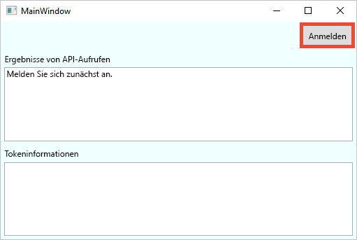
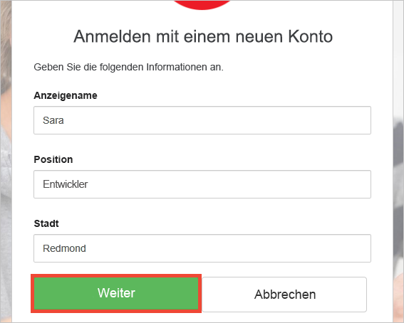
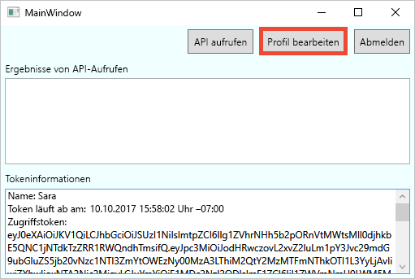
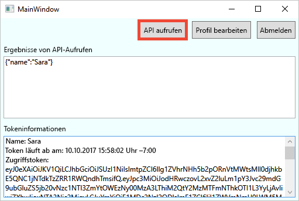

# Testen einer mit Azure AD B2C konfigurierten Desktopanwendung

Azure Active Directory B2C ermöglicht die Cloudidentitätsverwaltung, um Ihre Anwendung, Ihr Unternehmen und Ihre Kunden zu schützen.  Dieser Schnellstart veranschaulicht anhand einer Beispiel-WPF-Desktop-App (Windows Presentation Foundation) Folgendes:

* Erstellen eines Kontos bei einem sozialen Netzwerk als Identitätsanbieter oder eines lokalen Kontos mit der E-Mail-Adresse über die Richtlinie **Registrieren oder anmelden** oder Anmelden bei einem solchen Konto 
* **Aufrufen einer API** zum Abrufen Ihres Anzeigenamens aus einer mit Azure AD B2C geschützten Ressource

## Voraussetzungen

* Installieren Sie [Visual Studio 2017](https://www.visualstudio.com/downloads/) mit den folgenden Workloads:
    - **.NET-Desktopentwicklung**

* Sie besitzen ein Konto bei einem sozialen Netzwerk, d.h. bei Facebook, Google, Microsoft oder Twitter. Falls dies nicht der Fall sein sollte, ist eine gültige E-Mail-Adresse erforderlich.

[!INCLUDE [quickstarts-free-trial-note](../../includes/quickstarts-free-trial-note.md)]

## Herunterladen des Beispiels

[Laden Sie die Beispielanwendung von GitHub herunter, oder klonen Sie sie](https://github.com/Azure-Samples/active-directory-b2c-dotnet-desktop).

## Ausführen der App in Visual Studio

Öffnen Sie in Visual Studio im Projektordner der Beispielanwendung die Projektmappe `active-directory-b2c-wpf.sln`. 

Wählen Sie **Debuggen > Debuggen starten** aus, um die Anwendung zu erstellen und auszuführen. 

## Erstellen eines Kontos

Klicken Sie auf **Anmelden**, um den Workflow für das **Registrieren oder Anmelden** zu starten. Bei der Erstellung eines Kontos können Sie ein vorhandenes Konto bei einem sozialen Netzwerk als Identitätsanbieter oder ein E-Mail-Konto verwenden.

### Registrieren mit einem sozialen Netzwerk als Identitätsanbieter

Um sich mit einem Social Media-Konto als Identitätsanbieter zu registrieren, klicken Sie auf die Schaltfläche des Identitätsanbieters, den Sie verwenden möchten. Wenn Sie es vorziehen, eine E-Mail-Adresse zu verwenden, wechseln Sie zum Abschnitt [Registrieren mit einer E-Mail-Adresse](#sign-up-using-an-email-address).

Sie müssen sich mit den Anmeldeinformationen Ihres Social Media-Kontos authentifizieren (anmelden) und die Anwendung dazu autorisieren, Informationen von Ihrem Social Media-Konto zu lesen. Wenn Sie der Anwendung Zugriff auf diese gewähren, kann die Anwendung Profilinformationen aus dem Social Media-Konto abrufen, z.B. Ihren Namen und Ihre Stadt. 

Die Profildetails für Ihr neues Konto werden mit Informationen aus Ihrem Social Media-Konto aufgefüllt. Passen Sie die Informationen bei Bedarf an, und klicken Sie auf **Fortfahren**.

Sie haben erfolgreich ein neues Azure AD B2C-Benutzerkonto über einen Identitätsanbieter erstellt. Nach der Anmeldung wird das Zugriffstoken im Textfeld *Tokeninformationen* angezeigt. Das Zugriffstoken wird für den Zugriff auf die API-Ressource verwendet.

Nächster Schritt: Fahren Sie direkt mit dem Abschnitt [Bearbeiten des Profils](#edit-your-profile) fort.

### Registrieren mit einer E-Mail-Adresse

Wenn Sie nicht ein Social Media-Konto zur Authentifizierung verwenden möchten, können Sie mit einer gültigen E-Mail-Adresse ein Azure AD B2C-Benutzerkonto erstellen. Ein lokales Azure AD B2C-Benutzerkonto verwendet Azure Active Directory als Identitätsanbieter. Um Ihre E-Mail-Adresse zu verwenden, klicken Sie auf den Link **Sie haben noch kein Konto? Jetzt registrieren**.

Geben Sie eine gültige E-Mail-Adresse ein, und klicken Sie auf **Überprüfungscode senden**. Um den Überprüfungscode von Azure AD B2C zu erhalten, ist eine gültige E-Mail-Adresse erforderlich.

Geben Sie den Überprüfungscode ein, den Sie per E-Mail erhalten, und klicken Sie auf **Code überprüfen**.

Fügen Sie Ihre Profilinformationen hinzu, und klicken Sie auf **Erstellen**.

Sie haben erfolgreich ein neues lokales Azure AD B2C-Benutzerkonto erstellt. Nach der Anmeldung wird das Zugriffstoken im Textfeld *Tokeninformationen* angezeigt. Das Zugriffstoken wird für den Zugriff auf die API-Ressource verwendet.

## Bearbeiten des Profils

Azure Active Directory B2C bietet Funktionen, mit denen Benutzer ihre Profile aktualisieren können. Klicken Sie auf **Profil bearbeiten**, um das erstellte Profil zu bearbeiten.

Wählen Sie den Identitätsanbieter aus, der dem erstellten Konto zugeordnet ist. Wenn Sie beim Erstellen Ihres Kontos z.B. Twitter als Identitätsanbieter verwendet haben, wählen Sie Twitter aus, um die Details des verknüpften Profils zu ändern.

Ändern Sie Ihren **Anzeigenamen** und Ihre **Stadt**. 

Im Textfeld *Tokeninformationen* wird ein neues Zugriffstoken angezeigt. Wenn Sie die Änderungen an Ihrem Profil überprüfen möchten, kopieren Sie das Zugriffstoken und fügen es in den Tokendecoder https://jwt.ms ein.

## Zugreifen auf eine Ressource

Klicken Sie auf **Call API** (API aufrufen), um eine Anforderung an die durch Azure AD B2C geschützte Ressource https://fabrikamb2chello.azurewebsites.net/hello zu übermitteln. 

Die Anwendung enthält das Zugriffstoken, das im Textfeld *Tokeninformationen* in der Anforderung angezeigt wird. Die API sendet den Anzeigenamen zurück, der im Zugriffstoken enthalten ist.

## Nächste Schritte

Der nächste Schritt besteht darin, einen eigenen Azure AD B2C-Mandanten zu erstellen und das Beispiel für die Ausführung über Ihren Mandanten zu konfigurieren. 

> [!div class="nextstepaction"]
> [Erstellen eines Azure Active Directory B2C-Mandanten im Azure-Portal](active-directory-b2c-get-started.md)
