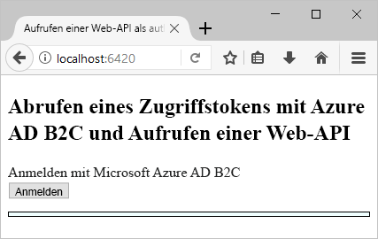
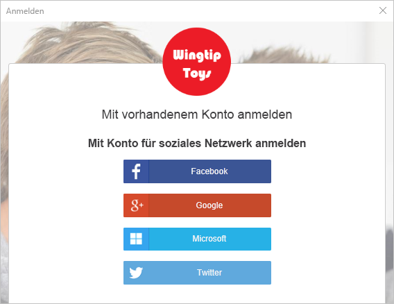
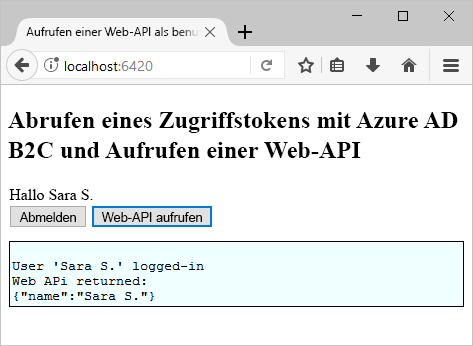

# <a name="test-drive-a-single-page-application-configured-with-azure-ad-b2c"></a>Testen einer mit Azure AD B2C konfigurierten Single-Page-Anwendung

## <a name="about-this-sample"></a>Informationen zu diesem Beispiel

Azure Active Directory B2C ermöglicht die Cloudidentitätsverwaltung, um Ihre Anwendung, Ihr Unternehmen und Ihre Kunden zu schützen.  Dieser Schnellstart verwendet eine Single-Page-Beispielanwendung, um Folgendes zu veranschaulichen:

* Erstellen eines Kontos bei einem sozialen Netzwerk als Identitätsanbieter oder eines lokalen Kontos mit der E-Mail-Adresse über die Richtlinie **Registrieren oder anmelden** oder Anmelden bei einem solchen Konto 
* **Aufrufen einer API** zum Abrufen Ihres Anzeigenamens aus einer mit Azure AD B2C geschützten Ressource

## <a name="prerequisites"></a>Voraussetzungen

* Installieren Sie [Visual Studio 2017](https://www.visualstudio.com/downloads/) mit den folgenden Workloads:
    - **ASP.NET und Webentwicklung**

* Installieren von [Node.js](https://nodejs.org/en/download/)

* Sie besitzen ein Konto bei einem sozialen Netzwerk, d.h. bei Facebook, Google, Microsoft oder Twitter. Falls dies nicht der Fall sein sollte, ist eine gültige E-Mail-Adresse erforderlich.

[!INCLUDE [quickstarts-free-trial-note](../../includes/quickstarts-free-trial-note.md)]

## <a name="download-the-sample"></a>Herunterladen des Beispiels

[Laden Sie die Beispielanwendung von GitHub herunter, oder klonen Sie sie](https://github.com/Azure-Samples/active-directory-b2c-javascript-msal-singlepageapp).

## <a name="run-the-sample-application"></a>Ausführen der Beispielanwendung

So führen Sie dieses Beispiel über die Node.js-Eingabeaufforderung aus 

```
cd active-directory-b2c-javascript-msal-singlepageapp
npm install && npm update
node server.js
```

Das Konsolenfenster zeigt die Portnummer für die Webanwendung, die auf Ihrem Computer ausgeführt wird.

```
Listening on port 6420...
```

Öffnen Sie `http://localhost:6420` in einem Webbrowser, um auf die Webanwendung zuzugreifen.




## <a name="create-an-account"></a>Erstellen eines Kontos

Klicken Sie auf die Schaltfläche **Login** (Anmelden), um den Azure AD B2C-Workflow zum **Registrieren oder Anmelden** zu starten. Bei der Erstellung eines Kontos können Sie ein vorhandenes Konto bei einem sozialen Netzwerk als Identitätsanbieter oder ein E-Mail-Konto verwenden.

### <a name="sign-up-using-a-social-identity-provider"></a>Registrieren mit einem sozialen Netzwerk als Identitätsanbieter

Um sich mit einem Social Media-Konto als Identitätsanbieter zu registrieren, klicken Sie auf die Schaltfläche des Identitätsanbieters, den Sie verwenden möchten. Wenn Sie es vorziehen, eine E-Mail-Adresse zu verwenden, wechseln Sie zum Abschnitt [Registrieren mit einer E-Mail-Adresse](#sign-up-using-an-email-address).



Sie müssen sich mit den Anmeldeinformationen Ihres Social Media-Kontos authentifizieren (anmelden) und die Anwendung dazu autorisieren, Informationen von Ihrem Social Media-Konto zu lesen. Wenn Sie der Anwendung Zugriff auf diese gewähren, kann die Anwendung Profilinformationen aus dem Social Media-Konto abrufen, z.B. Ihren Namen und Ihre Stadt. 


Die Profildetails für Ihr neues Konto werden mit Informationen aus Ihrem Social Media-Konto aufgefüllt. 


Aktualisieren Sie die Felder „Anzeigename“, „Position“ und „Stadt“, und klicken Sie auf **Fortfahren**.  Die von Ihnen eingegebenen Werte werden für das Profil Ihres Azure AD B2C-Benutzerkontos verwendet.

Sie haben erfolgreich ein neues Azure AD B2C-Benutzerkonto über einen Identitätsanbieter erstellt. 

Nächster Schritt: Abschnitt [Aufrufen einer Ressource](#call-a-resource).

### <a name="sign-up-using-an-email-address"></a>Registrieren mit einer E-Mail-Adresse

Wenn Sie nicht ein Social Media-Konto zur Authentifizierung verwenden möchten, können Sie mit einer gültigen E-Mail-Adresse ein Azure AD B2C-Benutzerkonto erstellen. Ein lokales Azure AD B2C-Benutzerkonto verwendet Azure Active Directory als Identitätsanbieter. Um Ihre E-Mail-Adresse zu verwenden, klicken Sie auf den Link **Sie haben noch kein Konto? Jetzt registrieren**.


Geben Sie eine gültige E-Mail-Adresse ein, und klicken Sie auf **Überprüfungscode senden**. Um den Überprüfungscode von Azure AD B2C zu erhalten, ist eine gültige E-Mail-Adresse erforderlich. 

Geben Sie den Überprüfungscode ein, den Sie per E-Mail erhalten, und klicken Sie auf **Code überprüfen**.

Fügen Sie Ihre Profilinformationen hinzu, und klicken Sie auf **Erstellen**.


Sie haben erfolgreich ein neues lokales Azure AD B2C-Benutzerkonto erstellt.

## <a name="call-a-resource"></a>Aufrufen einer Ressource

Wenn Sie angemeldet sind, können Sie auf die Schaltfläche **Call Web API** (Web-API aufrufen) klicken, um Ihren Anzeigenamen, der vom Web-API-Aufruf zurückgegeben wurde, als JSON-Objekt abzurufen. 



## <a name="next-steps"></a>Nächste Schritte

Der nächste Schritt besteht darin, einen eigenen Azure AD B2C-Mandanten zu erstellen und das Beispiel für die Ausführung über Ihren Mandanten zu konfigurieren. 

> [!div class="nextstepaction"]
> [Erstellen eines Azure Active Directory B2C-Mandanten im Azure-Portal](active-directory-b2c-get-started.md)