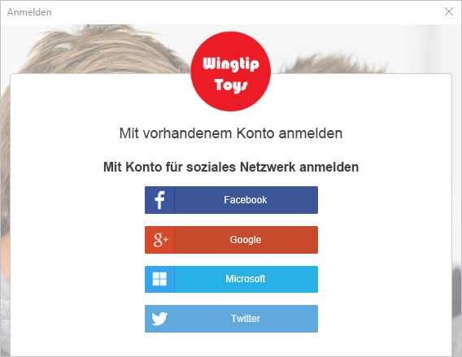
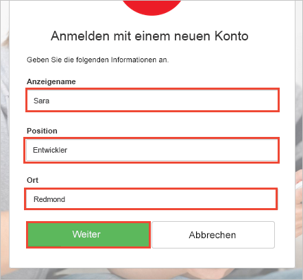
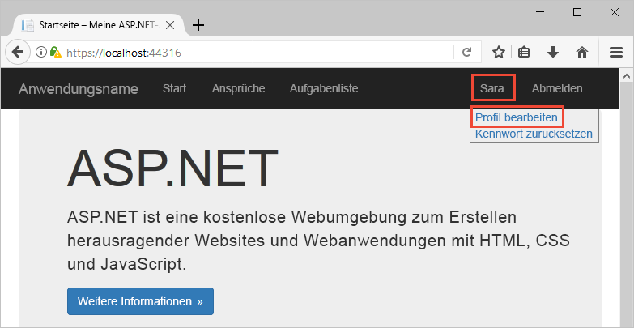
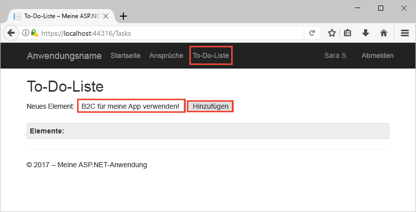

# Testversion einer Azure AD-B2C-fähigen Web-App

Azure Active Directory B2C ermöglicht die Cloudidentitätsverwaltung, um Ihre Anwendung, Ihr Unternehmen und Ihre Kunden zu schützen. In diesem Schnellstart wird eine Aufgabenlisten-Beispiel-App verwendet, um Folgendes zu veranschaulichen:

> [!div class="checklist"]
> * Anmelden mit einer benutzerdefinierten Anmeldeseite
> * Anmelden mit einem sozialen Netzwerk als Identitätsanbieter
> * Erstellen und Verwalten des Azure AD B2C-Kontos und -Benutzerprofils
> * Aufrufen einer durch Azure AD B2C gesicherten Web-API

## Voraussetzungen

* [Visual Studio 2017](https://www.visualstudio.com/downloads/) mit der Workload **ASP.NET und Webentwicklung** 
* Sie besitzen ein Konto bei einem sozialen Netzwerk, d.h. bei Facebook, Google, Microsoft oder Twitter.

[!INCLUDE [quickstarts-free-trial-note](../../includes/quickstarts-free-trial-note.md)]

## Herunterladen des Beispiels

[Laden Sie die Beispielanwendung von GitHub herunter, oder klonen Sie sie](https://github.com/Azure-Samples/active-directory-b2c-dotnet-webapp-and-webapi).

## Ausführen der App in Visual Studio

Öffnen Sie in Visual Studio im Projektordner der Beispielanwendung die Projektmappe `B2C-WebAPI-DotNet.sln`. 

Bei der Projektmappe handelt es sich um eine Beispielanwendung für Aufgabenlisten, die aus zwei Projekten besteht:

* **TaskWebApp** – Eine ASP.NET MVC-Webanwendung, in der ein Benutzer die Elemente seiner Aufgabenliste verwalten kann.  
* **TaskService** – Ein ASP.NET-Web-API-Back-End, das in den Aufgabenlistenelementen eines Benutzers ausgeführte Vorgänge verwaltet. Die Web-App ruft diese Web-API auf und zeigt die Ergebnisse an.

Für diesen Schnellstart müssen die Projekte `TaskWebApp` und `TaskService` gleichzeitig ausgeführt werden. 

1. Wählen Sie im Visual Studio-Menü **Projekte > Startprojekte festlegen...**. 
2. Aktivieren Sie das Optionsfeld **Mehrere Startprojekte**.
3. Ändern Sie die **Aktion** für beide Projekte in **Start**. Klicken Sie auf **OK**.

Wählen Sie **Debuggen > Debuggen starten** aus, um beide Anwendungen zu erstellen und auszuführen. Jede Anwendung wird in einer eigenen Browserregisterkarte geöffnet:

`https://localhost:44316/` – Dies ist die Seite der ASP.NET-Webanwendung. Im Rahmen des Schnellstarts interagieren Sie direkt mit dieser Anwendung.
`https://localhost:44332/` – Dies ist die Seite der Web-API, die von der ASP.NET-Webanwendung aufgerufen wird.

## Erstellen eines Kontos

Klicken Sie in der ASP.NET-Webanwendung auf den Link **Registrieren/Anmelden**, um den Workflow **Registrieren oder anmelden** zu starten. Bei der Erstellung eines Kontos können Sie ein vorhandenes Konto bei einem sozialen Netzwerk als Identitätsanbieter oder ein E-Mail-Konto verwenden. Verwenden Sie für diese Schnellstartanleitung ein Konto bei einem sozialen Netzwerk als Identitätsanbieter (etwa Facebook, Google, Microsoft oder Twitter).

### Registrieren mit einem Konto bei einem sozialen Netzwerk als Identitätsanbieter

Um sich mit einem Social Media-Konto als Identitätsanbieter zu registrieren, klicken Sie auf die Schaltfläche des Identitätsanbieters, den Sie verwenden möchten. 

Sie müssen sich mit den Anmeldeinformationen Ihres Social Media-Kontos authentifizieren (anmelden) und die Anwendung dazu autorisieren, Informationen von Ihrem Social Media-Konto zu lesen. Wenn Sie der Anwendung Zugriff auf diese gewähren, kann die Anwendung Profilinformationen aus dem Social Media-Konto abrufen, z.B. Ihren Namen und Ihre Stadt. 

Schließen Sie den Anmeldevorgang für den Identitätsanbieter ab. Beispiel: Wenn Sie Twitter ausgewählt haben, geben Sie Ihre Twitter-Anmeldeinformationen ein, und klicken Sie auf **Anmelden**.

Die Profildetails für Ihr neues Azure AD B2C-Konto werden mit Informationen aus Ihrem Social Media-Konto aufgefüllt.

Aktualisieren Sie die Felder „Anzeigename“, „Position“ und „Stadt“, und klicken Sie auf **Fortfahren**.  Die von Ihnen eingegebenen Werte werden für das Profil Ihres Azure AD B2C-Benutzerkontos verwendet.

Folgende Schritte wurden erfolgreich ausgeführt:

> [!div class="checklist"]
> * Authentifizierung mit einem Identitätsanbieter
> * Erstellung eines Azure AD B2C-Benutzerkontos 

## Bearbeiten des Profils

Azure Active Directory B2C bietet Funktionen, mit denen Benutzer ihre Profile aktualisieren können. Klicken Sie in der Menüleiste der Webanwendung auf Ihren Profilnamen, und wählen Sie **Profil bearbeiten** aus, um das von Ihnen erstellte Profil zu bearbeiten.

Ändern Sie Ihren **Anzeigenamen** und Ihre **Stadt**.  Klicken Sie auf **Fortfahren**, um Ihr Profil zu aktualisieren.

Beachten Sie, dass Ihr Anzeigename oben rechts auf der Seite den aktualisierten Namen angibt. 

## Zugreifen auf eine Ressource für eine gesicherte Web-API

Klicken Sie auf **Aufgabenliste**, um Ihre Aufgabenlistenelemente einzugeben und zu ändern. Die ASP.NET-Webanwendung schließt ein Zugriffstoken in die Anforderung an die Web-API-Ressource ein, das die Berechtigung zum Ausführen von Vorgängen bezüglich der Aufgabenlistenelemente des Benutzers anfordert. 

Geben Sie Text in das Textfeld **Neues Element** ein. Klicken Sie auf **Hinzufügen**, um die mit Azure AD B2C geschützte Web-API aufzurufen, die ein Aufgabenlistenelement hinzufügt.

Sie haben Ihr Azure AD B2C-Benutzerkonto verwendet, um einen autorisierten Aufruf einer gesicherten Azure AD B2C-Web-API durchzuführen.

## Nächste Schritte

Mit dem Beispiel in dieser Schnellstartanleitung können andere Azure AD B2C-Szenarien ausprobiert werden, u.a.:

* Erstellen eines neuen lokalen Kontos mit einer E-Mail-Adresse
* Zurücksetzen des Kennworts Ihres lokalen Kontos

Wenn Sie sich mit der Erstellung eines eigenen Azure AD B2C-Mandanten befassen und das Beispiel für die Ausführung Ihres eigenen Mandanten konfigurieren möchten, sehen Sie sich das folgende Tutorial an:

> [!div class="nextstepaction"]
> [Erstellen Sie mithilfe von Azure Active Directory B2C eine ASP.NET-Web-App mit Registrierung, Anmeldung, Profilbearbeitung und Kennwortzurücksetzung.](active-directory-b2c-devquickstarts-web-dotnet-susi.md)