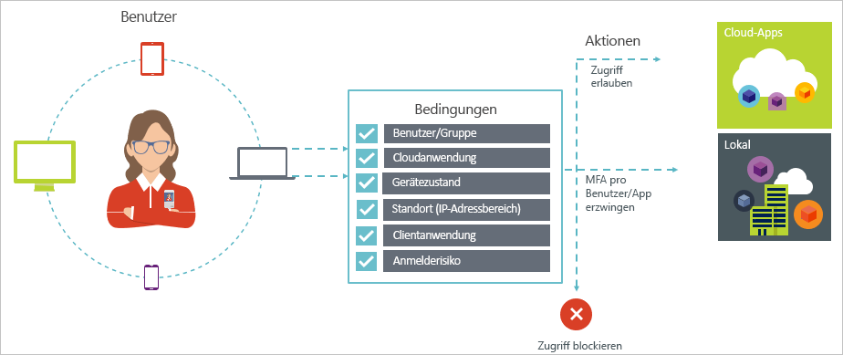

# Bedingter Zugriff in Azure Active Directory

Sicherheit ist ein wichtiges Anliegen von Organisationen, die die Cloud nutzen. Wichtige Aspekte der Cloudsicherheit, wenn es um die Verwaltung von Cloudressourcen geht, sind Identität und Zugriff. In einer von Mobilgeräten und der Cloud geprägten Welt können Benutzer mithilfe einer Vielzahl von Geräten und Apps von überall aus auf Ressourcen in Ihrer Organisation zugreifen. Daher reicht eine Konzentration darauf, wer auf Ihre Ressourcen Zugriff hat, nicht mehr aus. Um die Balance zwischen Sicherheit und Produktivität zu bewahren, müssen IT-Experten bei der Wahl der Zugriffssteuerung auch berücksichtigen, wie auf eine Ressource zugegriffen wird. Mit dem bedingten Zugriff von Azure AD können Sie diese Anforderung erfüllen. Der bedingte Zugriff ist eine Funktion von Azure Active Directory, mit der Sie von einem zentralen Ort aus die Kontrolle des Zugriffs für Apps in Ihrer Umgebung basierend auf bestimmten Bedingungen erzwingen können. 

Dieser Artikel bietet eine konzeptionelle Übersicht über den bedingten Zugriff in Azure AD.

## Häufige Szenarios

In einer Welt, in der Mobilität und die Cloud an erster Stelle stehen, ermöglicht Azure Active Directory das einmalige Anmelden an Geräten, Apps und Diensten an jedem Ort. Aufgrund der steigenden Zahl von Geräten (z.B. „BYOD“), das Arbeiten außerhalb von Unternehmensnetzwerken und der Nutzung von SaaS-Apps von Drittanbietern, gelten für IT-Spezialisten zwei gegensätzliche Zielsetzungen:

- Schaffen von Bedingungen für Benutzer, unter denen sie an jedem Ort und zu jeder Zeit produktiv sein können
- Lückenloses Schützen der Assets eines Unternehmens

Mithilfe von Richtlinien für bedingten Zugriff können Sie die passende Zugriffssteuerung unter den erforderlichen Bedingungen anwenden. Der bedingte Zugriff von Azure AD bietet zusätzliche Sicherheit, wenn er benötigt wird, ohne die Benutzer andernfalls zu behindern. 

Im Folgenden finden Sie einige allgemeine Zugriffsprobleme, bei denen der bedingte Zugriff Ihnen helfen kann:

- **[Anmelderisiko:](active-directory-conditional-access-conditions.md#sign-in-risk)** Azure AD Identity Protection erkennt Anmelderisiken. Wie schränken Sie den Zugriff ein, wenn ein erkanntes Anmelderisiko auf einen böswilligen Benutzer hindeutet? Was geschieht, wenn Sie einen stärkeren Beweis dafür benötigen, dass eine Anmeldung auch tatsächlich durch einen berechtigten Benutzer durchgeführt wurde, oder wenn Ihre Zweifel so stark sind, dass Sie für bestimmte Benutzer den Zugriff auf eine App blockieren möchten?

- **[Netzwerkadresse:](active-directory-conditional-access-locations.md)** Der Zugriff auf Azure AD ist von überall aus möglich. Was geschieht, wenn ein Zugriffsversuch von einer Netzwerkadresse ausgeführt wird, die nicht durch Ihre IT-Abteilung kontrolliert wird? Die Kombination aus Benutzername und Kennwort ist vermutlich ausreichend als Nachweis der Identität für den Zugriff auf Ihre Ressourcen aus Ihrem Unternehmensnetzwerk. Was geschieht aber, wenn Sie einen stärkeren Nachweis der Identität für den Zugriff aus anderen, unerwarteten Ländern oder Regionen der Welt benötigen? Was geschieht, wenn Sie sogar alle Zugriffsversuche von bestimmten Standorten blockieren möchten?  

- **[Geräteverwaltung:](active-directory-conditional-access-conditions.md#device-platforms)** In Azure AD können Benutzer über eine breite Palette von Geräten, einschließlich mobiler und persönlicher Geräte, auf Cloud-Apps zugreifen. Was geschieht, wenn Sie festlegen möchten, dass nur noch ein Zugriff durch Benutzer möglich ist, die von Ihrer IT-Abteilung verwaltete Geräte verwenden? Was geschieht, wenn Sie darüber hinaus den Zugriff auf Cloud-Apps in Ihrer Umgebung für bestimmte Gerätetypen blockieren möchten? 

- **[Clientanwendung:](active-directory-conditional-access-conditions.md#client-apps)** Heute können Sie auf viele Cloud-Apps über verschiedene App-Typen zugreifen, z.B. webbasierte Apps, mobile Apps oder Desktop-Apps. Was geschieht, wenn ein Zugriffsversuch mithilfe eines Client-App-Typs durchgeführt wird, der bekannte Probleme verursacht? Was geschieht, wenn Sie für bestimmte App-Typen ein Gerät vorschreiben möchten, das von Ihrer IT-Abteilung verwaltet wird? 

Diese Fragen und die zugehörigen Antworten stellen allgemeinen Szenarien für den bedingten Zugriff von Azure AD dar. Der bedingte Zugriff ist eine Funktion von Azure Active Directory, die es Ihnen ermöglicht, Zugriffsszenarien mithilfe eines richtlinienbasierten Ansatzes zu behandeln.

## Richtlinien für bedingten Zugriff

Eine Richtlinie für bedingten Zugriff ist die Definition eines Zugriffsszenarios mithilfe des folgenden Musters:

**Then do this** (Dann diese Aktion ausführen) definiert die Antwort Ihrer Richtlinie. Es ist wichtig zu beachten, dass das Ziel einer Richtlinie für bedingten Zugriff nicht das Gewähren des Zugriffs auf eine Cloud-App ist. In Azure AD erfolgt das Gewähren des Zugriffs auf Cloud-Apps über Benutzerzuweisungen. Mit einer Richtlinie für bedingten Zugriff steuern Sie, wie autorisierte Benutzer (Benutzer, denen der Zugriff auf einen Cloud-App gewährt wurde) unter bestimmten Bedingungen auf Cloud-Apps zugreifen können. In Ihrer Antwort erzwingen Sie zusätzliche Anforderungen wie z.B. eine mehrstufige Authentifizierung, ein verwaltetes Gerät usw. Im Kontext des bedingten Zugriffs von Azure AD heißen diese Anforderungen, die Ihre Richtlinie erzwingt, „Zugriffssteuerungen“. In der am stärksten einschränkenden Form kann Ihre Richtlinie den Zugriff blockieren. Weitere Informationen finden Sie unter [Zugriffssteuerungen beim bedingten Zugriff von Azure Active Directory](active-directory-conditional-access-controls.md).
     

**When this happens** (Wenn dies geschieht) definiert den Grund für das Auslösen der Richtlinie. Dieser Grund wird durch eine Gruppe von Bedingungen gekennzeichnet, die erfüllt wurden. Beim bedingten Zugriff von Azure AD spielen zwei Zuordnungsbedingungen eine besondere Rolle:

- **[Benutzer:](active-directory-conditional-access-conditions.md#users-and-groups)** Dies ist der Benutzer, der einen Zugriffsversuch durchführt (**Wer**). 

- **[Cloud-Apps:](active-directory-conditional-access-conditions.md#cloud-apps)** Dies sind die Ziele des Zugriffsversuchs (**Was**).    

Beide Bedingungen müssen in einer Richtlinie für bedingten Zugriff angegeben werden. Zusätzlich zu den beiden obligatorischen Bedingungen können Sie auch zusätzliche Bedingungen einfügen, die beschreiben, wie der Zugriffsversuch erfolgt. Gängige Beispiele sind mobile Geräte oder Standorte außerhalb des Unternehmensnetzwerks. Weitere Informationen finden Sie unter [Bedingungen beim bedingten Zugriff von Azure Active Directory](active-directory-conditional-access-conditions.md).   

Die Kombination aus Bedingungen und Ihren Zugriffssteuerungen ergibt eine Richtlinie für bedingten Zugriff. 

Mit dem bedingten Zugriff von Azure AD können Sie den Zugriff von autorisierten Benutzern auf Ihre Cloud-Apps steuern. Ziel einer Richtlinie für bedingten Zugriff ist es, bei einem Zugriffsversuch auf eine Cloud-App zusätzliche Zugriffssteuerungen zu erzwingen, die durch die Methodik eines Zugriffsversuchs ausgelöst werden.

Ein Vorteil der Verwendung eines richtlinienbasierten Ansatzes zum Schutz des Zugriffs auf Ihre Cloud-Apps ist, dass Sie die Richtlinienanforderungen für Ihre Umgebung mit der in diesem Artikel beschriebenen Struktur beginnen können, ohne sich über die technische Implementierung Gedanken machen zu müssen. 

## Nächste Schritte

- Wenn Sie mehr erfahren möchten:
    - Bedingungen: [Bedingungen beim bedingten Zugriff in Azure Active Directory](active-directory-conditional-access-conditions.md)

    - Zugriffssteuerungen: [Zugriffssteuerungen beim bedingten Zugriff von Azure Active Directory](active-directory-conditional-access-controls.md)

- Wenn Sie Erfahrungen beim Konfigurieren von Richtlinien für bedingten Zugriff sammeln möchten, lesen Sie unter [Erste Schritte mit dem bedingten Zugriff von Azure Active Directory](active-directory-conditional-access-azure-portal-get-started.md) nach.

- Wenn Sie bereit sind, Richtlinien für den bedingten Zugriff für Ihre Umgebung zu konfigurieren, lesen Sie unter [Best Practices für den bedingten Zugriff in Azure Active Directory](active-directory-conditional-access-best-practices.md) nach. 
