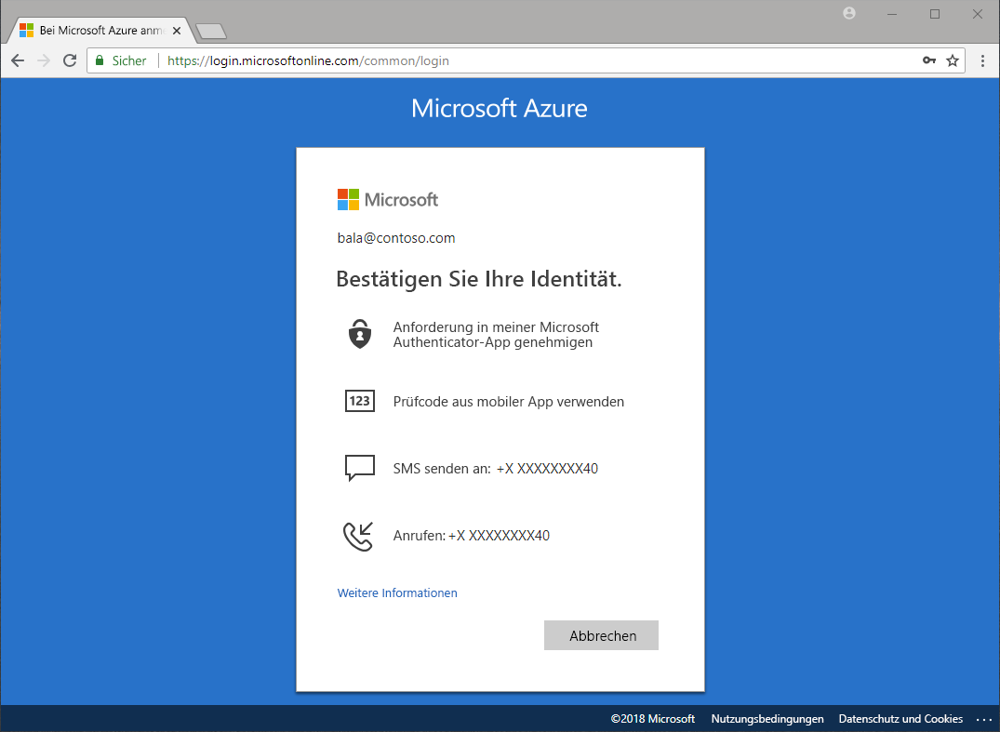

# Welche Methoden stehen für die Authentifizierung zur Verfügung?

In den Nachrichten hören wir davon, dass Kennwörter gestohlen und Identitäten kompromittiert werden. Indem zusätzlich zu einem Kennwort die Abfrage eines zweiten Faktors erzwungen wird, wird die Sicherheit für Ihre Organisation sofort erhöht. Microsoft Azure Active Directory (Azure AD) enthält Features, z.B. Azure Multi-Factor Authentication (Azure MFA) und Azure AD-Self-Service-Kennwortzurücksetzung (Self-Service Password Reset, SSPR), damit Administratoren ihre Organisationen und Benutzer mit zusätzlichen Authentifizierungsmethoden schützen können.

Wenn ein Benutzer Zugriff auf eine sensible Anwendung benötigt, sein Kennwort zurücksetzt oder Windows Hello aktiviert, wird er ggf. dazu aufgefordert, sich noch auf eine weitere Weise als Person zu verifizieren.

Die zusätzliche Verifizierung kann beispielsweise über die folgenden Authentifizierungsmethoden durchgeführt werden:

* Einen Code, der per E-Mail oder SMS bereitgestellt wird
* Einen Telefonanruf
* Eine Benachrichtigung oder einen Code auf dem Smartphone
* Antworten auf Sicherheitsfragen

Mit Azure MFA und Azure AD-Self-Service-Kennwortzurücksetzung haben Administratoren die Kontrolle über die Bereiche Konfiguration, Richtlinien, Überwachung und Berichterstellung und können Azure AD und das Azure-Portal nutzen, um ihre Organisationen zu schützen.

## Self-Service-Kennwortzurücksetzung

Mit der Self-Service-Kennwortzurücksetzung können Ihre Benutzer jederzeit ihr Kennwort zurücksetzen, ohne dass ein Administrator eingreifen muss.

> [!VIDEO https://www.youtube.com/embed/hc97Yx5PJiM]

Die Self-Service-Kennwortzurücksetzung umfasst Folgendes:

* **Kennwortänderung:** Mir ist mein Kennwort bekannt, aber ich möchte es in ein neues Kennwort ändern.
* **Kennwortzurücksetzung**: Ich kann mich nicht anmelden und möchte mein Kennwort mithilfe einer oder mehrerer genehmigter Authentifizierungsmethoden zurücksetzen.
* **Kontoentsperrung**: Ich kann mich nicht anmelden, weil mein Konto gesperrt ist, und ich möchte es mithilfe einer oder mehrerer genehmigter Authentifizierungsmethoden entsperren.

## Multi-Factor Authentication

Azure Multi-Factor Authentication (MFA) ist die Lösung von Microsoft für die zweistufige Überprüfung. Mit vom Administrator genehmigten Authentifizierungsmethoden trägt Azure MFA zum Schutz Ihres Zugriffs auf Daten und Anwendungen bei, während gleichzeitig die Forderung nach einem einfachen Anmeldeprozess erfüllt wird.

## Nächste Schritte

Der nächste Schritt besteht darin, tiefer einzusteigen und mit dem Konfigurieren der Self-Service-Kennwortzurücksetzung und Azure Multi-Factor Authentication zu beginnen.

Informationen zum Einstieg in die Self-Service-Kennwortzurücksetzung finden Sie in der entsprechenden [Schnellstartanleitung zur Aktivierung](quickstart-sspr.md).

Weitere Informationen zur Self-Service-Kennwortzurücksetzung finden Sie im Artikel [Ausführliche Informationen zur Self-Service-Kennwortzurücksetzung in Azure AD](concept-sspr-howitworks.md).

Informieren Sie sich über Azure Multi-Factor Authentication im Artikel [Funktionsweise von Azure Multi-Factor Authentication](concept-mfa-howitworks.md).