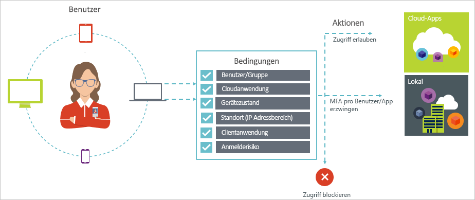

# Was ist der bedingte Zugriff in Azure Active Directory?

Sicherheit ist ein wichtiges Anliegen von Organisationen, die die Cloud nutzen. Wichtige Aspekte der Cloudsicherheit, wenn es um die Verwaltung von Cloudressourcen geht, sind Identität und Zugriff. In einer von Mobilgeräten und der Cloud geprägten Welt können Benutzer mithilfe einer Vielzahl von Geräten und Apps von überall aus auf Ressourcen in Ihrer Organisation zugreifen. Daher reicht eine Konzentration darauf, wer auf Ihre Ressourcen Zugriff hat, nicht mehr aus. Um das Gleichgewicht zwischen Sicherheit und Produktivität zu bewahren, müssen Sie bei der Wahl der Zugriffssteuerung auch berücksichtigen, auf welche Weise auf eine Ressource zugegriffen wird. Mit dem bedingten Zugriff von Azure Active Directory (Azure AD) können Sie diese Anforderung erfüllen. Der bedingte Zugriff ist eine Funktion von Azure Active Directory. Mit dem bedingten Zugriff können Sie basierend auf bestimmten Bedingungen automatisierte Entscheidungen hinsichtlich der Zugriffssteuerung für den Zugriff auf Ihre Cloud-Apps implementieren.

Richtlinien für den bedingten Zugriff werden durchgesetzt, nachdem die First-Factor-Authentifizierung abgeschlossen ist. Daher ist der bedingte Zugriff nicht als erste Abwehrmaßnahme für Szenarien wie Denial-of-Service-Angriffe (DoS) gedacht, sondern kann Signale von diesen Ereignissen (z. B. der Risikostufe für die Anmeldung, den Standort der Anforderung usw.) nutzen, um den Zugriff zu bestimmen.  

Dieser Artikel bietet eine konzeptionelle Übersicht über den bedingten Zugriff in Azure AD.

## Häufige Szenarios

In einer Welt, in der Mobilität und die Cloud an erster Stelle stehen, ermöglicht Azure Active Directory das einmalige Anmelden an Geräten, Apps und Diensten an jedem Ort. Aufgrund der steigenden Zahl von Geräten (z.B. durch das BYOD-Konzept [Bring Your Own Device]), der zunehmenden Arbeit außerhalb von Unternehmensnetzwerken und der vermehrten Nutzung von SaaS-Apps von Drittanbietern stehen Sie vor zwei gegensätzlichen Zielsetzungen:

- Schaffen von Bedingungen für Benutzer, unter denen sie an jedem Ort und zu jeder Zeit produktiv sein können
- Lückenloses Schützen der Assets eines Unternehmens

Mithilfe von Richtlinien für bedingten Zugriff können Sie die passende Zugriffssteuerung unter den erforderlichen Bedingungen anwenden. Der bedingte Zugriff von Azure AD bietet zusätzliche Sicherheit, wenn er benötigt wird, ohne die Benutzer andernfalls zu behindern.

Im Folgenden finden Sie einige allgemeine Überlegungen zum Zugriff, bei denen der bedingte Zugriff Ihnen helfen kann:

- **[Anmelderisiko](conditions.md#sign-in-risk)**: Azure AD Identity Protection erkennt Anmelderisiken. Wie schränken Sie den Zugriff ein, wenn ein erkanntes Anmelderisiko auf einen böswilligen Benutzer hindeutet? Was geschieht, wenn Sie einen fundierteren Beweis dafür benötigen, dass eine Anmeldung durch einen berechtigten Benutzer durchgeführt wurde? Was geschieht, wenn Ihre Zweifel so stark sind, dass Sie für bestimmte Benutzer den Zugriff auf eine App blockieren möchten?  

- **[Netzwerkadresse](location-condition.md)**: Der Zugriff auf Azure AD ist von überall aus möglich. Was geschieht, wenn ein Zugriffsversuch von einer Netzwerkadresse ausgeführt wird, die nicht durch Ihre IT-Abteilung kontrolliert wird? Eine Kombination aus Benutzername und Kennwort ist vermutlich ein ausreichender Identitätsnachweis für Zugriffsversuche aus Ihrem Unternehmensnetzwerk. Was geschieht aber, wenn Sie einen stärkeren Nachweis der Identität für den Zugriff aus anderen, unerwarteten Ländern oder Regionen der Welt benötigen? Was geschieht, wenn Sie sogar alle Zugriffsversuche von bestimmten Standorten blockieren möchten?  

- **[Geräteverwaltung](conditions.md#device-platforms)**: In Azure AD können Benutzer über eine breite Palette von Geräten, einschließlich mobiler und persönlicher Geräte, auf Cloud-Apps zugreifen. Was geschieht, wenn Sie festlegen möchten, dass der Zugriff nur noch mit Geräten möglich sein soll, die von Ihrer IT-Abteilung verwaltet werden? Was geschieht, wenn Sie darüber hinaus den Zugriff auf Cloud-Apps in Ihrer Umgebung für bestimmte Gerätetypen blockieren möchten?

- **[Clientanwendung](conditions.md#client-apps)**: Heute können Sie mit verschiedenen Arten von Apps auf viele Cloud-Apps zugreifen, z.B. mit webbasierten Apps, mobilen Apps oder Desktop-Apps. Was geschieht, wenn ein Zugriffsversuch mithilfe eines Client-App-Typs durchgeführt wird, der bekannte Probleme verursacht? Was geschieht, wenn Sie für bestimmte App-Typen ein Gerät vorschreiben möchten, das von Ihrer IT-Abteilung verwaltet wird?

Diese Fragen und die zugehörigen Antworten stellen allgemeinen Szenarien für den bedingten Zugriff von Azure AD dar.
Der bedingte Zugriff ist eine Funktion von Azure Active Directory, die es Ihnen ermöglicht, Zugriffsszenarien mithilfe eines richtlinienbasierten Ansatzes zu behandeln.

> [!VIDEO https://www.youtube.com/embed/eLAYBwjCGoA]

## Richtlinien für bedingten Zugriff

Eine Richtlinie für bedingten Zugriff ist die Definition eines Zugriffsszenarios mithilfe des folgenden Musters:

**Then do this** (Dann diese Aktion ausführen) gibt die Reaktion Ihrer Richtlinie an. Es ist wichtig zu beachten, dass das Ziel einer Richtlinie für bedingten Zugriff nicht das Gewähren des Zugriffs auf eine Cloud-App ist. In Azure AD erfolgt das Gewähren des Zugriffs auf Cloud-Apps über Benutzerzuweisungen. Mit einer Richtlinie für bedingten Zugriff steuern Sie, wie autorisierte Benutzer (Benutzer, denen der Zugriff auf einen Cloud-App gewährt wurde) unter bestimmten Bedingungen auf Cloud-Apps zugreifen können. In Ihrer Antwort erzwingen Sie zusätzliche Anforderungen wie z.B. eine mehrstufige Authentifizierung, ein verwaltetes Gerät usw. Im Kontext des bedingten Zugriffs von Azure AD heißen diese Anforderungen, die Ihre Richtlinie erzwingt, „Zugriffssteuerungen“. In der am stärksten einschränkenden Form kann Ihre Richtlinie den Zugriff blockieren. Weitere Informationen finden Sie unter [Zugriffssteuerungen beim bedingten Zugriff von Azure Active Directory](controls.md).

**When this happens** (Wenn dies geschieht) definiert den Grund für das Auslösen der Richtlinie. Dieser Grund wird durch eine Gruppe von Bedingungen gekennzeichnet, die erfüllt wurden. Beim bedingten Zugriff von Azure AD spielen zwei Zuordnungsbedingungen eine besondere Rolle:

- **[Benutzer](conditions.md#users-and-groups)**: Dies ist der Benutzer, der einen Zugriffsversuch durchführt (**Wer**).

- **[Cloud-Apps](conditions.md#cloud-apps-and-actions)**: Dies sind die Ziele des Zugriffsversuchs (**Was**).

Beide Bedingungen müssen in einer Richtlinie für bedingten Zugriff angegeben werden. Zusätzlich zu den beiden obligatorischen Bedingungen können Sie auch zusätzliche Bedingungen einfügen, die beschreiben, wie der Zugriffsversuch erfolgt. Gängige Beispiele sind mobile Geräte oder Standorte außerhalb des Unternehmensnetzwerks. Weitere Informationen finden Sie unter [Bedingungen beim bedingten Zugriff von Azure Active Directory](conditions.md).

Die Kombination aus Bedingungen und Ihren Zugriffssteuerungen ergibt eine Richtlinie für bedingten Zugriff.

Mit dem bedingten Zugriff von Azure AD können Sie den Zugriff von autorisierten Benutzern auf Ihre Cloud-Apps steuern. Ziel einer Richtlinie für bedingten Zugriff ist es, bei einem Zugriffsversuch auf eine Cloud-App abhängig von der Art des Zugriffsversuchs zusätzliche Zugriffssteuerungen zu erzwingen.

Mit einem richtlinienbasierten Ansatz zum Schutz des Zugriffs auf Ihre Cloud-Apps können Sie die Richtlinienanforderungen für Ihre Umgebung mit der in diesem Artikel beschriebenen Struktur entwerfen, ohne sich über die technische Implementierung Gedanken machen zu müssen.

## Bedingter Azure AD-Zugriff und Verbundauthentifizierung

Richtlinien für bedingten Zugriff arbeiten problemlos mit der [Verbundauthentifizierung](../../security/azure-ad-choose-authn.md#federated-authentication) zusammen. Diese Unterstützung umfasst alle unterstützten Bedingungen und Steuerungen und gibt mithilfe der [Azure AD-Berichterstellung](../reports-monitoring/concept-sign-ins.md) Aufschluss darüber, wie die Richtlinie auf Anmeldungen aktiver Benutzer angewendet wird.

*Verbundauthentifizierung mit Azure AD* bedeutet, dass die Benutzerauthentifizierung bei Azure AD über einen vertrauenswürdigen Authentifizierungsdienst abgewickelt wird. Als vertrauenswürdigen Authentifizierungsdienst können Sie beispielsweise die Active Directory-Verbunddienste (AD FS) oder einen beliebigen anderen Verbunddienst verwenden. Bei dieser Konfiguration führt der Dienst die primäre Benutzerauthentifizierung durch, und Azure AD wird anschließend für die Anmeldung bei einzelnen Anwendungen verwendet. Bedingter Zugriff auf Azure AD wird angewendet, bevor Zugriff auf die Anwendung gewährt wird, auf die der Benutzer zugreift. 

Wenn die konfigurierte Richtlinie für bedingten Zugriff eine mehrstufige Authentifizierung vorsieht, verwendet Azure AD standardmäßig Azure MFA. Wenn Sie den Verbunddienst für MFA verwenden, können Sie `-SupportsMFA` in [PowerShell](https://docs.microsoft.com/powershell/module/msonline/set-msoldomainfederationsettings) auf `$true` festlegen, um Azure AD mit einer Umleitung zum Verbunddienst zu konfigurieren, wenn MFA erforderlich ist. Diese Einstellung funktioniert für Verbundauthentifizierungsdienste, die die Anforderung der MFA-Überprüfung unterstützen, die von Azure AD mithilfe von `wauth= http://schemas.microsoft.com/claims/multipleauthn` ausgegeben wird.

Nachdem sich der Benutzer bei dem Verbundauthentifizierungsdienst angemeldet hat, kümmert sich Azure AD um weitere Richtlinienanforderungen wie Gerätekonformität oder eine genehmigte Anwendung.

## Lizenzanforderungen

[!INCLUDE [Active Directory P1 license](../../../includes/active-directory-p1-license.md)]

## Nächste Schritte

Unter [Anleitung: Planen der Bereitstellung von bedingtem Zugriff in Azure Active Directory](plan-conditional-access.md) erfahren Sie, wie Sie bedingten Zugriff in Ihrer Umgebung implementieren.
