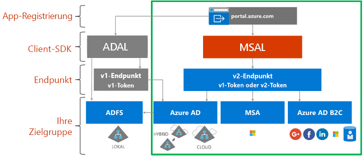

# Informationen zu Microsoft Identity Platform

Microsoft Identity Platform ist eine Weiterentwicklung des Azure AD-Identitätsdiensts (Azure Active Directory) und der zugehörigen Entwicklerplattform. Sie ermöglicht Entwicklern das Erstellen von Anwendungen, mit denen alle Microsoft-Identitäten angemeldet werden, und das Abrufen von Token zum Aufrufen von Microsoft Graph, anderen Microsoft-APIs oder von Entwicklern erstellten APIs. Es handelt sich um eine Plattform mit vollem Funktionsumfang, die einen Authentifizierungsdienst, Open-Source-Bibliotheken, Anwendungsregistrierung und -konfiguration (über ein Entwicklerportal und eine Anwendungs-API), eine vollständige Entwicklerdokumentation, Codebeispiele und andere Inhalte für Entwickler umfasst. Microsoft Identity Platform unterstützt die branchenüblichen Protokolle, z.B. OAuth 2.0 und OpenID Connect.

Bisher haben die meisten Entwickler mit der Azure AD v1.0-Plattform gearbeitet, um Azure AD-Identitäten (Geschäfts-, Schul- und Unikonten) zu authentifizieren, indem sie Token vom Azure AD v1.0-Endpunkt angefordert, die Azure AD-Authentifizierungsbibliothek (ADAL), das Azure-Portal für die Registrierung und Konfiguration von Anwendungen und die Azure AD Graph-API für die Konfiguration von programmgesteuerten Anwendungen verwendet haben. Die Azure AD v1.0-Plattform ist ein ausgereiftes Plattformangebot, das weiterhin für Unternehmensanwendungen geeignet ist.

Um die Funktionen von Microsoft Identity Platform zu erweitern und weiterzuentwickeln, können Sie jetzt eine breitere Palette von Microsoft Identitäten (Azure AD-Identitäten, Microsoft-Konten (wie outlook.com und hotmail.com) sowie soziale und lokale Konten über Azure AD B2C) über den so genannten Azure AD v2.0-Endpunkt authentifizieren. Hier verwenden Sie die Microsoft Authentication Library (MSAL) oder eine beliebige Open-Source-OAuth2.0- oder -OpenID Connect-Bibliothek, das Azure-Portal zur Anwendungsregistrierung und -konfiguration und die Microsoft Graph-API zur programmgesteuerten Anwendungskonfiguration. Die aktualisierte Microsoft Identity Platform (insbesondere die MSAL-Bibliotheken und die neueste App-Registrierungsbenutzeroberfläche des Azure-Portals) hat sich im Laufe des letzten Jahres deutlich weiterentwickelt. Um dieses Release abzuschließen, empfehlen wir Entwicklern, ihre Anwendungen mit der neuesten Microsoft Identity Platform zu entwickeln und zu testen.

Für Anwendungen, die die neuesten ADAL- und MSAL-Versionen verwenden, wird SSO genutzt. Anwendungen, die von ADAL auf MSAL aktualisiert wurden, behalten den Status der Benutzeranmeldung bei. Entwickler können ihre Anwendungen nach eigenem Ermessen auf MSAL aktualisieren, da mit ADAL erstellte Anwendungen weiterhin funktionieren und unterstützt werden.

## Benutzeroberfläche von Microsoft Identity Platform

Die folgende Abbildung zeigt eine Übersicht der Microsoft-Identitätsbenutzeroberfläche. Dabei werden die App-Registrierungsbenutzeroberfläche, SDKs, Endpunkte und unterstützte Identitäten berücksichtigt.

Microsoft Identity Platform verfügt über zwei Endpunkte (v1.0 und v2.0) und zwei Gruppen von Clientbibliotheken für die Verarbeitung dieser Endpunkte. Berücksichtigen Sie bei der Entwicklung einer neuen Anwendung die Vorteile und den aktuellen Zustand der Endpunkte und der Authentifizierungsbibliotheken. Berücksichtigen Sie auch Folgendes:

* Unterstützte Plattformen

    * [ADAL](active-directory-authentication-libraries.md) unterstützt .NET, JavaScript, iOS, Android, Java und Python.
    * [MSAL (Vorschau)](reference-v2-libraries.md) unterstützt .NET, JavaScript, iOS und Android.
    * Beide Endpunkte unterstützen .NET- und Node.js-Servermiddleware zum Schützen von APIs und der Anmeldung. 

* Der Großteil der Innovationen, wie dynamische Zustimmung und inkrementelle Zustimmung, betrifft den v2.0-Endpunkt und MSAL, während wir weiterhin v1.0 und ADAL unterstützen.

    Im Azure-Portal mussten Sie bisher alle Bereiche, die Ihre App benötigt, statisch identifizieren. Mit dem v2.0-Endpunkt und den diesem Endpunkt zugeordneten Portalen können Sie die Bereiche wie bisher statisch definieren oder dynamisch anfordern, wenn Ihre App die Berechtigung benötigt. Der dynamische Vorgang bietet eine weitere optionale Möglichkeit: die inkrementelle Zustimmung. Mit der inkrementellen Zustimmung können Sie eine Teilmenge von Bereichen anfordern, die Sie benötigen, wenn sich ein Benutzer zum ersten Mal authentifiziert, und zusätzliche Bereiche anfordern, wenn diese benötigt werden. 
    
    Wenn Sie beispielsweise eine Kamera-App auf einem mobilen Gerät verwenden, wird der Benutzer aufgefordert, der App den Zugriff auf die Kamera zu erlauben, und erst nachdem der Benutzer zugestimmt hat, darf die App auf die Kamera zugreifen und ein Foto aufnehmen.  Wenn die App bereit ist, das neue Foto zu speichern, kann sie die Lese-/Schreibberechtigung für das Foto anfordern. 

* Mögliche neue Änderungen

    MSAL eignet sich für die Verwendung in einer Produktionsumgebung. Wir bieten die gleiche Art von Produktionsunterstützung für MSAL wie für unsere aktuellen Produktionsbibliotheken. In der Vorschauphase nehmen wir ggf. ohne vorherige Ankündigung Änderungen an der API, am internen Cacheformat und an anderen Mechanismen dieser Bibliothek vor, die neben Fehlerkorrekturen und Verbesserungen von Features erfolgen. Dies kann sich auf Ihre Anwendung auswirken. Eine Änderung am Cacheformat kann sich z.B. bei Ihren Benutzern dadurch bemerkbar machen, dass sie sich erneut anmelden müssen. Eine API-Änderung kann das Aktualisieren Ihres Codes erforderlich machen. Sobald wir das allgemein verfügbare Release veröffentlichen (GA-Release), müssen Sie binnen sechs Monaten ein Update auf das GA-Release ausführen, da Anwendungen, die mit einer Vorschauversion der Bibliothek geschrieben wurden, ggf. nicht mehr funktionieren.

## Nächste Schritte

Weitere Informationen zu v1. 0 und v2. 0.

* [Informationen zu v1.0](v1-overview.md)
* [Informationen zu v2.0](v2-overview.md)
