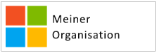
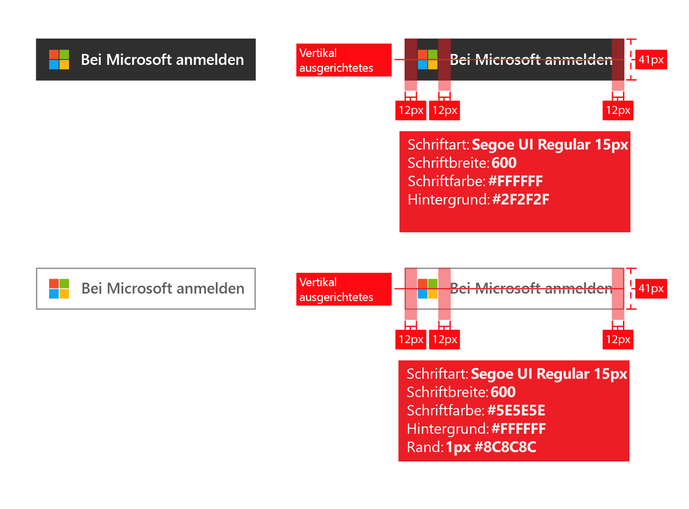
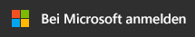
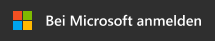
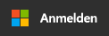

# Brandingrichtlinien für Anwendungen

Wenn Sie Anwendungen mit Azure Active Directory (Azure AD) entwickeln, müssen Sie Ihre Kunden entsprechend anweisen, wenn sie ihr Geschäfts-, Schul- oder Unikonto (verwaltet in Azure AD) oder ihr persönliches Konto für die Registrierung und Anmeldung bei Ihrer Anwendung verwenden möchten.

In diesem Artikel werden die folgenden Themen behandelt:

- Weitere Informationen zu den beiden Arten von Benutzerkonten, die von Microsoft verwaltet werden, und dazu, wie Sie auf Azure AD-Konten in Ihrer Anwendung verweisen können.
- Informationen dazu, wie Sie vorgehen müssen, um das Microsoft-Logo für die Verwendung in Ihrer App hinzuzufügen.
- Herunterladen der offiziellen **Anmelden**- oder **Bei Microsoft anmelden**-Bilder zu Verwendung in Ihrer App.
- Informationen zum Branding und zu Navigationsempfehlungen und -einschränkungen.

## Gegenüberstellung von persönlichen Konten und Geschäfts- oder Schulkonten von Microsoft

Microsoft verwaltet zwei Arten von Benutzerkonten:

- **Persönliche Konten** (ehemals Windows Live ID). Diese Konten stellen die Beziehung zwischen *einzelnen* Benutzern und Microsoft dar und werden für den Zugriff auf Verbrauchergeräte und -dienste von Microsoft verwendet. Konten dieser Art sind für den persönlichen Gebrauch vorgesehen.
- **Geschäfts- oder Schulkonten.**  Diese Konten werden von Microsoft für Unternehmen verwaltet, die Azure Active Directory verwenden. Konten dieser Art dienen zur Anmeldung bei Office 365 und anderen Unternehmensdiensten von Microsoft.

Geschäfts- oder Schulkonten von Microsoft werden den Endbenutzern (Angestellten, Schülern/Studenten, Behördenmitarbeitern) üblicherweise von der jeweiligen Organisation (Unternehmen, Bildungseinrichtung, Behörde) zugewiesen. Diese Konten werden direkt in der Cloud (über die Azure AD-Plattform) verwaltet oder über ein lokales Verzeichnis wie z.B. Windows Server Active Directory mit Azure AD synchronisiert. Microsoft fungiert als *Verwaltungsberechtigter* des Geschäfts- oder Schulkontos, die Konten gehören aber der Organisation und werden auch von dieser gesteuert.

## Verweisen auf Azure AD-Konten in Ihrer Anwendung

Microsoft verwendet die Markennamen „Azure“ und „Active Directory“ nicht gegenüber Endbenutzern – eine Regel, an die auch Sie sich halten sollten.

- Verwenden Sie nach der Anmeldung eines Benutzers möglichst häufig den Namen und das Logo der Organisation. Das ist besser als die Verwendung generischer Formulierungen wie „Ihre Organisation“.
- Wenn Benutzer nicht angemeldet sind, bezeichnen Sie ihre Konten als „Geschäfts- oder Schulkonto“, und machen Sie durch die Verwendung des Microsoft-Logos deutlich, dass das Konto von Microsoft verwaltet wird. Verwenden Sie keine Begriffe wie „Unternehmenskonto“, „Business-Konto“ oder „Firmenkonto“, die den Benutzer verwirren können.

## Piktogramm für Benutzerkonten

In einer früheren Version dieser Richtlinien haben wir die Verwendung eines blauen Badge-Piktogramms empfohlen. Aufgrund von Benutzer- und Entwicklerfeedback empfehlen wir inzwischen aber stattdessen die Verwendung des Microsoft-Logos. Das Microsoft-Logo verdeutlicht den Benutzern, dass sie sich bei Ihrer App mit demselben Konto anmelden können, das sie auch für Office 365 und andere Unternehmensdienste von Microsoft verwenden.

## Registrieren und Anmelden mit Azure AD

Ihre Anwendung verwendet möglicherweise separate Vorgehensweisen für Registrierung und Anmeldung. Dies wird in den folgenden Abschnitten berücksichtigt.

**Ihre App unterstützt die Registrierung von Endbenutzern (etwa bei einer kostenlosen Testversion oder bei einem Freemium-Modell)**: Sie können eine **Registrierungsschaltfläche** anzeigen, mit deren Hilfe Benutzer über ihr Geschäftskonto oder persönliches Konto auf Ihre App zugreifen können. Beim ersten Zugriff auf Ihre App zeigt Azure AD eine Zustimmungsaufforderung an.

**Ihre App benötigt Berechtigungen, die die Einwilligung eines Administrators voraussetzen, oder Ihre App muss von der Organisation lizenziert werden**: Trennen Sie Administratoreinwilligung und Benutzeranmeldung voneinander. Die **Schaltfläche zum Abrufen der App** leitet Administratoren zur Anmeldung weiter und fordert sie auf, im Namen von Benutzern in der Organisation ihre Zustimmung zu erteilen. Dies hat den zusätzlichen Vorteil, dass Benutzeraufforderungen zur Zustimmung zu Ihrer App unterdrückt werden.

## Darstellungsleitfaden für den App-Erwerb

Über den Link zum Abrufen der App muss der Benutzer auf die Zugriffsgewährungs- bzw. Autorisierungsseite von Azure AD weitergeleitet werden, damit ein Organisationsadministrator Ihrer App den Zugriff auf die von Microsoft gehosteten Organisationsdaten gewähren kann. Ausführliche Informationen zum Anfordern von Zugriff finden Sie im Artikel [Integrieren von Anwendungen in Azure Active Directory](quickstart-v1-integrate-apps-with-azure-ad.md).

Nach der Zustimmung des Administrators kann dieser entscheiden, ob Ihre App dem App-Startfeld von Office 365 hinzugefügt werden soll (zugänglich über das Waffel-Menü und [https://portal.office.com/myapps](https://portal.office.com/myapps)). Wenn Sie auf diese Funktion hinweisen möchten, können Sie beispielsweise eine Formulierung wie „App zur Organisation hinzufügen“ verwenden und eine Schaltfläche wie im folgenden Beispiel anzeigen:

Es empfiehlt sich jedoch, eine Erläuterung in Textform zu verwenden, anstatt nur auf Schaltflächen zu setzen. Beispiel: 

> *Wenn Sie bereits Office 365 oder andere Unternehmensdienste von Microsoft verwenden, können Sie <Name_Ihrer_App> einfach Zugriff auf die Daten Ihrer Organisation gewähren. Dadurch können Benutzer mit ihren bereits vorhandenen Arbeitskonten auf <Name_Ihrer_App> zugreifen.*

Um das offizielle Microsoft-Logo zur Verwendung in Ihrer App herunterzuladen, klicken Sie mit der rechten Maustaste auf das gewünschte Logo, und speichern Sie es auf Ihrem Computer.

| Asset                                | PNG-Format | SVG-Format |
| ------------------------------------ | ---------- | ---------- |
| Microsoft-Logo  |  |  |

## Darstellungsleitfaden für die Anmeldung

Ihre App sollte eine Anmeldeschaltfläche enthalten, über die der Benutzer zum Anmeldungsendpunkt für das Protokoll weitergeleitet wird, das Sie für die Azure AD-Integration verwenden. Im folgenden Abschnitt erfahren Sie, wie diese Schaltfläche auszusehen hat.

### Piktogramm und „Bei Microsoft anmelden“

Durch die Kombination aus Microsoft-Logo und dem Text „Bei Microsoft anmelden“ hebt sich Azure AD von anderen Identitätsanbietern ab, die Ihre App möglicherweise unterstützt. Sollte für „Bei Microsoft anmelden“ nicht genügend Platz zur Verfügung stehen, kann der Text auch zu „Anmelden“ verkürzt werden. Für die Schaltflächen kann ein helles oder ein dunkles Farbschema verwendet werden.

Das folgende Diagramm zeigt die von Microsoft empfohlenen Redlines bei der Verwendung der Assets in Ihrer App. Die Redlines gelten für „Mit Microsoft anmelden“ oder die kürzere Version „Anmelden“.

Um die offiziellen Bilddateien zur Verwendung in Ihrer App herunterzuladen, klicken Sie mit der rechten Maustaste auf das gewünschte Logo, und speichern Sie es auf Ihrem Computer.

| Asset                                | PNG-Format | SVG-Format |
| ------------------------------------ | ---------- | ---------- |
| Mit Microsoft anmelden (dunkles Design)  |  |  |
| Mit Microsoft anmelden (helles Design) |  |  |
| Anmelden (dunkles Design)                 |  |  |
| Anmelden (helles Design)                |  |  |

## Brandingempfehlungen

**Verwenden Sie** „Geschäfts-, Schul- oder Unikonto“ in Kombination mit der Schaltfläche „Bei Microsoft anmelden“, um eine zusätzliche Erläuterung bereitzustellen, damit Endbenutzer sofort wissen, ob sie die Option verwenden können. **Nicht** Verwenden Sie keine Begriffe wie „Unternehmenskonto“, „Geschäftskonto“ oder „Firmenkonto“.

**Nicht** Verwenden Sie weder „Office 365-ID“ noch „Azure-ID“. Office 365 ist auch der Name eines Microsoft-Produkts für Heimanwender, das für die Authentifizierung nicht auf Azure AD zurückgreift.

**Nicht** verändert werden.

**Nicht** Verwenden Sie die Markennamen „Azure“ und „Active Directory“ nicht gegenüber Endbenutzern. Gegenüber Entwicklern, IT-Experten und Administratoren können diese Begriffe dagegen problemlos verwendet werden.

## Navigationsempfehlungen

**Stellen** Sie den Benutzern eine Funktion zur Verfügung, über die sie sich abmelden und das Benutzerkonto wechseln können. Die meisten Benutzer besitzen zwar nur ein einzelnes persönliches Konto von Microsoft/Facebook/Google/Twitter, gehören aber häufig mehreren Organisationen an. Die Unterstützung mehrerer angemeldeter Benutzer folgt in Kürze.
