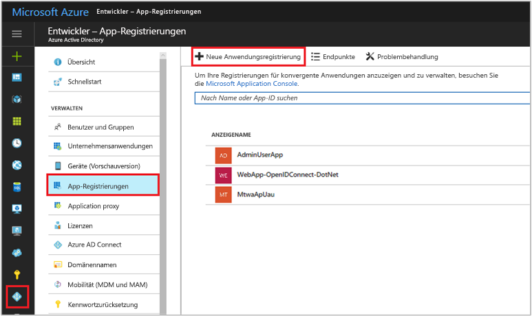
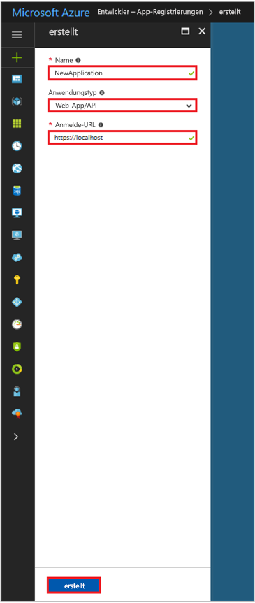

# Schnellstart: Registrieren einer App mit dem Azure AD v1.0-Endpunkt

[!INCLUDE [active-directory-develop-applies-v1](../../../includes/active-directory-develop-applies-v1.md)]

Unternehmensentwickler und SaaS-Anbieter (Software-as-a-Service) können kommerzielle Clouddienste oder Branchenanwendungen entwickeln, die in Azure Active Directory (Azure AD) integriert werden können, um eine sichere Anmeldung und Autorisierung für ihre Dienste bereitzustellen. Um eine Anwendung oder einen Dienst in Azure AD zu integrieren, muss ein Entwickler die Anwendung zuerst bei Azure AD registrieren.

Jede Anwendung muss zunächst in einem Azure AD-Mandanten registriert werden, um die Funktionen von Azure AD nutzen zu können. Dieser Registrierungsvorgang umfasst das Angeben von Details zu Ihrer Anwendung in Azure AD. Beispielsweise muss die URL für den Speicherort angegeben werden, die URL, an die nach der Authentifizierung eines Benutzers Antworten gesendet werden sollen, die URI zum Identifizieren der App usw.

In dieser Schnellstartanleitung wird gezeigt, wie Sie im Azure-Portal über die Benutzeroberfläche für **App-Registrierungen** eine Anwendung in Azure AD hinzufügen und registrieren.

> [!NOTE]
> Sie registrieren eine neue App? Probieren Sie die neue Benutzeroberfläche für **App-Registrierungen (Vorschauversion)** im Azure-Portal aus. Informationen zu den ersten Schritten finden Sie unter [Schnellstart: Registrieren einer Anwendung bei der Microsoft Identity Platform (Vorschauversion)](quickstart-register-app.md).

## Voraussetzungen

Stellen Sie zunächst sicher, dass Sie über einen Azure AD-Mandanten verfügen, bei dem Sie Ihre Apps registrieren können. Wenn Sie über noch keinen Mandanten verfügen, [erfahren Sie hier, wie Sie einen erhalten](quickstart-create-new-tenant.md).

## Registrieren einer neuen Anwendung mit dem Azure-Portal

1. Melden Sie sich beim [Azure-Portal](https://portal.azure.com) an.
1. Wenn Ihr Konto Zugriff auf mehrere Mandanten ermöglicht, wählen Sie oben rechts Ihr Konto aus und legen Ihre Portalsitzung auf den gewünschten Azure AD-Mandanten fest.
1. Wählen Sie im linken Navigationsbereich den Dienst **Azure Active Directory** aus.
1. Wählen Sie **App-Registrierungen** aus, und wählen Sie dann **Neue Awendungsregistrierung** aus.

    

1. Geben Sie auf der angezeigten Seite **Erstellen** die Registrierungsinformationen für Ihre Anwendung ein: 

    - **Name:** Geben Sie einen aussagekräftigen Anwendungsnamen ein.
    - **Anwendungstyp:**
      - Wählen Sie für [Clientanwendungen](developer-glossary.md#client-application), die lokal auf dem Gerät installiert sind, die Option **Nativ** aus. Diese Einstellung wird für öffentliche [native OAuth-Clients](developer-glossary.md#native-client) verwendet.
      - Wählen Sie die Option **Web-App/API** für [Clientanwendungen](developer-glossary.md#client-application) und [Ressourcen-/API-Anwendungen](developer-glossary.md#resource-server) aus, die auf einem sicheren Server installiert sind. Diese Einstellung wird für vertrauliche OAuth-[Webclients](developer-glossary.md#web-client) und für öffentliche [Clients auf Basis von Benutzer-Agents](developer-glossary.md#user-agent-based-client) verwendet. Außerdem kann dieselbe Anwendung sowohl einen Client als auch eine Ressource/API verfügbar machen.
    - **Anmelde-URL**: Geben Sie für Anwendungen von Typ „Web-App/API“ die Basis-URL Ihrer App an. `http://localhost:31544` kann beispielsweise die URL für eine Web-App sein, die auf einem lokalen Computer ausgeführt wird. Benutzer können diese URL nutzen, um sich an einer Webclientanwendung anzumelden. 
    - **Umleitungs-URI**: Geben Sie für native Anwendungen den URI an, der von Azure AD zum Zurückgeben von Tokenantworten verwendet wird. Geben Sie einen für Ihre Anwendung spezifischen Wert ein, z.B. `http://MyFirstAADApp`.

      

    Spezifische Beispiele für Webanwendungen oder native Anwendungen finden Sie in den **Schnellstarts** in unserer Dokumentation.

1. Wenn Sie fertig sind, wählen Sie **Erstellen** aus.

    Azure AD weist Ihrer Anwendung eine eindeutige Anwendungs-ID zu, und Sie gelangen auf die Hauptseite für die Registrierung Ihrer Anwendung. Je nachdem, ob es sich bei Ihrer Anwendung um eine Web- oder eine systemeigene Anwendung handelt, werden jeweils andere Optionen zum Hinzufügen weiterer Funktionen zu Ihrer Anwendung bereitgestellt.

      > [!NOTE]
      > Eine neu registrierte Webanwendung wird standardmäßig so konfiguriert, dass sich **nur** Benutzer desselben Mandanten an Ihrer Anwendung anmelden können.

## Nächste Schritte

- Lesen Sie [Azure AD-Zustimmungsframework](consent-framework.md), um einen Überblick über die Zustimmungsfunktion zu erhalten.
- Um zusätzliche Konfigurationsfunktionen in Ihrer Anwendungsregistrierung zu aktivieren (z.B. Anmeldeinformationen, Berechtigungen, Aktivieren der Anmeldung für Benutzer von anderen Mandanten), lesen Sie [Aktualisieren einer Anwendung in Azure AD](quickstart-v1-update-azure-ad-app.md).
- Um mehr über die beiden Azure AD-Objekte, die eine registrierte Anwendung darstellen, und die Beziehung zwischen ihnen zu erfahren, lesen Sie [Anwendungsobjekte und Dienstprinzipalobjekte](app-objects-and-service-principals.md).
- Weitere Informationen zu den Brandingrichtlinien, die Sie bei der Entwicklung von Anwendungen mit Azure Active Directory verwenden sollten, finden Sie unter [Brandingrichtlinien für Anwendungen](howto-add-branding-in-azure-ad-apps.md).
