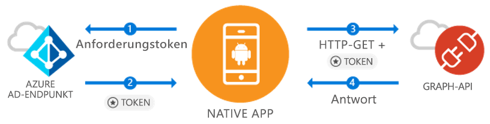

# <a name="quickstart-sign-in-users-and-call-the-microsoft-graph-api-from-an-android-app"></a>Schnellstart: Benutzeranmeldung und Aufrufen der Microsoft Graph-API aus einer Android-App

[!INCLUDE [active-directory-develop-applies-v1-adal](../../../includes/active-directory-develop-applies-v1-adal.md)]

Wenn Sie eine Android-Anwendung entwickeln, sorgt Microsoft für eine einfache und unkomplizierte Anmeldung von Azure Active Directory (Azure AD)-Benutzern. Azure AD ermöglicht es Ihrer Anwendung, über Microsoft Graph oder Ihre eigene geschützte Web-API auf die Benutzerdaten zuzugreifen.

Die Azure AD-Authentifizierungsbibliothek (ADAL) für Android bietet Ihrer App die Möglichkeit, durch Unterstützung der [Microsoft Azure Active Directory-Konten](https://azure.microsoft.com/services/active-directory/) mithilfe der Industriestandards OAuth 2.0 und OpenID Connect mit der Nutzung der [Microsoft Azure-Cloud](https://cloud.microsoft.com) und der [Microsoft Graph-API](https://developer.microsoft.com/graph) zu beginnen.

In diesem Schnellstart erfahren Sie, wie die folgenden Aufgaben ausgeführt werden:

* Abrufen eines Tokens für Microsoft Graph
* Aktualisieren eines Tokens
* Aufrufen von Microsoft Graph
* Abmelden des Benutzers

## <a name="prerequisites"></a>Voraussetzungen

Zu Beginn benötigen Sie einen Azure AD-Mandanten zum Erstellen von Benutzern und zum Registrieren der Anwendung. Wenn Sie über noch keinen Mandanten verfügen, [erfahren Sie hier, wie Sie einen erhalten](quickstart-create-new-tenant.md).

## <a name="scenario-sign-in-users-and-call-the-microsoft-graph"></a>Szenario: Anmelden von Benutzern und Aufrufen von Microsoft Graph



Sie können diese App für alle Azure AD-Konten verwenden. Sie unterstützt einzelinstanzen- und mehrinstanzenfähige Szenarien (dies wird Schritt für Schritt erläutert). Sie veranschaulicht, wie Sie Apps erstellen können, die über Microsoft Graph eine Verbindung mit Unternehmensbenutzern herstellen und auf deren Azure- und Office 365-Daten zugreifen. Während des Authentifizierungsvorgangs muss sich der Endbenutzer anmelden und den Berechtigungen der Anwendung zustimmen. In manchen Fällen ist für die App möglicherweise die Zustimmung eines Administrators erforderlich. Der Großteil der Logik in diesem Beispiel zeigt, wie die Authentifizierung eines Endbenutzers erfolgt und ein Grundaufruf an Microsoft Graph ausgegeben wird.

## <a name="sample-code"></a>Beispielcode

Den vollständigen Beispielcode finden Sie [auf GitHub](https://github.com/Azure-Samples/active-directory-android).

```Java
// Initialize your app with MSAL
AuthenticationContext mAuthContext = new AuthenticationContext(
        MainActivity.this,
        AUTHORITY,
        false);


// Perform authentication requests
mAuthContext.acquireToken(
    getActivity(),
    RESOURCE_ID,
    CLIENT_ID,
    REDIRECT_URI,
    PromptBehavior.Auto,
    getAuthInteractiveCallback());

// ...

// Get tokens to call APIs like the Microsoft Graph
mAuthResult.getAccessToken()
```

## <a name="step-1-register-and-configure-your-app"></a>Schritt 1: Registrieren und Konfigurieren der App

Sie müssen eine systemeigene Clientanwendung über das [Azure-Portal](https://portal.azure.com) bei Microsoft registrieren lassen.

1. Aufrufen der App-Registrierung
    - Navigieren Sie zum [Azure-Portal](https://aad.portal.azure.com).
    - Klicken Sie auf ***Azure Active Directory*** > ***App-Registrierungen***.

2. Erstellen der App
    - Wählen Sie **Neue Registrierung** aus.
    - Geben Sie im Feld **Name** einen Namen für die App ein.
    - Wählen Sie unter **Unterstützte Kontotypen** **Konten in allen Organisationsverzeichnissen und persönliche Microsoft-Konten** aus.
    - Wählen Sie in **Umleitungs-URI** in der Dropdownliste den Eintrag **Öffentlicher Client (Mobilgerät und Desktop)** aus, und geben Sie dann `http://localhost` ein.
    - Klicken Sie auf **Registrieren**.

3. Konfigurieren von Microsoft Graph
    - Wählen Sie **API-Berechtigungen anfordern** aus.
    - Wählen Sie **Berechtigung hinzufügen** aus, und wählen Sie dann in **Hiermit wählen Sie eine API aus** die Option ***Microsoft Graph*** aus.
    - Wählen Sie unter **Delegierte Berechtigungen** die Berechtigung **User.Read** aus, und klicken Sie dann auf **Hinzufügen**, um den Vorgang zu speichern.        
    
4. Glückwunsch! Ihre App wurde erfolgreich konfiguriert. Im nächsten Abschnitt benötigen Sie:
    - `Application ID`
    - `Redirect URI`

## <a name="step-2-get-the-sample-code"></a>Schritt 2: Laden Sie den Beispielcode herunter

1. Klonen Sie den Code:
    ```
    git clone https://github.com/Azure-Samples/active-directory-android
    ```
2. Öffnen Sie das Beispiel in Android Studio.
    - Wählen Sie die Option zum **Öffnen eines vorhandenen Android Studio-Projekts** aus.

## <a name="step-3-configure-your-code"></a>Schritt 3: Konfigurieren des Codes

Die gesamte Konfiguration für dieses Codebeispiel finden Sie in der Datei ***src/main/java/com/azuresamples/azuresampleapp/MainActivity.java***.

1. Ersetzen Sie die Konstante `CLIENT_ID` durch `ApplicationID`.
2. Ersetzen Sie die Konstante `REDIRECT URI` durch den zuvor konfigurierten `Redirect URI` (`http://localhost`).

## <a name="step-4-run-the-sample"></a>Schritt 4: Ausführen des Beispiels

1. Wählen Sie **Erstellen > Projekt bereinigen** aus.
2. Wählen Sie **Ausführen > App ausführen** aus.
3. Die App sollte erstellt werden und einige grundlegende Benutzerfunktionen zeigen. Beim Klicken auf die Schaltfläche `Call Graph API` wird eine Anmeldeaufforderung angezeigt, und anschließend wird im Hintergrund die Microsoft Graph-API mit dem neuen Token aufgerufen.

## <a name="next-steps"></a>Nächste Schritte

1. Weitere Informationen zu den Bibliotheksmechanismen und zum Konfigurieren neuer Szenarien und Funktionen finden Sie im [ADAL-Android-Wiki](https://github.com/AzureAD/azure-activedirectory-library-for-android/wiki).
2. Bei Szenarien mit dem Anwendungstyp „Systemeigen“ verwendet die App eine eingebettete Webansicht und verlässt die App nicht. Der `Redirect URI` kann beliebig sein.
3. Haben Sie Probleme oder Wünsche? Sie können ein Problem erstellen oder mit dem Tag `azure-active-directory` einen Beitrag in Stack Overflow veröffentlichen.

### <a name="cross-app-sso"></a>App-übergreifendes SSO

Informationen zum Aktivieren von App-übergreifendem SSO unter Android mit ADAL finden Sie [hier](howto-v1-enable-sso-android.md).

### <a name="auth-telemetry"></a>Telemetriedaten zur Authentifizierung

Die ADAL-Bibliothek stellt Telemetriedaten zur Authentifizierung bereit. App-Entwickler können auf diese Weise besser verstehen, wie sich ihre Apps verhalten, und sie können die Benutzererfahrung dementsprechend optimieren. So erhalten sie erfolgreiche Anmeldungen und aktive Benutzern und gewinnen eine Reihe anderer interessanter Einblicke. Bei Nutzung der Telemetriedaten zur Authentifizierung brauchen App-Entwickler keinen Telemetriedienst zum Aggregieren und Speichern von Ereignissen einzurichten.

Weitere Informationen zu den bei der Authentifizierung erfassten Telemetriedaten finden Sie unter [ADAL Android-Authentifizierung – Telemetrie](https://github.com/AzureAD/azure-activedirectory-library-for-android/wiki/Telemetry).
