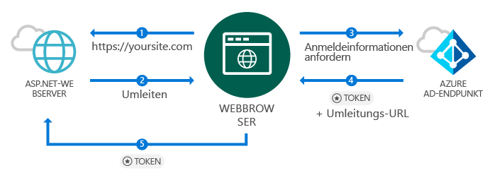
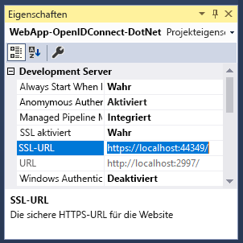
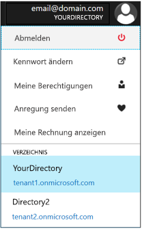
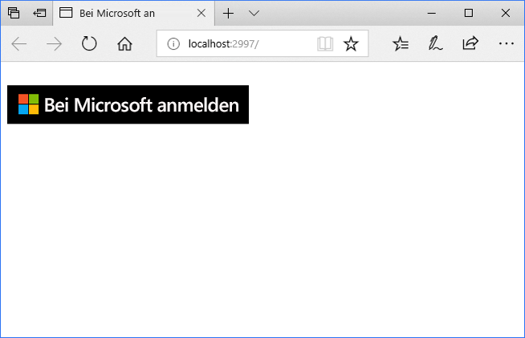
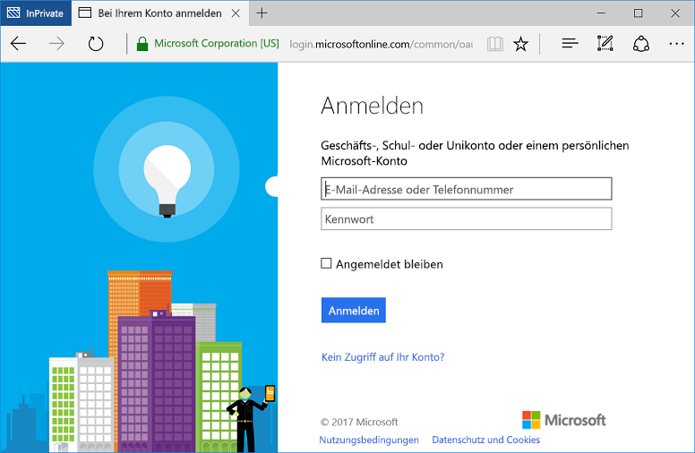

# <a name="quickstart-add-sign-in-with-microsoft-to-an-aspnet-web-app"></a>Schnellstart: Hinzufügen von „Mit Microsoft anmelden“ zu einer ASP.NET-Web-App

[!INCLUDE [active-directory-develop-applies-v1](../../../includes/active-directory-develop-applies-v1.md)]

In diesem Schnellstart erfahren Sie, wie „Mit Microsoft anmelden“ mithilfe einer ASP.NET MVC-Lösung mit einer herkömmlichen browserbasierten Anwendung mit OpenID Connect implementiert wird. Sie erfahren, wie Anmeldungen über Geschäfts-, Schul- oder Unikonten in Ihrer ASP.NET-Anwendung aktiviert werden.

Am Ende dieses Schnellstarts akzeptiert Ihre Anwendung Anmeldungen von Geschäfts-, Schul- oder Unikonten aus Organisationen, die in Azure Active Directory (Azure AD) integriert sind.

> [!NOTE]
> Wenn Sie die Anmeldung über persönliche Konten zusätzlich zu Geschäfts-, Schul- oder Unikonten aktivieren müssen, verwenden Sie den [v2.0-Endpunkt](azure-ad-endpoint-comparison.md). Weitere Informationen finden Sie in [diesem ASP.NET-Tutorial für den v2.0-Endpunkt](tutorial-v2-asp-webapp.md) sowie in [diesem Artikel](active-directory-v2-limitations.md), der die aktuellen Einschränkungen des v2.0-Endpunkts erläutert.

## <a name="prerequisites"></a>Voraussetzungen

Stellen Sie zu Beginn sicher, dass die folgenden Voraussetzungen erfüllt sind:

* Visual Studio 2015 Update 3 oder Visual Studio 2017 ist installiert. Sie haben beides nicht? [Laden Sie Visual Studio 2017 kostenlos herunter](https://www.visualstudio.com/downloads/)

## <a name="scenario-sign-in-users-from-work-and-school-accounts-in-your-aspnet-app"></a>Szenario: Anmelden von Benutzern von Geschäfts-, Schul- oder Unikonto Konten in Ihrer ASP.NET-App



In diesem Szenario greift ein Browser auf eine ASP.NET-Website zu und fordert einen Benutzer auf, sich über eine Anmeldeschaltfläche zu authentifizieren. In diesem Szenario wird ein Großteil der Arbeit zum Rendern der Webseite auf dem Server erledigt.

Der Schnellstart zeigt, wie die Anmeldung von Benutzern bei einer ASP.NET-Webanwendung beginnend mit einer leeren Vorlage erfolgt. Er beinhaltet Schritte wie das Hinzufügen einer Anmeldeschaltfläche und aller Controller und Methoden und erläutert die Konzepte hinter diesen Aufgaben. Alternativ können Sie auch ein Projekt für die Anmeldung von Azure AD-Benutzern (Geschäfts-, Schul- oder Unikonten) mithilfe der [Visual Studio-Webvorlage](https://docs.microsoft.com/aspnet/visual-studio/overview/2013/creating-web-projects-in-visual-studio#organizational-account-authentication-options) erstellen und dann **Organisationskonten** und eine der Cloudoptionen auswählen. Bei dieser Option wird eine umfangreichere Vorlage mit zusätzlichen Controllern, Methoden und Ansichten verwendet.

## <a name="libraries"></a>Bibliotheken

In diesem Schnellstart werden die folgenden Pakete verwendet:

| Bibliothek | BESCHREIBUNG |
|---|---|
| [Microsoft.Owin.Security.OpenIdConnect](https://www.nuget.org/packages/Microsoft.Owin.Security.OpenIdConnect/) | Middleware, die einer Anwendung das Verwenden von OpenIDConnect für die Authentifizierung ermöglicht |
| [Microsoft.Owin.Security.Cookies](https://www.nuget.org/packages/Microsoft.Owin.Security.Cookies) |Middleware, die einer Anwendung das Beibehalten der Benutzersitzung mithilfe von Cookies ermöglicht |
| [Microsoft.Owin.Host.SystemWeb](https://www.nuget.org/packages/Microsoft.Owin.Host.SystemWeb) | Ermöglicht OWIN-basierten Anwendungen die Ausführung in IIS mithilfe der ASP.NET-Anforderungspipeline |
|  |  | 

## <a name="step-1-set-up-your-project"></a>Schritt 1: Einrichten des Projekts

Diese Schritte zeigen das Installieren und Konfigurieren der Authentifizierungspipeline über OWIN-Middleware für ein ASP.NET-Projekt mithilfe von OpenID Connect.

Um stattdessen das Visual Studio-Projekt dieses Beispiels herunterzuladen, führen Sie die folgenden Schritte aus:
1. [Herunterladen des Projekts von GitHub](https://github.com/AzureADQuickStarts/WebApp-OpenIdConnect-DotNet/archive/GuidedSetup.zip).
1. Fahren Sie mit dem Schritt [Konfiguration](#configure-your-webconfig-and-register-an-application) fort, um das Codebeispiel vor der Ausführung zu konfigurieren.

## <a name="step-2-create-your-aspnet-project"></a>Schritt 2: Erstellen des ASP.NET-Projekts

1. Navigieren Sie in Visual Studio zu **Datei > Neu > Projekt**.
2. Wählen Sie unter **Visual C#\Web** die Option **ASP.NET-Webanwendung (.NET Framework)** aus.
3. Geben Sie der Anwendung einen Namen, und klicken Sie auf **OK**.
4. Wählen Sie **Leer** aus, und aktivieren Sie dann das Kontrollkästchen, um **MVC**-Verweise hinzuzufügen.

## <a name="step-3-add-authentication-components"></a>Schritt 3: Hinzufügen von Authentifizierungskomponenten

1. Navigieren Sie in Visual Studio zu **Extras > NuGet-Paket-Manager > Paket-Manager-Konsole**.
2. Fügen Sie **NuGet-Pakete für OWIN-Middleware** hinzu, indem Sie im Fenster „Paket-Manager-Konsole“ Folgendes eingeben:

    ```powershell
    Install-Package Microsoft.Owin.Security.OpenIdConnect
    Install-Package Microsoft.Owin.Security.Cookies
    Install-Package Microsoft.Owin.Host.SystemWeb
    ```

<!--start-collapse-->
> ### <a name="about-these-packages"></a>Zu diesen Paketen
>Die oben genannten Bibliotheken ermöglichen einmaliges Anmelden (Single Sign-On, SSO) mithilfe von OpenID Connect über die cookiebasierte Authentifizierung. Nachdem die Authentifizierung abgeschlossen ist und das Token, das den Benutzer darstellt, an Ihre Anwendung gesendet wurde, erstellt die OWIN-Middleware ein Sitzungscookie. Der Browser verwendet dann dieses Cookie bei nachfolgenden Anforderungen, damit der Benutzer keine erneute Authentifizierung durchführen muss. Es ist außerdem keine weitere Überprüfung erforderlich.
<!--end-collapse-->

## <a name="step-4-configure-the-authentication-pipeline"></a>Schritt 4: Konfigurieren der Authentifizierungspipeline

Führen Sie die folgenden Schritte zum Erstellen der *Startklasse* der OWIN-Middleware aus, um die OpenID Connect-Authentifizierung zu konfigurieren. Diese Klasse wird automatisch ausgeführt.

> [!TIP]
> Wenn das Projekt nicht die Datei `Startup.cs` im Stammordner enthält:<br/>
> 1. Klicken Sie mit der rechten Maustaste auf den Stammordner des Projekts: **Hinzufügen > Neues Element > OWIN-Startklasse**.<br/>
> 2. Vergeben Sie den Namen `Startup.cs`.<br/>
>
>> Stellen Sie sicher, dass die ausgewählte Klasse eine OWIN-Klasse des Typs „Startup“ und keine C#-Standardklasse ist. Bestätigen Sie dies, indem Sie überprüfen, ob `[assembly: OwinStartup(typeof({NameSpace}.Startup))]` über dem Namespace angezeigt wird.

Erstellen Sie eine *Startklasse* der OWIN-Middleware:

1. Fügen Sie `Startup.cs` die Namespaces *OWIN* und *Microsoft.IdentityModel* hinzu:

    [!code-csharp[main](../../../WebApp-OpenIDConnect-DotNet/WebApp-OpenIDConnect-DotNet\Startup.cs?name=AddedNameSpaces "Startup.cs")]

2. Ersetzen Sie die Startup-Klasse durch den folgenden Code:

    [!code-csharp[main](../../../WebApp-OpenIDConnect-DotNet/WebApp-OpenIDConnect-DotNet\Startup.cs?name=Startup "Startup.cs")]

<!--start-collapse-->
> [!NOTE]
> Die Parameter, die Sie in *OpenIDConnectAuthenticationOptions* bereitstellen, dienen als Koordinaten für die Anwendung zur Kommunikation mit Azure AD. Da die OpenID Connect-Middleware Cookies verwendet, müssen Sie außerdem die Cookieauthentifizierung einrichten, wie im Code oben beschrieben. Der *ValidateIssuer*-Wert weist OpenIdConnect an, den Zugriff nicht auf eine bestimmte Organisation zu beschränken.
<!--end-collapse-->

<!--end-setup-->

<!--start-use-->

## <a name="step-5-add-a-controller-to-handle-sign-in-and-sign-out-requests"></a>Schritt 5: Hinzufügen eines Controllers zum Verarbeiten von An- und Abmeldeanforderungen

Erstellen Sie einen neuen Controller, um An- und Abmeldeverfahren bereitzustellen.

1.  Klicken Sie mit der rechten Maustaste auf den Ordner **Controller**, und wählen Sie dann **Hinzufügen > Controller** aus.
2.  Wählen Sie **MVC (.NET-Version)-Controller – Leer** aus.
3.  Wählen Sie **Hinzufügen**.
4.  Nennen Sie den Controller `HomeController`, und wählen Sie **Hinzufügen** aus.
5.  Fügen Sie der Klasse **OWIN**-Namespaces hinzu:

    [!code-csharp[main](../../../WebApp-OpenIDConnect-DotNet/WebApp-OpenIDConnect-DotNet\Controllers\HomeController.cs?name=AddedNameSpaces "HomeController.cs")]

6. Fügen Sie die folgenden Methoden hinzu, um die An- und Abmeldung bei Ihrem Controller zu verarbeiten, indem Sie eine Authentifizierungsaufforderung per Code auslösen:

    [!code-csharp[main](../../../WebApp-OpenIDConnect-DotNet/WebApp-OpenIDConnect-DotNet\Controllers\HomeController.cs?name=SigInAndSignOut "HomeController.cs")]

## <a name="step-6-create-the-apps-home-page-to-sign-in-users-via-a-sign-in-button"></a>Schritt 6: Erstellen der Startseite der App zum Anmelden von Benutzern über eine Anmeldeschaltfläche

Erstellen Sie in Visual Studio eine neue Ansicht, um die Schaltfläche „Anmelden“ hinzufügen und Benutzerinformationen nach der Authentifizierung anzuzeigen:

1. Klicken Sie mit der rechten Maustaste auf den Ordner **Ansichten\Start**, und wählen Sie **Ansicht hinzufügen** aus.
1. Nennen Sie diese Ansicht **Index**.
1. Fügen Sie der Datei den folgenden HTML-Code hinzu, der die Schaltfläche „Anmelden“ enthält:

    [!code-html[main](../../../WebApp-OpenIDConnect-DotNet/WebApp-OpenIDConnect-DotNet/Views/Home/Index.cshtml "Index.cshtml")]

<!--start-collapse--> Auf dieser Seite wird eine Anmeldeschaltfläche im SVG-Format mit schwarzem Hintergrund hinzugefügt:<br/><br/> Weitere Anmeldeschaltflächen finden Sie unter [Brandingrichtlinien für Anwendungen](https://docs.microsoft.com/azure/active-directory/develop/howto-add-branding-guidelines-in-azure-ad-apps).
<!--end-collapse-->

## <a name="step-7-display-users-claims-by-adding-a-controller"></a>Schritt 7: Anzeigen von Ansprüchen des Benutzers durch Hinzufügen eines Controllers

Dieser Controller veranschaulicht die Verwendungen des `[Authorize]`-Attributs, um einen Controller zu schützen. Dieses Attribut beschränkt den Zugriff auf den Controller, indem nur authentifizierte Benutzer zugelassen werden. Der folgende Code verwendet das Attribut zum Anzeigen von Benutzeransprüchen, die als Teil der Anmeldung abgerufen wurden.

1. Klicken Sie mit der rechten Maustaste auf den Ordner **Controller**, und wählen Sie dann **Hinzufügen > Controller** aus.
1. Wählen Sie **MVC {Version}-Controller – Leer** aus.
1. Wählen Sie **Hinzufügen**.
1. Nennen Sie diesen Controller **ClaimsController**.
1. Ersetzen Sie den Code Ihrer Controller-Klasse durch den folgenden Code. Dadurch wird der Klasse das `[Authorize]`-Attribut hinzugefügt:

    [!code-csharp[main](../../../WebApp-OpenIDConnect-DotNet/WebApp-OpenIDConnect-DotNet\Controllers\ClaimsController.cs?name=ClaimsController "ClaimsController.cs")]

<!--start-collapse-->
> [!NOTE]
> Aufgrund der Verwendung des `[Authorize]`-Attributs können alle Methoden dieses Controllers nur ausgeführt werden, wenn der Benutzer authentifiziert ist. Wenn der Benutzer nicht authentifiziert ist und versucht, auf den Controller zuzugreifen, löst OWIN eine Authentifizierungsaufforderung aus und zwingt den Benutzer, sich zu authentifizieren. Der vorherige Code untersucht die Anspruchssammlung des Benutzers auf bestimmte Attribute, die im Token des Benutzers enthalten sind. Diesen Attribute enthalten den vollständigen Namen des Benutzers und den Benutzername sowie die GUID des Antragstellers. Sie enthalten auch die *Mandanten-ID*, die die ID der Organisation des Benutzers darstellt. 
<!--end-collapse-->

## <a name="step-8-create-a-view-to-display-the-users-claims"></a>Schritt 8: Erstellen einer Ansicht zum Anzeigen der Ansprüche des Benutzers

Erstellen Sie in Visual Studio eine neue Ansicht zum Anzeigen der Ansprüche des Benutzers auf einer Webseite:

1. Klicken Sie mit der rechten Maustaste auf den Ordner **Ansichten\Ansprüche**, und wählen Sie **Ansicht hinzufügen** aus.
1. Nennen Sie diese Ansicht **Index**.
1. Fügen Sie der Datei den folgenden HTML-Code hinzu:

    [!code-html[main](../../../WebApp-OpenIDConnect-DotNet/WebApp-OpenIDConnect-DotNet/Views/Claims/Index.cshtml "Index.cshtml")]

<!--end-use-->

<!--start-configure-->

## <a name="step-9-configure-your-webconfig-and-register-an-application"></a>Schritt 9: Konfigurieren der Datei *web.config* und Registrieren einer Anwendung

1. Fügen Sie in Visual Studio der Datei `web.config` (im Stammordner) im Abschnitt `configuration\appSettings` Folgendes hinzu:

    ```xml
    <add key="ClientId" value="Enter_the_Application_Id_here" />
    <add key="RedirectUrl" value="Enter_the_Redirect_Url_here" />
    <add key="Tenant" value="common" />
    <add key="Authority" value="https://login.microsoftonline.com/{0}" /> 
    ```
2. Wählen Sie im Projektmappen-Explorer das Projekt aus. Untersuchen Sie das Fenster <i>Eigenschaften</i> (wenn es nicht angezeigt wird, drücken Sie F4).
3. Ändern Sie „SSL-aktiviert“ in <code>True</code>.
4. Kopieren Sie die SSL-URL des Projekts in die Zwischenablage:<br/><br/><br />
5. Ersetzen Sie in <code>web.config</code> den Wert von <code>Enter_the_Redirect_URL_here</code> durch die SSL-URL Ihres Projekts.

### <a name="register-your-application-in-the-azure-portal-then-add-its-information-to-webconfig"></a>Registrieren Ihrer Anwendung im Azure-Portal und Hinzufügen ihrer Informationen in *web.config*

1. Navigieren Sie zu [Microsoft Azure-Portal – App-Registrierungen](https://portal.azure.com/#blade/Microsoft_AAD_IAM/ActiveDirectoryMenuBlade/RegisteredApps), um eine Anwendung zu registrieren.
2. Wählen Sie **Registrierung einer neuen Anwendung** aus.
3. Geben Sie einen Namen für Ihre Anwendung ein.
4. Fügen Sie die *SSL-URL* des Visual Studio-Projekts in **Anmelde-URL** ein. Diese URL wird auch automatisch der Liste der Antwort-URLs für die Anwendung hinzugefügt, die Sie registrieren.
5. Wählen Sie **Erstellen** aus, um die Anwendung zu registrieren. Durch diese Aktion gelangen Sie zurück zur Liste der Anwendungen.
6. Suchen Sie nun nach der Anwendung, die Sie soeben erstellt haben, und/oder wählen Sie sie aus, um ihre Eigenschaften anzuzeigen.
7. Kopieren Sie die GUID unter **Anwendungs-ID** in die Zwischenablage.
8. Wechseln Sie zurück zu Visual Studio, und ersetzen Sie in `web.config` den Wert von `Enter_the_Application_Id_here` durch die Anwendungs-ID der Anwendung, die Sie soeben registriert haben.

> [!TIP]
> Wenn Ihr Konto für den Zugriff auf mehrere Verzeichnisse konfiguriert ist, müssen Sie das richtige Verzeichnis für die Organisation, für die Sie die Anwendung registrieren möchten, auswählen. Klicken Sie zu diesem Zweck rechts oben im Azure-Portal auf Ihren Kontonamen, und überprüfen Sie das ausgewählte Verzeichnis wie angegeben:<br/>

## <a name="step-10-configure-sign-in-options"></a>Schritt 10: Konfigurieren von Anmeldeoptionen

Sie können Ihre Anwendung so konfigurieren, dass sich nur Benutzer anmelden dürfen, die zu einer Azure AD-Instanz einer Organisation gehören, oder dass Anmeldungen von Benutzern beliebiger Organisation erlaubt sind. Führen Sie die Anweisungen für eine der folgenden Optionen aus:

### <a name="configure-your-application-to-allow-sign-ins-of-work-and-school-accounts-from-any-company-or-organization-multi-tenant"></a>Konfigurieren der Anwendung, damit Anmeldungen von Geschäfts-, Schul- oder Unikonten aller Unternehmen oder Organisationen (mehrere Mandanten) zulässig sind

Führen Sie die folgenden Schritte aus, wenn Sie Anmeldungen von Geschäfts-, Schul- oder Unikonten beliebiger Unternehmen oder Organisationen, die in Azure AD integriert sind, zulassen möchten. Dies ist ein gängiges Szenario für *SaaS-Anwendungen*:

1. Wechseln Sie zurück zu [Microsoft Azure-Portal – App-Registrierungen](https://portal.azure.com/#blade/Microsoft_AAD_IAM/ActiveDirectoryMenuBlade/RegisteredApps), und suchen Sie die Anwendung, die Sie soeben registriert haben.
2. Wählen Sie unter **Alle Einstellungen** die Option **Eigenschaften** aus.
3. Ändern Sie die Eigenschaft **Mehrinstanzenfähig** in **Ja**, und wählen Sie dann **Speichern** aus.

Weitere Informationen zu dieser Einstellung und zum Konzept von mehrinstanzenfähigen Anwendungen finden Sie unter [Übersicht über mehrinstanzenfähige Anwendungen](howto-convert-app-to-be-multi-tenant.md).

### <a name="restrict-users-from-only-one-organizations-active-directory-instance-to-sign-in-to-your-application-single-tenant"></a>Beschränken der Benutzer auf die Active Directory-Instanz nur einer Organisation für die Anmeldung bei der Anwendung (Einzelmandant)

Diese Option ist ein häufiges Szenario für Branchenanwendungen.

Wenn Ihre Anwendung Anmeldungen nur von Konten akzeptieren soll, die zu einer bestimmten Azure AD-Instanz gehören (einschließlich *Gastkonten* dieser Instanz), gehen Sie wie folgt vor:
1. Ersetzen Sie den Wert `Common` des Parameters `Tenant` in *web.config* durch den Mandantennamen des Unternehmens, z.B. durch *contoso.onmicrosoft.com*.
1. Ändern Sie das `ValidateIssuer`-Argument in Ihrer [*OWIN-Startklasse*](#configure-the-authentication-pipeline) in `true`.

Um Benutzer nur aus einer Liste bestimmter Unternehmen zuzulassen, führen Sie die folgenden Schritte aus:
1. Legen Sie `ValidateIssuer` auf TRUE fest.
1. Verwenden Sie den `ValidIssuers`-Parameter, um eine Liste mit Organisationen anzugeben.

Eine andere Möglichkeit ist das Implementieren einer benutzerdefinierten Methode, um mit dem *IssuerValidator*-Parameter Aussteller zu überprüfen. Weitere Informationen zu `TokenValidationParameters` finden Sie in [diesem MSDN-Artikel](https://msdn.microsoft.com/library/system.identitymodel.tokens.tokenvalidationparameters.aspx "MSDN-Artikel zu TokenValidationParameters").

<!--end-configure-->

<!--start-configure-arp-->
<!--
## Configure your ASP.NET Web App with the application's registration information

In this step, you will configure your project to use SSL, and then use the SSL URL to configure your application’s registration information. After this, add the application’ registration information to your solution via *web.config*.

1.  In Solution Explorer, select the project and look at the `Properties` window (if you don’t see a Properties window, press F4)
2.  Change `SSL Enabled` to `True`
3.  Copy the value from `SSL URL` above and paste it in the `Redirect URL` field on the top of this page, then click *Update*:<br/><br/><br />
4.  Add the following in `web.config` file located in root’s folder, under section `configuration\appSettings`:

```xml
<add key="ClientId" value="[Enter the application Id here]" />
<add key="RedirectUri" value="[Enter the Redirect URL here]" />
<add key="Tenant" value="common" />
<add key="Authority" value="https://login.microsoftonline.com/{0}" /> 
```
-->
<!--end-configure-arp-->
<!--start-test-->

## <a name="step-11-test-your-code"></a>Schritt 11: Testen Ihres Codes

1. Drücken Sie **F5**, um das Projekt in Visual Studio auszuführen. Der Browser wird geöffnet und leitet Sie an `http://localhost:{port}` weiter. Dort wird die Schaltfläche **Mit Microsoft anmelden** angezeigt.
1. Wählen Sie die Schaltfläche aus, um sich anzumelden.

### <a name="sign-in"></a>Anmelden

Wenn Sie einen Test durchführen möchten, verwenden Sie ein Geschäftskonto (Azure AD), um sich anzumelden.





#### <a name="expected-results"></a>Erwartete Ergebnisse

Nach der Anmeldung wird der Benutzer zur Startseite Ihrer Website umgeleitet. Dabei handelt es sich um die HTTPS-URL, die im Microsoft-Anwendungsregistrierungsportal in Ihre Anwendungsregistrierungsinformationen eingegeben wurde. Diese Seite zeigt jetzt *Hello {Benutzer}*, einen Link zum Abmelden und einen Link zum Anzeigen der Ansprüche des Benutzers. Hierbei handelt es sich um einen Link zum Authorize-Controller, den Sie zuvor erstellt haben.

### <a name="see-users-claims"></a>Anzeigen der Ansprüche des Benutzers

Klicken Sie auf den Link, um die Ansprüche des Benutzers anzuzeigen. Dadurch gelangen Sie zum Controller und zur Ansicht, die nur Benutzern zur Verfügung steht, die authentifiziert wurden.

#### <a name="expected-results"></a>Erwartete Ergebnisse

 Es sollte eine Tabelle angezeigt werden, die die Standardeigenschaften des angemeldeten Benutzers enthält:

| Eigenschaft | Wert | BESCHREIBUNG |
|---|---|---|
| NAME | {Vollständiger Name des Benutzers} | Vor- und Nachname des Benutzers |
| Username | <span>user@domain.com</span> | Benutzername zur Identifizierung des angemeldeten Benutzers |
| Antragsteller| {Antragsteller} |Zeichenfolge zur eindeutigen Identifizierung der Benutzeranmeldung über das Web |
| Mandanten-ID | {GUID} | Eine *GUID*, die die Azure AD-Organisation des Benutzers eindeutig identifiziert. |

Darüber hinaus sehen Sie eine Tabelle mit allen Benutzeransprüchen, die in der Authentifizierungsanforderung enthalten sind. Eine Liste aller Ansprüche in einem ID-Token mit einer Erläuterung finden Sie in unter [Liste der Ansprüche im ID-Token](https://docs.microsoft.com/azure/active-directory/develop/active-directory-token-and-claims).

### <a name="optional-access-a-method-that-has-an-authorize-attribute"></a>(Optional) Zugreifen auf eine Methode mit einem *[Authorize]*-Attribut

In diesem Schritt testen Sie den Zugriff auf den Claims-Controller als anonymer Benutzer:<br/>
Klicken Sie auf den Link zum Abmelden des Benutzers, und schließen Sie den Abmeldevorgang ab.<br/>
Geben Sie nun http://localhost:{port}/claims im Browser ein, um auf Ihren Controller zuzugreifen, der durch das `[Authorize]`-Attribut geschützt ist.

#### <a name="expected-results"></a>Erwartete Ergebnisse

Sie sollten zum Anmelden aufgefordert werden, um die Ansicht anzuzeigen.

## <a name="additional-information"></a>Zusätzliche Informationen

<!--start-collapse-->
### <a name="protect-your-entire-web-site"></a>Schützen der gesamten Website

Zum Schutz der gesamten Website fügen Sie in der Methode `Global.asax` `Application_Start` `AuthorizeAttribute` zu `GlobalFilters` hinzu:

```csharp
GlobalFilters.Filters.Add(new AuthorizeAttribute());
```
<!--end-collapse-->

<div></div>
<br/>

<!--end-test-->

## <a name="next-steps"></a>Nächste Schritte

Sie können sich nun weiteren Szenarien zuwenden.

> [!div class="nextstepaction"]
> [ASP.NET-Tutorial](https://docs.microsoft.com/azure/active-directory/develop/tutorial-v2-asp-webapp)