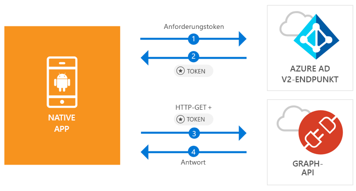

# <a name="quickstart-sign-in-users-and-call-the-microsoft-graph-api-from-an-android-app"></a>Schnellstart: Benutzeranmeldung und Aufrufen der Microsoft Graph-API aus einer Android-App

[!INCLUDE [active-directory-develop-applies-v2-msal](../../../includes/active-directory-develop-applies-v2-msal.md)]

Dieser Schnellstart enthält ein Codebeispiel, das zeigt, wie eine Android-Anwendung persönliche, Geschäfts-, Schul- oder Unikonten anmelden, ein Zugriffstoken abrufen und die Microsoft Graph-API aufrufen kann.



> [!NOTE]
> **Voraussetzungen**
> * Android Studio 3 oder höher
> * Android SDK 21 oder höher ist erforderlich (SDK 27 empfohlen).

> [!div renderon="docs"]
> ## <a name="register-and-download"></a>Registrieren und herunterladen
> ### <a name="register-and-configure-your-application-and-code-sample"></a>Registrieren und Konfigurieren Ihrer Anwendung und des Codebeispiels
> #### <a name="step-1-register-your-application"></a>Schritt 1: Registrieren Ihrer Anwendung
> Wenn Sie Ihre Anwendung registrieren und die Anwendungsregistrierungsinformationen Ihrer Projektmappe hinzufügen möchten, führen Sie folgende Schritte aus:
> 1. Registrieren Sie Ihre Anwendung im [Microsoft-Anwendungsregistrierungsportal](https://apps.dev.microsoft.com/portal/register-app).
> 1. Geben Sie im Feld **Anwendungsname** einen Namen für Ihre Anwendung ein.
> 1. Vergewissern Sie sich, dass das Kontrollkästchen **Guided Setup** (Geführtes Setup) deaktiviert ist, und klicken Sie anschließend auf **Erstellen**.
> 1. Klicken Sie auf **Plattform hinzufügen** > **Native Anwendung** und anschließend auf **Speichern**.

> [!div renderon="portal" class="sxs-lookup"]
> #### <a name="step-1-configure-your-application"></a>Schritt 1: Konfigurieren der Anwendung
> Damit das Codebeispiel für diesen Schnellstart funktioniert, müssen Sie eine Antwort-URL als **msal{AppId}://auth** hinzufügen. (wobei {AppId} die Anwendungs-ID Ihrer App ist).
> > [!div renderon="portal" id="makechanges" class="nextstepaction"]
> > [Diese Änderung für mich vornehmen]()
>
> > [!div id="appconfigured" class="alert alert-info"]
> > : Ihre Anwendung ist mit diesen Attributen konfiguriert.

#### <a name="step-2-download-the-project"></a>Schritt 2: Herunterladen des Projekts

* [Android Studio-Projekt herunterladen](https://github.com/Azure-Samples/active-directory-android-native-v2/archive/master.zip)

#### <a name="step-3-configure-your-project"></a>Schritt 3: Konfigurieren des Projekts

1. Extrahieren und öffnen Sie das Projekt in Android Studio.
1. Öffnen Sie **MainActivity** unter **app** > **java** > **<i>{host}.{namespace}</i>**.
1. Ersetzen Sie die Zeile, die mit `final static String CLIENT_ID` beginnt, durch:

    > [!div renderon="portal" class="sxs-lookup"]
    > ```java
    > final static String CLIENT_ID = "ENTER_THE_APPLICATION_ID_HERE";
    > ```

    > [!div renderon="docs"]
    > ```java
    > final static String CLIENT_ID = "<ENTER_THE_APPLICATION_ID_HERE>";
    > ```

1. Öffnen Sie **app** > **manifests** > **AndroidManifest.xml**.
1. Fügen Sie dem Knoten **manifest\application** die folgende Aktivität hinzu. Dieser Codeausschnitt registriert eine **BrowserTabActivity**, damit das Betriebssystem Ihre Anwendung nach Abschluss der Authentifizierung fortsetzen kann:

    > [!div renderon="docs"]
    > ```xml
    > <!--Intent filter to capture System Browser calling back to our app after Sign In-->
    > <activity
    >     android:name="com.microsoft.identity.client.BrowserTabActivity">
    >     <intent-filter>
    >         <action android:name="android.intent.action.VIEW" />
    >         <category android:name="android.intent.category.DEFAULT" />
    >         <category android:name="android.intent.category.BROWSABLE" />
    > 
    >         <!--Add in your scheme/host from registered redirect URI-->
    >         <!--By default, the scheme should be similar to 'msal[appId]' -->
    >         <data android:scheme="msal<ENTER_THE_APPLICATION_ID_HERE>"
    >             android:host="auth" />
    >     </intent-filter>
    > </activity>
    > ```

    > [!div renderon="portal" class="sxs-lookup"]
    > ```xml
    > <!--Intent filter to capture System Browser calling back to our app after Sign In-->
    > <activity
    >     android:name="com.microsoft.identity.client.BrowserTabActivity">
    >     <intent-filter>
    >         <action android:name="android.intent.action.VIEW" />
    >         <category android:name="android.intent.category.DEFAULT" />
    >         <category android:name="android.intent.category.BROWSABLE" />
    > 
    >         <!--Add in your scheme/host from registered redirect URI-->
    >         <!--By default, the scheme should be similar to 'msal[appId]' -->
    >         <data android:scheme="msalENTER_THE_APPLICATION_ID_HERE"
    >             android:host="auth" />
    >     </intent-filter>
    > </activity>
    > ```

> [!div renderon="docs"]
> <span>6.</span> Ersetzen Sie `<ENTER_THE_APPLICATION_ID_HERE>` durch die *Anwendungs-ID* für Ihre Anwendung. Wenn Sie die *Anwendungs-ID* ermitteln müssen, navigieren Sie zur Seite *Übersicht*.

## <a name="more-information"></a>Weitere Informationen

Lesen Sie die folgenden Abschnitte, um mehr über diesen Schnellstart zu erfahren.

### <a name="msal"></a>MSAL

MSAL ([com.microsoft.identity.client](http://javadoc.io/doc/com.microsoft.identity.client/msal)) ist die Bibliothek zum Anmelden von Benutzern und Anfordern von Token, die für den Zugriff auf eine durch Microsoft Azure Active Directory (Azure AD) geschützte API verwendet wird. Sie können Gradle verwenden, um sie zu installieren, indem Sie Folgendes in **Gradle Scripts** > **build.gradle (Modul: app)** unter **Dependencies** hinzufügen:

```gradle  
implementation 'com.android.volley:volley:1.1.1'
implementation 'com.microsoft.identity.client:msal:0.1.+'
```

### <a name="msal-initialization"></a>MSAL-Initialisierung

Sie können den Verweis auf MSAL hinzufügen, indem Sie den folgenden Code hinzufügen:

```java
import com.microsoft.identity.client.*;
```

Initialisieren Sie MSAL anschließend mit dem folgenden Code:

```java
sampleApp = new PublicClientApplication(
        this.getApplicationContext(),
        CLIENT_ID);
```

> |Hinweis: ||
> |---------|---------|
> |`CLIENT_ID` | Die Anwendungs-ID der in *portal.azure.com* registrierten Anwendung. |

### <a name="requesting-tokens"></a>Anfordern von Token

MSAL verfügt über zwei Methoden, die zum Abrufen von Token verwendet werden: `acquireToken` und `acquireTokenSilentAsync`.

#### <a name="getting-a-user-token-interactively"></a>Interaktives Abrufen eines Benutzertokens

In einigen Situationen müssen Benutzer gezwungen werden, mit dem Azure AD v2.0-Endpunkt zu interagieren. Dies führt zu einem Kontextwechsel zum Systembrowser, um entweder die Anmeldeinformationen der Benutzer zu überprüfen oder die Zustimmung zu erhalten. Beispiele hierfür sind:

* Erstmaliges Anmelden von Benutzern bei der Anwendung.
* Benutzer müssen ihre Anmeldeinformationen erneut eingeben, weil das Kennwort abgelaufen ist.
* Ihre Anwendung fordert Zugriff auf eine Ressource an, dem der Benutzer zustimmen muss.
* Zweistufige Authentifizierung ist erforderlich.

```java
sampleApp.acquireToken(this, SCOPES, getAuthInteractiveCallback());
```

> |Hinweis:||
> |---------|---------|
> | `SCOPES` | Enthält die angeforderten Bereiche (d.h. `{ "user.read" }` für Microsoft Graph oder `{ "<Application ID URL>/scope" }` für benutzerdefinierte Web-APIs (z.B. `api://<Application ID>/access_as_user`)). |
> | `getAuthInteractiveCallback` | Der Rückruf wird ausgeführt, wenn die Steuerung nach der Authentifizierung an die Anwendung zurückgegeben wird. |

#### <a name="getting-a-user-token-silently"></a>Automatisches Abrufen eines Benutzertokens

Sie möchten nicht, dass Benutzer ihre Anmeldeinformationen jedes Mal überprüfen müssen, wenn sie auf eine Ressource zugreifen müssen. Meistens wünschen Sie sich den Abruf und die Erneuerung von Token ohne jegliche Benutzerinteraktion. Sie können die `AcquireTokenSilentAsync`-Methode verwenden, um Token für den Zugriff auf geschützte Ressourcen nach der anfänglichen `acquireToken`-Methode abzurufen:

```java
sampleApp.acquireToken(getActivity(), SCOPES, getAuthInteractiveCallback());
```

> |Hinweis:||
> |---------|---------|
> | `SCOPES` | Enthält die angeforderten Bereiche (d.h. `{ "user.read" }` für Microsoft Graph oder `{ "<Application ID URL>/scope" }` für benutzerdefinierte Web-APIs (z.B. `api://<Application ID>/access_as_user`)). |
> | `getAuthInteractiveCallback` | Der Rückruf wird ausgeführt, wenn die Steuerung nach der Authentifizierung an die Anwendung zurückgegeben wird. |

## <a name="next-steps"></a>Nächste Schritte

### <a name="learn-the-steps-to-create-the-application-used-in-this-quickstart"></a>Informieren Sie sich über die Schritte zum Erstellen der in diesem Schnellstart verwendeten Anwendung.

Probieren Sie das Android-Tutorial aus, um eine vollständige Schritt-für-Schritt-Anleitung zum Erstellen von Anwendungen und neuen Features zu erhalten, einschließlich einer vollständigen Erläuterung dieses Schnellstarts.

> [!div class="nextstepaction"]
> [Tutorial: Aufrufen der Graph-API (Android)](https://docs.microsoft.com/azure/active-directory/develop/guidedsetups/active-directory-android)

### <a name="msal-for-android-library-wiki"></a>Wiki: MSAL für Android-Bibliothek

Erfahren Sie mehr über die MSAL-Bibliothek für Android:

> [!div class="nextstepaction"]
> [Wiki: MSAL für Android-Bibliothek](https://github.com/AzureAD/microsoft-authentication-library-for-android/wiki)

[!INCLUDE [Help and support](../../../includes/active-directory-develop-help-support-include.md)]