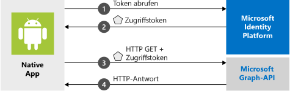

# <a name="quickstart-sign-in-users-and-call-the-microsoft-graph-api-from-an-android-app"></a>Schnellstart: Benutzeranmeldung und Aufrufen der Microsoft Graph-API aus einer Android-App

[!INCLUDE [active-directory-develop-applies-v2-msal](../../../includes/active-directory-develop-applies-v2-msal.md)]

Dieser Schnellstart enthält ein Codebeispiel, das zeigt, wie eine Android-Anwendung persönliche, Geschäfts-, Schul- oder Unikonten anmelden, ein Zugriffstoken abrufen und die Microsoft Graph-API aufrufen kann.



> [!NOTE]
> **Voraussetzungen**
> * Android Studio 
> * Android 16+ erforderlich 


> [!div renderon="docs"]
> ## <a name="register-and-download-your-quickstart-app"></a>Registrieren und Herunterladen Ihrer Schnellstart-App
> Die Schnellstartanwendung kann auf zwei Arten gestartet werden:
> * [Express] [Option 1: Registrieren und automatisches Konfigurieren Ihrer App und anschließendes Herunterladen des Codebeispiels](#option-1-register-and-auto-configure-your-app-and-then-download-your-code-sample)
> * [Manuell] [Option 2: Registrieren und manuelles Konfigurieren Ihrer Anwendung und des Codebeispiels](#option-2-register-and-manually-configure-your-application-and-code-sample)
>
> ### <a name="option-1-register-and-auto-configure-your-app-and-then-download-your-code-sample"></a>Option 1: Registrieren und automatisches Konfigurieren Ihrer App und anschließendes Herunterladen des Codebeispiels
> #### <a name="step-1-register-your-application"></a>Schritt 1: Anwendung registrieren
> So registrieren Sie Ihre App:
> 1. Navigieren Sie zum neuen Bereich [Azure-Portal – App-Registrierungen](https://portal.azure.com/#blade/Microsoft_AAD_RegisteredApps/applicationsListBlade/quickStartType/AndroidQuickstartPage/sourceType/docs).
> 1. Geben Sie einen Namen für Ihre Anwendung ein, und wählen Sie **Registrieren** aus.
> 1. Befolgen Sie die Anweisungen, um Ihre neue Anwendung mit nur einem Klick herunterzuladen und automatisch zu konfigurieren.
>
> ### <a name="option-2-register-and-manually-configure-your-application-and-code-sample"></a>Option 2: Registrieren und manuelles Konfigurieren Ihrer Anwendung und des Codebeispiels
>
> #### <a name="step-1-register-your-application"></a>Schritt 1: Anwendung registrieren
> Führen Sie die folgenden Schritte aus, um Ihre Anwendung zu registrieren und Ihrer Projektmappe manuell die Registrierungsinformationen Ihrer App hinzuzufügen:
>
> 1. Navigieren Sie zur Seite [App-Registrierungen](https://aka.ms/MobileAppReg) von Microsoft Identity Platform für Entwickler.
> 1. Wählen Sie **Neue Registrierung** aus.
> 1. Geben Sie auf der daraufhin angezeigten Seite **Anwendung registrieren** die Registrierungsinformationen für Ihre Anwendung ein:
>      - Geben Sie im Abschnitt **Name** einen aussagekräftigen Anwendungsnamen ein, der den Benutzern der App angezeigt wird (beispielsweise `AndroidQuickstart`).
>      - Sie können die weiteren Konfigurationsschritte auf dieser Seite überspringen. 
>      - Klicken Sie auf die Schaltfläche `Register`.
> 1. Klicken Sie auf die neue App, und wählen Sie `Authentication` > `Add Platform` > `Android` aus.    
>      - Geben Sie den Paketnamen aus Ihrem Android Studio-Projekt ein. 
>      - Generieren Sie einen Signaturhash. Anweisungen finden Sie im Portal.
> 1. Wählen Sie `Configure` aus, und speichern Sie den JSON-Code der ***MSAL-Konfiguration*** zur späteren Verwendung. 

> [!div renderon="portal" class="sxs-lookup"]
> #### <a name="step-1-configure-your-application"></a>Schritt 1: Konfigurieren der Anwendung
> Damit das Codebeispiel für diese Schnellstartanleitung funktioniert, müssen Sie einen mit dem Authentifizierungsbroker kompatiblen Umleitungs-URI hinzufügen. 
> > [!div renderon="portal" id="makechanges" class="nextstepaction"]
> > [Diese Änderung für mich vornehmen]()
>
> > [!div id="appconfigured" class="alert alert-info"]
> > : Ihre Anwendung ist mit diesen Attributen konfiguriert.

#### <a name="step-2-download-the-project"></a>Schritt 2: Herunterladen des Projekts

* [Codebeispiel herunterladen](https://github.com/Azure-Samples/active-directory-android-native-v2/archive/master.zip)

#### <a name="step-3-configure-your-project"></a>Schritt 3: Konfigurieren des Projekts

> [!div renderon="docs"]
> Wenn Sie weiter oben die erste Option ausgewählt haben, können Sie diese Schritte überspringen. 

> [!div renderon="portal" class="sxs-lookup"]
> 1. Extrahieren und öffnen Sie das Projekt in Android Studio.
> 1. Öffnen Sie unter **app** > **src** > **main** > **res** > **raw** die Datei **auth_config.json**.
> 1. Bearbeiten Sie **auth_config.json**, indem Sie die Datei durch den JSON-Code aus dem Azure-Portal ersetzen. Falls Sie die Änderungen stattdessen manuell vornehmen möchten:
>    ```javascript
>    {
>       "client_id" : "Enter_the_Application_Id_Here",
>       "authorization_user_agent" : "DEFAULT",
>       "redirect_uri" : "Enter_the_Redirect_Uri_Here",
>       "authorities" : [
>          {
>             "type": "AAD",
>             "audience": {
>                "type": "Enter_the_Audience_Info_Here",
>                "tenant_id": "Enter_the_Tenant_Info_Here"
>             }
>          }
>       ]
>    }
> 1. Inside **app** > **manifests**, open  **AndroidManifest.xml**.
> 1. Paste the following activity to the **manifest\application** node: 
>    ```xml
>    <!--Intent filter to catch Microsoft's callback after Sign In-->
>    <activity
>        android:name="com.microsoft.identity.client.BrowserTabActivity">
>        <intent-filter>
>            <action android:name="android.intent.action.VIEW" />
>            <category android:name="android.intent.category.DEFAULT" />
>            <category android:name="android.intent.category.BROWSABLE" />
>            <data android:scheme="msauth"
>                android:host="Enter_the_Package_Name"
>                android:path="/Enter_the_Signature_Hash" />
>        </intent-filter>
>    </activity>
>    ```
> > 1. Führen Sie die App aus. 

> [!div renderon="docs"]
> 1. Extrahieren und öffnen Sie das Projekt in Android Studio.
> 1. Öffnen Sie unter **app** > **res** > **raw** die Datei **auth_config.json**.
> 1. Bearbeiten Sie **auth_config.json**, indem Sie die Datei durch den JSON-Code aus dem Azure-Portal ersetzen. Falls Sie die Änderungen stattdessen manuell vornehmen möchten:
>    ```javascript
>    "client_id" : "ENTER_YOUR_APPLICATION_ID",
>    "redirect_uri": "ENTER_YOUR_REDIRECT_URI", 
>     ```
> 1. Öffnen Sie unter **app** > **manifests** die Datei **AndroidManifest.xml**.
> 1. Fügen Sie dem Knoten **manifest\application** die folgende Aktivität hinzu. Dieser Codeausschnitt registriert eine **BrowserTabActivity**, damit das Betriebssystem Ihre Anwendung nach Abschluss der Authentifizierung fortsetzen kann:
>    ```xml
>    <!--Intent filter to catch Microsoft's callback after Sign In-->
>    <activity
>        android:name="com.microsoft.identity.client.BrowserTabActivity">
>        <intent-filter>
>            <action android:name="android.intent.action.VIEW" />
>            <category android:name="android.intent.category.DEFAULT" />
>            <category android:name="android.intent.category.BROWSABLE" />
>            <data android:scheme="msauth"
>                android:host="Enter_the_Package_Name"
>                android:path="/Enter_the_Decoded_Signature_Hash" />
>        </intent-filter>
>    </activity>
>    ```
> 1. Ersetzen Sie `Enter_the_Package_Name` und `Enter_the_Signature_Hash` durch die Werte, die Sie im Azure-Portal registriert haben. 
> 1. Führen Sie die App aus. 

## <a name="more-information"></a>Weitere Informationen

Lesen Sie die folgenden Abschnitte, um mehr über diesen Schnellstart zu erfahren.

### <a name="getting-msal"></a>Abrufen von MSAL

MSAL ([com.microsoft.identity.client](https://javadoc.io/doc/com.microsoft.identity.client/msal)) ist die Bibliothek zum Anmelden von Benutzern und Anfordern von Token, die für den Zugriff auf eine durch Microsoft Identity Platform geschützte API verwendet wird. Sie können zur Installation Gradle 3.0+ verwenden, indem Sie unter **Dependencies** in **Gradle Scripts** > **build.gradle (Modul: app)** folgenden Code hinzufügen:

```gradle  
implementation 'com.android.volley:volley:1.1.1'
implementation 'com.microsoft.identity.client:msal:0.3.+'
```

### <a name="msal-initialization"></a>MSAL-Initialisierung

Sie können den Verweis auf MSAL hinzufügen, indem Sie den folgenden Code hinzufügen:

```java
import com.microsoft.identity.client.*;
```

Initialisieren Sie MSAL anschließend mit dem folgenden Code:

```java
    sampleApp = new PublicClientApplication(
        this.getApplicationContext(),
        R.raw.auth_config);
```

> |Hinweis: ||
> |---------|---------|
> |`R.raw.auth_config` | Diese Datei enthält die Konfigurationen für Ihre Anwendung. Dazu zählen unter anderem die App-/Client-ID, die Zielgruppe für die Anmeldung, der Umleitungs-URI sowie verschiedene andere Anpassungsoptionen. |

### <a name="requesting-tokens"></a>Anfordern von Token

MSAL verfügt über zwei Methoden, die zum Abrufen von Token verwendet werden: `acquireToken` und `acquireTokenSilentAsync`.

#### <a name="acquiretoken-getting-a-token-interactively"></a>acquireToken: Interaktives Abrufen eines Tokens

In einigen Situationen müssen Benutzer mit Microsoft Identity Platform interagieren. In diesen Fällen muss der Endbenutzer möglicherweise sein Konto auswählen, seine Anmeldeinformationen eingeben oder den von der App angeforderten Berechtigungen zustimmen. Beispiel: 

* Erstmaliges Anmelden von Benutzern bei der Anwendung.
* Wenn ein Benutzer sein Kennwort zurücksetzt, muss er seine Anmeldeinformationen eingeben. 
* Wenn die Zustimmung widerrufen wurde 
* Wenn Ihre App explizit eine Zustimmung erfordert 
* Wenn Ihre Anwendung zum ersten Mal Zugriff auf eine Ressource anfordert
* Wenn MFA oder andere Richtlinien für bedingten Zugriff erforderlich sind

```java
sampleApp.acquireToken(this, SCOPES, getAuthInteractiveCallback());
```

> |Hinweis:||
> |---------|---------|
> | `SCOPES` | Enthält die angeforderten Bereiche (d.h. `{ "user.read" }` für Microsoft Graph oder `{ "<Application ID URL>/scope" }` für benutzerdefinierte Web-APIs (z.B. `api://<Application ID>/access_as_user`)). |
> | `getAuthInteractiveCallback` | Der Rückruf wird ausgeführt, wenn die Steuerung nach der Authentifizierung an die Anwendung zurückgegeben wird. |

#### <a name="acquiretokensilent-getting-a-user-token-silently"></a>acquireTokenSilent: Automatisches Abrufen eines Benutzertokens

Apps sollten nicht verlangen, dass sich die Benutzer jedes Mal anmelden, wenn sie ein Token anfordern. Wenn sich der Benutzer bereits angemeldet hat, haben Apps durch diese Methode die Möglichkeit, Token im Hintergrund anzufordern.

```java
    sampleApp.getAccounts(new PublicClientApplication.AccountsLoadedCallback() {
        @Override
        public void onAccountsLoaded(final List<IAccount> accounts) {

            if (!accounts.isEmpty()) {
                sampleApp.acquireTokenSilentAsync(SCOPES, accounts.get(0), getAuthSilentCallback());
            } else {
                /* No accounts */
            }
        }
    });
```

> |Hinweis:||
> |---------|---------|
> | `SCOPES` | Enthält die angeforderten Bereiche (d.h. `{ "user.read" }` für Microsoft Graph oder `{ "<Application ID URL>/scope" }` für benutzerdefinierte Web-APIs (z.B. `api://<Application ID>/access_as_user`)). |
> | `getAccounts(...)` | Enthält das Konto, für das Sie automatisch Token abrufen möchten. |
> | `getAuthSilentCallback()` | Der Rückruf wird ausgeführt, wenn die Steuerung nach der Authentifizierung an die Anwendung zurückgegeben wird. |

## <a name="next-steps"></a>Nächste Schritte

### <a name="learn-the-steps-to-create-the-application-used-in-this-quickstart"></a>Informieren Sie sich über die Schritte zum Erstellen der in diesem Schnellstart verwendeten Anwendung.

Probieren Sie das Android-Tutorial aus, um eine vollständige Schritt-für-Schritt-Anleitung zum Erstellen von Anwendungen und neuen Features zu erhalten, einschließlich einer vollständigen Erläuterung dieses Schnellstarts.

> [!div class="nextstepaction"]
> [Tutorial: Aufrufen der Graph-API (Android)](https://docs.microsoft.com/azure/active-directory/develop/guidedsetups/active-directory-android)

### <a name="msal-for-android-library-wiki"></a>Wiki: MSAL für Android-Bibliothek

Erfahren Sie mehr über die MSAL-Bibliothek für Android:

> [!div class="nextstepaction"]
> [Wiki: MSAL für Android-Bibliothek](https://github.com/AzureAD/microsoft-authentication-library-for-android/wiki)

[!INCLUDE [Help and support](../../../includes/active-directory-develop-help-support-include.md)]
