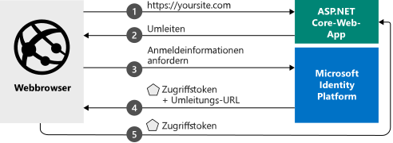

# <a name="quickstart-add-sign-in-with-microsoft-to-an-aspnet-core-web-app"></a>Schnellstart: Hinzufügen von „Bei Microsoft anmelden“ zu einer ASP.NET Core-Web-App

[!INCLUDE [active-directory-develop-applies-v2](../../../includes/active-directory-develop-applies-v2.md)]

In diesem Schnellstart erfahren Sie, wie eine ASP. NET Core-Web-App persönliche Konten (hotmail.com, outlook.com, andere) und Geschäfts-, Schul- und Unikonten aus jeder Azure AD-Instanz (Azure Active Directory) anmelden kann.



> [!div renderon="docs"]
> ## <a name="register-and-download-your-quickstart-app"></a>Registrieren und Herunterladen Ihrer Schnellstart-App
> Die Schnellstartanwendung kann auf zwei Arten gestartet werden:
> * [Express] [Option 1: Registrieren und automatisches Konfigurieren Ihrer App und anschließendes Herunterladen des Codebeispiels](#option-1-register-and-auto-configure-your-app-and-then-download-your-code-sample)
> * [Manuell] [Option 2: Registrieren und manuelles Konfigurieren Ihrer Anwendung und des Codebeispiels](#option-2-register-and-manually-configure-your-application-and-code-sample)
>
> ### <a name="option-1-register-and-auto-configure-your-app-and-then-download-your-code-sample"></a>Option 1: Registrieren und automatisches Konfigurieren Ihrer App und anschließendes Herunterladen des Codebeispiels
>
> 1. Navigieren Sie zu [Azure-Portal – App-Registrierungen](https://aka.ms/aspnetcore2-1-aad-quickstart-v2).
> 1. Geben Sie einen Namen für Ihre Anwendung ein, und wählen Sie **Registrieren** aus.
> 1. Befolgen Sie die Anweisungen, um Ihre neue Anwendung mit einem Klick herunterzuladen und automatisch zu konfigurieren.
>
> ### <a name="option-2-register-and-manually-configure-your-application-and-code-sample"></a>Option 2: Registrieren und manuelles Konfigurieren Ihrer Anwendung und des Codebeispiels
>
> #### <a name="step-1-register-your-application"></a>Schritt 1: Anwendung registrieren
> Führen Sie die folgenden Schritte aus, um Ihre Anwendung zu registrieren und Ihrer Projektmappe manuell die Registrierungsinformationen Ihrer App hinzuzufügen:
>
> 1. Melden Sie sich mit einem Geschäfts-, Schul- oder Unikonto oder mit einem persönlichen Microsoft-Konto beim [Azure-Portal](https://portal.azure.com) an.
> 1. Wenn Sie mit Ihrem Konto auf mehrere Mandanten zugreifen können, klicken Sie rechts oben auf Ihr Konto, und legen Sie Ihre Portalsitzung auf den gewünschten Azure AD-Mandanten fest.
> 1. Navigieren Sie zur Seite [App-Registrierungen](https://go.microsoft.com/fwlink/?linkid=2083908) von Microsoft Identity Platform für Entwickler.
> 1. Wählen Sie **Neue Registrierung** aus.
> 1. Geben Sie auf der daraufhin angezeigten Seite **Anwendung registrieren** die Registrierungsinformationen für Ihre Anwendung ein:
>    - Geben Sie im Abschnitt **Name** einen aussagekräftigen Anwendungsnamen ein, der den Benutzern der App angezeigt wird (beispielsweise `AspNetCore-Quickstart`).
>    - Fügen Sie `https://localhost:44321/` unter **Umleitungs-URI** hinzu, und wählen Sie **Registrieren** aus.
> 1. Wählen Sie das Menü **Authentifizierung** aus, und fügen Sie dann die folgenden Informationen hinzu:
>    - Fügen Sie `https://localhost:44321/signin-oidc` unter **Umleitungs-URI** hinzu, und wählen Sie **Speichern** aus.
>    - Legen Sie im Abschnitt **Erweiterte Einstellungen** die Option **Abmelde-URL** auf `https://localhost:44321/signout-oidc` fest.
>    - Aktivieren Sie unter **Implizite Genehmigung** die Option **ID-Token**.
>    - Wählen Sie **Speichern** aus.

> [!div class="sxs-lookup" renderon="portal"]
> #### <a name="step-1-configure-your-application-in-the-azure-portal"></a>Schritt 1: Konfigurieren Ihrer Anwendung im Azure-Portal
> Damit das Codebeispiel in dieser Schnellstartanleitung funktioniert, müssen Sie die Antwort-URLs `https://localhost:44321/` und `https://localhost:44321/signin-oidc` und die Abmelde-URL `https://localhost:44321/signout-oidc` hinzufügen und die Ausstellung von ID-Token durch den Autorisierungsendpunkt anfordern.
> > [!div renderon="portal" id="makechanges" class="nextstepaction"]
> > [Diese Änderung für mich vornehmen]()
>
> > [!div id="appconfigured" class="alert alert-info"]
> > : Ihre Anwendung ist mit diesen Attributen konfiguriert.

#### <a name="step-2-download-your-aspnet-core-project"></a>Schritt 2: Herunterladen des ASP.NET Core-Projekts

- [Herunterladen der Visual Studio 2019-Projektmappe](https://github.com/Azure-Samples/active-directory-aspnetcore-webapp-openidconnect-v2/archive/aspnetcore2-2.zip)

#### <a name="step-3-configure-your-visual-studio-project"></a>Schritt 3: Konfigurieren des Visual Studio-Projekts

1. Extrahieren Sie die ZIP-Datei in einem lokalen Ordner im Stammordner, etwa **C:\Azure-Samples**.
1. Wenn Sie Visual Studio-2019 verwenden, öffnen Sie die Projektmappe in Visual Studio (optional).
1. Bearbeiten Sie die Datei **appsettings.json**. Suchen Sie nach `ClientId`, und aktualisieren Sie den Wert von `ClientId` mit dem Wert der **Anwendungs-ID (Client)** der soeben registrierten Anwendung. 

    ```json
    "ClientId": "Enter_the_Application_Id_here"
    "TenantId": "Enter_the_Tenant_Info_Here"
    ```

> [!div renderon="docs"]
> Hinweis:
> - `Enter_the_Application_Id_here`: Die **Anwendungs-ID (Client)** für die im Azure-Portal registrierte Anwendung. Den Wert für **Anwendungs-ID (Client)** finden Sie auf der Seite **Übersicht** der App.
> - `Enter_the_Tenant_Info_Here` ist eine der folgenden Optionen:
>   - Unterstützt Ihre Anwendung **Nur Konten in diesem Organisationsverzeichnis**, ersetzen Sie diesen Wert durch die **Mandanten-ID** oder den **Mandantennamen** (etwa „contoso.microsoft.com“).
>   - Unterstützt Ihre Anwendung **Konten in einem beliebigen Organisationsverzeichnis**, ersetzen Sie diesen Wert durch `organizations`.
>   - Unterstützt Ihre Anwendung **Alle Microsoft-Kontobenutzer** ersetzen Sie diesen Wert durch `common`.
>
> > [!TIP]
> > Die Werte für **Anwendungs-ID (Client)**, **Verzeichnis-ID (Mandant)** und **Unterstützte Kontotypen** finden Sie im Azure-Portal auf der Seite **Übersicht** der App.

## <a name="more-information"></a>Weitere Informationen

In diesem Abschnitt erhalten Sie eine Übersicht über den erforderlichen Code für die Benutzeranmeldung. Diese Übersicht kann hilfreich sein, um die Funktionsweise des Codes und die Hauptargumente zu verstehen und zu ermitteln, ob Sie einer vorhandenen ASP.NET Core-Anwendung eine Anmeldung hinzufügen möchten.

### <a name="startup-class"></a>Startklasse

Die *Microsoft.AspNetCore.Authentication*-Middleware verwendet eine Startklasse, die ausgeführt wird, wenn der Hostprozess initialisiert wird:

```csharp
public void ConfigureServices(IServiceCollection services)
{
  services.Configure<CookiePolicyOptions>(options =>
  {
    // This lambda determines whether user consent for non-essential cookies is needed for a given request.
    options.CheckConsentNeeded = context => true;
    options.MinimumSameSitePolicy = SameSiteMode.None;
  });

  services.AddAuthentication(AzureADDefaults.AuthenticationScheme)
          .AddAzureAD(options => Configuration.Bind("AzureAd", options));

  services.Configure<OpenIdConnectOptions>(AzureADDefaults.OpenIdScheme, options =>
  {
    options.Authority = options.Authority + "/v2.0/";         // Microsoft identity platform

    options.TokenValidationParameters.ValidateIssuer = false; // accept several tenants (here simplified)
  });

  services.AddMvc(options =>
  {
     var policy = new AuthorizationPolicyBuilder()
                     .RequireAuthenticatedUser()
                     .Build();
     options.Filters.Add(new AuthorizeFilter(policy));
  })
  .SetCompatibilityVersion(CompatibilityVersion.Version_2_1);
}
```

Die Methode `AddAuthentication` konfiguriert den Dienst zum Hinzufügen der cookiebasierten Authentifizierung, die in Browserszenarien sowie zum Festlegen der Aufforderung auf OpenID Connect verwendet wird. 

Die Zeile, die `.AddAzureAd` enthält, fügt Ihrer Anwendung die Microsoft Identity Platform-Authentifizierung hinzu. Die Anmeldung erfolgt dann über den Microsoft Identity Platform-Endpunkt.

> |Hierbei gilt:  |  |
> |---------|---------|
> | ClientId  | Die Anwendungs-ID (Client) der im Azure-Portal registrierten Anwendung |
> | Authority | Der STS-Endpunkt für den zu authentifizierenden Benutzer. Normalerweise lautet er <https://login.microsoftonline.com/{tenant}/v2.0> für die öffentliche Cloud, wobei {tenant} der Name Ihres Mandanten, Ihre Mandanten-ID oder *common* für einen Verweis auf den allgemeinen Endpunkt (verwendet für mehrinstanzenfähige Anwendungen) ist. |
> | TokenValidationParameters | Eine Liste von Parametern für die Tokenüberprüfung. In diesem Fall wird `ValidateIssuer` auf `false` festgelegt, um anzugeben, dass Anmeldungen von beliebigen persönlichen Konten oder Geschäfts-, Schul- oder Unikonten akzeptiert werden können. |


> [!NOTE]
> Zur Vereinfachung dieser Schnellstartanleitung wird `ValidateIssuer = false` festgelegt. In echten Anwendungen müssen Sie den Aussteller überprüfen.
> Informationen dazu finden Sie in den Beispielen.

### <a name="protect-a-controller-or-a-controllers-method"></a>Schützen eines Controllers oder der Methode eines Controllers

Sie können einen Controller oder Controllermethoden mithilfe des `[Authorize]`-Attributs schützen. Dieses Attribut schränkt den Zugriff auf den Controller oder seine Methoden ein, indem es nur authentifizierte Benutzer zulässt. Das bedeutet, dass eine Authentifizierungsaufforderung für den Zugriff auf den Controller gestartet werden kann, wenn der Benutzer nicht authentifiziert ist.

[!INCLUDE [Help and support](../../../includes/active-directory-develop-help-support-include.md)]

## <a name="next-steps"></a>Nächste Schritte

Weitere Informationen finden Sie im GitHub-Repository für dieses ASP.NET Core-Tutorial, einschließlich Anweisungen zum Hinzufügen der Authentifizierung zu einer neuen ASP.NET Core Web-Anwendung, zum Aufrufen von Microsoft Graph und anderen Microsoft-APIs, zum Aufrufen eigener APIs, zum Hinzufügen von Berechtigungen, zum Anmelden von Benutzern bei nationalen Clouds oder mit Identitäten in sozialen Netzwerken und mehr:

> [!div class="nextstepaction"]
> [Tutorial: ASP.NET Core-Web-App](https://github.com/Azure-Samples/active-directory-aspnetcore-webapp-openidconnect-v2/)
