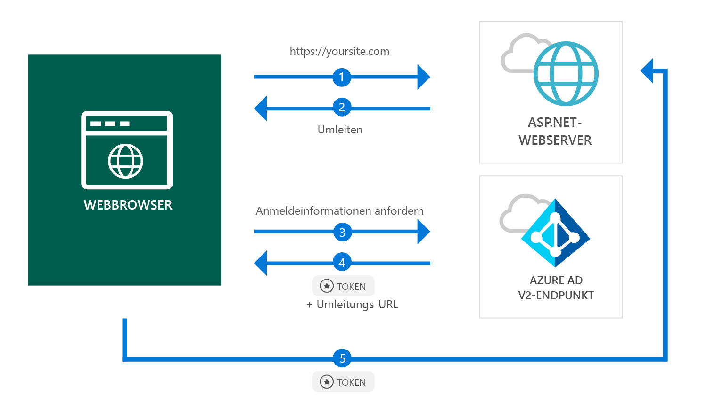

# <a name="quickstart-add-sign-in-with-microsoft-to-an-aspnet-web-app"></a>Schnellstart: Hinzufügen von „Mit Microsoft anmelden“ zu einer ASP.NET-Web-App

[!INCLUDE [active-directory-develop-applies-v2](../../../includes/active-directory-develop-applies-v2.md)]

In diesem Schnellstart erfahren Sie, wie eine ASP. NET-Web-App persönliche Konten (hotmail.com, outlook.com, andere) und Geschäfts-, Schul- und Unikonten aus jeder Azure AD-Instanz (Azure Active Directory) anmelden kann.



> [!div renderon="docs"]
> ## <a name="register-and-download-your-quickstart-app"></a>Registrieren und Herunterladen Ihrer Schnellstart-App
> Die Schnellstartanwendung kann auf zwei Arten gestartet werden:
> * [Express] [Option 1: Registrieren und automatisches Konfigurieren Ihrer App und anschließendes Herunterladen des Codebeispiels](#option-1-register-and-auto-configure-your-app-and-then-download-your-code-sample)
> * [Manuell] [Option 2: Registrieren und manuelles Konfigurieren Ihrer Anwendung und des Codebeispiels](#option-2-register-and-manually-configure-your-application-and-code-sample)
>
> ### <a name="option-1-register-and-auto-configure-your-app-and-then-download-your-code-sample"></a>Option 1: Registrieren und automatisches Konfigurieren Ihrer App und anschließendes Herunterladen des Codebeispiels
>
> 1. Navigieren Sie zur [Anwendungsregistrierung (Vorschau) im Azure-Portal](https://portal.azure.com/?Microsoft_AAD_RegisteredApps=true#blade/Microsoft_AAD_RegisteredApps/applicationsListBlade/quickStartType/AspNetWebAppQuickstartPage/sourceType/docs).
> 1. Geben Sie einen Namen für Ihre Anwendung ein, und klicken Sie auf **Registrieren**.
> 1. Befolgen Sie die Anweisungen, um Ihre neue Anwendung mit einem Klick herunterzuladen und automatisch zu konfigurieren.
>
> ### <a name="option-2-register-and-manually-configure-your-application-and-code-sample"></a>Option 2: Registrieren und manuelles Konfigurieren Ihrer Anwendung und des Codebeispiels
>
> #### <a name="step-1-register-your-application"></a>Schritt 1: Registrieren Ihrer Anwendung
> Führen Sie die folgenden Schritte aus, um Ihre Anwendung zu registrieren und Ihrer Projektmappe manuell die Registrierungsinformationen Ihrer App hinzuzufügen:
>
> 1. Melden Sie sich mit einem Geschäfts-, Schul- oder Unikonto oder mit einem persönlichen Microsoft-Konto beim [Azure-Portal](https://portal.azure.com) an.
> 1. Wenn Sie mit Ihrem Konto auf mehrere Mandanten zugreifen können, klicken Sie rechts oben auf Ihr Konto, und legen Sie Ihre Portalsitzung auf den gewünschten Azure AD-Mandanten fest.
> 1. Wählen Sie im linken Navigationsbereich den Dienst **Azure Active Directory** und anschließend **App-Registrierungen (Vorschau)** > **Neue Registrierung** aus.
> 1. Geben Sie auf der daraufhin angezeigten Seite **Anwendung registrieren** die Registrierungsinformationen Ihrer Anwendung ein:
>      - Geben Sie im Abschnitt **Name** einen aussagekräftigen Anwendungsnamen ein, der den Benutzern der App angezeigt wird (beispielsweise `ASPNET-Quickstart`).
>      - Fügen Sie unter **Antwort-URL** die URL `https://localhost:44368/` ein, und klicken Sie auf **Registrieren**.
Wählen Sie das Menü **Authentifizierung** aus, und legen Sie **ID-Token** unter **Implizite Genehmigung** fest. Wählen Sie dann **Speichern** aus.

> [!div class="sxs-lookup" renderon="portal"]
> #### <a name="step-1-configure-your-application-in-azure-portal"></a>Schritt 1: Konfigurieren Ihrer Anwendung im Azure-Portal
> Damit das Codebeispiel für diesen Schnellstart funktioniert, müssen Sie einen Antwort-URI als `https://localhost:44368/` hinzufügen.
> > [!div renderon="portal" id="makechanges" class="nextstepaction"]
> > [Diese Änderung für mich vornehmen]()
>
> > [!div id="appconfigured" class="alert alert-info"]
> > : Ihre Anwendung ist mit diesem Attribut konfiguriert.

#### <a name="step-2-download-your-project"></a>Schritt 2: Herunterladen Ihres Projekts

[Visual Studio 2017-Projektmappe herunterladen](https://github.com/AzureADQuickStarts/AppModelv2-WebApp-OpenIDConnect-DotNet/archive/master.zip)

#### <a name="step-3-configure-your-visual-studio-project"></a>Schritt 3: Konfigurieren des Visual Studio-Projekts

1. Extrahieren Sie die ZIP-Datei in einen lokalen Ordner, der sich näher am Stammordner befindet, beispielsweise **C:\Azure-Samples**.
1. Öffnen Sie die Projektmappe in Visual Studio (AppModelv2-WebApp-OpenIDConnect-DotNet.sln).
1. Bearbeiten Sie **Web.config**, und ersetzen Sie die Parameter `ClientId` und `Tenant` durch Folgendes:

    ```xml
    <add key="ClientId" value="Enter_the_Application_Id_here" />
    <add key="Tenant" value="Enter_the_Tenant_Info_Here" />
    ```

> [!div renderon="docs"]
> Hinweis:
> - `Enter_the_Application_Id_here` ist die Anwendungs-ID für die von Ihnen registrierte Anwendung.
> - `Enter_the_Tenant_Info_Here` ist eine der folgenden Optionen:
>   - Unterstützt Ihre Anwendung **Nur meine Organisation**, ersetzen Sie diesen Wert durch die **Mandanten-ID** oder den **Mandantennamen** (etwa „contoso.microsoft.com“).
>   - Unterstützt Ihre Anwendung **Konten in einem beliebigen Organisationsverzeichnis**, ersetzen Sie diesen Wert durch `organizations`.
>   - Unterstützt Ihre Anwendung **Alle Microsoft-Kontobenutzer** ersetzen Sie diesen Wert durch `common`.
>
> > [!TIP]
> > Die Werte für *Anwendungs-ID*, *Verzeichnis-ID (Mandant)* und *Unterstützte Kontotypen* finden Sie auf der Seite **Übersicht**.

## <a name="more-information"></a>Weitere Informationen

Dieser Abschnitt gibt einen Überblick über den Code, der für die Anmeldung von Benutzern erforderlich ist. Dies kann hilfreich sein, um die Funktionsweise des Codes und die Hauptargumente zu verstehen und zu ermitteln, ob Sie einer vorhandenen ASP.NET-Anwendung Anmeldung hinzufügen möchten.

### <a name="owin-middleware-nuget-packages"></a>NuGet-Pakete der OWIN-Middleware

Sie können die Authentifizierungspipeline mit cookiebasierter Authentifizierung über OpenID Connect in ASP.NET mit OWIN-Middlewarepaketen einrichten. Sie können diese Pakete installieren, indem Sie die folgenden Befehle in der **Paket-Manager-Konsole** von Visual Studio ausführen:

```powershell
Install-Package Microsoft.Owin.Security.OpenIdConnect
Install-Package Microsoft.Owin.Security.Cookies
Install-Package Microsoft.Owin.Host.SystemWeb
```

### <a name="owin-startup-class"></a>OWIN-Startklasse

Die OWIN-Middleware verwendet eine *Startklasse*, die bei der Initialisierung des Hostingprozesses ausgeführt wird (für diesen Schnellstart handelt es sich um die Datei *startup.cs* im Stammordner). Der folgende Code zeigt die Parameter, die von diesem Schnellstart verwendet werden:

```csharp
public void Configuration(IAppBuilder app)
{
    app.SetDefaultSignInAsAuthenticationType(CookieAuthenticationDefaults.AuthenticationType);

    app.UseCookieAuthentication(new CookieAuthenticationOptions());
    app.UseOpenIdConnectAuthentication(
        new OpenIdConnectAuthenticationOptions
        {
            // Sets the ClientId, authority, RedirectUri as obtained from web.config
            ClientId = clientId,
            Authority = authority,
            RedirectUri = redirectUri,
            // PostLogoutRedirectUri is the page that users will be redirected to after sign-out. In this case, it is using the home page
            PostLogoutRedirectUri = redirectUri,
            Scope = OpenIdConnectScope.OpenIdProfile,
            // ResponseType is set to request the id_token - which contains basic information about the signed-in user
            ResponseType = OpenIdConnectResponseType.IdToken,
            // ValidateIssuer set to false to allow personal and work accounts from any organization to sign in to your application
            // To only allow users from a single organizations, set ValidateIssuer to true and 'tenant' setting in web.config to the tenant name
            // To allow users from only a list of specific organizations, set ValidateIssuer to true and use ValidIssuers parameter 
            TokenValidationParameters = new TokenValidationParameters()
            {
                ValidateIssuer = false
            },
            // OpenIdConnectAuthenticationNotifications configures OWIN to send notification of failed authentications to OnAuthenticationFailed method
            Notifications = new OpenIdConnectAuthenticationNotifications
            {
                AuthenticationFailed = OnAuthenticationFailed
            }
        }
    );
}
```

> |Hierbei gilt:  |  |
> |---------|---------|
> | `ClientId`     | Die Anwendungs-ID der im Azure-Portal registrierten Anwendung. |
> | `Authority`    | Der STS-Endpunkt für den zu authentifizierenden Benutzer. Normalerweise https://login.microsoftonline.com/{tenant}/v2.0 für die öffentliche Cloud, wobei {tenant} der Name Ihres Mandanten, Ihre Mandanten-ID oder *common* für einen Verweis auf den allgemeinen Endpunkt (verwendet für mehrinstanzenfähige Anwendungen) ist. |
> | `RedirectUri`  | Die URL, an die Benutzer nach der Authentifizierung über den Azure AD v2.0-Endpunkt umgeleitet werden. |
> | `PostLogoutRedirectUri`     | Die URL, an die Benutzer nach der Abmeldung umgeleitet werden. |
> | `Scope`     | Die Liste der angeforderten Bereiche, getrennt durch Leerzeichen. |
> | `ResponseType`     | Die Anforderung, dass die Antwort von der Authentifizierung ein ID-Token enthält. |
> | `TokenValidationParameters`     | Eine Liste von Parametern für die Tokenüberprüfung. In diesem Fall wird `ValidateIssuer` auf `false` festgelegt, um anzugeben, dass Anmeldungen von beliebigen persönlichen oder Geschäfts-, Schul- oder Unikontotypen akzeptiert werden können. |
> | `Notifications`     | Eine Liste von Delegaten, die für verschiedene *OpenIdConnect*-Nachrichten ausgeführt werden können. |

### <a name="initiate-an-authentication-challenge"></a>Initiieren einer Authentifizierungsaufforderung

Sie können den Benutzer zur Anmeldung zwingen, indem Sie eine Authentifizierungsaufforderung in Ihrem Controller anfordern:

```csharp
public void SignIn()
{
    if (!Request.IsAuthenticated)
    {
        HttpContext.GetOwinContext().Authentication.Challenge(
            new AuthenticationProperties{ RedirectUri = "/" },
            OpenIdConnectAuthenticationDefaults.AuthenticationType);
    }
}
```

> [!TIP]
> Das Anfordern einer Authentifizierungsaufforderung mit der Methode oben ist optional und wird normalerweise verwendet, wenn Sie möchten, dass auf eine Ansicht sowohl durch authentifizierte als auch durch nicht authentifizierte Benutzer zugegriffen werden kann. Alternativ können Sie Controller mit der im nächsten Abschnitt beschriebenen Methode schützen.

### <a name="protect-a-controller-or-a-controllers-method"></a>Schützen eines Controllers oder der Methode eines Controllers

Sie können einen Controller oder Controlleraktionen mithilfe des `[Authorize]`-Attributs schützen. Dieses Attribut schränkt den Zugriff auf den Controller oder die Aktionen ein, indem es nur authentifizierten Benutzern den Zugriff auf die Aktionen im Controller erlaubt. Dies bedeutet, dass die Authentifizierungsaufforderung automatisch erfolgt, wenn ein *nicht authentifizierter* Benutzer versucht, auf eine der Aktionen oder den Controller zuzugreifen, die mit dem Attribut `[Authorize]` versehen sind.

## <a name="next-steps"></a>Nächste Schritte

Probieren Sie das ASP.NET-Tutorial aus, um eine vollständige Schritt-für-Schritt-Anleitung zum Erstellen von Anwendungen und neuen Features zu erhalten, einschließlich einer vollständigen Erläuterung dieses Schnellstarts.

### <a name="learn-the-steps-to-create-the-application-used-in-this-quickstart"></a>Informieren Sie sich über die Schritte zum Erstellen der in diesem Schnellstart verwendeten Anwendung.

> [!div class="nextstepaction"]
> [Beim Tutorial anmelden](.\tutorial-v2-asp-webapp.md)

[!INCLUDE [Help and support](../../../includes/active-directory-develop-help-support-include.md)]