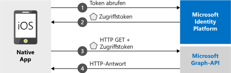

# <a name="quickstart-sign-in-users-and-call-the-microsoft-graph-api-from-an-ios-app"></a>Schnellstart: Anmelden von Benutzern und Aufrufen der Microsoft Graph-API aus einer iOS-App

[!INCLUDE [active-directory-develop-applies-v2-msal](../../../includes/active-directory-develop-applies-v2-msal.md)]

Dieser Schnellstart enthält ein Codebeispiel, das zeigt, wie eine native iOS-Anwendung persönliche, Geschäfts-, Schul- oder Unikonten anmelden, ein Zugriffstoken abrufen und die Microsoft Graph-API aufrufen kann.



> [!NOTE]
> **Voraussetzungen**
> * XCode 10 oder höher
> * iOS 10 oder höher 

> [!div renderon="docs"]
> ## <a name="register-and-download-your-quickstart-app"></a>Registrieren und Herunterladen Ihrer Schnellstart-App
> Die Schnellstartanwendung kann auf zwei Arten gestartet werden:
> * [Express] [Option 1: Registrieren und automatisches Konfigurieren Ihrer App und anschließendes Herunterladen des Codebeispiels](#option-1-register-and-auto-configure-your-app-and-then-download-your-code-sample)
> * [Manuell] [Option 2: Registrieren und manuelles Konfigurieren Ihrer Anwendung und des Codebeispiels](#option-2-register-and-manually-configure-your-application-and-code-sample)
>
> ### <a name="option-1-register-and-auto-configure-your-app-and-then-download-your-code-sample"></a>Option 1: Registrieren und automatisches Konfigurieren Ihrer App und anschließendes Herunterladen des Codebeispiels
> #### <a name="step-1-register-your-application"></a>Schritt 1: Anwendung registrieren
> So registrieren Sie Ihre App:
> 1. Navigieren Sie zum neuen Bereich [Azure-Portal – App-Registrierungen](https://portal.azure.com/#blade/Microsoft_AAD_RegisteredApps/applicationsListBlade/quickStartType/IosQuickstartPage/sourceType/docs).
> 1. Geben Sie einen Namen für Ihre Anwendung ein, und wählen Sie **Registrieren** aus.
> 1. Befolgen Sie die Anweisungen, um Ihre neue Anwendung mit nur einem Klick herunterzuladen und automatisch zu konfigurieren.
>
> ### <a name="option-2-register-and-manually-configure-your-application-and-code-sample"></a>Option 2: Registrieren und manuelles Konfigurieren Ihrer Anwendung und des Codebeispiels
>
> #### <a name="step-1-register-your-application"></a>Schritt 1: Anwendung registrieren
> Führen Sie die folgenden Schritte aus, um Ihre Anwendung zu registrieren und Ihrer Projektmappe manuell die Registrierungsinformationen Ihrer App hinzuzufügen:
>
> 1. Navigieren Sie zur Seite [App-Registrierungen](https://aka.ms/MobileAppReg) von Microsoft Identity Platform für Entwickler.
> 1. Wählen Sie **Neue Registrierung** aus.
> 1. Geben Sie auf der daraufhin angezeigten Seite **Anwendung registrieren** die Registrierungsinformationen für Ihre Anwendung ein:
>      - Geben Sie im Abschnitt **Name** einen aussagekräftigen Anwendungsnamen (z. B. `iOSQuickstart`) ein, der den Benutzern der App angezeigt wird, wenn sie sich anmelden oder Ihrer App zustimmen.
>      - Überspringen Sie die weiteren Konfigurationsschritte auf dieser Seite. 
>      - Klicken Sie auf die Schaltfläche `Register`.
> 1. Klicken Sie auf die neue App, und wählen Sie `Authentication` > `Add Platform` > `iOS` aus.    
>      - Geben Sie die ***Bündel-ID*** für Ihre Anwendung ein. 
> 1. Wählen Sie `Configure` aus, und speichern Sie die Details der ***MSAL-Konfiguration*** zur späteren Verwendung. 

> [!div renderon="portal" class="sxs-lookup"]
>
> #### <a name="step-1-configure-your-application"></a>Schritt 1: Konfigurieren der Anwendung
> Damit das Codebeispiel für diese Schnellstartanleitung funktioniert, müssen Sie einen mit dem Authentifizierungsbroker kompatiblen Umleitungs-URI hinzufügen. 
> > [!div renderon="portal" id="makechanges" class="nextstepaction"]
> > [Diese Änderung für mich vornehmen]()
>
> > [!div id="appconfigured" class="alert alert-info"]
> > : Ihre Anwendung ist mit diesen Attributen konfiguriert.

#### <a name="step-2-download-your-web-server-or-project"></a>Schritt 2: Herunterladen Ihres Webservers oder Projekts

- [Codebeispiel herunterladen](https://github.com/Azure-Samples/active-directory-ios-swift-native-v2/archive/master.zip)

#### <a name="step-3-configure-your-project"></a>Schritt 3: Konfigurieren des Projekts

> [!div renderon="docs"]
> Wenn Sie weiter oben die erste Option ausgewählt haben, können Sie diese Schritte überspringen. 

> [!div renderon="portal" class="sxs-lookup"]
> 1. Extrahieren Sie die ZIP-Datei, und öffnen Sie das Projekt in XCode.
> 1. Bearbeiten Sie **ViewController.swift**, und ersetzen Sie die Zeile, die mit „let kClientID“ beginnt, durch den folgenden Codeausschnitt:
>    ```swift
>    let kClientID = "Enter_the_Application_Id_here"
>    let kAuthority = "https://login.microsoftonline.com/Enter_the_Tenant_Info_Here"
>
>    ```
> 1. Klicken Sie mit der rechten Maustaste auf **Info.plist**, und wählen Sie **Öffnen als** > **Quellcode** aus.
> 1. Ersetzen Sie unter dem Stammknoten „dict“ den Platzhalter durch Ihre ***Bündel-ID***:
>
>    ```xml
>    <key>CFBundleURLTypes</key>
>    <array>
>       <dict>
>          <key>CFBundleURLSchemes</key>
>          <array>
>             <string>msauth.Enter_the_Bundle_Id_Here</string>
>          </array>
>       </dict>
>    </array>
> 
>    ```
> 1. Erstellen Sie die App, und führen Sie die App aus! 

> [!div renderon="docs"]
>
> 1. Extrahieren Sie die ZIP-Datei, und öffnen Sie das Projekt in XCode.
> 1. Bearbeiten Sie **ViewController.swift**, und ersetzen Sie die Zeile, die mit „let kClientID“ beginnt, durch den folgenden Codeausschnitt:
>
>    ```swift
>    let kClientID = "<ENTER_YOUR_APPLICATION/CLIENT_ID>"
> 
>    ```
> 1. Klicken Sie mit der rechten Maustaste auf **Info.plist**, und wählen Sie **Öffnen als** > **Quellcode** aus.
> 1. Ersetzen Sie unter dem Stammknoten „dict“ den Platzhalter durch Ihre ***Bündel-ID***:
>
>    ```xml
>    <key>CFBundleURLTypes</key>
>    <array>
>       <dict>
>          <key>CFBundleURLSchemes</key>
>          <array>
>             <string>msauth.<ENTER_YOUR_BUNDLE_ID></string>
>          </array>
>       </dict>
>    </array>
>
>    ```
> 1. Erstellen Sie die App, und führen Sie die App aus! 

## <a name="more-information"></a>Weitere Informationen

Lesen Sie diese Abschnitte, um mehr über diesen Schnellstart zu erfahren.

### <a name="getting-msal"></a>Abrufen von MSAL

MSAL ([MSAL.framework](https://github.com/AzureAD/microsoft-authentication-library-for-objc)) ist die Bibliothek zum Anmelden von Benutzern und zum Anfordern von Token, die für den Zugriff auf eine durch Microsoft Identity Platform geschützte API verwendet werden. Sie können Ihrer Anwendung MSAL mithilfe des folgenden Vorgangs hinzufügen:

```
$ vi Podfile

```
Fügen Sie der Podfile-Datei den folgenden Code (mit dem Ziel Ihres Projekts) hinzu:

```
use_frameworks!

target 'MSALiOS' do
   pod 'MSAL', '~> 0.4.0'
end

```

### <a name="msal-initialization"></a>MSAL-Initialisierung

Sie können den Verweis auf MSAL hinzufügen, indem Sie den folgenden Code hinzufügen:

```swift
import MSAL
```

Initialisieren Sie MSAL anschließend mit dem folgenden Code:

```swift
let authority = try MSALAADAuthority(url: URL(string: kAuthority)!)
            
let msalConfiguration = MSALPublicClientApplicationConfig(clientId: kClientID, redirectUri: nil, authority: authority)
self.applicationContext = try MSALPublicClientApplication(configuration: msalConfiguration)

```

> |Hinweis: ||
> |---------|---------|
> | `clientId` | Die Anwendungs-ID der in *portal.azure.com* registrierten Anwendung. |
> | `authority` | Der Microsoft Identity Platform-Endpunkt. In den meisten Fällen ist dies *https<span/>://login.microsoftonline.com/common*. |
> | `redirectUri` | Der Umleitungs-URI der Anwendung. Sie können „nil“ übergeben, um den Standardwert zu verwenden, oder Ihren benutzerdefinierten Umleitungs-URI angeben. |

### <a name="additional-app-requirements"></a>Zusätzliche App-Anforderungen  

Ihre App muss auch Folgendes in `AppDelegate` enthalten. Dadurch kann das MSAL SDK die Tokenantwort der Authentifizierungsbroker-App verarbeiten, wenn Sie die Authentifizierung ausführen.

 ```swift
 func application(_ app: UIApplication, open url: URL, options: [UIApplication.OpenURLOptionsKey : Any] = [:]) -> Bool {
         guard let sourceApplication = options[UIApplication.OpenURLOptionsKey.sourceApplication] as? String else {
             return false
         }
         
         return MSALPublicClientApplication.handleMSALResponse(url, sourceApplication: sourceApplication)
     }

```

Und schließlich muss Ihre App in der Datei ***Info.plist*** einen `LSApplicationQueriesSchemes`-Eintrag neben dem Eintrag `CFBundleURLTypes` enthalten. Im Beispiel ist dies enthalten. 

   ```xml 
   <key>LSApplicationQueriesSchemes</key>
   <array>
      <string>msauth</string>
      <string>msauthv2</string>
   </array>
   ```

### <a name="sign-in-users--request-tokens"></a>Anmelden von Benutzern und Anfordern von Token

MSAL verfügt über zwei Methoden, die zum Abrufen von Token verwendet werden: `acquireToken` und `acquireTokenSilent`.

#### <a name="acquiretoken-getting-a-token-interactively"></a>acquireToken: Interaktives Abrufen eines Tokens

In einigen Situationen müssen Benutzer mit Microsoft Identity Platform interagieren. In diesen Fällen muss der Endbenutzer möglicherweise sein Konto auswählen, seine Anmeldeinformationen eingeben oder den Berechtigungen Ihrer App zustimmen. Beispiel: 

* Erstmaliges Anmelden von Benutzern bei der Anwendung.
* Wenn ein Benutzer sein Kennwort zurücksetzt, muss er seine Anmeldeinformationen eingeben. 
* Wenn Ihre Anwendung zum ersten Mal Zugriff auf eine Ressource anfordert
* Wenn MFA erforderlich ist oder andere Richtlinien für bedingten Zugriff erforderlich sind

```swift
let parameters = MSALInteractiveTokenParameters(scopes: kScopes)
applicationContext.acquireToken(with: parameters) { (result, error) in /* Add your handling logic */}
```

> |Hinweis:||
> |---------|---------|
> | `scopes` | Enthält die angeforderten Bereiche, d. h. `[ "user.read" ]` für Microsoft Graph oder `[ "<Application ID URL>/scope" ]` für benutzerdefinierte Web-APIs (`api://<Application ID>/access_as_user`) |

#### <a name="acquiretokensilent-getting-an-access-token-silently"></a>acquireTokenSilent: Automatisches Abrufen eines Zugriffstokens

Apps sollten nicht verlangen, dass sich die Benutzer jedes Mal anmelden, wenn sie ein Token anfordern. Wenn der Benutzer sich bereits angemeldet hat, ermöglicht diese Methode Apps, Token im Hintergrund anzufordern. 

```swift
let parameters = MSALSilentTokenParameters(scopes: kScopes, account: applicationContext.allAccounts().first)
applicationContext.acquireTokenSilent(with: parameters) { (result, error) in /* Add your handling logic */}
```

> |Hinweis: ||
> |---------|---------|
> | `scopes` | Enthält die angeforderten Bereiche, d. h. `[ "user.read" ]` für Microsoft Graph oder `[ "<Application ID URL>/scope" ]` für benutzerdefinierte Web-APIs (`api://<Application ID>/access_as_user`) |
> | `account` | Das Konto, für das ein Token angefordert wird. In diesem Schnellstart geht es um eine Einzelkontoanwendung. Wenn Sie eine App mit mehreren Konten erstellen möchten, müssen Sie die Logik zum Identifizieren des für Tokenanforderungen zu verwendenden Kontos definieren `applicationContext.account(forHomeAccountId: self.homeAccountId)`. |

## <a name="next-steps"></a>Nächste Schritte

Probieren Sie das iOS-Tutorial aus, um eine vollständige Schritt-für-Schritt-Anleitung zum Erstellen von Anwendungen einschließlich einer vollständigen Erläuterung dieses Schnellstarts zu erhalten.

### <a name="learn-the-steps-to-create-the-application-used-in-this-quickstart"></a>Informieren Sie sich über die Schritte zum Erstellen der in diesem Schnellstart verwendeten Anwendung.

> [!div class="nextstepaction"]
> [Tutorial: Aufrufen der Graph-API (iOS)](https://docs.microsoft.com/azure/active-directory/develop/guidedsetups/active-directory-ios)

[!INCLUDE [Help and support](../../../includes/active-directory-develop-help-support-include.md)]