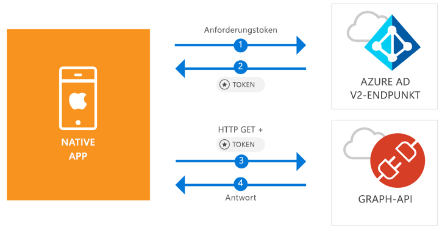

# <a name="quickstart-sign-in-users-and-call-the-microsoft-graph-api-from-an-ios-native-app"></a>Schnellstart: Anmelden von Benutzern und Aufrufen der Microsoft Graph-API aus einer nativen iOS-App

[!INCLUDE [active-directory-develop-applies-v2-msal](../../../includes/active-directory-develop-applies-v2-msal.md)]

Dieser Schnellstart enthält ein Codebeispiel, das zeigt, wie eine native iOS-Anwendung persönliche, Geschäfts-, Schul- oder Unikonten anmelden, ein Zugriffstoken abrufen und die Microsoft Graph-API aufrufen kann.



> [!div renderon="docs"]
> ## <a name="register-and-download"></a>Registrieren und herunterladen
> ### <a name="register-and-configure-your-application-and-code-sample"></a>Registrieren und Konfigurieren Ihrer Anwendung und des Codebeispiels
> #### <a name="step-1-register-your-application"></a>Schritt 1: Registrieren Ihrer Anwendung
> Wenn Sie Ihre Anwendung registrieren und die Anwendungsregistrierungsinformationen Ihrer Projektmappe hinzufügen möchten, führen Sie folgende Schritte aus:
> 1. Registrieren Sie Ihre Anwendung im [Microsoft-Anwendungsregistrierungsportal](https://apps.dev.microsoft.com/portal/register-app).
> 1. Geben Sie im Feld **Anwendungsname** einen Namen für Ihre Anwendung ein.
> 1. Vergewissern Sie sich, dass das Kontrollkästchen **Guided Setup** (Geführtes Setup) deaktiviert ist, und klicken Sie anschließend auf **Erstellen**.
> 1. Klicken Sie auf **Plattform hinzufügen** > **Native Anwendung** und anschließend auf **Speichern**.

> [!div renderon="portal" class="sxs-lookup"]
> #### <a name="step-1-configure-your-application"></a>Schritt1: Konfigurieren Ihrer Anwendung
> Damit das Codebeispiel für diesen Schnellstart funktioniert, müssen Sie eine Antwort-URL mit `msal<AppId>://auth` hinzufügen (dabei ist msal<AppId> diese Anwendungs-ID).
> > [!div renderon="portal" id="makechanges" class="nextstepaction"]
> > [Diese Änderung für mich vornehmen]()
>
> > [!div id="appconfigured" class="alert alert-info"]
> > : Ihre Anwendung ist mit diesem Attribut konfiguriert.

#### <a name="step-2-download-your-web-server-or-project"></a>Schritt 2: Herunterladen Ihres Webservers oder Projekts

- [XCode-Projekt herunterladen](https://github.com/Azure-Samples/active-directory-ios-swift-native-v2/archive/master.zip)

#### <a name="step-3-configure-your-project"></a>Schritt 3: Konfigurieren des Projekts

1. Extrahieren Sie die ZIP-Datei, und öffnen Sie das Projekt in XCode.
1. Bearbeiten Sie **ViewController.swift**, und ersetzen Sie die Zeile, die mit „let kClientID“ beginnt, durch den folgenden Codeausschnitt:

    > [!div renderon="portal" class="sxs-lookup"]
    > ```swift
    > let kClientID = "Enter_the_Application_Id_here"
    > ```

    > [!div renderon="docs"]
    > ```swift
    > let kClientID = "<ENTER_THE_APPLICATION_ID_HERE>"
    > ```   
1. Drücken Sie STRG, und klicken Sie auf **Info.plist**, um das Kontextmenü anzuzeigen. Wählen Sie dann **Öffnen als** > **Quellcode** aus.
1. Fügen Sie unter dem dict-Stammknoten den folgenden Code hinzu:

    > [!div renderon="portal" class="sxs-lookup"]
    > ```xml
    > <key>CFBundleURLTypes</key>
    > <array>
    >     <dict>
    >         <key>CFBundleTypeRole</key>
    >         <string>Editor</string>
    >         <key>CFBundleURLName</key>
    >         <string>$(PRODUCT_BUNDLE_IDENTIFIER)</string>
    >         <key>CFBundleURLSchemes</key>
    >         <array>
    >             <string>msalEnter_the_Application_Id_here</string>
    >         </array>
    >     </dict>
    > </array>
    > ```

    > [!div renderon="docs"]
    > ```xml
    > <key>CFBundleURLTypes</key>
    > <array>
    >     <dict>
    >         <key>CFBundleTypeRole</key>
    >         <string>Editor</string>
    >         <key>CFBundleURLName</key>
    >         <string>$(PRODUCT_BUNDLE_IDENTIFIER)</string>
    >         <key>CFBundleURLSchemes</key>
    >         <array>
    >             <string>msal<ENTER_THE_APPLICATION_ID_HERE></string>
    >         </array>
    >     </dict>
    > </array>
    > ```
    
> [!div renderon="docs"]
> <span>5.</span> Ersetzen Sie `<ENTER_THE_APPLICATION_ID_HERE>` durch die *Anwendungs-ID* für Ihre Anwendung. Wenn Sie die *Anwendungs-ID* ermitteln müssen, navigieren Sie zur Seite *Übersicht*.

## <a name="more-information"></a>Weitere Informationen

Lesen Sie diese Abschnitte, um mehr über diesen Schnellstart zu erfahren.

### <a name="msal"></a>MSAL

MSAL ([MSAL.framework](https://github.com/AzureAD/microsoft-authentication-library-for-objc)) ist die Bibliothek, die zum Anmelden von Benutzern und Anfordern von Token verwendet wird, die für den Zugriff auf eine durch Microsoft Azure Active Directory geschützte API verwendet werden. Sie können Ihrer Anwendung MSAL mithilfe des folgenden Vorgangs hinzufügen:

```
$ vi Podfile
```
Fügen Sie diesem Podfile folgenden Code hinzu:

```
 target 'QuickStart' do
   use_frameworks!
 pod 'MSAL'
 end
```

### <a name="msal-initialization"></a>MSAL-Initialisierung

Sie können den Verweis auf MSAL hinzufügen, indem Sie den folgenden Code hinzufügen:

```swift
import MSAL
```

Initialisieren Sie MSAL anschließend mit dem folgenden Code:

```swift
let authority = MSALAuthority(url: URL(string: kAuthority)!)
self.applicationContext = try MSALPublicClientApplication(clientId: kClientID, authority: authority)
```

> |Hinweis: ||
> |---------|---------|
> | `clientId` | Die Anwendungs-ID der in *portal.azure.com* registrierten Anwendung. |
> | `authority` | Der Azure AD v2.0-Endpunkt. In den meisten Fällen ist dies *https<span/>://login.microsoftonline.com/common*. |

### <a name="requesting-tokens"></a>Anfordern von Token

MSAL verfügt über zwei Methoden, die zum Abrufen von Token verwendet werden: `acquireToken` und `acquireTokenSilent`.

#### <a name="getting-an-access-token-interactively"></a>Interaktives Abrufen eines Zugriffstokens

In einigen Situationen müssen Benutzer gezwungen werden, mit dem Azure Active Directory (Azure AD) v2.0-Endpunkt zu interagieren. Dies führt zu einem Kontextwechsel zum Systembrowser, um entweder die Anmeldeinformationen der Benutzer zu überprüfen oder die Zustimmung zu erhalten. Beispiele hierfür sind:

* Erstmaliges Anmelden von Benutzern bei der Anwendung.
* Benutzer müssen ihre Anmeldeinformationen erneut eingeben, weil das Kennwort abgelaufen ist.
* Ihre Anwendung fordert Zugriff auf eine Ressource an, dem der Benutzer zustimmen muss.
* Zweistufige Authentifizierung ist erforderlich.

```swift
applicationContext.acquireToken(forScopes: self.kScopes) { (result, error) in /* Add your handling logic */}
```

> |Hinweis:||
> |---------|---------|
> | `forScopes` | Enthält die angeforderten Bereiche (d.h. [ "user.read" ]` for Microsoft Graph or `[ "<Application ID URL>/scope" ]` for custom Web APIs (i.e. `api://<Application ID>/access_as_user`)). |

#### <a name="getting-an-access-token-silently"></a>Automatisches Abrufen eines Zugriffstokens

Sie möchten nicht, dass der Benutzer seine Anmeldeinformationen jedes Mal überprüfen muss, wenn er auf eine Ressource zugreifen muss. Meistens wünschen Sie sich den Abruf und die Erneuerung von Token ohne jegliche Benutzerinteraktion. Sie können die `acquireTokenSilent`-Methode verwenden, um Token für den Zugriff auf geschützte Ressourcen nach der anfänglichen `acquireToken`-Methode abzurufen:

```swift
applicationContext.acquireTokenSilent(forScopes: self.kScopes, account: applicationContext.allAccounts().first) { (result, error) in /* Add your handling logic */}
```

> |Hinweis: ||
> |---------|---------|
> | `forScopes` | Enthält die angeforderten Bereiche (d.h. `[ "user.read" ]` für Microsoft Graph oder `[ "<Application ID URL>/scope" ]` für benutzerdefinierte Web-APIs (z.B. `api://<Application ID>/access_as_user`)). |
> | `account` | Das Konto, das das Token anfordert (MSAL unterstützt mehrere Konten in einer App). Bei diesem Schnellstart verweist der Wert auf das erste Konto im Cache (`applicationContext.allAccounts().first`). |

## <a name="next-steps"></a>Nächste Schritte

Probieren Sie das iOS-Tutorial aus, um eine vollständige Schritt-für-Schritt-Anleitung zum Erstellen von Anwendungen und neuen Features zu erhalten, einschließlich einer vollständigen Erläuterung dieses Schnellstarts.

### <a name="learn-the-steps-to-create-the-application-used-in-this-quickstart"></a>Informieren Sie sich über die Schritte zum Erstellen der in diesem Schnellstart verwendeten Anwendung.

> [!div class="nextstepaction"]
> [Tutorial: Aufrufen der Graph-API (iOS)](https://docs.microsoft.com/azure/active-directory/develop/guidedsetups/active-directory-ios)

[!INCLUDE [Help and support](../../../includes/active-directory-develop-help-support-include.md)]
