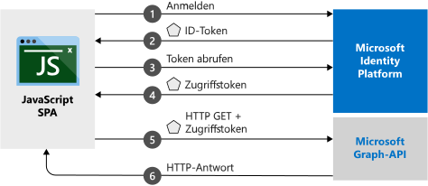

# <a name="quickstart-sign-in-users-and-acquire-an-access-token-from-a-javascript-single-page-application-spa"></a>Schnellstart: Anmelden von Benutzern und Beschaffen eines Zugriffstokens von einer JavaScript-Single-Page-Webanwendung

In dieser Schnellstartanleitung wird ein Codebeispiel beschrieben. Darin wird veranschaulicht, wie eine JavaScript-Single-Page-Webanwendung (SPA) die Anmeldung für persönliche Konten und Geschäfts-, Schul- und Unikonten durchführen und ein Zugriffstoken abrufen kann, um die Microsoft Graph-API oder eine beliebige Web-API aufzurufen.



## <a name="prerequisites"></a>Voraussetzungen

Für diese Schnellstartanleitung benötigen Sie das folgende Setup:
* Führen Sie zum Ausführen des Projekts mit einem Node.js-Server die folgenden Schritte aus:
    * Installieren von [Node.js](https://nodejs.org/en/download/)
    * Installieren von [Visual Studio Code](https://code.visualstudio.com/download) zum Bearbeiten der Projektdateien
* Wenn Sie das Projekt als Visual Studio-Projektmappe ausführen möchten, installieren Sie [Visual Studio 2019](https://visualstudio.microsoft.com/downloads/).

> [!div renderon="docs"]
> ## <a name="register-and-download-your-quickstart-application"></a>Registrieren und Herunterladen Ihrer Schnellstartanwendung
> Die Schnellstartanwendung kann auf zwei Arten gestartet werden:
> * [Express] [Option 1: Registrieren und automatisches Konfigurieren Ihrer App und anschließendes Herunterladen des Codebeispiels](#option-1-register-and-auto-configure-your-app-and-then-download-your-code-sample)
> * [Manuell] [Option 2: Registrieren und manuelles Konfigurieren Ihrer Anwendung und des Codebeispiels](#option-2-register-and-manually-configure-your-application-and-code-sample)
>
> ### <a name="option-1-register-and-auto-configure-your-app-and-then-download-your-code-sample"></a>Option 1: Registrieren und automatisches Konfigurieren Ihrer App und anschließendes Herunterladen des Codebeispiels
>
> 1. Melden Sie sich mit einem Geschäfts-, Schul- oder Unikonto oder mit einem persönlichen Microsoft-Konto beim [Azure-Portal](https://portal.azure.com) an.
> 1. Wenn Sie mit Ihrem Konto auf mehrere Mandanten zugreifen können, klicken Sie rechts oben auf Ihr Konto, und legen Sie Ihre Portalsitzung auf den gewünschten Azure AD-Mandanten fest.
> 1. Navigieren Sie zum neuen Bereich [Azure-Portal – App-Registrierungen](https://portal.azure.com/#blade/Microsoft_AAD_RegisteredApps/ApplicationsListBlade/quickStartType/JavascriptSpaQuickstartPage/sourceType/docs).
> 1. Geben Sie einen Namen für Ihre Anwendung ein, und klicken Sie auf **Registrieren**.
> 1. Befolgen Sie die Anweisungen, um Ihre neue Anwendung mit einem Klick herunterzuladen und automatisch zu konfigurieren.
>
> ### <a name="option-2-register-and-manually-configure-your-application-and-code-sample"></a>Option 2: Registrieren und manuelles Konfigurieren Ihrer Anwendung und des Codebeispiels
>
> #### <a name="step-1-register-your-application"></a>Schritt 1: Anwendung registrieren
>
> 1. Melden Sie sich mit einem Geschäfts-, Schul- oder Unikonto oder mit einem persönlichen Microsoft-Konto beim [Azure-Portal](https://portal.azure.com) an.
> 1. Wenn Sie mit Ihrem Konto auf mehrere Mandanten zugreifen können, klicken Sie rechts oben auf Ihr Konto, und legen Sie Ihre Portalsitzung auf den gewünschten Azure AD-Mandanten fest.
> 1. Navigieren Sie zur Seite [App-Registrierungen](https://go.microsoft.com/fwlink/?linkid=2083908) von Microsoft Identity Platform für Entwickler.
> 1. Wählen Sie **Neue Registrierung** aus.
> 1. Geben Sie auf der daraufhin angezeigten Seite **Anwendung registrieren** einen Namen für Ihre Anwendung ein.
> 1. Wählen Sie unter **Unterstützte Kontotypen** **Konten in allen Organisationsverzeichnissen und persönliche Microsoft-Konten** aus.
> 1. Wählen Sie die **Web**-Plattform unter dem Abschnitt **Umleitungs-URI** aus, und legen Sie den Wert auf `http://localhost:30662/` fest.
> 1. Wenn Sie so weit sind, klicken Sie auf **Registrieren**.  Notieren Sie sich auf der Seite **Übersicht** den Wert von **Anwendungsclient-ID**.
> 1. Für diesen Schnellstart muss der [Flow zur impliziten Genehmigung](v2-oauth2-implicit-grant-flow.md) aktiviert werden. Wählen Sie im linken Navigationsbereich der registrierten Anwendung **Authentifizierung** aus.
> 1. Aktivieren Sie unter **Erweiterte Einstellungen** und **Implizite Gewährung** die Kontrollkästchen **ID-Token** und **Zugriffstoken**. ID-Token und Zugriffstoken sind erforderlich, da diese App Benutzer anmelden und eine API aufrufen muss.
> 1. Wählen Sie **Speichern** aus.

> [!div class="sxs-lookup" renderon="portal"]
> #### <a name="step-1-configure-your-application-in-the-azure-portal"></a>Schritt 1: Konfigurieren Ihrer Anwendung im Azure-Portal
> Damit das Codebeispiel für diese Schnellstartanleitung funktioniert, müssen Sie den Umleitungs-URI `http://localhost:30662/` hinzufügen und **Implizite Gewährung** aktivieren.
> > [!div renderon="portal" id="makechanges" class="nextstepaction"]
> > [Make these changes for me]() (Diese Änderungen für mich vornehmen)
>
> > [!div id="appconfigured" class="alert alert-info"]
> > : Ihre Anwendung ist mit diesen Attributen konfiguriert.

#### <a name="step-2-download-the-project"></a>Schritt 2: Herunterladen des Projekts

Sie können eine dieser Optionen auswählen, die für Ihre Entwicklungsumgebung geeignet sind.
* [Herunterladen der Kernprojektdateien](https://github.com/Azure-Samples/active-directory-javascript-graphapi-v2/archive/quickstart.zip) für die Ausführung mit einem Webserver mit Node.js. Verwenden Sie zum Öffnen der Dateien einen Editor wie [Visual Studio Code](https://code.visualstudio.com/).

* (Optional) [Herunterladen des Visual Studio-Projekts](https://github.com/Azure-Samples/active-directory-javascript-graphapi-v2/archive/vsquickstart.zip) für die Ausführung mit dem IIS-Server. Extrahieren Sie die ZIP-Datei in einen lokalen Ordner (z.B. **C:\Azure-Samples**).


#### <a name="step-3-configure-your-javascript-app"></a>Schritt 3: Konfigurieren Ihrer JavaScript-App

> [!div renderon="docs"]
> Bearbeiten Sie `index.html` unter dem Ordner *JavaScriptSPA*, und legen Sie die Werte `clientID` und `authority` unter `msalConfig` fest.

> [!div class="sxs-lookup" renderon="portal"]
> Bearbeiten Sie `index.html` unter dem Ordner *JavaScriptSPA*, und ersetzen Sie `msalConfig` mit:

```javascript
var msalConfig = {
    auth: {
        clientId: "Enter_the_Application_Id_here",
        authority: "https://login.microsoftonline.com/Enter_the_Tenant_Info_Here"
    },
    cache: {
        cacheLocation: "localStorage",
        storeAuthStateInCookie: true
    }
};

```
> [!div renderon="docs"]
>
> Hinweis:
> - `Enter_the_Application_Id_here` ist die **Anwendungs-ID (Client)** für die von Ihnen registrierte Anwendung.
> - `Enter_the_Tenant_Info_Here` wird auf eine der folgenden Optionen festgelegt:
>   - Unterstützt Ihre Anwendung **Nur Konten in diesem Organisationsverzeichnis**, ersetzen Sie diesen Wert durch die **Mandanten-ID** oder den **Mandantennamen** (etwa „contoso.microsoft.com“).
>   - Unterstützt Ihre Anwendung **Konten in einem beliebigen Organisationsverzeichnis**, ersetzen Sie diesen Wert durch `organizations`.
>   - Unterstützt Ihre Anwendung **Konten in allen Organisationsverzeichnissen und persönliche Microsoft-Konten**, ersetzen Sie diesen Wert durch `common`. Wenn Sie die Unterstützung *ausschließlich auf persönliche Microsoft-Konten* beschränken möchten, ersetzen Sie diesen Wert durch `consumers`.
>
> > [!TIP]
> > Die Werte für **Anwendungs-ID (Client)** , **Verzeichnis-ID (Mandant)** und **Unterstützte Kontotypen** finden Sie im Azure-Portal auf der Seite **Übersicht** der App.
>

#### <a name="step-4-run-the-project"></a>Schritt 4: Ausführen des Projekts

* Wenn Sie [Node.js](https://nodejs.org/en/download/) verwenden, gehen Sie wie folgt vor:

    1. Führen Sie über das Projektverzeichnis den folgenden Befehl aus, um den Server zu starten:

        ```batch
        npm install
        node server.js
        ```

    1. Öffnen Sie einen Webbrowser, und navigieren Sie zu `http://localhost:30662/`.
    1. Klicken Sie auf die Schaltfläche **Anmelden**, um die Anmeldung zu starten, und rufen Sie anschließend die Microsoft Graph-API auf.


* Stellen Sie bei Verwendung von [Visual Studio](https://visualstudio.microsoft.com/downloads/) sicher, dass Sie die Projektlösung auswählen, und drücken Sie dann **F5**, um Ihr Projekt auszuführen.

Klicken Sie auf **Anmelden**, wenn der Browser die Anwendung geladen hat.  Bei der ersten Anmeldung werden Sie aufgefordert, Ihre Zustimmung zu geben, dass die Anwendung auf Ihr Profil zugreifen und Sie anmelden darf. Bei erfolgreicher Anmeldung sollten Ihre Benutzerprofilinformationen auf der Seite angezeigt werden.

## <a name="more-information"></a>Weitere Informationen

### <a name="msaljs"></a>*msal.js*

MSAL ist die Bibliothek zum Anmelden von Benutzern und Anfordern von Token, die für den Zugriff auf eine durch Microsoft Identity Platform geschützte API verwendet wird. Die Datei *index.html* der Schnellstartanleitung enthält einen Verweis auf die Bibliothek:

```html
<script src="https://secure.aadcdn.microsoftonline-p.com/lib/1.0.0/js/msal.min.js"></script>
```
> [!TIP]
> Sie können die oben genannte Version durch die letzte veröffentlichte Version unter [MSAL.js-Releases](https://github.com/AzureAD/microsoft-authentication-library-for-js/releases) ersetzen.


Falls Sie Node installiert haben, können Sie die aktuelle Version auch per npm herunterladen:

```batch
npm install msal
```

### <a name="msal-initialization"></a>MSAL-Initialisierung

Im Code der Schnellstartanleitung wird auch veranschaulicht, wie Sie die Bibliothek initialisieren:

```javascript
var msalConfig = {
    auth: {
        clientId: "Enter_the_Application_Id_here",
        authority: "https://login.microsoftonline.com/Enter_the_Tenant_Info_Here"
    },
    cache: {
        cacheLocation: "localStorage",
        storeAuthStateInCookie: true
    }
};

var myMSALObj = new Msal.UserAgentApplication(msalConfig);
```

> |Hierbei gilt:  |  |
> |---------|---------|
> |`ClientId`     |Die Anwendungs-ID der im Azure-Portal registrierten Anwendung.|
> |`authority`    | (Optional) Es handelt sich um die Autoritäts-URL zur Unterstützung von Kontotypen wie im Konfigurationsabschnitt oben beschrieben. Die Standardautorität lautet `https://login.microsoftonline.com/common`. |
> |`cacheLocation`  | (Optional) Hiermit wird der Browserspeicher für den Authentifizierungsstatus festgelegt. Der Standardwert lautet „sessionStorage“.   |
> |`storeAuthStateInCookie`  | (Optional) Die Bibliothek speichert den Authentifizierungsanforderungsstatus, der für die Überprüfung der Authentifizierungsflows erforderlich ist, in den Browsercookies. Dies wird für die Browser IE und Edge festgelegt, um die Auswirkungen bestimmter [bekannter Probleme](https://github.com/AzureAD/microsoft-authentication-library-for-js/wiki/Known-issues-on-IE-and-Edge-Browser#issues) zu minimieren. |

 Weitere Informationen zu den verfügbaren konfigurierbaren Optionen finden Sie unter [Initialisieren von Clientanwendungen](msal-js-initializing-client-applications.md).

### <a name="sign-in-users"></a>Anmelden von Benutzern

Der folgende Codeausschnitt veranschaulicht, wie Sie Benutzer anmelden:

```javascript
var requestObj = {
    scopes: ["user.read"]
};

myMSALObj.loginPopup(requestObj).then(function (loginResponse) {
    //Login Success callback code here
}).catch(function (error) {
    console.log(error);
});
```

> |Hierbei gilt:  |  |
> |---------|---------|
> | `scopes`   | (Optional) Enthält Bereiche, die bei der Anmeldung für die Benutzereinwilligung angefordert werden. Beispiel: `[ "user.read" ]` für Microsoft Graph oder `[ "<Application ID URL>/scope" ]` für benutzerdefinierte Web-APIs (d.h. `api://<Application ID>/access_as_user`). |

> [!TIP]
> Alternativ hierzu können Sie auch die `loginRedirect`-Methode verwenden, um die aktuelle Seite auf die Anmeldeseite umzuleiten, anstatt an das Popupfenster.

### <a name="request-tokens"></a>Anfordern von Token

MSAL verfügt über drei Methoden, die zum Beschaffen von Token verwendet werden: `acquireTokenRedirect`, `acquireTokenPopup` und `acquireTokenSilent`.

#### <a name="get-a-user-token-silently"></a>Automatisches Abrufen eines Benutzertokens

Die Methode `acquireTokenSilent` verwaltet das Abrufen und Erneuern von Token ohne Eingreifen des Benutzers. Nachdem die Methode `loginRedirect` oder `loginPopup` zum ersten Mal ausgeführt wurde, wird normalerweise die `acquireTokenSilent`-Methode zum Abrufen der Token genutzt, die für den Zugriff auf geschützte Ressourcen für nachfolgende Aufrufe verwendet werden. Aufrufe zum Anfordern oder Verlängern von Token werden im Hintergrund ausgeführt.

```javascript
var requestObj = {
    scopes: ["user.read"]
};

myMSALObj.acquireTokenSilent(requestObj).then(function (tokenResponse) {
    // Callback code here
    console.log(tokenResponse.accessToken);
}).catch(function (error) {
    console.log(error);
});
```

> |Hierbei gilt:  |  |
> |---------|---------|
> | `scopes`   | Enthält Bereiche, die für die Rückgabe im Zugriffstoken für die API angefordert werden. Beispiel: `[ "user.read" ]` für Microsoft Graph oder `[ "<Application ID URL>/scope" ]` für benutzerdefinierte Web-APIs (d.h. `api://<Application ID>/access_as_user`).|

#### <a name="get-a-user-token-interactively"></a>Interaktives Abrufen eines Benutzertokens

Es gibt Situationen, in denen Sie die Interaktion mit dem Microsoft Identity Platform-Endpunkt erzwingen müssen. Beispiel: 
* Benutzer müssen ihre Anmeldeinformationen ggf. erneut eingeben, weil ihr Kennwort abgelaufen ist.
* Ihre Anwendung fordert Zugriff auf zusätzliche Ressourcenbereiche an, für die der Benutzer seine Zustimmung erteilen muss.
* Die zweistufige Authentifizierung ist erforderlich.

Das übliche empfohlene Muster für die meisten Anwendungen ist zuerst das Aufrufen von `acquireTokenSilent`, das anschließende Abfangen der Ausnahme und dann das Aufrufen von `acquireTokenPopup` (oder `acquireTokenRedirect`), um eine interaktive Anforderung zu starten.

Der Aufruf von `acquireTokenPopup` führt zu einem Popupfenster (`acquireTokenRedirect` führt dazu, dass Benutzer an den Microsoft Identity Platform-Endpunkt umgeleitet werden), mit dem Benutzer interagieren müssen. Entweder bestätigen sie ihre Anmeldeinformationen, indem sie ihre Zustimmung zur erforderlichen Ressource erteilen, oder sie führen die zweistufige Authentifizierung durch.

```javascript
var requestObj = {
    scopes: ["user.read"]
};

myMSALObj.acquireTokenPopup(requestObj).then(function (tokenResponse) {
    // Callback code here
    console.log(tokenResponse.accessToken);
}).catch(function (error) {
    console.log(error);
});
```

> [!NOTE]
> In dieser Schnellstartanleitung werden die Methoden `loginRedirect` und `acquireTokenRedirect` verwendet, wenn Internet Explorer als Browser genutzt wird. Dies liegt an einem [bekannten Problem](https://github.com/AzureAD/microsoft-authentication-library-for-js/wiki/Known-issues-on-IE-and-Edge-Browser#issues) mit der Verarbeitung von Popupfenstern durch den Browser Internet Explorer.

## <a name="next-steps"></a>Nächste Schritte

Eine ausführlichere Schritt-für-Schritt-Anleitung zur Erstellung der Anwendung für diese Schnellstartanleitung finden Sie im unten angegebenen JavaScript-Tutorial.

### <a name="learn-the-steps-to-create-the-application-for-this-quickstart"></a>Informieren Sie sich über die Schritte zum Erstellen der Anwendung für diese Schnellstartanleitung.

> [!div class="nextstepaction"]
> [Aufrufen der Microsoft Graph-API aus einer JavaScript-SPA](https://docs.microsoft.com/azure/active-directory/develop/guidedsetups/active-directory-javascriptspa)

### <a name="browse-the-msal-repo-for-documentation-faq-issues-and-more"></a>Suchen Sie im MSAL-Repository nach Dokumentation, häufig gestellten Fragen, Problemen und mehr.

> [!div class="nextstepaction"]
> [MSAL.js – GitHub-Repository](https://github.com/AzureAD/microsoft-authentication-library-for-js)
