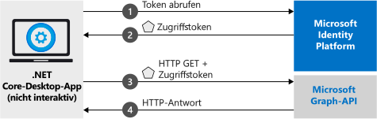

# <a name="quickstart-acquire-a-token-and-call-microsoft-graph-api-from-a-console-app-using-apps-identity"></a>Schnellstart: Abrufen eines Tokens und Aufrufen der Microsoft Graph-API über eine Konsolen-App anhand der Identität der App

In dieser Schnellstartanleitung wird beschrieben, wie Sie eine .NET Core-Anwendung schreiben, mit der anhand der eigenen Identität der App ein Zugriffstoken abgerufen werden kann. Anschließend wird veranschaulicht, wie Sie die Microsoft Graph-API aufrufen, um im Verzeichnis eine [Liste mit Benutzern](https://docs.microsoft.com/graph/api/user-list) anzuzeigen. Dieses Szenario ist für Situationen hilfreich, in denen ein monitorloser, unbeaufsichtigter Auftrag oder ein Windows-Dienst nicht mit der Identität eines Benutzers, sondern mit einer Anwendungsidentität ausgeführt werden muss.



## <a name="prerequisites"></a>Voraussetzungen

Für diese Schnellstartanleitung ist [.NET Core 2.2](https://www.microsoft.com/net/download/dotnet-core/2.2) erforderlich.

> [!div renderon="docs"]
> ## <a name="register-and-download-your-quickstart-app"></a>Registrieren und Herunterladen Ihrer Schnellstart-App

> [!div renderon="docs" class="sxs-lookup"]
>
> Die Schnellstartanwendung kann auf zwei Arten gestartet werden:
> * [Express] [Option 1: Registrieren und automatisches Konfigurieren Ihrer App und anschließendes Herunterladen des Codebeispiels](#option-1-register-and-auto-configure-your-app-and-then-download-your-code-sample)
> * [Manuell] [Option 2: Registrieren und manuelles Konfigurieren Ihrer Anwendung und des Codebeispiels](#option-2-register-and-manually-configure-your-application-and-code-sample)
>
> ### <a name="option-1-register-and-auto-configure-your-app-and-then-download-your-code-sample"></a>Option 1: Registrieren und automatisches Konfigurieren Ihrer App und anschließendes Herunterladen des Codebeispiels
>
> 1. Navigieren Sie zum neuen Bereich [Azure-Portal – App-Registrierungen](https://portal.azure.com/?Microsoft_AAD_RegisteredApps=true#blade/Microsoft_AAD_RegisteredApps/applicationsListBlade/quickStartType/DotNetCoreDaemonQuickstartPage/sourceType/docs).
> 1. Geben Sie einen Namen für Ihre Anwendung ein, und wählen Sie **Registrieren** aus.
> 1. Befolgen Sie die Anweisungen, um Ihre neue Anwendung mit nur einem Klick herunterzuladen und automatisch zu konfigurieren.
>
> ### <a name="option-2-register-and-manually-configure-your-application-and-code-sample"></a>Option 2: Registrieren und manuelles Konfigurieren Ihrer Anwendung und des Codebeispiels

> [!div renderon="docs"]
> #### <a name="step-1-register-your-application"></a>Schritt 1: Anwendung registrieren
> Führen Sie die folgenden Schritte aus, um Ihre Anwendung zu registrieren und Ihrer Projektmappe manuell die Registrierungsinformationen Ihrer App hinzuzufügen:
>
> 1. Melden Sie sich mit einem Geschäfts-, Schul- oder Unikonto oder mit einem persönlichen Microsoft-Konto beim [Azure-Portal](https://portal.azure.com) an.
> 1. Wenn Sie mit Ihrem Konto auf mehrere Mandanten zugreifen können, klicken Sie rechts oben auf Ihr Konto, und legen Sie Ihre Portalsitzung auf den gewünschten Azure AD-Mandanten fest.
> 1. Navigieren Sie zur Seite [App-Registrierungen](https://go.microsoft.com/fwlink/?linkid=2083908) von Microsoft Identity Platform für Entwickler.
> 1. Wählen Sie **Neue Registrierung** aus.
> 1. Geben Sie auf der daraufhin angezeigten Seite **Anwendung registrieren** die Registrierungsinformationen Ihrer Anwendung ein. 
> 1. Geben Sie im Abschnitt **Name** einen aussagekräftigen Anwendungsnamen ein, der den Benutzern der App angezeigt wird, z.B. `Daemon-console`. Wählen Sie anschließend **Registrieren**, um die Anwendung zu erstellen.
> 1. Wählen Sie nach Abschluss der Registrierung das Menü **Zertifikate & Geheimnisse**.
> 1. Wählen Sie unter **Geheime Clientschlüssel** die Option **+ Neuer geheimer Clientschlüssel**. Geben Sie ihm einen Namen, und wählen Sie **Hinzufügen**. Kopieren Sie das Geheimnis an einen sicheren Speicherort. Sie benötigen es für Ihren Code.
> 1. Wählen Sie nun das Menü **API-Berechtigungen**, die Schaltfläche **+ Berechtigung hinzufügen** und dann die Option **Microsoft Graph**.
> 1. Wählen Sie **Anwendungsberechtigungen**.
> 1. Wählen Sie unter dem Knoten **Benutzer** die Option **User.Read.All** und dann **Berechtigungen hinzufügen**.

> [!div class="sxs-lookup" renderon="portal"]
> ### <a name="download-and-configure-your-quickstart-app"></a>Herunterladen und Konfigurieren Ihrer Schnellstart-App
> 
> #### <a name="step-1-configure-your-application-in-azure-portal"></a>Schritt 1: Konfigurieren Ihrer Anwendung im Azure-Portal
> Damit das Codebeispiel für diese Schnellstartanleitung funktioniert, müssen Sie einen geheimen Clientschlüssel erstellen und die Anwendungsberechtigung **User.Read.All** aus der Graph-API hinzufügen.
> > [!div renderon="portal" id="makechanges" class="nextstepaction"]
> > [Make these changes for me]() (Diese Änderungen für mich vornehmen)
>
> > [!div id="appconfigured" class="alert alert-info"]
> > : Ihre Anwendung ist mit diesen Attributen konfiguriert.

#### <a name="step-2-download-your-visual-studio-project"></a>Schritt 2: Herunterladen des Visual Studio-Projekts

[Laden Sie das Visual Studio-Projekt herunter](https://github.com/Azure-Samples/active-directory-dotnetcore-daemon-v2/archive/msal3x.zip)

#### <a name="step-3-configure-your-visual-studio-project"></a>Schritt 3: Konfigurieren des Visual Studio-Projekts

1. Extrahieren Sie die ZIP-Datei in einem lokalen Ordner in der Nähe des Datenträger-Stammverzeichnisses (beispielsweise **C:\Azure-Samples**).
1. Öffnen Sie die Projektmappe in Visual Studio: **daemon-console.sln** (optional).
1. Bearbeiten Sie **appsettings.json**, und ersetzen Sie die Felder `ClientId`, `Tenant` und `ClientSecret` durch Folgendes:

    ```json
    "Tenant": "Enter_the_Tenant_Id_Here",
    "ClientId": "Enter_the_Application_Id_Here",
    "ClientSecret": "Enter_the_Client_Secret_Here"
    ```
    > > [!div renderon="portal" id="certandsecretspage" class="sxs-lookup"]
    > > [Generieren eines neuen geheimen Clientschlüssels]()
    
    > [!div renderon="docs"]
    >> Hinweis:
    >> * `Enter_the_Application_Id_Here` ist die **Anwendungs-ID (Client)** für die von Ihnen registrierte Anwendung.
    >> * `Enter_the_Tenant_Id_Here`: Ersetzen Sie diesen Wert durch die **Mandanten-ID** oder den **Mandantennamen** (z.B. „contoso.microsoft.com“).
    >> * `Enter_the_Client_Secret_Here`: Ersetzen Sie diesen Wert durch den geheimen Clientschlüssel, den Sie in Schritt 1 erstellt haben.

    > [!div renderon="docs"]
    > > [!TIP]
    > > Die Werte für **Anwendungs-ID (Client)** und **Verzeichnis-ID (Mandant)** finden Sie im Azure-Portal auf der Seite **Übersicht** der App. Navigieren Sie zum Generieren eines neuen Schlüssels zur Seite **Zertifikate & Geheimnisse**.
    
#### <a name="step-4-admin-consent"></a>Schritt 4: Administratorzustimmung

Wenn Sie zu diesem Zeitpunkt versuchen, die Anwendung auszuführen, wird der Fehler *HTTP 403 – Verboten* angezeigt: `Insufficient privileges to complete the operation`. Der Grund dafür ist, dass für eine *nur für die App geltende Berechtigung* eine Administratoreinwilligung erforderlich ist. Dies bedeutet, dass ein globaler Administrator Ihres Verzeichnisses die Einwilligung zu Ihrer Anwendung erteilen muss. Wählen Sie je nach Ihrer Rolle eine der unten angegebenen Optionen aus:

##### <a name="global-tenant-administrator"></a>Globaler Mandantenadministrator

> [!div renderon="docs"]
> Gehen Sie wie folgt vor, wenn Sie ein globaler Mandantenadministrator sind: Navigieren Sie im Azure-Portal in der Anwendungsregistrierung (Vorschauversion) zur Seite **API-Berechtigungen**, und wählen Sie **Administratorzustimmung für „{Mandantenname}“ erteilen**. (Hierbei steht „{Mandantenname}“ für den Namen Ihres Verzeichnisses.)

> [!div renderon="portal" class="sxs-lookup"]
> Gehen Sie als globaler Administrator wie folgt vor: Navigieren Sie zur Seite **API-Berechtigungen**, und wählen Sie **Administratorzustimmung für <Mandantennamen_hier_eingeben> erteilen**.
> > [!div id="apipermissionspage"]
> > [Navigieren Sie zur Seite „API-Berechtigungen“]().

##### <a name="standard-user"></a>Standardbenutzer

Wenn Sie ein Standardbenutzer Ihres Mandanten sind, müssen Sie einen globalen Administrator bitten, die Administratoreinwilligung für Ihre Anwendung zu erteilen. Übermitteln Sie hierzu die folgende URL an Ihren Administrator:

```url
https://login.microsoftonline.com/Enter_the_Tenant_Id_Here/adminconsent?client_id=Enter_the_Application_Id_Here
```

> [!div renderon="docs"]
>> Hinweis:
>> * `Enter_the_Tenant_Id_Here`: Ersetzen Sie diesen Wert durch die **Mandanten-ID** oder den **Mandantennamen** (z.B. „contoso.microsoft.com“).
>> * `Enter_the_Application_Id_Here` ist die **Anwendungs-ID (Client)** für die von Ihnen registrierte Anwendung.

> [!NOTE]
> Unter Umständen wird der Fehler *„AADSTS50011: No reply address is registered for the application“* (AADSTS50011: Für die Anwendung ist keine Antwortadresse registriert.) angezeigt, nachdem über die obige URL die Einwilligung für die App erteilt wurde. Dieser Fehler tritt auf, da diese Anwendung und die URL nicht über einen Umleitungs-URI verfügen.

#### <a name="step-5-run-the-application"></a>Schritt 5: Ausführen der Anwendung

Drücken Sie bei Verwendung von Visual Studio **F5**, um die Anwendung auszuführen. Führen Sie die Anwendung andernfalls über die Eingabeaufforderung oder die Konsole aus:

```console
cd {ProjectFolder}\daemon-console
dotnet run
```

> Hinweis:
> * *{ProjectFolder}* ist der Ordner, in den Sie die ZIP-Datei extrahieren. Beispiel: **C:\Azure-Samples\active-directory-dotnetcore-daemon-v2**

Es sollte eine Liste mit Benutzern in Ihrem Azure AD-Verzeichnis angezeigt werden.

> [!IMPORTANT]
> Für die Anwendung in dieser Schnellstartanleitung wird ein Clientgeheimnis verwendet, um sich selbst als vertraulicher Client zu identifizieren. Da das Clientgeheimnis Ihren Projektdateien als Nur-Text hinzugefügt wird, wird aus Sicherheitsgründen empfohlen, ein Zertifikat anstelle eines Clientgeheimnisses zu verwenden, bevor die Anwendung als Produktionsanwendung eingestuft wird. Weitere Informationen zur Verwendung eines Zertifikats finden Sie im GitHub-Repository für dieses Beispiel in [diesen Anweisungen](https://github.com/Azure-Samples/active-directory-dotnetcore-daemon-v2/#variation-daemon-application-using-client-credentials-with-certificates).

## <a name="more-information"></a>Weitere Informationen

### <a name="msalnet"></a>MSAL.NET

MSAL ([Microsoft.Identity.Client](https://www.nuget.org/packages/Microsoft.Identity.Client)) ist die Bibliothek zum Anmelden von Benutzern und Anfordern von Token, die für den Zugriff auf eine durch Microsoft Identity Platform geschützte API verwendet wird. In dieser Schnellstartanleitung werden wie beschrieben Token angefordert, indem keine delegierten Berechtigungen verwendet werden, sondern die eigene Identität der Anwendung. Der hier genutzte Authentifizierungsablauf wird als *[OAuth-Ablauf mit Clientanmeldeinformationen](v2-oauth2-client-creds-grant-flow.md)* bezeichnet. Weitere Informationen dazu, wie Sie MSAL.NET mit einem Clientanmeldeinformationen-Ablauf verwenden, finden Sie in [diesem Artikel](https://aka.ms/msal-net-client-credentials).

 Sie können MSAL.NET installieren, indem Sie den folgenden Befehl in der **Paket-Manager-Konsole** von Visual Studio ausführen:

```powershell
Install-Package Microsoft.Identity.Client -Pre
```

Wenn Sie nicht Visual Studio verwenden, können Sie alternativ den folgenden Befehl ausführen, um Ihrem Projekt MSAL hinzuzufügen:

```console
dotnet add package Microsoft.Identity.Client
```

### <a name="msal-initialization"></a>MSAL-Initialisierung

Sie können den Verweis auf MSAL hinzufügen, indem Sie den folgenden Code hinzufügen:

```csharp
using Microsoft.Identity.Client;
```

Initialisieren Sie MSAL anschließend mit dem folgenden Code:

```csharp
IConfidentialClientApplication app;
app = ConfidentialClientApplicationBuilder.Create(config.ClientId)
                                          .WithClientSecret(config.ClientSecret)
                                          .WithAuthority(new Uri(config.Authority))
                                          .Build();
);
```

> | Hinweis: ||
> |---------|---------|
> | `config.ClientSecret` | Der geheime Clientschlüssel, der für die Anwendung im Azure-Portal erstellt wird. |
> | `config.ClientId` | Die **Anwendungs-ID (Client)** für die im Azure-Portal registrierte Anwendung. Dieser Wert befindet sich im Azure-Portal auf der Seite **Übersicht** der App. |
> | `config.Authority`    | (Optional) Der STS-Endpunkt für den zu authentifizierenden Benutzer. Normalerweise <https://login.microsoftonline.com/{tenant}> für die öffentliche Cloud, wobei „{tenant}“ der Name Ihres Mandanten bzw. Ihre Mandanten-ID ist.|

Weitere Informationen finden Sie in der [Referenzdokumentation für `ConfidentialClientApplication`](https://docs.microsoft.com/dotnet/api/microsoft.identity.client.iconfidentialclientapplication?view=azure-dotnet).

### <a name="requesting-tokens"></a>Anfordern von Token

Verwenden Sie die `AcquireTokenForClient`-Methode, um ein Token mit der Identität einer App anzufordern:

```csharp
result = await app.AcquireTokenForClient(scopes)
                  .ExecuteAsync();
```

> |Hinweis:| |
> |---------|---------|
> | `scopes` | Enthält die angeforderten Bereiche. Für vertrauliche Clients sollte ein Format wie `{Application ID URI}/.default` verwendet werden. Hiermit wird angegeben, dass die angeforderten Bereiche diejenigen sind, die im App-Objekt, das im Azure-Portal festgelegt ist, statisch definiert sind (für Microsoft Graph wird für `{Application ID URI}` auf `https://graph.microsoft.com` verwiesen). Für benutzerdefinierte Web-APIs wird `{Application ID URI}` in der Anwendungsregistrierung (Vorschauversion) im Azure-Portal unter dem Abschnitt **Eine API verfügbar machen** definiert. |

Weitere Informationen finden Sie in der [Referenzdokumentation für `AcquireTokenForClient`](https://docs.microsoft.com/dotnet/api/microsoft.identity.client.confidentialclientapplication.acquiretokenforclientasync?view=azure-dotnet#Microsoft_Identity_Client_ConfidentialClientApplication_AcquireTokenForClientAsync_System_Collections_Generic_IEnumerable_System_String__).

[!INCLUDE [Help and support](../../../includes/active-directory-develop-help-support-include.md)]

## <a name="next-steps"></a>Nächste Schritte

> [!div class="nextstepaction"]
> [Beispiel für .NET Core-Daemon](https://github.com/Azure-Samples/active-directory-dotnetcore-daemon-v2)

Informieren Sie sich über Berechtigungen und die Einwilligung:

> [!div class="nextstepaction"]
> [Berechtigungen und Einwilligung](v2-permissions-and-consent.md)

Weitere Informationen zum Authentifizierungsfluss für dieses Szenario finden Sie unter dem OAuth 2.0-Clientanmeldeinformations-Flow:

> [!div class="nextstepaction"]
> [OAuth 2.0-Clientanmeldeinformations-Flow](v2-oauth2-client-creds-grant-flow.md)

> [!div class="nextstepaction"]
> [Client credential flows in MSAL.NET](https://aka.ms/msal-net-client-credentials) (Clientanmeldeinformations-Flow in MSAL.NET)
