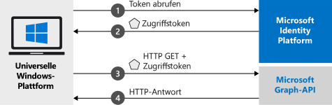

# <a name="quickstart-call-the-microsoft-graph-api-from-a-universal-windows-platform-uwp-application"></a>Schnellstart: Aufrufen der Microsoft Graph-API über eine UWP-Anwendung (UWP = Universelle Windows-Plattform)

Dieser Schnellstart enthält ein Codebeispiel, das zeigt, wie eine UWP-Anwendung (Universelle Windows-Plattform) Benutzer mit persönlichen Konten oder Geschäfts-, Schul- oder Unikonten anmelden, ein Zugriffstoken abrufen und die Microsoft Graph-API aufrufen kann.



> [!div renderon="docs"]
> ## <a name="register-and-download-your-quickstart-app"></a>Registrieren und Herunterladen Ihrer Schnellstart-App
> [!div renderon="docs" class="sxs-lookup"]
> Die Schnellstartanwendung kann auf zwei Arten gestartet werden:
> * [Express] [Option 1: Registrieren und automatisches Konfigurieren Ihrer App und anschließendes Herunterladen des Codebeispiels](#option-1-register-and-auto-configure-your-app-and-then-download-your-code-sample)
> * [Manuell] [Option 2: Registrieren und manuelles Konfigurieren Ihrer Anwendung und des Codebeispiels](#option-2-register-and-manually-configure-your-application-and-code-sample)
>
> ### <a name="option-1-register-and-auto-configure-your-app-and-then-download-your-code-sample"></a>Option 1: Registrieren und automatisches Konfigurieren Ihrer App und anschließendes Herunterladen des Codebeispiels
>
> 1. Navigieren Sie zum neuen Bereich [Azure-Portal – App-Registrierungen](https://portal.azure.com/#blade/Microsoft_AAD_RegisteredApps/applicationsListBlade/quickStartType/UwpQuickstartPage/sourceType/docs).
> 1. Geben Sie einen Namen für Ihre Anwendung ein, und klicken Sie auf **Registrieren**.
> 1. Befolgen Sie die Anweisungen, um Ihre neue Anwendung mit einem Klick herunterzuladen und automatisch zu konfigurieren.
>
> ### <a name="option-2-register-and-manually-configure-your-application-and-code-sample"></a>Option 2: Registrieren und manuelles Konfigurieren Ihrer Anwendung und des Codebeispiels
> [!div renderon="docs"]
> #### <a name="step-1-register-your-application"></a>Schritt 1: Anwendung registrieren
> Führen Sie die folgenden Schritte aus, um Ihre Anwendung zu registrieren und Ihrer Projektmappe die Registrierungsinformationen Ihrer App hinzuzufügen:
> 1. Melden Sie sich mit einem Geschäfts-, Schul- oder Unikonto oder mit einem persönlichen Microsoft-Konto beim [Azure-Portal](https://portal.azure.com) an.
> 1. Wenn Sie mit Ihrem Konto auf mehrere Mandanten zugreifen können, klicken Sie rechts oben auf Ihr Konto, und legen Sie Ihre Portalsitzung auf den gewünschten Azure AD-Mandanten fest.
> 1. Navigieren Sie zur Seite [App-Registrierungen](https://aka.ms/MobileAppReg) von Microsoft Identity Platform für Entwickler.
> 1. Wählen Sie **Neue Registrierung** aus.
> 1. Geben Sie auf der daraufhin angezeigten Seite **Anwendung registrieren** die Registrierungsinformationen für Ihre Anwendung ein:
>      - Geben Sie im Abschnitt **Name** einen aussagekräftigen Anwendungsnamen ein, der den Benutzern der App angezeigt wird (beispielsweise `UWP-App-calling-MsGraph`).
>      - Wählen Sie im Abschnitt **Unterstützte Kontotypen** die Option **Konten in allen Organisationsverzeichnissen und persönliche Microsoft-Konten (z. B. Skype, Xbox, Outlook.com)** aus.
>      - Wählen Sie **Registrieren** aus, um die Anwendung zu erstellen.
> 1. Wählen Sie in der Liste mit den Seiten für die App die Option **Authentifizierung** aus.
> 1. Erweitern Sie den Abschnitt **Desktop + devices** (Desktop + Geräte).  (Wird **Desktop + devices** (Desktop + Geräte) nicht angezeigt, klicken Sie zuerst auf das obere Banner, um die Vorschauversion der Authentifizierungsumgebung anzuzeigen.)
> 1. Wählen Sie im Abschnitt **Umleitungs-URI** die Option **URI hinzufügen** aus.  Geben Sie **urn:ietf:wg:oauth:2.0:oob** ein.
> 1. Wählen Sie **Speichern** aus.

> [!div renderon="portal" class="sxs-lookup alert alert-info"]
> #### <a name="step-1-configure-your-application"></a>Schritt 1: Konfigurieren der Anwendung
> Damit das Codebeispiel für diese Schnellstartanleitung funktioniert, muss ein Umleitungs-URI als **urn:ietf:wg:oauth:2.0:oob** hinzufügt werden.
> > [!div renderon="portal" id="makechanges" class="nextstepaction"]
> > [Diese Änderung für mich vornehmen]()
>
> > [!div id="appconfigured" class="alert alert-info"]
> > : Ihre Anwendung ist mit diesen Attributen konfiguriert.

#### <a name="step-2-download-your-visual-studio-project"></a>Schritt 2: Herunterladen des Visual Studio-Projekts

 - [Laden Sie das Visual Studio-Projekt herunter](https://github.com/Azure-Samples/active-directory-dotnet-native-uwp-v2/archive/msal3x.zip)

#### <a name="step-3-configure-your-visual-studio-project"></a>Schritt 3: Konfigurieren des Visual Studio-Projekts

1. Extrahieren Sie die ZIP-Datei in einem lokalen Ordner in der Nähe des Datenträger-Stammverzeichnisses (beispielsweise **C:\Azure-Samples**).
1. Öffnen Sie das Projekt in Visual Studio. Sie werden unter Umständen aufgefordert, ein UWP-SDK zu installieren. Akzeptieren Sie in diesem Fall den Vorgang.
1. Bearbeiten Sie **MainPage.Xaml.cs**, und ersetzen Sie dabei die Werte im Feld `ClientId`:

    ```csharp
    private const string ClientId = "Enter_the_Application_Id_here";
    ```

> [!div renderon="docs"]
> Hinweis:
> - `Enter_the_Application_Id_here` ist die Anwendungs-ID für die von Ihnen registrierte Anwendung.
>
> > [!TIP]
> > Um die Werte von *Anwendungs-ID* zu ermitteln, navigieren Sie im Portal zur Seite **Übersicht**.

#### <a name="step-4-run-your-application"></a>Schritt 4: Ausführen der Anwendung

Wenn Sie den Schnellstart auf Ihrem Windows-Computer testen möchten:

1. Wählen Sie auf der Symbolleiste von Visual Studio die richtige Plattform aus (voraussichtlich **x64** oder **x86**, nicht ARM).
   > Beachten Sie, dass das Zielgerät von *Gerät* zu *Lokaler Computer* wechselt.
1. Wählen Sie „Debuggen“ | **Ohne Debuggen starten** aus.

## <a name="more-information"></a>Weitere Informationen

Dieser Abschnitt enthält weitere Informationen zu der Schnellstartanleitung.

### <a name="msalnet"></a>MSAL.NET

MSAL ([Microsoft.Identity.Client](https://www.nuget.org/packages/Microsoft.Identity.Client)) ist die Bibliothek, mit der Benutzer angemeldet und Sicherheitstoken angefordert werden können. Mithilfe der Sicherheitstoken kann auf eine API zugegriffen werden, die durch Microsoft Identity Platform für Entwickler geschützt ist. Sie können MSAL installieren, indem Sie den folgenden Befehl in der *Paket-Manager-Konsole* von Visual Studio ausführen:

```powershell
Install-Package Microsoft.Identity.Client -IncludePrerelease
```

### <a name="msal-initialization"></a>MSAL-Initialisierung

Sie können den Verweis auf MSAL hinzufügen, indem Sie den folgenden Code hinzufügen:

```csharp
using Microsoft.Identity.Client;
```

Anschließend wird MSAL mit dem folgenden Code initialisiert:

```csharp
public static IPublicClientApplication PublicClientApp;
PublicClientApp = new PublicClientApplicationBuilder.Create(ClientId)
                                                    .Build();
```

> |Hinweis: ||
> |---------|---------|
> | `ClientId` | Die **Anwendungs-ID (Client)** für die im Azure-Portal registrierte Anwendung. Dieser Wert befindet sich im Azure-Portal auf der Seite **Übersicht** der App. |

### <a name="requesting-tokens"></a>Anfordern von Token

MSAL verfügt über zwei Methoden zum Abrufen von Token in einer UWP-App: `AcquireTokenInteractive` und `AcquireTokenSilent`.

#### <a name="get-a-user-token-interactively"></a>Interaktives Abrufen eines Benutzertokens

In bestimmten Situationen müssen Benutzer über ein Popupfenster mit dem Microsoft Identity Platform-Endpunkt interagieren, um entweder ihre Anmeldeinformationen zu bestätigen oder ihre Zustimmung zu geben. Beispiele hierfür sind:

- Erstmaliges Anmelden von Benutzern bei der Anwendung.
- Benutzer müssen ihre Anmeldeinformationen erneut eingeben, weil das Kennwort abgelaufen ist.
- Ihre Anwendung fordert Zugriff auf eine Ressource an, dem der Benutzer zustimmen muss.
- Zweistufige Authentifizierung ist erforderlich.

```csharp
authResult = await App.PublicClientApp.AcquireTokenInteractive(scopes)
                      .ExecuteAsync();
```

> |Hinweis:||
> |---------|---------|
> | `scopes` | Enthält die angeforderten Bereiche (etwa `{ "user.read" }` für Microsoft Graph oder `{ "api://<Application ID>/access_as_user" }` für benutzerdefinierte Web-APIs). |

#### <a name="get-a-user-token-silently"></a>Automatisches Abrufen eines Benutzertokens

Verwenden Sie die `AcquireTokenSilent`-Methode, um Token für den Zugriff auf geschützte Ressourcen nach der anfänglichen `AcquireTokenAsync`-Methode abzurufen. Sie möchten nicht, dass der Benutzer seine Anmeldeinformationen jedes Mal überprüfen muss, wenn er auf eine Ressource zugreifen muss. Meistens wünschen Sie sich den Abruf und die Erneuerung von Token ohne jegliche Benutzerinteraktion.

```csharp
var accounts = await App.PublicClientApp.GetAccountsAsync();
var firstAccount = accounts.FirstOrDefault();
authResult = await App.PublicClientApp.AcquireTokenSilent(scopes, firstAccount)
                                      .ExecuteAsync();
```

> |Hinweis: ||
> |---------|---------|
> | `scopes` | Enthält die angeforderten Bereiche (etwa `{ "user.read" }` für Microsoft Graph oder `{ "api://<Application ID>/access_as_user" }` für benutzerdefinierte Web-APIs). |
> | `firstAccount` | Gibt das erste Benutzerkonto im Cache an (MSAL unterstützt mehrere Benutzer in einer App). |

[!INCLUDE [Help and support](../../../includes/active-directory-develop-help-support-include.md)]

## <a name="next-steps"></a>Nächste Schritte

Probieren Sie das Windows Desktop-Tutorial aus, um eine vollständige Schritt-für-Schritt-Anleitung zum Erstellen von Anwendungen und neuen Features zu erhalten, einschließlich einer vollständigen Erläuterung dieses Schnellstarts.

> [!div class="nextstepaction"]
> [Tutorial: UWP – Aufrufen der Microsoft Graph-API](tutorial-v2-windows-uwp.md)
