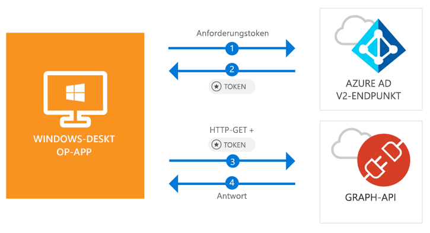

# <a name="quickstart-acquire-a-token-and-call-microsoft-graph-api-from-a-windows-desktop-app"></a>Schnellstart: Abrufen eines Tokens und Aufrufen der Microsoft Graph-API von einer Windows Desktop-Anwendung aus

[!INCLUDE [active-directory-develop-applies-v2-msal](../../../includes/active-directory-develop-applies-v2-msal.md)]

In diesem Schnellstart erfahren Sie, wie eine Windows Desktop .NET-Anwendung (WPF-Anwendung) persönliche, Geschäfts-, Schul- oder Unikonten anmelden, ein Zugriffstoken abrufen und die Microsoft Graph-API aufrufen kann.



> [!div renderon="docs"]
> ## <a name="register-and-download"></a>Registrieren und herunterladen
> ### <a name="register-and-configure-your-application-and-code-sample"></a>Registrieren und Konfigurieren Ihrer Anwendung und des Codebeispiels
> #### <a name="step-1-register-your-application"></a>Schritt 1: Registrieren Ihrer Anwendung
> Wenn Sie Ihre Anwendung registrieren und die Anwendungsregistrierungsinformationen Ihrer Projektmappe hinzufügen möchten, führen Sie folgende Schritte aus:
> 1. Registrieren Sie Ihre Anwendung im [Microsoft-Anwendungsregistrierungsportal](https://apps.dev.microsoft.com/portal/register-app).
> 1. Geben Sie im Feld **Anwendungsname** einen Namen für Ihre Anwendung ein.
> 1. Vergewissern Sie sich, dass das Kontrollkästchen **Guided Setup** (Geführtes Setup) deaktiviert ist, und klicken Sie anschließend auf **Erstellen**.
> 1. Klicken Sie auf **Plattform hinzufügen** > **Native Anwendung** und anschließend auf **Speichern**.

> [!div renderon="portal" class="sxs-lookup"]
> #### <a name="step-1-configure-your-application"></a>Schritt 1: Konfigurieren der Anwendung
> Damit das Codebeispiel für diesen Schnellstart funktioniert, müssen Sie eine Antwort-URL als **urn:ietf:wg:oauth:2.0:oob** hinzufügen.
> > [!div renderon="portal" id="makechanges" class="nextstepaction"]
> > [Diese Änderung für mich vornehmen]()
>
> > [!div id="appconfigured" class="alert alert-info"]
> > : Ihre Anwendung ist mit diesen Attributen konfiguriert.

#### <a name="step-2-download-your-visual-studio-project"></a>Schritt 2: Herunterladen des Visual Studio-Projekts

[Visual Studio 2017-Projekt herunterladen](https://github.com/Azure-Samples/active-directory-dotnet-desktop-msgraph-v2/archive/master.zip)

#### <a name="step-3-configure-your-visual-studio-project"></a>Schritt 3: Konfigurieren des Visual Studio-Projekts

1. Extrahieren Sie die ZIP-Datei in einen lokalen Ordner (z.B. **C:\Azure-Samples**).
1. Öffnen Sie das Projekt in Visual Studio.
1. Bearbeiten Sie **App.Xaml.cs**, und ersetzen Sie die mit `private static string ClientId` beginnende Zeile durch die Anwendungs-ID aus der soeben registrierten Anwendung:

```csharp
private static string ClientId = "Enter_the_Application_Id_here";
```

## <a name="more-information"></a>Weitere Informationen

### <a name="msalnet"></a>MSAL.NET

MSAL ([Microsoft.Identity.Client](https://www.nuget.org/packages/Microsoft.Identity.Client)) ist die Bibliothek zum Anmelden von Benutzern und Anfordern von Token, die für den Zugriff auf eine durch Microsoft Azure Active Directory (Azure AD) geschützte API verwendet wird. Sie können sie installieren, indem Sie die folgenden Befehle in der **Paket-Manager-Konsole** von Visual Studio ausführen:

```powershell
Install-Package Microsoft.Identity.Client -Pre
```

### <a name="msal-initialization"></a>MSAL-Initialisierung

Sie können den Verweis auf MSAL hinzufügen, indem Sie den folgenden Code hinzufügen:

```csharp
using Microsoft.Identity.Client;
```

Initialisieren Sie MSAL anschließend mit dem folgenden Code:

```csharp
public static PublicClientApplication PublicClientApp = new PublicClientApplication(ClientId);
```

> |Hinweis: ||
> |---------|---------|
> | `ClientId` | Die Anwendungs-ID der in *portal.microsoft.com* registrierten Anwendung. |

### <a name="requesting-tokens"></a>Anfordern von Token

MSAL verfügt über zwei Methoden, die zum Abrufen von Token verwendet werden: `AcquireTokenAsync` und `AcquireTokenSilentAsync`.

#### <a name="get-a-user-token-interactively"></a>Interaktives Abrufen eines Benutzertokens

In einigen Situationen müssen Benutzer gezwungen werden, über ein Popupfenster mit dem Azure AD v2.0-Endpunkt zu interagieren, um entweder ihre Anmeldeinformationen zu überprüfen oder ihre Zustimmung zu erteilen. Beispiele hierfür sind:

- Erstmaliges Anmelden von Benutzern bei der Anwendung.
- Benutzer müssen ihre Anmeldeinformationen erneut eingeben, weil das Kennwort abgelaufen ist.
- Ihre Anwendung fordert Zugriff auf eine Ressource an, dem der Benutzer zustimmen muss.
- Zweistufige Authentifizierung ist erforderlich.

```csharp
authResult = await App.PublicClientApp.AcquireTokenAsync(_scopes);
```

> |Hinweis:||
> |---------|---------|
> | `_scopes` | Enthält die angeforderten Bereiche (d.h. `{ "user.read" }` für Microsoft Graph oder `{ "api://<Application ID>/access_as_user" }` für benutzerdefinierte Web-APIs). |

#### <a name="get-a-user-token-silently"></a>Automatisches Abrufen eines Benutzertokens

Sie möchten nicht, dass der Benutzer seine Anmeldeinformationen jedes Mal überprüfen muss, wenn er auf eine Ressource zugreifen muss. Meistens wünschen Sie sich den Abruf und die Erneuerung von Token ohne jegliche Benutzerinteraktion. Sie können die `AcquireTokenSilentAsync`-Methode verwenden, um Token für den Zugriff auf geschützte Ressourcen nach der anfänglichen `AcquireTokenAsync`-Methode abzurufen:

```csharp
var accounts = await App.PublicClientApp.GetAccountsAsync();
authResult = await App.PublicClientApp.AcquireTokenSilentAsync(scopes, accounts.FirstOrDefault());
```

> |Hinweis: ||
> |---------|---------|
> |Bereiche | Enthält die angeforderten Bereiche (d.h. `{ "user.read" }` für Microsoft Graph oder `{ "api://<Application ID>/access_as_user" }` für benutzerdefinierte Web-APIs). |
> |accounts.FirstOrDefault() | Der erste Benutzer im Cache (MSAL unterstützt mehrere Benutzer in einer App). |

## <a name="next-steps"></a>Nächste Schritte

Probieren Sie das Windows Desktop-Tutorial aus, um eine vollständige Schritt-für-Schritt-Anleitung zum Erstellen von Anwendungen und neuen Features zu erhalten, einschließlich einer vollständigen Erläuterung dieses Schnellstarts.

### <a name="learn-the-steps-to-create-the-application-used-in-this-quickstart"></a>Informieren Sie sich über die Schritte zum Erstellen der in diesem Schnellstart verwendeten Anwendung.

> [!div class="nextstepaction"]
> [Tutorial: Aufrufen der Microsoft Graph-API](https://docs.microsoft.com/azure/active-directory/develop/guidedsetups/active-directory-windesktop)

[!INCLUDE [Help and support](../../../includes/active-directory-develop-help-support-include.md)]
