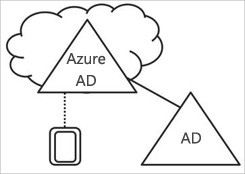
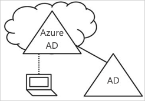
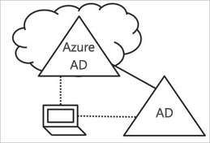

# Worum handelt es sich bei der Geräteverwaltung in Azure Active Directory?

In einer Welt, in der Mobilität und die Cloud an erster Stelle stehen, ermöglicht Azure Active Directory (Azure AD) das einmalige Anmelden an Geräten, Apps und Diensten an jedem Ort. Aufgrund der steigenden Zahl von Geräten, etwa in Form von „Bring Your Own Device“ (BYOD), gelten für IT-Spezialisten zwei gegensätzliche Zielsetzungen:

- Schaffen von Bedingungen für Endbenutzer, unter denen sie an jedem Ort und zu jeder Zeit produktiv sein können
- Lückenloses Schützen der Assets eines Unternehmens

Über Geräte erhalten Ihre Benutzer Zugriff auf Ihre Unternehmensressourcen. Zum Schutz der Unternehmensressourcen möchten Sie als IT-Administrator Kontrolle über diese Geräte haben. So können Sie sicherstellen, dass Ihre Benutzer auf Ihre Ressourcen über Geräte zugreifen, die Ihren Standards für Sicherheit und Konformität entsprechen.

Die Geräteverwaltung stellt zudem die Grundlage für [gerätebasierten bedingten Zugriff](../conditional-access/require-managed-devices.md) dar. Mit dem gerätebasierten bedingten Zugriff können Sie sicherstellen, dass nur mit verwalteten Geräten auf Ressourcen in Ihrer Umgebung zugegriffen werden kann.

In diesem Artikel wird erläutert, wie die Geräteverwaltung in Azure Active Directory funktioniert.

> [!VIDEO https://www.youtube.com/embed/NeezfKhomQU]

## Steuern der Geräte über Azure AD

Um ein Gerät über Azure AD zu steuern, haben Sie zwei Möglichkeiten:

- Registrieren
- Einbinden

Durch **Registrieren** eines Geräts bei Azure AD können Sie die Identität des Geräts verwalten. Wenn ein Gerät registriert wird, stellt Azure AD Device Registration eine Identität für das Gerät bereit, die bei der Anmeldung eines Benutzers bei Azure AD zum Authentifizieren des Geräts dient. Sie können die Identität zum Aktivieren oder Deaktivieren eines Geräts verwenden.

In Kombination mit einer Lösung für die Verwaltung mobiler Geräte, wie z.B. Microsoft Intune, werden die Geräteattribute in Azure AD mit zusätzlichen Informationen über das Gerät aktualisiert. So können Sie Regeln für den bedingten Zugriff erstellen, die erzwingen, dass der Zugriff von Geräten Ihren Standards für Sicherheit und Kompatibilität entspricht. Weitere Informationen zum Registrieren von Geräten in Microsoft Intune finden Sie unter [Was ist die Geräteregistrierung?](https://docs.microsoft.com/intune/device-enrollment).

Das **Einbinden** eines Geräts stellt eine Erweiterung der Registrierung eines Geräts dar. Das bedeutet, Sie profitieren von allen Vorteilen der Registrierung eines Geräts, und darüber hinaus wird der lokale Status des Geräts geändert. Durch Änderung des lokalen Status können sich Ihre Benutzer an einem Gerät anstatt mit einem persönlichen Konto mit einem Geschäfts-, Schul- oder Unikonto anmelden.

## Bei Azure AD registrierte Geräte

Ziel von bei Azure AD registrierten Geräten ist die Bereitstellung der Unterstützung für das **Bring Your Own Device (BYOD)**-Szenario. In diesem Szenario kann ein Benutzer auf die über Azure Active Directory gesteuerten Ressourcen Ihres Unternehmens über ein persönliches Gerät zugreifen.  

Der Zugriff basiert auf einem Geschäfts-, Schul- oder Unikonto, das auf dem Gerät eingegeben wurde.  
Unter Windows 10 können Benutzer beispielsweise ein Geschäfts-, Schul- oder Unikonto auf einem Personalcomputer, Tablet oder Telefon hinzufügen.  
Wenn ein Benutzer ein Geschäfts-, Schul- oder Unikonto hinzugefügt hat, ist das Gerät in Azure AD und optional in dem von Ihrem Unternehmen konfigurierten System für die Verwaltung mobiler Geräte registriert.
Benutzer Ihres Unternehmens können einem persönlichen Gerät einfach ein Geschäfts-, Schul- oder Unikonto hinzufügen:

- Beim erstmaligen Zugriff auf eine Unternehmensanwendung
- Manuell über das Menü **Einstellungen** unter Windows 10

Sie können bei Azure AD registrierte Geräte für Windows 10, iOS, Android und macOS konfigurieren.

## In Azure AD eingebundene Geräte

Ziel von in Azure AD eingebundenen Geräten ist die Vereinfachung folgender Elemente:

- Windows-Bereitstellungen unternehmenseigener Geräte
- Zugriff auf Unternehmens-Apps und Unternehmensressourcen über jegliche Windows-Geräte
- Cloudbasierte Verwaltung von unternehmenseigenen Geräten

Azure AD Join kann mit einer der folgenden Methoden bereitgestellt werden:

- [Windows Autopilot](https://docs.microsoft.com/windows/deployment/windows-autopilot/windows-10-autopilot)
- [Massenbereitstellung](https://docs.microsoft.com/intune/windows-bulk-enroll)
- [Self-service-Erfahrung](azuread-joined-devices-frx.md)

**Azure AD Join** ist für Organisationen gedacht, die in erster Linie Clouddienste verwenden und die lokale Infrastruktur reduzieren möchten, oder solche, die über gar keine lokale Infrastruktur verfügen. Es gibt keine Einschränkung bezüglich der Größe oder dem Typ von Organisationen, die Azure AD Join bereitstellen können. Azure AD Join funktioniert auch in einer Hybridumgebung gut, da es den Zugriff auf Apps und Ressourcen ermöglicht, egal ob in der Cloud oder vor Ort.

Die Implementierung von in Azure AD eingebundenen Geräten bietet die folgenden Vorteile:

- **Einmaliges Anmelden (SSO)** bei Ihren in Azure verwalteten SaaS-Apps und -Diensten. Für Benutzer werden beim Zugriff auf Arbeitsressourcen keine zusätzlichen Authentifizierungsaufforderungen angezeigt. Die SSO-Funktionalität ist auch dann verfügbar, wenn Ihre Benutzer nicht mit dem Domänennetzwerk verbunden sind.
- **Für Unternehmen geeignetes Roaming** von Benutzereinstellungen auf allen eingebundenen Geräten. Benutzer müssen keine Verbindung mit einem Microsoft-Konto (z.B. Hotmail) herstellen, um geräteübergreifende Einstellungen zu sehen.
- **Zugriff auf Windows Store für Unternehmen** über ein Azure AD-Konto. Ihre Benutzer können aus einem Bestand von durch das Unternehmen vorausgewählten Anwendungen auswählen.
- Unterstützung von **Windows Hello** für einen sicheren und komfortablen Zugriff auf Arbeitsressourcen.
- **Einschränkung des Zugriffs** auf Apps nur über die Geräte, die die Konformitätsrichtlinie erfüllen.

- **Nahtloser Zugriff auf lokale Ressourcen**, wenn das Gerät über Sichtverbindung mit dem lokalen Domänencontroller verfügt.

Azure AD Join ist zwar hauptsächlich für Unternehmen vorgesehen, die über keine lokale Windows Server Active Directory-Infrastruktur verfügen, kann aber auch in folgenden Szenarios verwendet werden:

- Sie möchten mit Azure AD und einer Lösung für die Verwaltung mobiler Geräte wie Intune zu einer cloudbasierten Infrastruktur wechseln.
- Sie können keinen lokalen Domänenbeitritt verwenden, z.B. wenn Sie mobile Geräte wie Tablets und Telefone steuern möchten.
- Benutzer müssen hauptsächlich auf Office 365 oder andere in Azure AD integrierte SaaS-Apps zugreifen.
- Sie möchten eine Gruppe von Benutzern in Azure AD anstatt in Active Directory verwalten. Dies können z.B. Saisonkräfte, Auftragnehmer oder Studenten sein.
- Sie möchten Beitrittsfunktionen für Mitarbeiter in entfernten Niederlassungen mit eingeschränkter lokaler Infrastruktur bereitstellen.

Sie können in Azure AD eingebundene Geräte für Windows 10-Geräte konfigurieren.

## In Azure AD eingebundene Hybridgeräte

Seit über zehn Jahren verwenden viele Unternehmen den Domänenbeitritt für das lokale Active Directory, um Folgendes zu ermöglichen:

- Verwaltung unternehmenseigener Geräte über einen zentralen Ort für IT-Abteilungen
- Anmeldung von Benutzern bei Geräten mit ihrem Geschäfts-, Schul- oder Unikonto in Active Directory

Unternehmen mit einem lokalen Fußabdruck nutzen normalerweise Verfahren für die Imageerstellung, um Geräte bereitzustellen, und häufig **System Center Configuration Manager (SCCM)** oder **Gruppenrichtlinien** für die Verwaltung der Geräte.

Wenn Ihre Umgebung über einen lokalen AD-Fußabdruck verfügt und Sie zudem die Funktionen von Azure Active Directory nutzen möchten, können Sie in Azure AD eingebundene Hybridgeräte implementieren. Hierbei handelt es sich um Geräte, die in Ihre lokale Active Directory-Instanz eingebunden und dafür registriert sind.

Verwenden Sie in Azure AD eingebundene Hybridgeräte in folgenden Fällen:

- Auf den Geräten sind Win32-Apps bereitgestellt, die die Active Directory-Authentifizierung für Computer benötigen.
- Sie benötigen Gruppenrichtlinien, um Geräte zu verwalten.
- Sie möchten weiterhin Lösungen für die Imageerstellung verwenden, um Geräte für Ihre Mitarbeiter zu konfigurieren.

Sie können in Azure AD eingebundene Hybridgeräte für Windows 10-Geräte und kompatible Geräte, z.B. mit Windows 8 und Windows 7, konfigurieren.

## Zusammenfassung

Mit der Geräteverwaltung in Azure AD haben Sie folgende Möglichkeiten:

- Vereinfachen des Prozesses zum Steuern von Geräten über Azure AD
- Benutzerfreundlicher Zugriff auf die cloudbasierten Ressourcen Ihres Unternehmens für Ihre Benutzer

Als Faustregel sollten Sie Folgendes verwenden:

- Bei Azure AD registrierte Geräte:
   - Für persönliche Geräte
   - Manuelles Registrieren von Geräten für Azure AD
- In Azure AD eingebundene Geräte:
   - Für Geräte, die im Besitz Ihrer Organisation sind
   - Für Geräte, die **nicht** in eine lokale AD-Instanz eingebunden sind
   - Manuelles Registrieren von Geräten für Azure AD
   - Ändern des lokalen Status eines Geräts
- In Azure AD eingebundene Hybridgeräte für Geräte, die in ein lokales AD eingebunden sind
   - Für Geräte, die im Besitz Ihrer Organisation sind
   - Für Geräte, die in eine lokale AD-Instanz eingebunden sind
   - Automatisches Registrieren von Geräten für Azure AD
   - Ändern des lokalen Status eines Geräts

## Lizenzanforderungen

[!INCLUDE [Active Directory P1 license](../../../includes/active-directory-p1-license.md)]

## Nächste Schritte

- Einen Überblick über die Verwaltung von Geräten im Azure-Portal finden Sie unter [Managing devices using the Azure portal - preview](device-management-azure-portal.md) (Verwalten von Geräten mit dem Azure-Portal – Vorschauversion).
- Weitere Informationen zum gerätebasierten bedingten Zugriff finden Sie unter [Konfigurieren des gerätebasierten bedingten Zugriffs für Azure Active Directory](../conditional-access/require-managed-devices.md).
- Einrichtung:
   - Informationen zu in Azure Active Directory registrierten Windows 10-Geräten finden Sie unter [How to configure Azure Active Directory registered Windows 10 devices](../user-help/device-management-azuread-registered-devices-windows10-setup.md) (Konfigurieren von in Azure Active Directory registrierten Windows 10-Geräten).
   - Informationen zu in Azure Active Directory eingebundenen Geräten finden Sie unter [How to configure Azure Active Directory joined devices](../user-help/device-management-azuread-joined-devices-setup.md) (Konfigurieren von in Azure Active Directory eingebundenen Geräten).
   - Informationen zu in Azure AD eingebundenen Hybridgeräten finden Sie unter [Planen der Implementierung einer Azure Active Directory-Hybrideinbindung](hybrid-azuread-join-plan.md).
