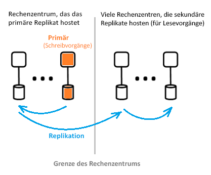

# Was ist die Azure Active Directory-Architektur?
Mit Azure Active Directory (Azure AD) können Sie den Zugriff auf Azure-Dienste und Ressourcen für Ihre Benutzer sicher verwalten. In Azure AD ist eine vollständige Suite mit Funktionen zur Identitätsverwaltung enthalten. Weitere Informationen zu Azure AD-Features finden Sie unter [Was ist Azure Active Directory?](active-directory-whatis.md).

Mit Azure AD können Sie Benutzer und Gruppen erstellen und verwalten und Berechtigungen zum Zulassen und Verweigern des Zugriffs auf Unternehmensressourcen aktivieren. Informationen zur Identitätsverwaltung finden Sie unter [Grundlagen der Identitätsverwaltung in Azure](active-directory-whatis.md).

## Azure AD-Architektur
Die geografisch verteilte Architektur von Azure AD bietet umfassende Funktionen für Überwachung, automatisierte Umleitungen, Failover und die Wiederherstellung, um die unternehmensweite Verfügbarkeit und die Leistung für Kunden sicherzustellen.

In diesem Artikel werden die folgenden Architekturelemente behandelt:
 *  Design der Dienstarchitektur
 *  Benutzerfreundlichkeit 
 *  Fortlaufende Verfügbarkeit
 *  Rechenzentren

### Design der Dienstarchitektur
Zum Erstellen eines zugänglichen und verwendbaren Systems mit umfassenden Daten werden am häufigsten unabhängige Bausteine oder Skalierungseinheiten für die Azure AD-Datenschicht verwendet. Skalierungseinheiten werden als *Partitionen* bezeichnet. 

Die Datenschicht verfügt über mehrere Front-End-Dienste, über die Lese-/Schreibfunktionen bereitgestellt werden. Im folgenden Diagramm ist dargestellt, wie die Komponenten einer Partition mit einem Verzeichnis in geografisch verteilten Rechenzentren bereitgestellt werden. 

  

Die Komponenten der Azure AD-Architektur enthalten ein primäres Replikat und sekundäre Replikate.

**Primäres Replikat**

Das *primäre Replikat* empfängt alle *Schreibvorgänge* für die Partition, zu der es gehört. Jeder Schreibvorgang wird sofort auf einem sekundären Replikat in einem anderen Rechenzentrum repliziert, bevor die Erfolgsmeldung an den Aufrufer zurückgegeben wird, um für Schreibvorgänge eine Georedundanz sicherzustellen.

**Sekundäre Replikate**

Alle *Lesevorgänge* des Verzeichnisses werden über *sekundäre Replikate* abgewickelt, bei denen es sich um Rechenzentren handelt, die physisch auf verschiedene geografische Regionen verteilt sind. Es gibt viele sekundäre Replikate, weil die Daten asynchron repliziert werden. Lesevorgänge des Verzeichnisses, z.B. Authentifizierungsanforderungen, werden über Rechenzentren abgewickelt, die sich in der Nähe der Kunden befinden. Die sekundären Replikate sind für die Skalierbarkeit der Lesevorgänge zuständig.

### Skalierbarkeit

Die Skalierbarkeit ist die Fähigkeit eines Diensts zur Erweiterung, um wachsende Anforderungen an die Leistung zu erfüllen. Die Skalierbarkeit von Schreibvorgängen wird durch das Partitionieren der Daten erreicht. Die Skalierbarkeit von Lesevorgängen wird erreicht, indem Daten von einer Partition auf mehreren sekundären Replikaten weltweit repliziert werden.

Anforderungen von Verzeichnisanwendungen werden an das Rechenzentrum geleitet, die physisch am wenigsten weit entfernt sind. Schreibvorgänge werden transparent an das primäre Replikat umgeleitet, um für eine Lese-/Schreibkonsistenz zu sorgen. Mit sekundären Replikaten wird die Skalierung von Partitionen erheblich erweitert, da von den Verzeichnissen größtenteils Lesevorgänge bereitgestellt werden.

Für Verzeichnisanwendungen wird eine Verbindung mit den Rechenzentren in der Nähe hergestellt. Diese Verbindung führt zu einer Verbesserung der Leistung, sodass eine horizontale Skalierung möglich ist. Da eine Verzeichnispartition über viele sekundäre Replikate verfügen kann, können sekundäre Replikate näher an den Verzeichnisclients angeordnet werden. Nur interne Verzeichnisdienstkomponenten, die sehr schreibintensiv sind, zielen direkt auf das aktive primäre Replikat ab.

### Fortlaufende Verfügbarkeit

Anhand der Verfügbarkeit (bzw. Betriebszeit) wird definiert, inwiefern ein System ohne Unterbrechungen betrieben werden kann. Der Schlüssel zur hohen Verfügbarkeit von Azure AD liegt darin, dass die Dienste Datenverkehr schnell in mehrere geografisch verteilte Rechenzentren verlagern können. Jedes Rechenzentrum ist unabhängig, sodass Fehlermodi ohne Korrelation möglich sind.

Der Partitionsentwurf von Azure AD ist im Vergleich mit dem AD-Unternehmensentwurf einfach. Es wird ein Entwurf mit nur einem Master verwendet, der über einen sorgfältig orchestrierten und deterministischen Failoverprozess für primäre Replikate verfügt.

**Fehlertoleranz**

Ein System weist eine höhere Verfügbarkeit auf, wenn es gegenüber Hardware-, Netzwerk- und Softwareausfällen tolerant ist. Für jede Partition im Verzeichnis ist ein hoch verfügbares Masterreplikat vorhanden: das primäre Replikat. Auf diesem Replikat werden nur Schreibvorgänge für die Partition durchgeführt. Dieses Replikat wird fortlaufend und eingehend überwacht, und Schreibvorgänge können sofort auf ein anderes Replikat verlagert werden (das dann zum neuen primären Replikat wird), wenn ein Fehler erkannt wird. Während des Failovers kann es zu einem Ausfall von Schreibvorgängen kommen, der meist ein bis zwei Minuten dauert. Die Lesevorgänge sind während dieses Zeitraums nicht beeinträchtigt.

Für Lesevorgänge (deren Zahl die Schreibvorgänge weit übersteigt) werden nur sekundäre Replikate verwendet. Da sekundäre Replikate idempotent sind, kann der Verlust eines Replikats auf einer Partition leicht kompensiert werden, indem die Lesevorgänge auf ein anderes Replikat verlagert werden (normalerweise in demselben Rechenzentrum).

**Dauerhaftigkeit von Daten**

Bevor ein Schreibvorgang bestätigt wird, erfolgt dafür ein dauerhafter Commit in mindestens zwei Rechenzentren. Hierfür wird für den Schreibvorgang zuerst auf dem primären Replikat ein Commit durchgeführt, und anschließend wird er sofort in mindestens einem anderen Rechenzentrum repliziert. Mit dieser Schreibaktion wird sichergestellt, dass in einer Notfallsituation ein potenzieller Ausfall des Rechenzentrums, auf dem das primäre Replikat gehostet wird, nicht zu Datenverlust führt.

In Azure AD wird ein RTO-Wert ([Recovery Time Objective](https://en.wikipedia.org/wiki/Recovery_time_objective)) von null verwendet, damit bei Failovern keine Daten verloren gehen. Dies umfasst:
-  Tokenausstellung und Verzeichnislesevorgänge
-  Nur RTO-Wert von 5 Minuten für Verzeichnisschreibvorgänge

### Rechenzentren

Die Replikate von Azure AD werden in Rechenzentren gespeichert, die weltweit verteilt sind. Weitere Informationen finden Sie unter [Azure-Rechenzentren](https://azure.microsoft.com/overview/datacenters).

Azure AD wird basierend auf Rechenzentren mit den folgenden Merkmalen betrieben:

 * Authentifizierung, Graph und andere AD-Dienste sind hinter dem Gatewaydienst angeordnet. Das Gateway verwaltet den Lastenausgleich dieser Dienste. Es wird automatisch ein Failover durchgeführt, wenn mit transaktionalen Integritätstests fehlerhafte Server erkannt werden. Basierend auf diesen Integritätstests wird Datenverkehr vom Gateway dynamisch an fehlerfreie Rechenzentren weitergeleitet.
 * Für *Lesevorgänge* verfügt das Verzeichnis über sekundäre Replikate und entsprechende Front-End-Dienste in einer Aktiv/Aktiv-Konfiguration, die in mehreren Rechenzentren betrieben wird. Wenn ein gesamtes Rechenzentrum ausfällt, wird der Datenverkehr automatisch an ein anderes Rechenzentrum weitergeleitet.
 *  Für *Schreibvorgänge* führt das Verzeichnis für primäre Replikate (Master) ein Failover für alle Rechenzentren durch, indem Schritte für geplante Failover (neues primäres Replikat wird mit altem primärem Replikat synchronisiert) oder Notfallfailover ausgeführt werden. Die Dauerhaftigkeit der Daten wird erreicht, indem ein Commit in mindestens zwei Rechenzentren repliziert wird.

**Datenkonsistenz**

Das Verzeichnismodell lautet „Letztliche Konsistenz“. Ein typisches Problem mit verteilten Systemen mit asynchroner Replikation ist, dass die Daten, die von einem „bestimmten“ Replikat zurückgegeben werden, unter Umständen nicht aktuell sind. 

Azure AD bietet Lese-/Schreibkonsistenz für Anwendungen, die auf ein sekundäres Replikat abzielen, indem die zugehörigen Schreibvorgänge an das primäre Replikat weitergeleitet und synchron dazu die Schreibvorgänge zurück auf das sekundäre Replikat verschoben werden.

Anwendungsschreibvorgänge, für die die Graph-API von Azure AD verwendet wird, werden in Bezug auf die Beibehaltung der Affinität mit einem Verzeichnisreplikat für Schreib-/Lesekonsistenz abstrahiert. Der Graph-Dienst von Azure AD verfügt über eine logische Sitzung mit einer Affinität mit einem sekundären Replikat, das für Lesevorgänge verwendet wird. Die Affinität wird in einem „Replikattoken“ erfasst, das vom Graphdienst mithilfe eines verteilten Cache zwischengespeichert wird. Dieses Token wird dann für nachfolgende Vorgänge in derselben logischen Sitzung verwendet. 

 >[!NOTE]
 >Schreibvorgänge werden sofort auf dem sekundären Replikat repliziert, für das die Lesevorgänge der logischen Sitzung ausgestellt wurden.
 >

**Sicherungsschutz**

Das Verzeichnis implementiert anstelle des endgültigen Löschens das vorläufige Löschen für Benutzer und Mandanten, um eine einfache Wiederherstellung zu ermöglichen, falls Daten von einem Kunden versehentlich gelöscht werden. Wenn Ihr Mandantenadministrator Benutzer versehentlich löscht, kann der Vorgang leicht rückgängig gemacht werden, und die gelöschten Benutzer können wiederhergestellt werden. 

Azure AD implementiert tägliche Sicherungen aller Daten und kann die Daten so autoritativ wiederherstellen, falls es zu logischen Löschungen oder Beschädigungen kommt. Für die Datenschicht werden Fehlerbehebungscodes verwendet, damit eine Überprüfung auf Fehler durchgeführt werden kann und bestimmte Arten von Datenträgerfehlern automatisch behoben werden können.

**Metriken und Überwachungen**

Zum Ausführen eines Hochverfügbarkeitsdiensts sind professionelle Metriken und Überwachungsfunktionen erforderlich. Azure AD führt eine fortlaufende Analyse durch und meldet wichtige Metriken zur Dienstintegrität und Erfolgskriterien für die einzelnen Dienste. Außerdem erfolgt eine fortlaufende Entwicklung und Optimierung von Metriken sowie die Überwachung und Warnungsbereitstellung für jedes Szenario – in jedem Azure AD-Dienst und übergreifend für alle Dienste.

Falls ein Azure AD-Dienst nicht wie erwartet funktioniert, werden sofort Maßnahmen ergriffen, um die Funktionalität so schnell wie möglich wiederherzustellen. Die wichtigste Metrik, die von Azure AD nachverfolgt wird, lautet: Wie schnell können Probleme mit der Livewebsite erkannt und für Kunden behoben werden. Wir investieren in hohem Maße in die Überwachung und Warnungen, um die Erkennungsdauer zu verringern (Ziel: weniger als 5 Minuten), und in die Betriebsbereitschaft, um die Lösungsdauer zu verringern (Ziel: weniger als 30 Minuten).

**Sichere Vorgänge**

Kontrolleinrichtungen werden für den Betrieb, z.B. Multi-Factor Authentication (MFA) für alle Vorgänge, verwendet, und außerdem werden für alle Vorgänge Überprüfungen durchgeführt. Darüber hinaus wird ein Just-in-Time-System zur Erhöhung von Rechten eingesetzt, um den benötigten temporären Zugriff für alle betrieblichen Aufgaben fortlaufend je nach Bedarf gewähren zu können. Weitere Informationen finden Sie unter [Die vertrauenswürdige Cloud](https://azure.microsoft.com/support/trust-center).

## Nächste Schritte
[Entwicklerhandbuch zu Azure Active Directory](https://docs.microsoft.com/azure/active-directory/develop/active-directory-developers-guide)

