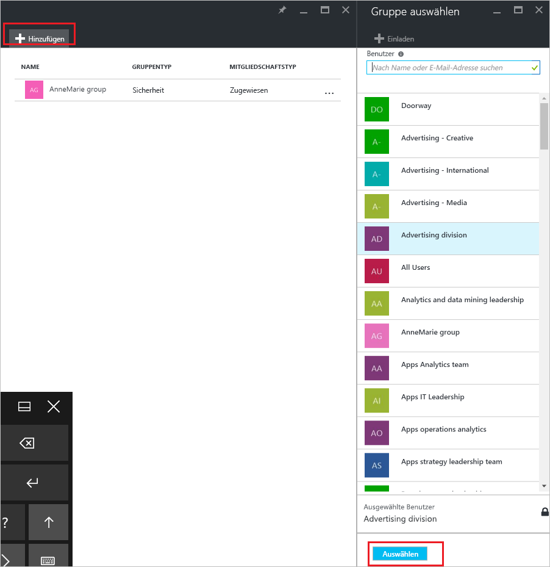
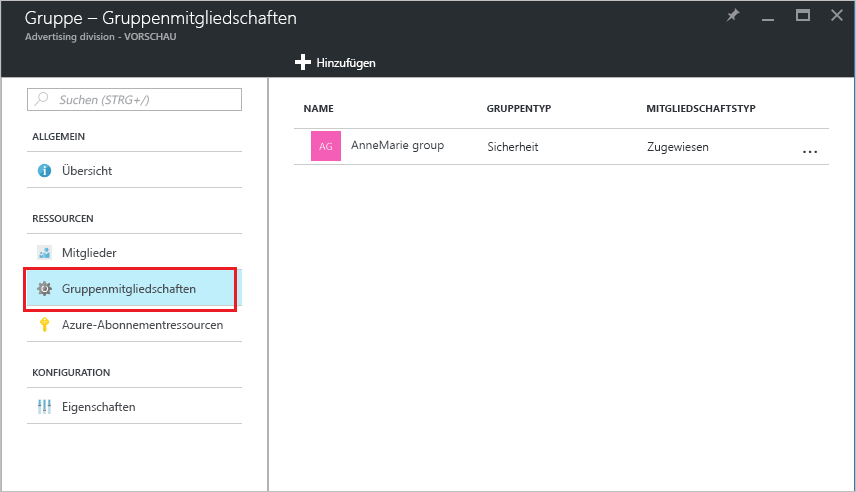

# Gewusst wie: Hinzufügen oder Entfernen einer Gruppe zu bzw. aus einer anderen Gruppe in Azure Active Directory
In diesem Artikel erfahren Sie mehr zum Hinzufügen oder Entfernen einer Gruppe zu bzw. aus einer anderen Gruppe in Azure Active Directory.

>[!Note]
>Wenn Sie die übergeordnete Gruppe löschen möchten, finden Sie Informationen dazu unter [Aktualisieren oder Löschen einer Gruppe und ihre Mitglieder](active-directory-groups-delete-group.md).

## Hinzufügen einer Gruppe zu einer anderen Gruppe
Sie können eine bestehende Sicherheitsgruppe zu einer anderen bestehenden Sicherheitsgruppe hinzufügen (dieser Vorgang wird auch als Schachteln von Gruppen bezeichnet), indem Sie eine Mitgliedergruppe (Untergruppe) und eine übergeordnete Gruppe erstellen. Die Mitgliedergruppe übernimmt die Attribute und Eigenschaften der übergeordneten Gruppe, wodurch Sie Zeit bei der Konfiguration sparen.

>[!Important]
>Folgendes wird derzeit nicht unterstützt:<ul><li>Hinzufügen von Sicherheitsgruppen zu Office 365-Gruppen</li><li>Hinzufügen von Office 365-Gruppen zu Sicherheitsgruppen oder anderen Office 365-Gruppen</li><li>Zuweisen von Apps zu geschachtelten Gruppen</li><li>Anwenden von Lizenzen auf geschachtelte Gruppen</li></ul>

### So fügen Sie eine Gruppe als Mitglied zu einer anderen Gruppe hinzu

1. Melden Sie sich mit dem Konto eines globalen Administrators für das Verzeichnis beim [Azure-Portal](https://portal.azure.com) an.

2. Wählen Sie **Azure Active Directory** und dann **Gruppen** aus.

3. Suchen und wählen Sie auf der Seite **Gruppen – Alle Gruppen** die Gruppe aus, die Mitglied einer anderen Gruppe werden soll. In dieser Übung verwenden wir die Gruppe **MDM-Richtlinie – Westen**.

    >[!Note]
    >Sie können Ihre Gruppe als Mitglied jeweils nur zu einer Gruppe hinzufügen. Darüber hinaus filtert das Feld **Gruppe auswählen** die Anzeige basierend auf einem Abgleich Ihrer Eingabe mit einem beliebigen Teil eines Benutzer- oder Gerätenamens. Platzhalterzeichen werden jedoch nicht unterstützt.

    

4. Wählen Sie auf der Seite **MDM-Richtlinie – Westen – Gruppenmitgliedschaften** die Option **Gruppenmitgliedschaften**, klicken Sie auf **Hinzufügen**, suchen Sie die Gruppe, zu der Ihre Gruppe gehören soll, und wählen Sie dann **Auswählen**. In dieser Übung verwenden wir die Gruppe **MDM-Richtlinie – Alle Org**.

    Die Gruppe **MDM-Richtlinie – Westen** ist nun Mitglied der Gruppe **MDM-Richtlinie – Alle Org.** und übernimmt alle Eigenschaften und Konfigurationen der Gruppe „MDM-Richtlinie – Alle Org.“.

    

5. Lesen Sie die Seite **MDM-Richtlinien – Westen – Gruppenmitgliedschaften**, um die Gruppe-Mitglied-Beziehung anzuzeigen.

    

6. Für eine detailliertere Ansicht der Gruppe-Mitglied-Beziehung wählen Sie die Gruppe (**MDM-Richtlinie – Alle Org.**) und schauen Sie sich die Seitendetails **MDM-Richtlinie – Westen** an.

    

## Entfernen einer Gruppe aus einer anderen Gruppe
Sie können eine vorhandene Sicherheitsgruppe aus einer anderen Sicherheitsgruppe entfernen. Das Entfernen der Gruppe entfernt jedoch auch alle geerbten Attribute und Eigenschaften für die Mitglieder.

### Entfernen einer Mitgliedergruppe aus einer anderen Gruppe
1. Suchen und wählen Sie auf der Seite **Gruppen – Alle Gruppen** die Gruppe aus, die als Mitglied einer anderen Gruppe entfernt werden soll. In dieser Übung verwenden wir wieder die Gruppe **MDM-Richtlinie – Westen**.

2. Klicken Sie auf der Übersichtsseite für **MDM-Richtlinie – Westen** auf **Gruppenmitgliedschaften**.

    

3. Wählen Sie die Gruppe **MDM-Richtlinie – Alle Org.** auf der Seite **MDM-Richtlinie – Westen – Gruppenmitgliedschaften** aus, und wählen Sie dann **Entfernen** auf der Detailseite **MDM-Richtlinie – Westen**.

    

## Zusätzliche Informationen
Diese Artikel enthalten zusätzliche Informationen zu Azure Active Directory.

- [Anzeigen Ihrer Gruppen und Mitglieder](active-directory-groups-view-azure-portal.md)

- [Erstellen einer einfachen Gruppe und Hinzufügen von Mitgliedern](active-directory-groups-create-azure-portal.md)

- [Hinzufügen oder Entfernen von Mitgliedern zu/aus einer Gruppe](active-directory-groups-members-azure-portal.md)

- [Bearbeiten Ihrer Gruppeneinstellungen](active-directory-groups-settings-azure-portal.md)

- [Verwenden einer Gruppe zum Verwalten des Zugriffs auf SaaS-Anwendungen](../users-groups-roles/groups-saasapps.md)

- [Szenarien, Einschränkungen und bekannte Probleme mit der Verwendung von Gruppen zum Verwalten der Lizenzierung in Azure Active Directory](../users-groups-roles/licensing-group-advanced.md#limitations-and-known-issues)
