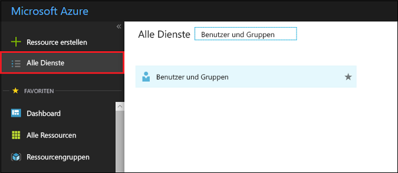
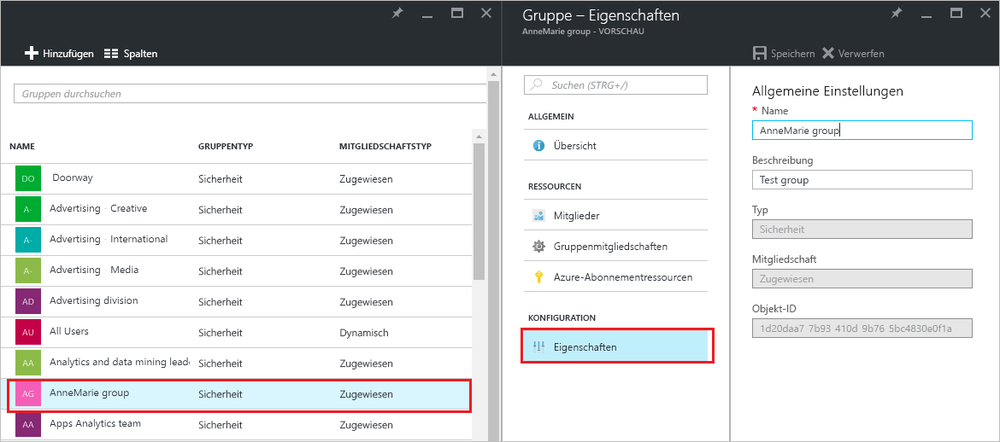
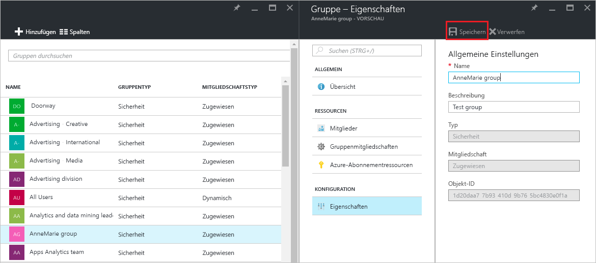

# Verwalten der Einstellungen für eine Gruppe in Azure Active Directory
In diesem Artikel wird erläutert, wie Sie die Einstellungen für eine Gruppe in Azure Active Directory (Azure AD) ändern.

## Wie finde und ändere ich die Einstellungen?
1. Melden Sie sich beim [Azure AD Admin Center](https://aad.portal.azure.com) mit dem Konto eines globalen Administrators für das Verzeichnis an.
2. Wählen Sie **Alle Dienste** aus, geben Sie **Benutzer und Gruppen** in das Textfeld ein, und drücken Sie die **EINGABETASTE**.

   
3. Wählen Sie auf dem Blatt **Benutzer und Gruppen** die Option **Alle Gruppen** aus.

   
4. Wählen Sie auf dem Blatt **Benutzer und Gruppen** eine Gruppe aus.
5. Wählen Sie auf dem Blatt **Gruppe – *Gruppenname*** die Option **Eigenschaften** aus.

   
6. Klicken Sie auf **Speichern**, wenn Sie die Bearbeitung der Eigenschaften für die Gruppe abgeschlossen haben.    

   

## Nächste Schritte
Diese Artikel enthalten zusätzliche Informationen zu Azure Active Directory.

* [Anzeigen vorhandener Gruppen](active-directory-groups-view-azure-portal.md)
* [Erstellen einer neuen Gruppe und Hinzufügen von Mitgliedern](active-directory-groups-create-azure-portal.md)
* [Verwalten der Mitglieder einer Gruppe](active-directory-groups-members-azure-portal.md)
* [Verwalten der Mitgliedschaften einer Gruppe](active-directory-groups-membership-azure-portal.md)
* [Verwalten dynamischer Regeln für Benutzer in einer Gruppe](../users-groups-roles/groups-dynamic-membership.md)
