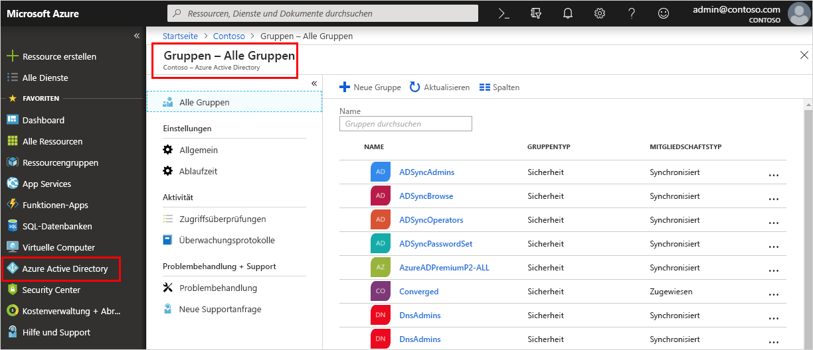

<!--As a brand-new Azure AD administrator, I need to view my organization’s groups along with the assigned members, so I can manage permissions to apps and services for people in my organization-->

# Schnellstart: Anzeigen der Gruppen und Mitglieder Ihrer Organisation in Azure Active Directory
Über das Azure-Portal können Sie die vorhandenen Gruppen und Gruppenmitglieder Ihrer Organisation anzeigen. Gruppen werden zur Verwaltung von Benutzern (Mitgliedern) verwendet, die alle die gleichen Zugriffsstufen und Berechtigungen für potenziell eingeschränkte Apps und Dienste benötigen.

In dieser Schnellstartanleitung zeigen Sie alle vorhandenen Gruppen Ihrer Organisation sowie die zugewiesenen Mitglieder an.

Wenn Sie kein Azure-Abonnement besitzen, können Sie ein [kostenloses Konto](https://azure.microsoft.com/free/) erstellen, bevor Sie beginnen. 

## Voraussetzungen
Bevor Sie beginnen, müssen Sie den folgenden Schritt ausführen:

- Erstellen eines Azure Active Directory-Mandanten. Weitere Informationen finden Sie unter [Quickstart: Access Azure Active Directory to create a new tenant](active-directory-access-create-new-tenant.md) (Schnellstart: Zugreifen auf Azure Active Directory zum Erstellen eines neuen Mandanten).

## Melden Sie sich auf dem Azure-Portal an.
Melden Sie sich mit dem globalen Administratorkonto für das Verzeichnis beim [Azure-Portal](https://portal.azure.com/) an.

## Erstellen einer neuen Gruppe 
Erstellen Sie eine neue Gruppe mit dem Namen _MDM policy - West_ (MDM-Richtlinie – Westen). Weitere Informationen zum Erstellen einer Gruppe finden Sie unter [Erstellen einer Gruppe und Hinzufügen von Mitgliedern in Azure Active Directory](active-directory-groups-create-azure-portal.md).

1. Wählen Sie **Azure Active Directory** > **Gruppen** und anschließend **Neue Gruppe** aus.

2. Geben Sie auf der Seite **Gruppe** die entsprechenden Informationen ein:
    
    - **Gruppentyp:** Wählen Sie **Sicherheit**.
    
    - **Gruppenname:** Geben Sie _MDM policy – West_ (MDM-Richtlinie – Westen) ein.
    
    - **Mitgliedschaftstyp:** Wählen Sie **Zugewiesen**.

3. Klicken Sie auf **Erstellen**.

## Erstellen eines neuen Benutzers
Erstellen Sie einen neuen Benutzer mit dem Namen _Alain Charon_. Ein Benutzer muss vorhanden sein, bevor Sie ihn als Mitglied einer Gruppe hinzufügen können. Weitere Informationen zum Erstellen eines Benutzers finden Sie unter [Schnellstart: Hinzufügen neuer Benutzer in Azure Active Directory](add-users-azure-active-directory.md).

1. Wählen Sie **Azure Active Directory** > **Benutzer** und anschließend **Neuer Benutzer** aus.

2. Geben Sie auf der Seite **Benutzer** die entsprechenden Informationen ein:

    - **Name:** Geben Sie _Alain Charon_ ein.

    - **Benutzername:** Geben Sie *alain\@contoso.com* ein.

3. Kopieren Sie das automatisch generierte Kennwort im Feld **Kennwort**, und wählen Sie dann **Erstellen** aus.

## Hinzufügen eines Gruppenmitglieds
Sie haben eine Gruppe und einen Benutzer erstellt und können nun _Alain Charon_ als Mitglied zur Gruppe _MDM policy - West_ (MDM-Richtlinie – Westen) hinzufügen. Weitere Informationen zum Hinzufügen von Gruppenmitgliedern finden Sie unter [Verwalten der Gruppenmitgliedschaft für Benutzer in Ihrem Azure Active Directory-Mandanten](active-directory-groups-members-azure-portal.md).

1. Klicken Sie auf **Azure Active Directory** > **Gruppen**.

2. Suchen Sie auf der Seite **Gruppen – Alle Gruppen** nach der Gruppe **MDM policy - West** (MDM-Richtlinie – Westen), und wählen Sie sie aus.

3. Wählen Sie auf der Übersichtsseite für **MDM policy - West** (MDM-Richtlinie – Westen) im Bereich **Verwalten** die Option **Mitglieder** aus.

4. Wählen Sie **Mitglieder hinzufügen**, suchen Sie nach **Alain Charon**, und wählen Sie den Benutzer aus.

5. Wählen Sie **Auswählen**.

## Anzeigen aller Gruppen
Im Azure-Portal auf der Seite **Gruppen – Alle Gruppen** können Sie alle Gruppen Ihrer Organisation anzeigen.

- Wählen Sie **Azure Active Directory** > **Gruppen** aus.

    Die Seite **Gruppen – Alle Gruppen** wird mit all Ihren aktiven Gruppen angezeigt.

    

## Suchen der Gruppe
Suchen Sie auf der Seite **Gruppen – Alle Gruppen** die Gruppe **MDM policy - West** (MDM-Richtlinie – Westen).

1. Geben Sie auf der Seite **Gruppen – Alle Gruppen** den Begriff _MDM_ ins Feld **Suche** ein.

    Die Suchergebnisse, einschließlich der Gruppe _MDM policy - West_ (MDM-Richtlinie – Westen), werden unterhalb des Felds **Suche** angezeigt.

    

3. Wählen Sie die Gruppe **MDM policy – West** (MDM-Richtlinie – Westen) aus.

4. Zeigen Sie die Gruppeninformationen (u.a. die Anzahl von Mitgliedern dieser Gruppe) auf der Übersichtsseite für **MDM policy - West** (MDM-Richtlinie – Westen) an.

    

## Anzeigen von Gruppenmitgliedern
Sie haben die Gruppe gefunden und können nun alle zugewiesenen Mitglieder anzeigen.

- Wählen Sie im Bereich **Verwalten** die Option **Mitglieder** aus, und überprüfen Sie dann die vollständige Liste der dieser bestimmten Gruppe zugewiesenen Mitgliedernamen, einschließlich _Alain Charon_.

    

## Bereinigen von Ressourcen
Diese Gruppe wird in mehreren Anleitungen verwendet, die im Abschnitt **Anleitungen** dieser Dokumentation verfügbar sind. Wenn Sie diese Gruppe jedoch nicht verwenden möchten, können Sie sie und die zugewiesenen Mitglieder mithilfe der folgenden Schritte löschen:

1. Suchen Sie auf der Seite **Gruppen – Alle Gruppen** nach der Gruppe **MDM policy - West** (MDM-Richtlinie – Westen).

2.  Wählen Sie die Gruppe **MDM policy – West** (MDM-Richtlinie – Westen) aus.

    Die Übersichtsseite für **MDM policy - West** (MDM-Richtlinie – Westen) wird angezeigt.

3. Klicken Sie auf **Löschen**.

    Die Gruppe und die zugewiesenen Mitglieder werden gelöscht.

    

    >[!Important]
    >Dadurch wird nicht der Benutzer Alain Charon, sondern nur seine Mitgliedschaft in der gelöschten Gruppe gelöscht.

## Nächste Schritte
Fahren Sie mit dem nächsten Artikel fort, um zu erfahren, wie Sie Ihrem Azure AD-Verzeichnis ein Abonnement zuordnen.

> [!div class="nextstepaction"]
> [Zuordnen eines Azure-Abonnements](active-directory-how-subscriptions-associated-directory.md)
