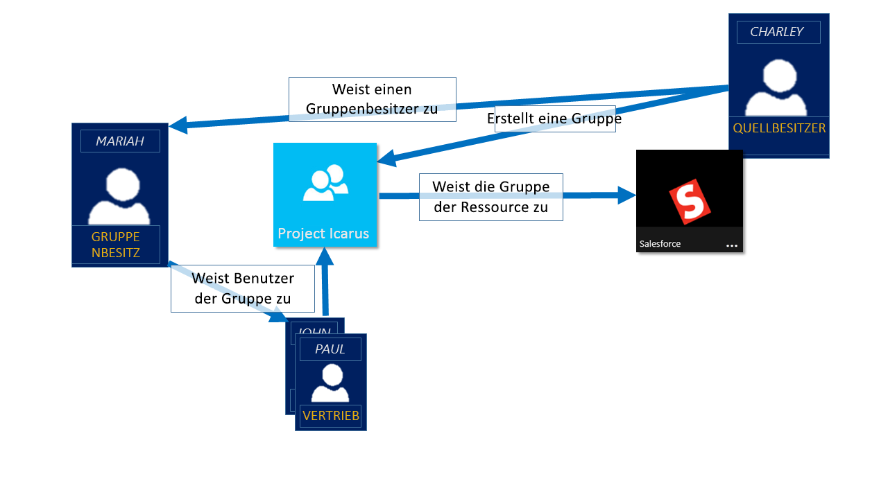
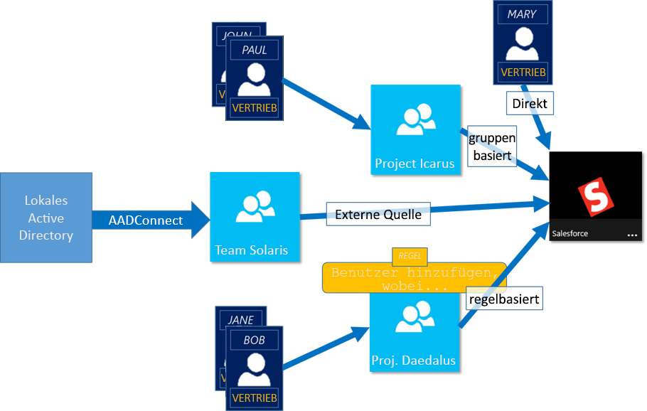

# Informationen zur Zugriffsverwaltung mithilfe von Azure Active Directory-Gruppen
Azure Active Directory (Azure AD) unterstützt Sie beim Verwalten Ihrer cloudbasierten und lokalen Apps und Ihrer Ressourcen mithilfe der Gruppen in Ihrer Organisation. Ihre Ressourcen können Teil des Verzeichnisses sein, wie im Fall von Berechtigungen zum Verwalten von Objekten mithilfe von Rollen im Verzeichnis, oder externe Ressourcen, etwa SaaS-Apps (Software-as-a-Service), Azure-Dienste, SharePoint-Websites und lokale Ressourcen.

>[!NOTE]
>Um Azure Active Directory verwenden zu können, benötigen Sie ein Azure-Konto. Wenn Sie nicht über ein Azure-Konto verfügen, können Sie sich [für ein kostenloses Azure-Konto registrieren](https://azure.microsoft.com/free/).

## Wie funktioniert die Zugriffsverwaltung in Azure AD?
Mit Azure AD können Sie Zugriff auf die Ressourcen Ihrer Organisation gewähren, indem Sie Zugriffsrechte für einen einzelnen Benutzer oder eine gesamte Azure AD-Gruppe erteilen. Mithilfe von Gruppen kann der Ressourcenbesitzer (oder Azure AD-Verzeichnisbesitzer) allen Mitgliedern der Gruppe Zugriffsberechtigungen gewähren, statt die Berechtigungen einzeln erteilen zu müssen. Der Ressourcen- oder Verzeichnisbesitzer kann darüber hinaus Verwaltungsrechte für die Mitgliederliste an eine andere Person übertragen, etwa den Abteilungsleiter oder einen Helpdesk-Administrator, und dadurch dieser Person das Hinzufügen und Entfernen von Mitgliedern nach Bedarf ermöglichen. Weitere Informationen zum Verwalten von Gruppenbesitzern finden Sie unter [Verwalten von Besitzern einer Gruppe](active-directory-accessmanagement-managing-group-owners.md).

## Möglichkeiten zum Zuweisen von Zugriffsrechten
Es gibt vier Möglichkeiten zum Zuweisen von Ressourcenzugriffsrechten zu Ihren Benutzern:

- **Direkte Zuweisung:** Der Ressourcenbesitzer weist den Benutzer direkt der Ressource zu.

- **Gruppenzuweisung:** Der Ressourcenbesitzer weist der Ressource eine Azure AD-Gruppe zu. Dadurch erhalten automatisch alle Gruppenmitglieder Zugriff auf die Ressource. Die Gruppenmitgliedschaft wird vom Gruppenbesitzer und vom Ressourcenbesitzer verwaltet, sodass beide Besitzer Mitglieder zur Gruppe hinzufügen bzw. daraus entfernen können. Weitere Informationen zum Hinzufügen oder Entfernen der Gruppenmitgliedschaft finden Sie unter [Verwalten, welchen Gruppen eine Gruppe in Ihrem Azure Active Directory-Mandanten angehört](active-directory-groups-membership-azure-portal.md). 

- **Regelbasierte Zuweisung:** Der Ressourcenbesitzer erstellt eine Gruppe und verwendet eine Regel, um festzulegen, welche Benutzer einer bestimmten Ressource zugewiesen werden. Die Regel basiert auf Attributen, die einzelnen Benutzern zugewiesen sind. Der Ressourcenbesitzer verwaltet die Regel und bestimmt, welche Attribute und Werte zum Zulassen des Zugriffs auf die Ressource erforderlich sind. Weitere Informationen finden Sie unter [Erstellen einer dynamischen Gruppe und Überprüfen des Status](../users-groups-roles/groups-create-rule.md).

    Sie können außerdem dieses kurze Video mit einer kurzen Erläuterung zum Erstellen und Verwenden von dynamischen Gruppen anschauen:

    >[!VIDEO https://channel9.msdn.com/Series/Azure-Active-Directory-Videos-Demos/Azure-AD--Introduction-to-Dynamic-Memberships-for-Groups/player]

- **Zuweisung durch eine externe Autorität:** Der Zugriff stammt aus einer externen Quelle, etwa einem lokalen Verzeichnis oder einer SaaS-App. In diesem Fall weist der Ressourcenbesitzer eine Gruppe zu, um Zugriff auf die Ressource zu ermöglichen, und die externe Quelle verwaltet die Gruppenmitglieder.

   

## Können Benutzer Gruppen beitreten, ohne zugewiesen zu werden?
Der Gruppenbesitzer kann zulassen, dass Benutzer ihre Gruppen selbst ermitteln, denen sie beitreten möchten, statt sie zuzuweisen. Der Besitzer kann die Gruppe auch so einrichten, dass sie alle beitretenden Benutzer automatisch akzeptiert oder dass eine Genehmigung erforderlich ist.

Nachdem ein Benutzer den Beitritt zu einer Gruppe angefordert hat, wird diese Anforderung an den Gruppenbesitzer weitergeleitet. Wenn es erforderlich ist, kann der Besitzer die Anforderung genehmigen, und der Benutzer wird über die Gruppenmitgliedschaft informiert. Wenn jedoch mehrere Besitzer vorhanden sind und einer davon die Anforderung ablehnt, wird der Benutzer zwar benachrichtigt, aber nicht zur Gruppe hinzugefügt. Weitere Informationen sowie Anweisungen dazu, wie Sie Benutzern die Anforderung des Gruppenbeitritts ermöglichen, finden Sie unter [Einrichten von Azure Active Directory für die Self-Service-Gruppenverwaltung](../users-groups-roles/groups-self-service-management.md).

## Nächste Schritte
Dieser Artikel enthielt eine kurze Einführung zur Zugriffsverwaltung mithilfe von Gruppen. Nun können Sie mit der Verwaltung Ihrer Ressourcen und Apps beginnen.

- [Erstellen einer neuen Gruppe mit Azure Active Directory](active-directory-groups-create-azure-portal.md) oder [Erstellen und Verwalten einer neuen Gruppe mit PowerShell-Cmdlets](../users-groups-roles/groups-settings-v2-cmdlets.md)

- [Verwenden von Gruppen zum Zuweisen des Zugriffs auf eine integrierte SaaS-App](../users-groups-roles/groups-saasapps.md)

- [Synchronisieren einer lokalen Gruppe in Azure mittels Azure AD Connect](../hybrid/whatis-hybrid-identity.md)