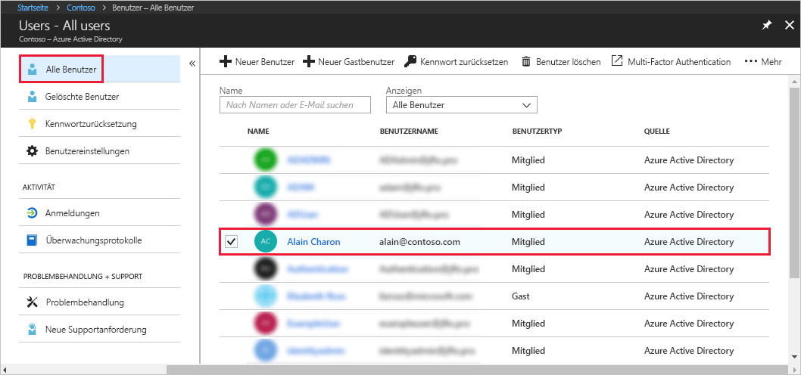

# Zuweisen eines Benutzers zu Administratorrollen in Azure Active Directory
In diesem Artikel wird erläutert, wie Sie einem Benutzer in Azure Active Directory eine Administratorrolle zuweisen. Informationen dazu, wie Sie neue Benutzer in Ihrer Organisation hinzufügen, finden Sie unter [Hinzufügen neuer Benutzer zu Azure Active Directory](../add-users-azure-active-directory.md). Hinzugefügte Benutzer verfügen nicht standardmäßig über Administratorberechtigungen, aber Sie können ihnen jederzeit Rollen zuweisen.

## Zuweisen einer Rolle zu einem Benutzer
1. Melden Sie sich am [Azure-Portal](https://portal.azure.com) mit einem Konto an, das als globaler Administrator oder Administrator mit einer privilegierten Rolle für das Verzeichnis konfiguriert ist.

2. Wählen Sie **Azure Active Directory**, **Benutzer** und dann in der Liste einen bestimmten Benutzer aus.

    

3. Wählen Sie für den ausgewählten Benutzer **Verzeichnisrolle**, **Rolle hinzufügen** und dann die entsprechenden Administratorrollen in der Liste mit den **Verzeichnisrollen** aus, z.B. **Administrator für bedingten Zugriff**. Weitere Informationen zu Administratorrollen finden Sie unter [Zuweisen von Administratorrollen in Azure AD](../users-groups-roles/directory-assign-admin-roles.md). 

    

1. Wählen Sie **Auswählen**, um zu speichern.

## Nächste Schritte
* [Schnellstart: Hinzufügen oder Löschen von Benutzern in Azure Active Directory](add-users-azure-active-directory.md)
* [Verwalten von Benutzerprofilen](active-directory-users-profile-azure-portal.md)
* [Hinzufügen von Gastbenutzern aus einem anderen Verzeichnis](../b2b/what-is-b2b.md) 
* [Zuweisen eines Benutzers zu einer Rolle in Azure AD](active-directory-users-assign-role-azure-portal.md)
* [Wiederherstellen eines gelöschten Benutzers](active-directory-users-restore.md)
