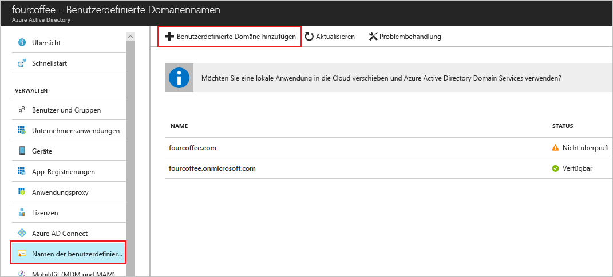

# Hinzufügen Ihres benutzerdefinierten Domänennamens über das Azure Active Directory-Portal
Jeder neue Azure AD-Mandant verfügt über einen anfänglichen Domänennamen im Format „*domänenname*.onmicrosoft.com“. Der anfängliche Domänenname kann nicht geändert oder gelöscht werden, Sie können der Liste jedoch die Namen Ihrer Organisation hinzufügen. Durch das Hinzufügen von benutzerdefinierten Domänennamen können Sie Benutzernamen erstellen, die Ihren Benutzern vertraut sind, beispielsweise *alain@contoso.com*.

## Voraussetzungen
Bevor Sie einen benutzerdefinierten Domänennamen hinzufügen können, müssen Sie Ihren Domänennamen bei einer Domänenregistrierungsstelle erstellen. Eine Liste von anerkannten Domänenregistrierungsstellen finden Sie unter [ICANN-Accredited Registrars](https://www.icann.org/registrar-reports/accredited-list.html) (Von der ICANN anerkannte Registrierungsstellen).

## Erstellen Ihres Verzeichnisses in Azure AD
Nachdem Sie Ihren Domänennamen erhalten haben, können Sie Ihr erstes Azure AD-Verzeichnis erstellen.

1. Melden Sie sich mit einem Konto mit der Rolle **Besitzer** für das Abonnement beim [Azure-Portal](https://portal.azure.com/) für Ihr Verzeichnis an, und wählen Sie dann **Azure Active Directory** aus. Weitere Informationen zu Abonnementrollen finden Sie unter [Administratorrollen für klassische Abonnements, Azure RBAC-Rollen und Azure AD-Administratorrollen](../../role-based-access-control/rbac-and-directory-admin-roles.md#azure-rbac-roles).

    

    >[!TIP]
    > Wenn Sie planen, Ihre lokale Windows Server AD mit Azure AD in einen Verbund aufzunehmen, müssen Sie das Kontrollkästchen **Ich möchte diese Domäne für einmaliges Anmelden bei meinem lokalen Active Directory konfigurieren** aktivieren, wenn Sie zum Synchronisieren Ihrer Verzeichnisse das Tool Azure AD Connect ausführen. Sie müssen den Domänennamen, den Sie für den Verbund mit Ihrem lokalen Verzeichnis im Schritt **Azure AD-Domäne** des Assistenten auswählen, außerdem registrieren. In [dieser Anleitung](../hybrid/how-to-connect-install-custom.md#verify-the-azure-ad-domain-selected-for-federation) wird veranschaulicht, wie der Schritt im Assistenten aussieht. Falls Sie nicht über das Azure AD Connect-Tool verfügen, können Sie es [hier herunterladen](https://go.microsoft.com/fwlink/?LinkId=615771).

2. Erstellen Sie Ihr neues Verzeichnis, indem Sie den Schritten unter [Create a new tenant for your organization](active-directory-access-create-new-tenant.md#create-a-new-tenant-for-your-organization) (Erstellen eines neuen Mandanten für Ihre Organisation) folgen.

    >[!Important]
    >Die Person, die den Mandanten erstellt, wird automatisch zum globalen Administrator für diesen Mandanten. Der globale Administrator kann dem Mandanten weitere Administratoren hinzufügen.

## Hinzufügen des benutzerdefinierten Domänennamens zu Azure AD
Nachdem Sie Ihr Verzeichnis erstellt haben, können Sie Ihren benutzerdefinierten Domänennamen hinzufügen.

1. Wählen Sie **Benutzerdefinierte Domänennamen** und dann **Benutzerdefinierte Domäne hinzufügen** aus.

    

2. Geben Sie den neuen Domänennamen Ihrer Organisation in das Feld **Benutzerdefinierter Domänenname** ein (z. B. _contoso.com_), und klicken Sie dann auf **Domäne hinzufügen**.

    Die nicht überprüfte Domäne wird hinzugefügt, und die Seite für **Contoso** mit Ihren DNS-Informationen wird angezeigt.

    >[!Important]
    >Der Domänenname muss „.com“, „.net“ oder eine andere Erweiterung der obersten Ebene enthalten, damit dies korrekt funktioniert.

    

4. Kopieren Sie die DNS-Informationen von der Seite für **Contoso**, beispielsweise MS=ms64983159.

    

## Hinzufügen Ihrer DNS-Informationen in der Domänenregistrierungsstelle
Nachdem Sie Azure AD Ihren benutzerdefinierten Domänennamen hinzugefügt haben, müssen Sie zur Domänenregistrierungsstelle zurückkehren und die DNS-Informationen von Azure AD aus der kopierten TXT-Datei hinzufügen. Durch die Erstellung dieses TXT-Eintrags wird der Besitz des Domänennamens überprüft.

-  Kehren Sie zur Domänenregistrierungsstelle zurück, erstellen Sie auf Grundlage der kopierten DNS-Informationen einen neuen TXT-Eintrag für Ihre Domäne, legen Sie die **Gültigkeitsdauer** (TTL) auf 3.600 Sekunden (60 Minuten) fest, und speichern Sie anschließend die Informationen.

    >[!Important]
    >Sie können beliebig viele Domänennamen registrieren. Jeder Domäne wird jedoch ein eigener TXT-Eintrag von Azure AD zugewiesen. Achten Sie darauf, dass Sie die Informationen aus der TXT-Datei in der Domänenregistrierungsstelle korrekt eingeben. Wenn Sie versehentlich falsche oder doppelte Informationen eingeben, müssen Sie warten, bis die Gültigkeitsdauer (60 Minuten) abgelaufen ist, bevor Sie es erneut versuchen können.

## Überprüfen des benutzerdefinierten Domänennamens
Nachdem Sie Ihren benutzerdefinierten Domänennamen registriert haben, müssen Sie sicherstellen, dass er in Azure AD gültig ist. Die Weitergabe der Informationen von der Domänenregistrierungsstelle an Azure AD kann je nach Registrierungsstelle sofort erfolgen oder einige Tage in Anspruch nehmen.

### So überprüfen Sie Ihren benutzerdefinierten Domänennamen
1. Melden Sie sich mit dem Konto eines globalen Administrators für das Verzeichnis beim [Azure-Portal](https://portal.azure.com/) an.

2. Wählen Sie **Azure Active Directory** und dann **Benutzerdefinierte Domänennamen** aus.

3. Wählen Sie auf der Seite **Fabrikam – Benutzerdefinierte Domänennamen** den benutzerdefinierten Domänennamen **Contoso** aus.

    

4. Klicken Sie auf der Seite für **Contoso** auf **Überprüfen**, um sicherzustellen, dass Ihre benutzerdefinierte Domäne korrekt registriert und für Azure AD gültig ist.

    

## Häufige Probleme bei der Überprüfung
- Versuchen Sie Folgendes, wenn Azure AD einen benutzerdefinierten Domänennamen nicht überprüfen kann:
    - **Warten Sie mindestens eine Stunde, und versuchen Sie es dann noch einmal.** DNS-Einträge müssen weitergegeben (verteilt) werden, bevor Azure AD die Domäne überprüfen kann, und dieser Prozess kann eine Stunde oder auch länger dauern.

    - **Stellen Sie sicher, dass der DNS-Eintrag korrekt ist.** Kehren Sie zur Website der Domänenregistrierungsstelle zurück, und stellen Sie sicher, dass der Eintrag vorhanden ist und mit den von Azure AD bereitgestellten DNS-Eintragsinformationen übereinstimmt.

    Falls Sie den Eintrag auf der Website der Registrierungsstelle nicht aktualisieren können, müssen Sie ihn für eine Person mit den erforderlichen Berechtigungen freigeben, um den Eintrag hinzufügen und seine Richtigkeit überprüfen zu lassen.

- **Stellen Sie sicher, dass der Domänenname nicht bereits in einem anderen Verzeichnis verwendet wird.** Ein Domänenname kann nur in einem Verzeichnis überprüft werden. Falls Ihr Domänenname gerade in einem anderen Verzeichnis überprüft wird, kann er daher nicht auch im neuen Verzeichnis überprüft werden. Um dieses Problem zu beheben, müssen Sie den Domänennamen aus dem alten Verzeichnis löschen. Weitere Informationen zum Löschen von Domänennamen finden Sie unter [Verwalten von benutzerdefinierten Domänennamen](../users-groups-roles/domains-manage.md).

- **Stellen Sie sicher, dass keine nicht verwalteten Power BI-Mandanten vorhanden sind.** Wenn Ihre Benutzer Power BI über die Self-Service-Registrierung aktiviert und einen nicht verwalteten Mandanten für Ihre Organisation erstellt haben, müssen Sie die Verwaltung als interner oder externer Administrator mithilfe von PowerShell übernehmen. Weitere Informationen zum Übernehmen eines nicht verwalteten Verzeichnisses finden Sie unter [Übernehmen eines nicht verwalteten Verzeichnisses als Administrator in Azure Active Directory](../users-groups-roles/domains-admin-takeover.md).

## Nächste Schritte

- Fügen Sie Ihrem Verzeichnis einen weiteren globalen Administrator hinzu. Weitere Informationen finden Sie unter [Zuweisen von Rollen und Administratoren](active-directory-users-assign-role-azure-portal.md).

- Fügen Sie Ihrer Domäne Benutzer hinzu. Weitere Informationen finden Sie unter [Hinzufügen oder Löschen von Benutzern](add-users-azure-active-directory.md).

- Verwalten Sie die Informationen zu Ihrem Domänennamen in Azure AD. Weitere Informationen finden Sie unter [Verwalten von benutzerdefinierten Domänennamen](../users-groups-roles/domains-manage.md).

- Falls Sie lokale Windows Server-Versionen haben, die Sie zusammen mit Azure Active Directory verwenden möchten, gehen Sie wie unter [Integrate your on-premises directories with Azure Active Directory](../connect/active-directory-aadconnect.md) (Integrieren Ihrer lokalen Verzeichnisse in Azure Active Directory) beschrieben vor.
