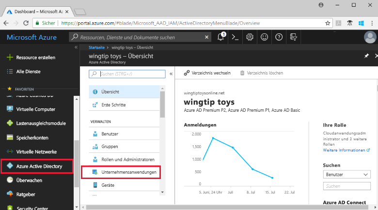
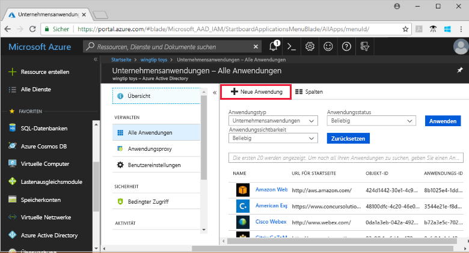
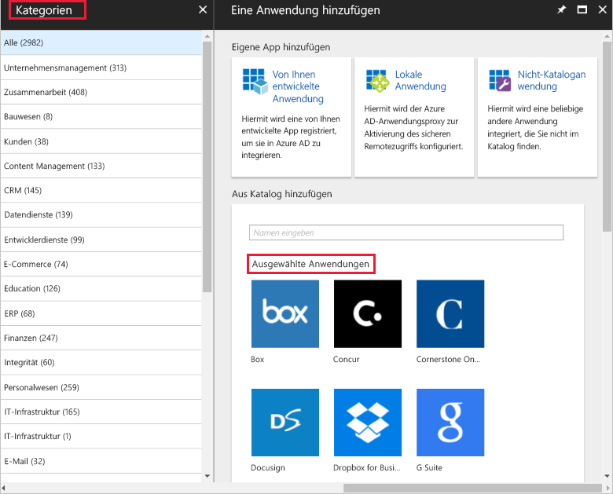
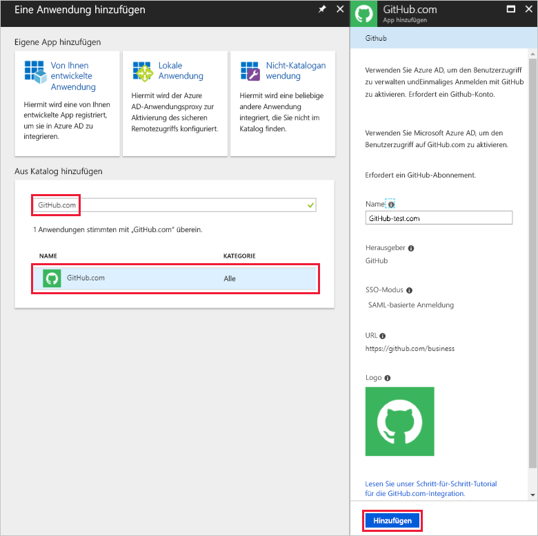
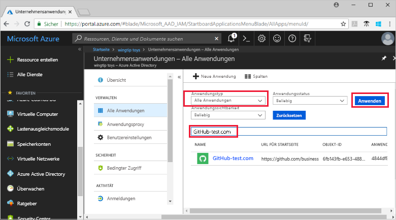
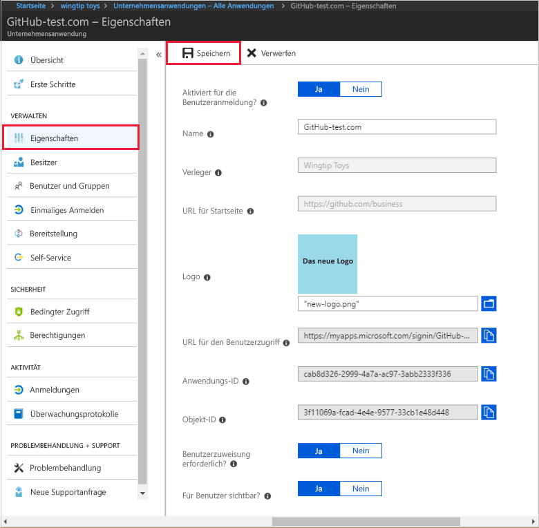
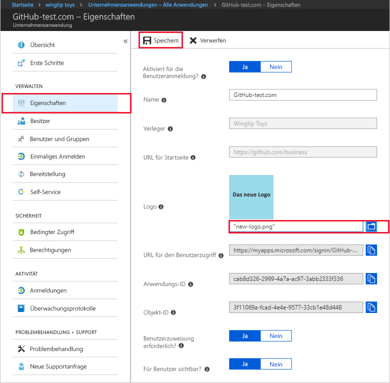

# Schnellstart: Hinzufügen einer Anwendung zu Ihrem Azure Active Directory-Mandanten

Azure Active Directory (Azure AD) enthält einen Katalog mit Tausenden von vorab integrierten Anwendungen. Einige der von Ihrer Organisation verwendeten Anwendungen sind wahrscheinlich im Katalog enthalten. In dieser Schnellstartanleitung wird mithilfe des Azure-Portals eine Kataloganwendung zu Ihrem Azure Active Directory-Mandanten (Azure AD) hinzugefügt.

Nach dem Hinzufügen einer Anwendung zum Azure AD-Mandanten haben Sie folgende Möglichkeiten:

- Verwalten des Benutzerzugriffs auf die Anwendung mit einer Richtlinie für bedingten Zugriff
- Konfigurieren von Benutzern für einmaliges Anmelden bei der Anwendung mit ihren Azure AD-Konten

## Voraussetzungen

Zum Hinzufügen einer Anwendung zu Ihrem Mandanten benötigen Sie Folgendes:

- Ein Azure AD-Abonnement
- Ein Abonnement für Ihre Anwendung, für das einmaliges Anmelden aktiviert ist

Melden Sie sich beim [Azure-Portal](https://portal.azure.com) als globaler Administrator für Ihren Azure AD-Mandanten, als Cloudanwendungsadministrator oder als Anwendungsadministrator an.

Es wird empfohlen, zum Testen der Schritte in diesem Tutorial keine Produktionsumgebung zu verwenden. Wenn Sie keine solche Umgebung besitzen, können Sie eine [einmonatige Testversion anfordern](https://azure.microsoft.com/pricing/free-trial/).

## Hinzufügen einer Anwendung zum Azure AD-Mandanten

So fügen Sie eine Kataloganwendung zu Ihrem Azure AD-Mandanten hinzu:

1. Wählen Sie im [Azure-Portal](https://portal.azure.com) im linken Navigationsbereich **Azure Active Directory** aus.

1. Wählen Sie im Bereich **Azure Active Directory** die Option **Unternehmensanwendungen** aus.

    

1. Der Bereich **Alle Anwendungen** wird mit einer nach dem Zufallsprinzip ausgewählten Gruppe von Anwendungen in Ihrem Azure AD-Mandanten geöffnet. Wählen Sie oben im Bereich **Alle Anwendungen** die Option **Neue Anwendung** aus.

    

1. Im Bereich **Kategorien** werden im Abschnitt **Ausgewählte Anwendungen** Symbole für nach dem Zufallsprinzip ausgewählte Kataloganwendungen angezeigt.  Wenn Sie weitere Anwendungen anzeigen möchten, wählen Sie **Mehr anzeigen** aus. Es wird jedoch nicht empfohlen, auf diese Weise zu suchen, da der Katalog Tausende Anwendungen enthält.

    

1. Geben Sie zum Suchen nach einer Anwendung unter **Aus Katalog hinzufügen** den Namen der hinzuzufügenden Anwendung ein. Wählen Sie die Anwendung in den Ergebnissen aus, und klicken Sie auf **Hinzufügen**. Das folgende Beispiel zeigt das Formular **App hinzufügen**, das nach dem Suchvorgang für GitHub.com angezeigt wird.

    

1. Im anwendungsspezifischen Formular können Sie Informationen zu Eigenschaften ändern. Beispielsweise können Sie den Namen der Anwendung entsprechend den Anforderungen Ihres Unternehmens bearbeiten. In diesem Beispiel wird der Name **GitHub-test** verwendet.

1. Wenn Sie die gewünschten Änderungen an den Eigenschaften vorgenommen haben, wählen Sie **Hinzufügen** aus.

1. Eine Seite mit ersten Schritten und den Optionen zum Konfigurieren der Anwendung für Ihre Organisation wird angezeigt.

Das Hinzufügen der Anwendung ist abgeschlossen. Sie können nun eine Pause einlegen. In den nächsten Abschnitten wird gezeigt, wie Sie das Logo ändern und weitere Eigenschaften für Ihre Anwendung bearbeiten.

## Suchen nach Ihrer Azure AD-Mandantenanwendung

Angenommen, Sie mussten den Vorgang unterbrechen und möchten nun die Konfiguration Ihrer Anwendung fortsetzen. Zunächst müssen Sie die Anwendung suchen.

1. Wählen Sie im **[Azure-Portal](https://portal.azure.com)** im linken Navigationsbereich **Azure Active Directory** aus.

1. Wählen Sie im Bereich **Azure Active Directory** die Option **Unternehmensanwendungen** aus.

1. Wählen Sie im Dropdownmenü **Anwendungstyp** die Option **Alle Anwendungen** und dann **Anwenden** aus. Weitere Informationen zu den Anzeigeoptionen finden Sie unter [Anzeigen aller von Ihnen verwaltbaren Unternehmens-Apps in Azure Active Directory](view-applications-portal.md).

1. Sie können jetzt eine Liste aller Anwendungen im Azure AD-Mandanten anzeigen. Die Liste enthält eine nach dem Zufallsprinzip ausgewählte Gruppe. Wählen Sie zum Anzeigen weiterer Anwendungen mehrmals die Option **Mehr anzeigen** aus.

1. Um schnell eine Anwendung in Ihrem Mandanten zu finden, geben Sie den Anwendungsnamen ins Suchfeld ein, und wählen Sie **Anwenden** aus. In diesem Beispiel wird nach der zuvor hinzugefügten Anwendung „GitHub-test“ gesucht.

    

## Konfigurieren der Eigenschaften für die Benutzeranmeldung

Sie haben die Anwendung gefunden. Nun können Sie sie öffnen und Anwendungseigenschaften konfigurieren.

So bearbeiten Sie die Anwendungseigenschaften:

1. Wählen Sie die Anwendung aus, um sie zu öffnen.
1. Wählen Sie **Eigenschaften** aus, um den Bereich „Eigenschaften“ zur Bearbeitung zu öffnen.

    

1. Nehmen Sie sich einen Moment Zeit, um die Anmeldeoptionen nachzuvollziehen. Die Optionen bestimmen, wie die der Anwendung zugewiesenen bzw. nicht zugewiesenen Benutzer sich bei der Anwendung anmelden können. Darüber hinaus legen die Optionen fest, ob ein Benutzer die Anwendung im Zugriffsbereich sehen kann.

    - Mit **Aktiviert für die Benutzeranmeldung?** wird festgelegt, ob sich Benutzer, die der Anwendung zugewiesen sind, anmelden können.
    - Mit **Benutzerzuweisung erforderlich?** wird festgelegt, ob sich Benutzer, die der Anwendung nicht zugewiesen sind, anmelden können.
    - Mit **Für Benutzer sichtbar?** wird festgelegt, ob für der App zugewiesene Benutzer die Anwendung im Zugriffsbereich und im Office 365-Startfeld angezeigt wird.

1. Anhand der folgenden Tabellen können Sie die Optionen auswählen, die am besten für Ihre Anforderungen geeignet sind:

   - Verhalten für **zugewiesene** Benutzer:

       | Eigenschafteneinstellungen der Anwendung | | | Zugewiesene Benutzer | |
       |---|---|---|---|---|
       | Aktiviert für die Benutzeranmeldung? | Benutzerzuweisung erforderlich? | Für Benutzer sichtbar? | Können sich zugewiesene Benutzer anmelden? | Können zugewiesene Benutzer die Anwendung sehen?* |
       | Ja | Ja | Ja | Ja | Ja  |
       | Ja | Ja | no  | Ja | no   |
       | Ja | no  | Ja | Ja | Ja  |
       | Ja | no  | no  | Ja | no   |
       | no  | Ja | Ja | no  | no   |
       | no  | Ja | no  | no  | no   |
       | no  | no  | Ja | no  | no   |
       | no  | no  | no  | no  | no   |

   - Verhalten für **nicht zugewiesene** Benutzer:

       | Eigenschafteneinstellungen der Anwendung | | | Nicht zugewiesene Benutzer | |
       |---|---|---|---|---|
       | Aktiviert für die Benutzeranmeldung? | Benutzerzuweisung erforderlich? | Für Benutzer sichtbar? | Können sich nicht zugewiesene Benutzer anmelden? | Können nicht zugewiesene Benutzer die Anwendung sehen?* |
       | Ja | Ja | Ja | no  | no   |
       | Ja | Ja | no  | no  | no   |
       | Ja | no  | Ja | Ja | no   |
       | Ja | no  | no  | Ja | no   |
       | no  | Ja | Ja | no  | no   |
       | no  | Ja | no  | no  | no   |
       | no  | no  | Ja | no  | no   |
       | no  | no  | no  | no  | no   |

     *Kann der Benutzer die Anwendung im Zugriffsbereich und im Office 365-App-Startfeld sehen?

## Verwenden eines benutzerdefinierten Logos

So verwenden Sie ein benutzerdefiniertes Logo:

1. Erstellen Sie ein Logo mit 215 x 215 Pixeln, und speichern Sie es im PNG-Format.
1. Da Sie Ihre Anwendung bereits gefunden haben, wählen Sie sie aus.
1. Wählen Sie im linken Bereich **Eigenschaften** aus.
1. Laden Sie das Logo hoch.
1. Wählen Sie abschließend **Speichern** aus.

    

## Nächste Schritte

In dieser Schnellstartanleitung haben Sie erfahren, wie eine Kataloganwendung zu Ihrem Azure AD-Mandanten hinzugefügt wird. Sie haben gelernt, wie Sie die Eigenschaften für eine Anwendung bearbeiten.

Nun können Sie die Anwendung für einmaliges Anmelden konfigurieren.

> [!div class="nextstepaction"]
> [Konfigurieren von einmaligem Anmelden](configure-single-sign-on-portal.md)

