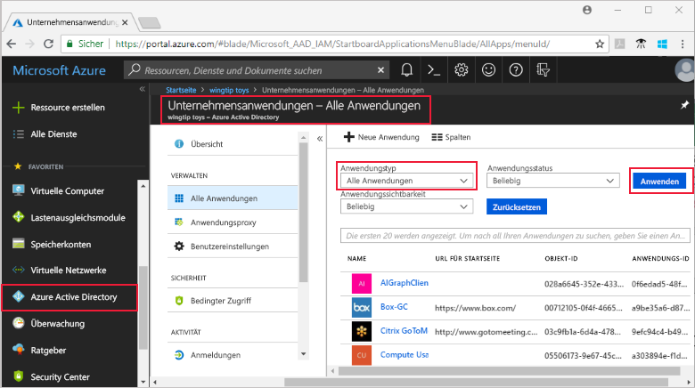
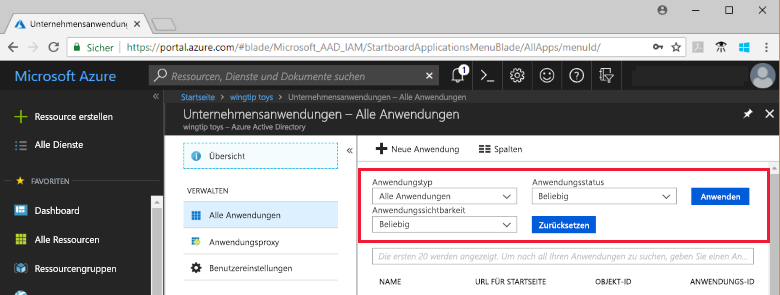

# Anzeigen Ihrer Azure Active Directory-Mandantenanwendungen

In dieser Schnellstartanleitung wird das Azure-Portal verwendet, um die Anwendungen in Ihrem Azure Active Directory-Mandanten (Azure AD) anzuzeigen.

## Voraussetzungen

Um Ergebnisse anzeigen zu können, muss mindestens eine Anwendung in Ihrem Azure AD-Mandanten vorhanden sein. Informationen zum Hinzufügen einer Anwendung finden Sie in der Schnellstartanleitung zum [Hinzufügen einer Anwendung](add-application-portal.md).

Melden Sie sich beim [Azure-Portal](https://portal.azure.com) als globaler Administrator für Ihren Azure AD-Mandanten, als Cloudanwendungsadministrator oder als Anwendungsadministrator an.

## Suchen der Liste der Mandantenanwendungen

Ihre Azure AD-Mandantenanwendungen können im Azure-Portal im Abschnitt **Unternehmens-Apps** angezeigt werden.

So suchen Sie nach Ihren Mandantenanwendungen:

1. Klicken Sie im linken Navigationsbereich des **[Azure-Portals](https://portal.azure.com)** auf **Azure Active Directory**. 

2. Klicken Sie auf dem Blatt „Azure Active Directory“ auf **Unternehmensanwendungen**. 

3. Wählen Sie im Dropdownmenü **Anwendungstyp** die Option **Alle Anwendungen** aus, und klicken Sie auf **Anwenden**. Eine nach dem Zufallsprinzip ausgewählte Gruppe Ihrer Mandantenanwendungen wird angezeigt.

    
   
4. Wenn Sie weitere Anwendungen anzeigen möchten, klicken Sie unten in der Liste auf **Mehr anzeigen**. Abhängig von der Anzahl von Anwendungen in Ihrem Mandanten ist es unter Umständen einfacher, [nach einer bestimmten Anwendung zu suchen](#search-for-a-tenant-application) als durch die Liste zu scrollen.

## Auswählen der Anzeigeoptionen

In diesem Abschnitt wählen Sie die Optionen basierend auf den gesuchten Elementen aus.

1. Sie können die Anwendungen gemäß den Optionen für **Anwendungstyp**, **Anwendungsstatus** und **Anwendungssichtbarkeit** anzeigen. 

    

2. Wählen Sie unter **Anwendungstyp** eine der folgenden Optionen aus:

    - Mit der Option **Unternehmensanwendungen** werden nicht von Microsoft stammende Anwendungen angezeigt.
    - Mit der Option **Microsoft-Anwendungen** werden Microsoft-Anwendungen angezeigt.
    - Mit der Option **Alle Anwendungen** werden nicht von Microsoft stammende Anwendungen und Microsoft-Anwendungen angezeigt.

3. Wählen Sie unter **Anwendungsstatus** die Option **Any** (Alle), **Deaktiviert** oder **Aktiviert** aus. Mit der Option **Any** (Alle) werden sowohl deaktivierte als auch aktivierte Anwendungen angezeigt.

4. Wählen Sie unter **Anwendungssichtbarkeit** die Option **Any** (Alle) oder **Ausgeblendet**. Mit der Option **Ausgeblendet** werden Anwendungen angezeigt, die sich zwar im Mandanten befinden, aber nicht für Benutzer sichtbar sind.

5. Klicken Sie nach dem Auswählen der gewünschten Optionen auf **Anwenden**.
 

## Suchen nach einer Mandantenanwendung

So suchen Sie nach einer bestimmten Anwendung:

1. Wählen Sie im Menü **Anwendungstyp** die Option **Alle Anwendungen** aus, und klicken Sie auf **Anwenden**.

2. Geben Sie den Namen der gewünschten Anwendung ein. Wenn die Anwendung zu Ihrem Azure AD-Mandanten hinzugefügt wurde, wird sie in den Suchergebnissen angezeigt. Dieses Beispiel zeigt, dass GitHub nicht zu den Mandantenanwendungen hinzugefügt wurde.

    

3. Geben Sie die ersten Buchstaben eines Anwendungsnamens ein.  Dieses Beispiel zeigt alle Anwendungen, die mit **Sales** beginnen.

    

## Nächste Schritte

In dieser Schnellstartanleitung haben Sie erfahren, wie Sie die Anwendungen in Ihrem Azure AD-Mandanten anzeigen und wie Sie die Liste der Anwendungen anhand des Typs, des Status und der Sichtbarkeit der Anwendung filtern. Darüber hinaus haben Sie gelernt, wie Sie nach einer bestimmten Anwendung suchen.

Sie haben die gewünschte Anwendung gefunden und können nun [weitere Anwendungen zu Ihrem Mandanten hinzufügen](add-application-portal.md) oder auf die Anwendung klicken, um Eigenschaften und Konfigurationsoptionen anzuzeigen oder zu bearbeiten. Beispielsweise können Sie einmaliges Anmelden konfigurieren. 

> [!div class="nextstepaction"]
> [Konfigurieren von einmaligem Anmelden](configure-single-sign-on-portal.md)

