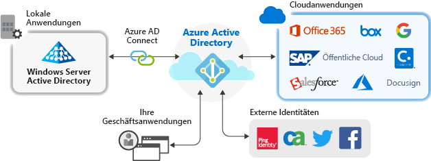

# Anwendungsverwaltung mit Azure Active Directory

Azure Active Directory (Azure AD) bietet einen sicheren und nahtlosen Zugriff auf die Cloud und lokale Anwendungen. Benutzer müssen sich nur einmal anmelden, um auf Office 365 und andere Geschäftsanwendungen von Microsoft, Software-as-a-Service-Anwendungen (SaaS), lokale Anwendungen und branchenspezifische Apps zuzugreifen. Senken Sie Verwaltungskosten durch die Automatisierung der Benutzerbereitstellung. Verwenden Sie die mehrstufige Authentifizierung und Richtlinien für bedingten Zugriff, um sicheren Zugriff auf Anwendungen zu ermöglichen.

## Gründe für die Verwaltung von Anwendungen mit einer Cloudlösung

Organisationen besitzen häufig Hunderte von Anwendungen, die für die Arbeit ihrer Benutzer unerlässlich sind. Der Benutzerzugriff auf diese Anwendungen erfolgt über eine Vielzahl von Geräten und Standorten. Tagtäglich werden neue Anwendungen hinzugefügt und entwickelt. Angesichts dieser Vielzahl an Anwendungen und Zugriffspunkte gewinnt die Verwaltung des Benutzerzugriffs auf alle Anwendungen über eine cloudbasierte Lösung zunehmend an Bedeutung.

## Risikomanagement durch Richtlinien für bedingten Zugriff
In Kombination mit der einmaligen Anmeldung (Single Sign-On, SSO) mit Azure AD bieten Richtlinien für bedingten Zugriff ein hohes Maß an Sicherheit für den Zugriff auf Anwendungen. Zu den Sicherheitsfunktionen zählen der cloudgestützte Identitätsschutz, die risikobasierte Zugriffssteuerung, die native mehrstufige Authentifizierung und Richtlinien für bedingten Zugriff. Durch diese Funktionen können präzise Steuerungsrichtlinien basierend auf Anwendungen oder Gruppen geschaffen werden, die ein höheres Maß an Sicherheit erfordern.

## Produktivitätssteigerung durch einmaliges Anmelden
Die Aktivierung des einmaligen Anmeldens (Single Sign-On, SSO) für verschiedenste Anwendungen und in Office 365 bietet eine optimierte Anmeldung für bestehende Benutzer, da hierdurch die Anzahl von Anmeldeeingabeaufforderungen reduziert wird oder diese gänzlich beseitigt werden. Ohne die Vielzahl an Eingabeaufforderungen oder die Verwaltung mehrerer Kennwörter wirkt die Umgebung des Benutzers ganzheitlicher und weniger verwirrend. Die Unternehmensgruppe kann Zugriffe über Self-Service-Funktionen und dynamische Mitgliedschaften verwalten und genehmigen. Indem Sie den richtigen Personen im Unternehmen die Verwaltung des Zugriffs auf eine Anwendung ermöglichen, erhöhen Sie die Sicherheit des Identitätssystems.

SSO erhöht die Sicherheit. *Ohne einmaliges Anmelden* müssen Administratoren Benutzerkonten für jede einzelne Anwendung erstellen und aktualisieren, was viel Zeit in Anspruch nimmt. Darüber hinaus müssen Benutzer mehrere Sätze von Anmeldeinformationen für den Zugriff auf ihre Anwendungen nachverfolgen. Die Folge: Benutzer neigen dazu, ihre Kennwörter aufzuschreiben oder andere Lösungen zur Kennwortverwaltung zu verwenden, was zu Risiken für die Datensicherheit führt. 

## Beheben von Governance- und Complianceproblemen
Mit Azure AD können Sie Anmeldungen bei Anwendungen durch Berichte überwachen, die SIEM-Tools (Security Information & Event Monitoring) nutzen. Sie können über das Portal oder über APIs auf die Berichte zugreifen. Lassen Sie programmgesteuert überwachen, wer auf Ihre Anwendungen zugreifen darf, und entfernen Sie den Zugriff für inaktive Benutzer durch Zugriffsüberprüfungen.

## Verwalten von Kosten
Durch eine Migration zu Azure AD können Sie Ihre Kosten senken und sich den Aufwand der Verwaltung Ihrer lokalen Infrastruktur ersparen. Azure AD bietet außerdem Self-Service-Zugriff auf Anwendungen, was sowohl Administratoren als auch Benutzern Zeit erspart. Einmaliges Anmelden macht anwendungsspezifische Kennwörter überflüssig. Diese Option für die einmalige Anmeldung spart Kosten für das Zurücksetzen von Kennwörtern für Anwendungen und vermeidet Produktivitätsverluste durch das Abrufen von Kennwörtern.

