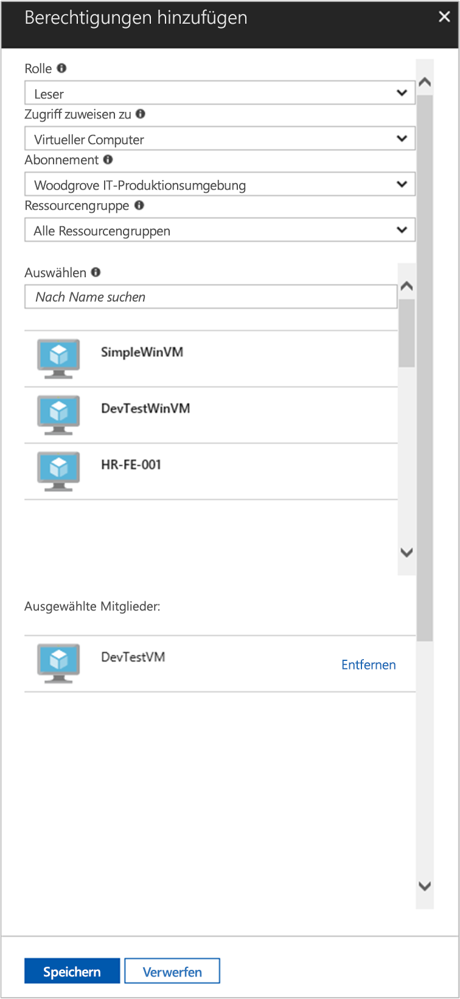

# <a name="use-a-linux-vm-system-assigned-managed-identity-to-access-azure-resource-manager"></a>Verwenden einer systemseitig zugewiesenen verwalteten Identität eines virtuellen Linux-Computers für den Zugriff auf Azure Resource Manager

[!INCLUDE [preview-notice](../../../includes/active-directory-msi-preview-notice.md)]

In dieser Schnellstartanleitung wird gezeigt, wie Sie eine systemseitig zugewiesene Identität eines virtuellen Linux-Computers verwenden, um auf die Azure Resource Manager-API zuzugreifen. Verwaltete Identitäten für Azure-Ressourcen werden von Azure automatisch verwaltet und ermöglichen Ihnen die Authentifizierung für Dienste, die die Azure AD-Authentifizierung unterstützen, ohne dass Sie Anmeldeinformationen in Ihren Code einfügen müssen. Folgendes wird vermittelt:

> [!div class="checklist"]
> * Gewähren des Zugriffs auf eine Ressourcengruppe in Azure Resource Manager für Ihren virtuellen Computer 
> * Abrufen eines Zugriffstokens mithilfe der VM-Identität und Verwenden dieses Zugriffstokens zum Aufrufen von Azure Resource Manager 

## <a name="prerequisites"></a>Voraussetzungen

[!INCLUDE [msi-tut-prereqs](../../../includes/active-directory-msi-tut-prereqs.md)]

## <a name="grant-your-vm-access-to-a-resource-group-in-azure-resource-manager"></a>Gewähren des Zugriffs auf eine Ressourcengruppe in Azure Resource Manager für Ihren virtuellen Computer 

Mithilfe von verwalteten Identitäten für Azure-Ressourcen kann der Code Zugriffstoken zur Authentifizierung von Ressourcen abrufen, die die Azure AD-Authentifizierung unterstützen. Die Azure Resource Manager-API unterstützt die Azure AD-Authentifizierung. Zunächst müssen Sie dieser VM-Identität den Zugriff auf eine Ressource in Azure Resource Manager gewähren. In diesem Fall handelt es sich dabei um die Ressourcengruppe, die den virtuellen Computer enthält.  

1. Navigieren Sie zu der Registerkarte für die **Ressourcengruppen**.
2. Wählen Sie die **Ressourcengruppe** aus, die Sie zuvor erstellt haben.
3. Wechseln Sie im linken Bereich zu **Zugriffssteuerung (IAM)** .
4. Klicken Sie dann auf **Hinzufügen**, um dem virtuellen Computer eine neue Rollenzuweisung hinzuzufügen. Wählen Sie die **Rolle** **Leser** aus.
5. Wählen Sie in der nächsten Dropdownliste für die Option **Zugriff zuweisen zu** die Ressource **Virtueller Computer** aus.
6. Stellen Sie dann sicher, dass in der Dropdownliste **Abonnement** das richtige Abonnement aufgeführt wird. Wählen Sie unter **Ressourcengruppe** die Option **Alle Ressourcengruppen**.
7. Wählen Sie schließlich unter **Auswählen** in der Dropdownliste Ihren virtuellen Linux-Computer aus, und klicken Sie auf **Speichern**.

    

## <a name="get-an-access-token-using-the-vms-system-assigned-managed-identity-and-use-it-to-call-resource-manager"></a>Abrufen eines Zugriffstokens mithilfe der systemseitig zugewiesenen verwalteten Identität des virtuellen Computers und Verwenden dieses Zugriffstokens zum Aufrufen von Resource Manager 

Zum Ausführen dieser Schritte benötigen Sie einen SSH-Client. Wenn Sie Windows verwenden, können Sie den SSH-Client im [Windows-Subsystem für Linux](https://msdn.microsoft.com/commandline/wsl/about) verwenden. Wenn Sie Hilfe beim Konfigurieren der SSH-Clientschlüssel benötigen, lesen Sie die Informationen unter [Vorgehensweise: Verwenden von SSH-Schlüsseln mit Windows in Azure](../../virtual-machines/linux/ssh-from-windows.md) oder [Erstellen und Verwenden eines SSH-Schlüsselpaars (öffentlich und privat) für virtuelle Linux-Computer in Azure](../../virtual-machines/linux/mac-create-ssh-keys.md).

1. Navigieren Sie im Portal zu Ihrem virtuellen Linux-Computer, und klicken Sie in der **Übersicht** auf **Verbinden**.  
2. **Verbinden** Sie den virtuellen Computer mit dem gewünschten SSH-Client. 
3. Übermitteln Sie im Terminalfenster mit `curl` eine Anforderung an den lokalen Endpunkt der verwalteten Identitäten für Azure-Ressourcen, um ein Zugriffstoken für Azure Resource Manager abzurufen.  
 
    Die `curl`-Anforderung für das Zugriffstoken finden Sie weiter unten.  
    
    ```bash
    curl 'http://169.254.169.254/metadata/identity/oauth2/token?api-version=2018-02-01&resource=https://management.azure.com/' -H Metadata:true   
    ```
    
    > [!NOTE]
    > Der Wert des „resource“-Parameters muss exakt mit dem von Azure AD erwarteten Wert übereinstimmen.  Für die Resource Manager-Ressourcen-ID müssen Sie den nachgestellten Schrägstrich im URI verwenden. 
    
    Die Antwort enthält das Zugriffstoken, das Sie für den Zugriff auf Azure Resource Manager benötigen. 
    
    Antwort:  

    ```bash
    {"access_token":"eyJ0eXAiOi...",
    "refresh_token":"",
    "expires_in":"3599",
    "expires_on":"1504130527",
    "not_before":"1504126627",
    "resource":"https://management.azure.com",
    "token_type":"Bearer"} 
    ```
    
    Dieses Zugriffstoken können Sie verwenden, um auf Azure Resource Manager zuzugreifen, beispielsweise um die Details der Ressourcengruppe zu lesen, für die Sie diesem virtuellen Computer zuvor den Zugriff gewährt haben. Ersetzen Sie die Werte von \<ABONNEMENT-ID\>, \<RESSOURCENGRUPPE\> und \<ZUGRIFFSTOKEN\> mit den Werten, die Sie zuvor erstellt haben. 
    
    > [!NOTE]
    > Bei der URL wird die Groß-/Kleinschreibung beachtet. Achten Sie daher darauf, dieselbe Groß- und Kleinschreibung zu verwenden wie zuvor beim Benennen der Ressourcengruppe. Beachten Sie auch den Großbuchstaben „G“ in „resourceGroup“.  
    
    ```bash 
    curl https://management.azure.com/subscriptions/<SUBSCRIPTION ID>/resourceGroups/<RESOURCE GROUP>?api-version=2016-09-01 -H "Authorization: Bearer <ACCESS TOKEN>" 
    ```
    
    Die Antwort enthält die spezifischen Informationen zur Ressourcengruppe:    
    ```bash
    {"id":"/subscriptions/98f51385-2edc-4b79-bed9-7718de4cb861/resourceGroups/DevTest","name":"DevTest","location":"westus","properties":{"provisioningState":"Succeeded"}} 
    ```

## <a name="next-steps"></a>Nächste Schritte

In dieser Schnellstartanleitung haben Sie gelernt, wie Sie eine systemseitig zugewiesene verwaltete Identität verwenden, um auf die Azure Resource Manager-API zuzugreifen.  Weitere Informationen zu Azure Resource Manager finden Sie hier:

> [!div class="nextstepaction"]
>[Azure Resource Manager](/azure/azure-resource-manager/resource-group-overview)
