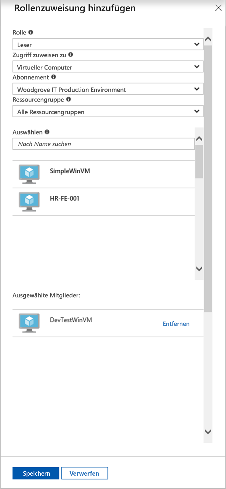

# <a name="use-a-windows-vm-system-assigned-managed-identity-to-access-resource-manager"></a>Verwenden einer systemseitig zugewiesenen verwalteten Identität eines virtuellen Windows-Computers für den Zugriff auf Resource Manager

[!INCLUDE [preview-notice](../../../includes/active-directory-msi-preview-notice.md)]

In dieser Schnellstartanleitung wird gezeigt, wie Sie mit einem virtuellen Windows-Computer, auf dem die systemseitig zugewiesene verwaltete Identität aktiviert ist, auf die Azure Resource Manager-API zugreifen. Verwaltete Identitäten für Azure-Ressourcen werden von Azure automatisch verwaltet und ermöglichen Ihnen die Authentifizierung für Dienste, die die Azure AD-Authentifizierung unterstützen, ohne dass Sie Anmeldeinformationen in Ihren Code einfügen müssen. Folgendes wird vermittelt:

> [!div class="checklist"] 
> * Gewähren des Zugriffs auf eine Ressourcengruppe in Azure Resource Manager für Ihren virtuellen Computer 
> * Abrufen eines Zugriffstokens mithilfe der VM-Identität und Verwenden dieses Zugriffstokens zum Aufrufen von Azure Resource Manager

## <a name="prerequisites"></a>Voraussetzungen

[!INCLUDE [msi-tut-prereqs](../../../includes/active-directory-msi-tut-prereqs.md)]

## <a name="grant-your-vm-access-to-a-resource-group-in-resource-manager"></a>Gewähren des Zugriffs auf eine Ressourcengruppe in Azure Resource Manager für Ihren virtuellen Computer
Mithilfe von verwalteten Identitäten für Azure-Ressourcen kann der Code Zugriffstoken zur Authentifizierung von Ressourcen abrufen, die die Azure AD-Authentifizierung unterstützen.  Azure Resource Manager unterstützt die Azure AD-Authentifizierung.  Zunächst müssen Sie dieser systemseitig zugewiesenen verwalteten Identität des virtuellen Computers Zugriff auf eine Ressource in Resource Manager gewähren. In diesem Fall handelt es sich dabei um die Ressourcengruppe, die den virtuellen Computer enthält.  

1.  Navigieren Sie zu der Registerkarte für die **Ressourcengruppen**. 
2.  Wählen Sie die **Ressourcengruppe** aus, die Sie für den **virtuellen Windows-Computer** erstellt haben. 
3.  Wechseln Sie im linken Bereich zu **Zugriffssteuerung (IAM)** . 
4.  Klicken Sie dann auf **Rollenzuweisung hinzufügen**, um dem **virtuellen Windows-Computer** eine neue Rollenzuweisung hinzuzufügen.  Wählen Sie die **Rolle** **Leser** aus. 
5.  Wählen Sie in der nächsten Dropdownliste für die Option **Zugriff zuweisen zu** die Ressource **Virtueller Computer** aus. 
6.  Stellen Sie dann sicher, dass in der Dropdownliste **Abonnement** das richtige Abonnement aufgeführt wird. Wählen Sie unter **Ressourcengruppe** die Option **Alle Ressourcengruppen**. 
7.  Wählen Sie schließlich unter **Auswählen** in der Dropdownliste Ihren virtuellen Windows-Computer aus, und klicken Sie auf **Speichern**.

    

## <a name="get-an-access-token-using-the-vms-system-assigned-managed-identity-and-use-it-to-call-azure-resource-manager"></a>Abrufen eines Zugriffstokens mithilfe der systemseitig zugewiesenen verwalteten Identität eines virtuellen Computers und Verwenden dieses Zugriffstokens zum Aufrufen von Azure Resource Manager 

In diesem Abschnitt müssen Sie **PowerShell** verwenden.  Wenn Sie **PowerShell** nicht installiert haben, können Sie es [hier](https://docs.microsoft.com/powershell/azure/overview) herunterladen. 

1.  Navigieren Sie im Portal zu **Virtuelle Computer**, wechseln Sie dann zu Ihrem virtuellen Windows-Computer, und klicken Sie in der **Übersicht** auf **Verbinden**. 
2.  Geben Sie Ihren **Benutzernamen** und Ihr **Kennwort** ein, das Sie beim Erstellen des virtuellen Windows-Computers hinzugefügt haben. 
3.  Sie haben nun eine **Remotedesktopverbindung** mit dem virtuellen Computer erstellt. Öffnen Sie jetzt **PowerShell** in der Remotesitzung. 
4.  Erstellen Sie mithilfe des Cmdlets „Invoke-WebRequest“ eine Anforderung an den lokalen Endpunkt für die verwaltete Identität für Azure-Ressourcen, um ein Zugriffstoken für Azure Resource Manager zu erhalten.

    ```powershell
       $response = Invoke-WebRequest -Uri 'http://169.254.169.254/metadata/identity/oauth2/token?api-version=2018-02-01&resource=https://management.azure.com/' -Method GET -Headers @{Metadata="true"}
    ```
    
    > [!NOTE]
    > Der Wert des „resource“-Parameters muss exakt mit dem von Azure AD erwarteten Wert übereinstimmen. Wenn Sie die Azure Resource Manager-Ressourcen-ID verwenden, müssen Sie den nachgestellten Schrägstrich im URI verwenden.
    
    Extrahieren Sie als Nächstes die vollständige Antwort, die als JSON-formatierte Zeichenfolge (JavaScript Object Notation) im „$response“-Objekt gespeichert ist. 
    
    ```powershell
    $content = $response.Content | ConvertFrom-Json
    ```
    Extrahieren Sie dann das Zugriffstoken aus der Antwort.
    
    ```powershell
    $ArmToken = $content.access_token
    ```
    
    Rufen Sie abschließend Azure Resource Manager mit dem Zugriffstoken auf. In diesem Beispiel wird auch das Cmdlet „Invoke-WebRequest“ für den Aufruf von Azure Resource Manager und das Einschließen des Zugriffstokens im Autorisierungsheader verwendet.
    
    ```powershell
    (Invoke-WebRequest -Uri https://management.azure.com/subscriptions/<SUBSCRIPTION ID>/resourceGroups/<RESOURCE GROUP>?api-version=2016-06-01 -Method GET -ContentType "application/json" -Headers @{ Authorization ="Bearer $ArmToken"}).content
    ```
    > [!NOTE] 
    > Bei der URL wird die Groß-/Kleinschreibung beachtet. Achten Sie daher darauf, dieselbe Groß- und Kleinschreibung zu verwenden wie zuvor beim Benennen der Ressourcengruppe, und darauf, den Großbuchstaben „G“ in „resourceGroups“ zu beachten.
        
    Der folgende Befehl gibt die Details der Ressourcengruppe zurück:

    ```powershell
    {"id":"/subscriptions/98f51385-2edc-4b79-bed9-7718de4cb861/resourceGroups/DevTest","name":"DevTest","location":"westus","properties":{"provisioningState":"Succeeded"}}
    ```

## <a name="next-steps"></a>Nächste Schritte

In dieser Schnellstartanleitung haben Sie gelernt, wie Sie eine systemseitig zugewiesene verwaltete Identität verwenden, um auf die Azure Resource Manager-API zuzugreifen.  Weitere Informationen zu Azure Resource Manager finden Sie hier:

> [!div class="nextstepaction"]
>[Azure Resource Manager](/azure/azure-resource-manager/resource-group-overview)

