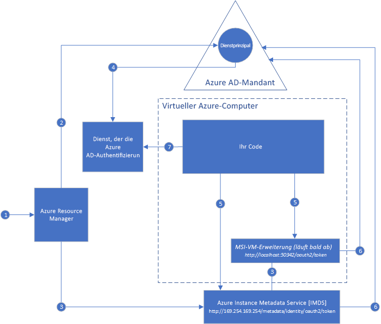

#  Was ist die verwaltete Dienstidentität (Managed Service Identity, MSI) für Azure-Ressourcen?

[!INCLUDE[preview-notice](../../../includes/active-directory-msi-preview-notice.md)]

Eine gängige Herausforderung beim Erstellen von Cloudanwendungen ist die Verwaltung der Anmeldeinformationen, die für die Authentifizierung bei Clouddiensten im Code enthalten sein müssen. Der Schutz dieser Anmeldeinformationen ist eine wichtige Aufgabe. Im Idealfall werden sie nie auf Entwicklerarbeitsstationen angezeigt oder in die Quellcodeverwaltung eingecheckt. Azure Key Vault bietet eine Möglichkeit zum sicheren Speichern von Anmeldeinformationen und anderen Schlüsseln und Geheimnissen. Um diese abrufen zu können, muss sich Ihr Code jedoch bei Key Vault authentifizieren. Mithilfe der verwalteten Dienstidentität kann dieses Problem leichter gelöst werden, indem für Azure-Dienste eine automatisch verwaltete Identität in Azure Active Directory (Azure AD) bereitgestellt wird. Sie können diese Identität für die Authentifizierung bei jedem Dienst verwenden, der die Azure AD-Authentifizierung einschließlich von Key Vault unterstützt. Hierfür müssen keine Anmeldeinformationen im Code enthalten sein.

Verwaltete Dienstidentitäten sind im Lieferumfang von Azure Active Directory Free enthalten. Dies ist die Standardbereitstellung für Azure-Abonnements. Für verwaltete Dienstidentitäten fallen keine zusätzlichen Kosten an.

## Wie funktioniert dies?

Es gibt zwei Arten von verwalteten Dienstidentitäten: **durch das System zugewiesene Identitäten** und **durch den Benutzer zugewiesene Identitäten**.

- Eine **durch das System zugewiesene Identität** wird direkt für eine Azure-Dienstinstanz aktiviert. Wenn diese Identität aktiviert ist, erstellt Azure eine Identität für die Dienstinstanz in dem Azure AD-Mandanten, dem von dem Abonnement der Dienstinstanz vertraut wird. Nach Erstellung der Identität werden die dazugehörigen Anmeldeinformationen in der Dienstinstanz bereitgestellt. Der Lebenszyklus einer durch das System zugewiesenen Identität ist direkt an die Azure-Dienstinstanz gebunden, für die sie aktiviert wurde. Wenn die Dienstinstanz gelöscht wird, bereinigt Azure automatisch die Anmeldeinformationen und die Identität in Azure AD.
- Eine **vom Benutzer zugewiesene Identität** wird als eigenständige Azure-Ressource erstellt. Azure erstellt eine Identität in dem Azure AD-Mandanten, dem vom verwendeten Abonnement vertraut wird. Nachdem die Identität erstellt wurde, kann sie einer oder mehreren Azure-Dienstinstanzen zugewiesen werden. Der Lebenszyklus einer durch den Benutzer zugewiesenen Identität wird getrennt vom Lebenszyklus der Azure-Dienstinstanzen verwaltet, denen sie zugewiesen ist.

Daher können Sie in Ihrem Code entweder eine durch das System zugewiesene Identität oder eine durch den Benutzer zugewiesene Identität verwenden, um Zugriffstoken für Dienste anzufordern, die die Azure AD-Authentifizierung unterstützen. Derweil übernimmt Azure die Weitergabe der von der Dienstinstanz verwendeten Anmeldeinformationen.

Das folgende Beispiel veranschaulicht die Funktionsweise einer durch das System zugewiesenen Identität für Azure Virtual Machines:

1. Azure Resource Manager empfängt eine Anforderung zur Aktivierung der durch das System verwalteten Identität auf einem virtuellen Computer.
2. Azure Resource Manager erstellt einen Dienstprinzipal in Azure AD, um die Identität des virtuellen Computers darzustellen. Der Dienstprinzipal wird in dem Azure AD-Mandanten erstellt, der von diesem Abonnement als vertrauenswürdig eingestuft wird.
3. Azure Resource Manager konfiguriert die Identität auf dem virtuellen Computer:
    - ARM aktualisiert den Azure Instance Metadata Service-Identitätsendpunkt mit der Client-ID und dem Zertifikat des Dienstprinzipals.
    - ARM stellt die VM-Erweiterung bereit und fügt die Client-ID und das Zertifikat des Dienstprinzipals hinzu. (Wird in Kürze als veraltet eingestuft.)
4. Nachdem der virtuelle Computer nun über eine Identität verfügt, verwenden wir die Dienstprinzipalinformationen, um ihm Zugriff auf Azure-Ressourcen zu gewähren. Müsste Ihr Code zum Beispiel Azure Resource Manager aufrufen, würden Sie dem Dienstprinzipal des virtuellen Computers die entsprechende Rolle mithilfe der rollenbasierten Zugriffssteuerung (RBAC) in Azure AD zuweisen. Wenn Ihr Code Key Vault aufrufen müsste, würden Sie dem Code den Zugriff auf das spezifische Geheimnis oder den spezifischen Schlüssel in Key Vault gewähren.
5. Der auf dem virtuellen Computer ausgeführte Code kann ein Token von zwei Endpunkten anfordern, auf die nur von dem virtuellen Computer aus zugegriffen werden kann:

    - Identitätsendpunkt des Azure-Instanzmetadatendiensts (Instance Metadata Service, IMDS): http://169.254.169.254/metadata/identity/oauth2/token (empfohlen)
        - Der Ressourcenparameter gibt den Dienst an, an den das Token gesendet wird. Wenn der Code beispielsweise bei Azure Resource Manager authentifiziert werden soll, würden Sie Folgendes verwenden: „resource=https://management.azure.com/“.
        - Der API-Versionsparameter gibt die IMDS-Version an. Verwenden Sie mindestens „api-version=2018-02-01“.
    - VM-Erweiterungsendpunkt: http://localhost:50342/oauth2/token (wird in Kürze als veraltet markiert)
        - Der Ressourcenparameter gibt den Dienst an, an den das Token gesendet wird. Wenn der Code beispielsweise bei Azure Resource Manager authentifiziert werden soll, würden Sie Folgendes verwenden: „resource=https://management.azure.com/“.

6. Mit einem an Azure AD gerichteten Aufruf wird ein Zugriffstoken angefordert, wie in Schritt 5 angegeben. Dabei werden die Client-ID und das Zertifikat verwendet, die in Schritt 3 konfiguriert wurden. Azure AD gibt ein JWT-Zugriffstoken (JSON Web Token) zurück.
7. Der Code sendet das Zugriffstoken in einem Aufruf eines Diensts, der die Azure AD-Authentifizierung unterstützt.

Dieses Diagramm veranschaulicht auch das folgende Beispiel für die Funktionsweise einer durch den Benutzer zugewiesenen verwalteten Dienstidentität mit Azure Virtual Machines.

1. Azure Resource Manager empfängt eine Anforderung zur Erstellung einer durch den Benutzer zugewiesenen Identität.
2. Azure Resource Manager erstellt einen Dienstprinzipal in Azure AD, der die durch den Benutzer zugewiesene Identität darstellt. Der Dienstprinzipal wird in dem Azure AD-Mandanten erstellt, der von diesem Abonnement als vertrauenswürdig eingestuft wird.
3. Azure Resource Manager empfängt eine Anforderung zur Konfiguration der durch den Benutzer verwalteten Identität auf einem virtuellen Computer:
    - ARM aktualisiert den Azure Instance Metadata Service-Identitätsendpunkt mit der Client-ID und dem Zertifikat des Dienstprinzipals der durch den Benutzer zugewiesenen Identität.
    - ARM stellt die VM-Erweiterung bereit und fügt die Client-ID und das Zertifikat des Dienstprinzipals der durch den Benutzer zugewiesenen Identität hinzu. (Wird in Kürze als veraltet eingestuft.)
4. Nachdem die durch den Benutzer zugewiesene Identität erstellt wurde, verwenden wir die Dienstprinzipalinformationen, um ihr Zugriff auf Azure-Ressourcen zu gewähren. Wenn Ihr Code also beispielsweise Azure Resource Manager aufrufen muss, weisen Sie dem Dienstprinzipal der durch den Benutzer zugewiesenen Identität mithilfe der rollenbasierten Zugriffssteuerung (Role-Based Access Control, RBAC) in Azure AD die geeignete Rolle zu. Wenn Ihr Code Key Vault aufrufen müsste, würden Sie dem Code den Zugriff auf das spezifische Geheimnis oder den spezifischen Schlüssel in Key Vault gewähren. Hinweis: Dieser Schritt kann auch vor Schritt 3 ausgeführt werden.
5. Der auf dem virtuellen Computer ausgeführte Code kann ein Token von zwei Endpunkten anfordern, auf die nur von dem virtuellen Computer aus zugegriffen werden kann:

    - Identitätsendpunkt des Azure-Instanzmetadatendiensts (Instance Metadata Service, IMDS): http://169.254.169.254/metadata/identity/oauth2/token (empfohlen)
        - Der Ressourcenparameter gibt den Dienst an, an den das Token gesendet wird. Wenn der Code beispielsweise bei Azure Resource Manager authentifiziert werden soll, würden Sie Folgendes verwenden: „resource=https://management.azure.com/“.
        - Der Client-ID-Parameter gibt die Identität an, für die das Token angefordert wird. Dies ist erforderlich, um Mehrdeutigkeiten zu vermeiden, wenn sich auf einem einzelnen virtuellen Computer mehrere durch den Benutzer zugewiesene Identitäten befinden.
        - Der API-Versionsparameter gibt die IMDS-Version an. Verwenden Sie mindestens „api-version=2018-02-01“.

    - VM-Erweiterungsendpunkt: http://localhost:50342/oauth2/token (wird in Kürze als veraltet markiert)
        - Der Ressourcenparameter gibt den Dienst an, an den das Token gesendet wird. Wenn der Code beispielsweise bei Azure Resource Manager authentifiziert werden soll, würden Sie Folgendes verwenden: „resource=https://management.azure.com/“.
        - Der Client-ID-Parameter gibt die Identität an, für die das Token angefordert wird. Dies ist erforderlich, um Mehrdeutigkeiten zu vermeiden, wenn sich auf einem einzelnen virtuellen Computer mehrere durch den Benutzer zugewiesene Identitäten befinden.
6. Mit einem an Azure AD gerichteten Aufruf wird ein Zugriffstoken angefordert, wie in Schritt 5 angegeben. Dabei werden die Client-ID und das Zertifikat verwendet, die in Schritt 3 konfiguriert wurden. Azure AD gibt ein JWT-Zugriffstoken (JSON Web Token) zurück.
7. Der Code sendet das Zugriffstoken in einem Aufruf eines Diensts, der die Azure AD-Authentifizierung unterstützt.
     
## Verwaltete Dienstidentitäten testen

Testen Sie ein Tutorial für verwaltete Dienstidentitäten, um mehr über End-to-End-Szenarios für den Zugriff auf verschiedene Azure-Ressourcen zu erfahren:
  
| Ressource zur aktivierten verwalteten Identität | Lernen Sie Folgendes: |
| ------- | -------- |
| Azure-VM (Windows) | [Zugreifen auf Azure Data Lake Store mit einer Windows-VM-MSI](tutorial-windows-vm-access-datalake.md) |
|                    | [Zugreifen auf Azure Resource Manager mit einer Windows-VM-MSI](tutorial-windows-vm-access-arm.md) |
|                    | [Zugreifen auf Azure SQL mit einer Windows-VM-MSI](tutorial-windows-vm-access-sql.md) |
|                    | [Zugreifen auf Azure Storage über einen Zugriffsschlüssel mit einer Windows-VM-MSI](tutorial-windows-vm-access-storage.md) |
|                    | [Zugreifen auf Azure Storage über SAS mit einer Windows-VM-MSI](tutorial-windows-vm-access-storage-sas.md) |
|                    | [Access a non-Azure AD resource with a Windows VM Managed Service Identity and Azure Key Vault (Zugreifen auf eine Nicht-Azure-Ressource mit einer Windows-VM-MSI und Azure Key Vault)](tutorial-windows-vm-access-nonaad.md) |
| Azure-VM (Linux)   | [Zugreifen auf Azure Data Lake Store mit einer Linux-VM-MSI](tutorial-linux-vm-access-datalake.md) |
|                    | [Zugreifen auf Azure Resource Manager mit einer Linux-VM-MSI](tutorial-linux-vm-access-arm.md) |
|                    | [Zugreifen auf Azure Storage über einen Zugriffsschlüssel mit einer Linux-VM-MSI](tutorial-linux-vm-access-storage.md) |
|                    | [Zugreifen auf Azure Storage über SAS mit einer Linux-VM-MSI](tutorial-linux-vm-access-storage-sas.md) |
|                    | [Zugreifen auf eine Nicht-Azure AD-Ressource mit einer Linux-VM-MSI und Azure Key Vault](tutorial-linux-vm-access-nonaad.md) |
| Azure App Service  | [Use Managed Service Identity with Azure App Service or Azure Functions (Verwenden von verwalteten Dienstidentitäten mit Azure App Service oder Azure Functions)](/azure/app-service/app-service-managed-service-identity) |
| Azure-Funktionen    | [Use Managed Service Identity with Azure App Service or Azure Functions (Verwenden von verwalteten Dienstidentitäten mit Azure App Service oder Azure Functions)](/azure/app-service/app-service-managed-service-identity) |
| Azure-Servicebus  | [Verwenden einer verwalteten Dienstidentität mit Azure Service Bus](../../service-bus-messaging/service-bus-managed-service-identity.md) |
| Azure Event Hubs   | [Verwenden einer verwalteten Dienstidentität mit Azure Event Hubs](../../event-hubs/event-hubs-managed-service-identity.md) |
| Azure API Management | [Verwenden einer verwalteten Dienstidentität mit Azure API Management](../../api-management/api-management-howto-use-managed-service-identity.md) |

## Welche Azure-Dienste unterstützen verwaltete Dienstidentitäten?

Verwaltete Identitäten können für die Authentifizierung bei Diensten verwendet werden, die die Azure AD-Authentifizierung unterstützen. Eine Liste mit Azure-Diensten, die die verwaltete Dienstidentität unterstützen, finden Sie im folgenden Artikel:
- [Services that support Managed Service Identity](services-support-msi.md) (Dienste, die verwaltete Dienstidentitäten unterstützen)

## Nächste Schritte

Informationen zu den ersten Schritten mit der verwalteten Azure-Dienstidentität finden Sie in den folgenden Schnellstartanleitungen:

* [Use a Windows VM Managed Service Identity to access Resource Manager - Windows VM (Verwenden einer verwalteten Dienstidentität einer Windows-VM für den Zugriff auf Resource Manager – Windows-VM)](tutorial-windows-vm-access-arm.md)
* [Use a Linux VM Managed Service Identity to access Azure Resource Manager - Linux VM (Zugreifen auf Azure Resource Manager mithilfe der verwalteten Dienstidentität einer Linux-VM – Linux-VM)](tutorial-linux-vm-access-arm.md)
