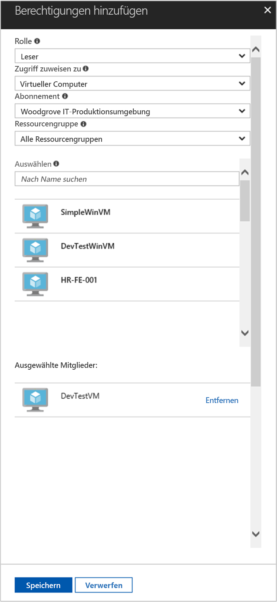

# <a name="use-a-linux-vm-managed-service-identity-msi-to-access-azure-resource-manager"></a>Zugreifen auf Azure Resource Manager mithilfe der verwalteten Dienstidentität (Managed Service Identity, MSI) einer Linux-VM

[!INCLUDE[preview-notice](../../../includes/active-directory-msi-preview-notice.md)]

In diesem Tutorial erfahren Sie, wie Sie eine verwaltete Dienstidentität (Managed Service Identity, MSI) für einen virtuellen Linux-Computer aktivieren und diese Identität anschließend verwenden, um auf die Azure Resource Manager-API zuzugreifen. Verwaltete Dienstidentitäten werden von Azure automatisch verwaltet und ermöglichen Ihnen die Authentifizierung für Dienste, die die Azure AD-Authentifizierung unterstützen, ohne dass Sie Anmeldeinformationen in Ihren Code einfügen müssen. Folgendes wird vermittelt:

> [!div class="checklist"]
> * Aktivieren von MSI auf einem virtuellen Linux-Computer 
> * Gewähren des Zugriffs auf eine Ressourcengruppe in Azure Resource Manager für Ihren virtuellen Computer 
> * Abrufen eines Zugriffstokens mithilfe der VM-Identität und Verwenden dieses Zugriffstokens zum Aufrufen von Azure Resource Manager 

## <a name="prerequisites"></a>Voraussetzungen

[!INCLUDE [msi-qs-configure-prereqs](../../../includes/active-directory-msi-qs-configure-prereqs.md)]

[!INCLUDE [msi-tut-prereqs](../../../includes/active-directory-msi-tut-prereqs.md)]

## <a name="sign-in-to-azure"></a>Anmelden bei Azure

Melden Sie sich unter [https://portal.azure.com](https://portal.azure.com) beim Azure-Portal an.

## <a name="create-a-linux-virtual-machine-in-a-new-resource-group"></a>Erstellen eines virtuellen Linux-Computers in einer neuen Ressourcengruppe

In diesem Tutorial wird ein neuer virtueller Linux-Computer erstellt. Sie können MSI auch auf einem vorhandenen virtuellen Computer aktivieren.

1. Klicken Sie in der linken oberen Ecke des Azure-Portals auf die Schaltfläche **Ressource erstellen**.
2. Wählen Sie **Compute** und dann **Ubuntu Server 16.04 LTS**.
3. Geben Sie die Informationen zum virtuellen Computer ein. Wählen Sie unter **Authentifizierungstyp** die Option **Öffentlicher SSH-Schlüssel** oder **Kennwort**. Mit den erstellten Anmeldeinformationen können Sie sich auf dem virtuellen Computer anmelden.

    

4. Wählen Sie in der Dropdownliste ein **Abonnement** für den virtuellen Computer aus.
5. Um eine neue **Ressourcengruppe** auszuwählen, in der der virtuelle Computer erstellt werden soll, wählen Sie **Neu erstellen** aus. Klicken Sie zum Abschluss auf **OK**.
6. Wählen Sie eine Größe für den virtuellen Computer. Wählen Sie die Option **Alle anzeigen**, oder ändern Sie den Filter für den unterstützten Datenträgertyp, um weitere Größen anzuzeigen. Behalten Sie auf dem Blatt „Einstellungen“ die Standardwerte bei, und klicken Sie auf **OK**.

## <a name="enable-msi-on-your-vm"></a>Aktivieren von MSI auf dem virtuellen Computer

Eine VM-MSI ermöglicht es Ihnen, Zugriffstoken aus Azure AD abzurufen, ohne dass Sie Anmeldeinformationen in Ihren Code einfügen müssen. Durch das Aktivieren der verwalteten Dienstidentität auf einem virtuellen Computer werden zwei Vorgänge ausgelöst: Der virtuelle Computer wird bei Azure Active Directory registriert, um die zugehörige verwaltete Identität zu erstellen, und die Identität wird auf dem virtuellen Computer konfiguriert.

1. Wählen Sie den **virtuellen Computer** aus, auf dem Sie MSI aktivieren möchten.
2. Klicken Sie in der links angezeigten Navigationsleiste auf **Konfiguration**.
3. Die Option **Verwaltete Dienstidenität** wird angezeigt. Wählen Sie zum Registrieren und Aktivieren von MSI die Option **Ja** oder zum Deaktivieren „Nein“.
4. Achten Sie darauf, zum Speichern der Konfiguration auf **Speichern** zu klicken.

    

## <a name="grant-your-vm-access-to-a-resource-group-in-azure-resource-manager"></a>Gewähren des Zugriffs auf eine Ressourcengruppe in Azure Resource Manager für Ihren virtuellen Computer 

Mithilfe von MSI kann der Code Zugriffstoken zur Authentifizierung von Ressourcen abrufen, die die Azure AD-Authentifizierung unterstützen. Die Azure Resource Manager-API unterstützt die Azure AD-Authentifizierung. Zunächst müssen Sie dieser VM-Identität den Zugriff auf eine Ressource in Azure Resource Manager gewähren. In diesem Fall handelt es sich dabei um die Ressourcengruppe, die den virtuellen Computer enthält.  

1. Navigieren Sie zu der Registerkarte für die **Ressourcengruppen**.
2. Wählen Sie die **Ressourcengruppe** aus, die Sie zuvor erstellt haben.
3. Wechseln Sie im linken Bereich zu **Zugriffssteuerung (IAM)**.
4. Klicken Sie dann auf **Hinzufügen**, um dem virtuellen Computer eine neue Rollenzuweisung hinzuzufügen. Wählen Sie die **Rolle** **Leser** aus.
5. Wählen Sie in der nächsten Dropdownliste für die Option **Zugriff zuweisen zu** die Ressource **Virtueller Computer** aus.
6. Stellen Sie dann sicher, dass in der Dropdownliste **Abonnement** das richtige Abonnement aufgeführt wird. Wählen Sie unter **Ressourcengruppe** die Option **Alle Ressourcengruppen**.
7. Wählen Sie schließlich unter **Auswählen** in der Dropdownliste Ihren virtuellen Linux-Computer aus, und klicken Sie auf **Speichern**.

    

## <a name="get-an-access-token-using-the-vms-identity-and-use-it-to-call-resource-manager"></a>Abrufen eines Zugriffstokens mithilfe der VM-Identität und Verwendung zum Aufrufen von Resource Manager 

Zum Ausführen dieser Schritte benötigen Sie einen SSH-Client. Wenn Sie Windows verwenden, können Sie den SSH-Client im [Windows-Subsystem für Linux](https://msdn.microsoft.com/commandline/wsl/about) verwenden. Wenn Sie Hilfe beim Konfigurieren der SSH-Clientschlüssel benötigen, lesen Sie die Informationen unter [Vorgehensweise: Verwenden von SSH-Schlüsseln mit Windows in Azure](../../virtual-machines/linux/ssh-from-windows.md) oder [Erstellen und Verwenden eines SSH-Schlüsselpaars (öffentlich und privat) für virtuelle Linux-Computer in Azure](../../virtual-machines/linux/mac-create-ssh-keys.md).

1. Navigieren Sie im Portal zu Ihrem virtuellen Linux-Computer, und klicken Sie in der **Übersicht** auf **Verbinden**.  
2. **Verbinden** Sie den virtuellen Computer mit dem gewünschten SSH-Client. 
3. Erstellen Sie im Terminalfenster mit CURL eine Anforderung an den lokalen MSI-Endpunkt zum Abrufen eines Zugriffstokens für Azure Resource Manager.  
 
    Die CURL-Anforderung für das Zugriffstoken finden Sie weiter unten.  
    
    ```bash
    curl 'http://169.254.169.254/metadata/identity/oauth2/token?api-version=2018-02-01&resource=https%3A%2F%2Fmanagement.azure.com%2F' -H Metadata:true   
    ```
    
    > [!NOTE]
    > Der Wert des „resource“-Parameters muss exakt mit dem von Azure AD erwarteten Wert übereinstimmen.  Für die Resource Manager-Ressourcen-ID müssen Sie den nachgestellten Schrägstrich im URI verwenden. 
    
    Die Antwort enthält das Zugriffstoken, das Sie für den Zugriff auf Azure Resource Manager benötigen. 
    
    Antwort:  

    ```bash
    {"access_token":"eyJ0eXAiOi...",
    "refresh_token":"",
    "expires_in":"3599",
    "expires_on":"1504130527",
    "not_before":"1504126627",
    "resource":"https://management.azure.com",
    "token_type":"Bearer"} 
    ```
    
    Dieses Zugriffstoken können Sie verwenden, um auf Azure Resource Manager zuzugreifen, beispielsweise um die Details der Ressourcengruppe zu lesen, für die Sie diesem virtuellen Computer zuvor den Zugriff gewährt haben. Ersetzen Sie die Werte von \<ABONNEMENT-ID\>, \<RESSOURCENGRUPPE\> und \<ZUGRIFFSTOKEN\> mit den Werten, die Sie zuvor erstellt haben. 
    
    > [!NOTE]
    > Bei der URL wird die Groß-/Kleinschreibung beachtet. Achten Sie daher darauf, dieselbe Groß- und Kleinschreibung zu verwenden wie zuvor beim Benennen der Ressourcengruppe. Beachten Sie auch den Großbuchstaben „G“ in „resourceGroup“.  
    
    ```bash 
    curl https://management.azure.com/subscriptions/<SUBSCRIPTION ID>/resourceGroups/<RESOURCE GROUP>?api-version=2016-09-01 -H "Authorization: Bearer <ACCESS TOKEN>" 
    ```
    
    Die Antwort enthält die spezifischen Informationen zur Ressourcengruppe: 
     
    ```bash
    {"id":"/subscriptions/98f51385-2edc-4b79-bed9-7718de4cb861/resourceGroups/DevTest","name":"DevTest","location":"westus","properties":{"provisioningState":"Succeeded"}} 
    ```     

## <a name="next-steps"></a>Nächste Schritte

In diesem Tutorial haben Sie erfahren, wie Sie eine vom Benutzer zugewiesene Identität erstellen und an einen virtuellen Azure-Computer anfügen, um auf die Azure Resource Manager-API zuzugreifen.  Weitere Informationen zu Azure Resource Manager finden Sie hier:

> [!div class="nextstepaction"]
>[Azure Resource Manager](/azure/azure-resource-manager/resource-group-overview)