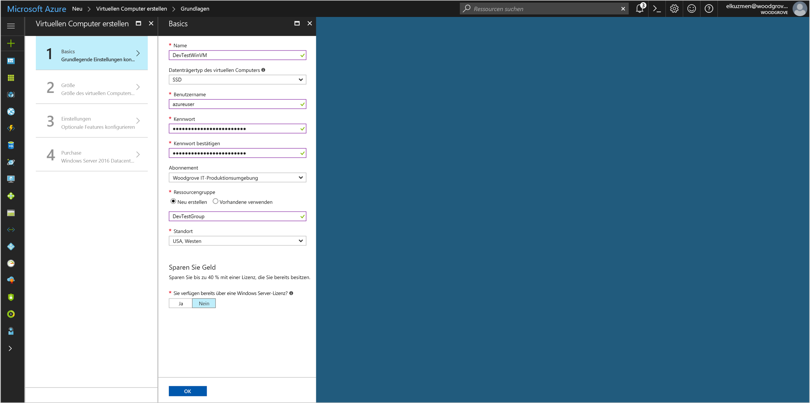

# <a name="tutorial-use-a-windows-vm-managed-identity-to-access-azure-storage"></a>Tutorial: Verwenden einer Windows-VM-MSI für den Zugriff auf Azure Storage

[!INCLUDE[preview-notice](../../../includes/active-directory-msi-preview-notice.md)]

In diesem Tutorial erfahren Sie, wie Sie eine verwaltete Dienstidentität (Managed Service Identity, MSI) für einen virtuellen Windows-Computer aktivieren und mit dieser Identität auf Azure Storage zugreifen.  Folgendes wird vermittelt:

> [!div class="checklist"]
> * Erstellen eines virtuellen Windows-Computers in einer neuen Ressourcengruppe 
> * Aktivieren einer verwalteten Dienstidentität auf einem virtuellen Windows-Computer (VM)
> * Erstellen eines Blobcontainers im Speicherkonto
> * Gewähren des Zugriffs auf ein Speicherkonto für Ihre Windows-VM-MSI 
> * Erhalten eines Zugriffs und seine Verwendung zum Aufrufen von Azure Storage 

> [!NOTE]
> Die Azure Active Directory-Authentifizierung für Azure Storage liegt in der Public Preview-Version vor.

## <a name="prerequisites"></a>Voraussetzungen

[!INCLUDE [msi-qs-configure-prereqs](../../../includes/active-directory-msi-qs-configure-prereqs.md)]

[!INCLUDE [msi-tut-prereqs](../../../includes/active-directory-msi-tut-prereqs.md)]

## <a name="sign-in-to-azure"></a>Anmelden bei Azure

Melden Sie sich unter [https://portal.azure.com](https://portal.azure.com) beim Azure-Portal an.

## <a name="create-a-windows-virtual-machine-in-a-new-resource-group"></a>Erstellen eines virtuellen Windows-Computers in einer neuen Ressourcengruppe

In diesem Abschnitt erstellen Sie einen virtuellen Windows-Computer, für den später eine verwaltete Identität gewährt wird.

1.  Klicken Sie in der linken oberen Ecke des Azure-Portals auf die Schaltfläche **+/Neuen Dienst erstellen**.
2.  Wählen Sie **Compute** und dann **Windows Server 2016 Datacenter**. 
3.  Geben Sie die Informationen zum virtuellen Computer ein. Der **Benutzername** und das **Kennwort**, die hier erstellt werden, sind die Anmeldeinformationen, die Sie für die Anmeldung beim virtuellen Computer verwenden.
4.  Wählen Sie in der Dropdownliste das richtige **Abonnement** für den virtuellen Computer aus.
5.  Um eine neue **Ressourcengruppe** auszuwählen, in der der virtuelle Computer erstellt werden soll, wählen Sie **Neu erstellen** aus. Klicken Sie zum Abschluss auf **OK**.
6.  Wählen Sie eine Größe für den virtuellen Computer. Wählen Sie die Option **Alle anzeigen**, oder ändern Sie den Filter **Supported disk type** (Unterstützter Datenträgertyp), um weitere Größen anzuzeigen. Behalten Sie auf dem Blatt „Einstellungen“ die Standardwerte bei, und klicken Sie auf **OK**.

    

## <a name="enable-managed-identity-on-your-vm"></a>Aktivieren der MSI auf dem virtuellen Computer

Eine VM-MSI ermöglicht es Ihnen, Zugriffstoken aus Azure AD abzurufen, ohne Anmeldeinformationen in Ihren Code einfügen zu müssen. Im Hintergrund werden durch das Aktivieren der MSI auf einem virtuellen Computer über das Azure-Portal zwei Vorgänge ausgelöst: Der virtuelle Computer wird bei Azure AD registriert, um eine verwaltete Identität zu erstellen, und die Identität wird auf dem virtuellen Computer konfiguriert. 

1. Navigieren Sie zu der Ressourcengruppe des neuen virtuellen Computers, und wählen Sie den virtuellen Computer aus, den Sie im vorherigen Schritt erstellt haben.
2. Klicken Sie in der Kategorie **Einstellungen** auf **Konfiguration**.
3. Wählen Sie zum Aktivieren der MSI **Ja** aus.
4. Klicken Sie zum Anwenden der Konfiguration auf **Speichern**. 

## <a name="create-a-storage-account"></a>Speicherkonto erstellen 

In diesem Abschnitt erstellen Sie ein Speicherkonto. 

1. Klicken Sie in der linken oberen Ecke des Azure-Portals auf die Schaltfläche **+ Ressource erstellen**.
2. Wählen Sie die Option **Speicher** und anschließend **Speicherkonto – Blob, Datei, Tabelle, Warteschlange** aus.
3. Geben Sie unter **Name** einen Namen für das Speicherkonto ein.  
4. **Bereitstellungsmodell** und **Kontoart** sollten jeweils auf **Resource Manager** und **Storage (universell, Version 1)** festgelegt werden. 
5. Stellen Sie sicher, dass **Abonnement** und **Ressourcengruppe** dem entsprechen, was Sie bei der Erstellung Ihrer VM im vorherigen Schritt angegeben haben.
6. Klicken Sie auf **Create**.

    

## <a name="create-a-blob-container-and-upload-a-file-to-the-storage-account"></a>Erstellen eines Blobcontainers und Hochladen einer Datei in das Speicherkonto

Da Dateien Blob Storage erfordern, müssen wir einen Blobcontainer erstellen, in dem die Datei gespeichert wird. Anschließend laden Sie eine Datei in den Blobcontainer im neuen Speicherkonto hoch.

1. Navigieren Sie zurück zum neu erstellten Speicherkonto.
2. Klicken Sie unter **Blob-Dienst** auf **Container**.
3. Klicken Sie oben auf der Seite auf **+ Container**.
4. Geben Sie unter **Neuer Container** einen Namen für den Container ein, und behalten Sie unter **Öffentliche Zugriffsebene** den Standardwert bei.

    

5. Erstellen Sie mit einem Editor Ihrer Wahl eine Datei mit dem Titel *hall_ welt.txt* auf dem lokalen Computer.  Öffnen Sie die Datei, fügen Sie den Text „Hallo Welt! :)“ (ohne Anführungszeichen) hinzu, und speichern Sie ihn. 
6. Laden Sie die Datei in den neu erstellten Container hoch, indem Sie auf den Containernamen und dann auf **Hochladen** klicken.
7. Klicken Sie im Bereich **Blob hochladen** unter **Dateien** auf das Ordnersymbol und navigieren Sie zur Datei **hallo_welt.txt** auf dem lokalen Computer. Wählen Sie dann die Datei aus, und klicken Sie auf **Hochladen**.
    

## <a name="grant-your-vm-access-to-an-azure-storage-container"></a>Gewähren des Zugriffs auf einen Azure-Speichercontainer für Ihre VM 

Sie können die verwaltete Identität des virtuellen Computers verwenden, um die Daten in Azure Storage Blob abzurufen.   

1. Navigieren Sie zurück zum neu erstellten Speicherkonto.  
2. Klicken Sie im linken Bereich auf den Link **Zugriffssteuerung (IAM)**.  
3. Klicken Sie dann oben auf der Seite auf **+ Hinzufügen**, um dem virtuellen Computer eine neue Rollenzuweisung hinzuzufügen.
4. Wählen Sie unter **Rolle** in der Dropdownliste **Storage-Blobdatenleser (Vorschau)** aus. 
5. Wählen Sie in der nächsten Dropdownliste unter **Zugriff zuweisen zu** die Option **Virtueller Computer** aus.  
6. Stellen Sie im nächsten Schritt sicher, dass das richtige Abonnement in der Dropdownliste **Abonnement** aufgeführt ist, und legen Sie dann für **Ressourcengruppe** die Option **Alle Ressourcengruppen** fest.  
7. Wählen Sie unter **Auswählen** Ihren virtuellen Computer aus, und klicken Sie dann auf **Speichern**. 

    

## <a name="get-an-access-token-and-use-it-to-call-azure-storage"></a>Erhalten eines Zugriffstokens und seine Verwendung zum Aufrufen von Azure Storage 

Azure Storage unterstützt die Azure AD-Authentifizierung nativ, sodass Zugriffstoken, die mit der MSI abgerufen wurden, direkt angenommen werden können. Dieser Umstand ist Teil der Azure Storage-Integration in Azure AD und unterscheidet sich vom Bereitstellen von Anmeldeinformationen in der Verbindungszeichenfolge.

Im Folgenden finden Sie ein .Net-Code-Beispiel zum Öffnen einer Verbindung zu Azure Storage mithilfe eines Zugriffstokens und zum anschließenden Lesen der Inhalte der zuvor erstellten Datei. Dieser Code muss auf dem virtuellen Computer ausgeführt werden, um auf den VM-MSI-Endpunkt zugreifen zu können. Für die Verwendung des Verfahrens mit Zugriffstoken ist .NET Framework 4.6 oder höher erforderlich. Ersetzen Sie entsprechend den Wert `<URI to blob file>`. Diesen erhalten Sie, wenn Sie zur Datei navigieren, die Sie zuvor erstellt und in Blob Storage hochgeladen haben, und darin die **URL** unter **Eigenschaften** auf der Seite **Übersicht** kopieren.

```csharp
using System;
using System.Collections.Generic;
using System.Linq;
using System.Text;
using System.Threading.Tasks;
using System.IO;
using System.Net;
using System.Web.Script.Serialization; 
using Microsoft.WindowsAzure.Storage.Auth;
using Microsoft.WindowsAzure.Storage.Blob;

namespace StorageOAuthToken
{
    class Program
    {
        static void Main(string[] args)
        {
            //get token
            string accessToken = GetMSIToken("https://storage.azure.com/");
           
            //create token credential
            TokenCredential tokenCredential = new TokenCredential(accessToken);

            //create storage credentials
            StorageCredentials storageCredentials = new StorageCredentials(tokenCredential);

            Uri blobAddress = new Uri("<URI to blob file>");

            //create block blob using storage credentials
            CloudBlockBlob blob = new CloudBlockBlob(blobAddress, storageCredentials);
        
            //retrieve blob contents
            Console.WriteLine(blob.DownloadText());
            Console.ReadLine();
        }

        static string GetMSIToken(string resourceID)
        {
            string accessToken = string.Empty;
            // Build request to acquire MSI token
            HttpWebRequest request = (HttpWebRequest)WebRequest.Create("http://169.254.169.254/metadata/identity/oauth2/token?api-version=2018-02-01&resource=" + resourceID);
            request.Headers["Metadata"] = "true";
            request.Method = "GET";

            try
            {
                // Call /token endpoint
                HttpWebResponse response = (HttpWebResponse)request.GetResponse();

                // Pipe response Stream to a StreamReader, and extract access token
                StreamReader streamResponse = new StreamReader(response.GetResponseStream());
                string stringResponse = streamResponse.ReadToEnd();
                JavaScriptSerializer j = new JavaScriptSerializer();
                Dictionary<string, string> list = (Dictionary<string, string>)j.Deserialize(stringResponse, typeof(Dictionary<string, string>));
                accessToken = list["access_token"];
                return accessToken;
            }
            catch (Exception e)
            {
                string errorText = String.Format("{0} \n\n{1}", e.Message, e.InnerException != null ? e.InnerException.Message : "Acquire token failed");
                return accessToken;
            }
        }            
    }
}
```

Die Antwort enthält den Inhalt der Datei:

`Hello world! :)`

## <a name="next-steps"></a>Nächste Schritte

In diesem Tutorial haben Sie gelernt, wie Sie eine Windows-VM-MSI für den Zugriff auf Azure Storage aktivieren können.  Weitere Informationen zu Azure Storage finden Sie hier:

> [!div class="nextstepaction"]
> [Azure Storage](/azure/storage/common/storage-introduction)


