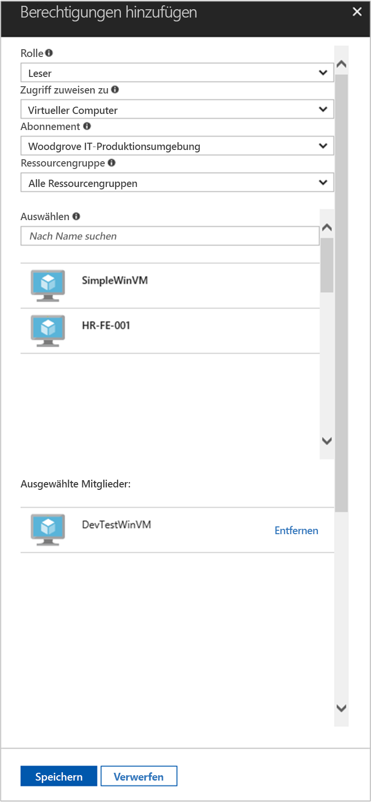

# <a name="use-a-windows-vm-managed-service-identity-msi-to-access-resource-manager"></a>Verwenden einer Windows-VM-MSI (Managed Service Identity, verwaltete Dienstidentität) für den Zugriff auf Resource Manager

[!INCLUDE[preview-notice](../../../includes/active-directory-msi-preview-notice.md)]

In diesem Tutorial erfahren Sie, wie Sie eine verwaltete Dienstidentität (Managed Service Identity, MSI) für einen virtuellen Windows-Computer aktivieren. Mit dieser Identität können Sie dann auf die Azure Resource Manager-API zugreifen. Verwaltete Dienstidentitäten werden von Azure automatisch verwaltet und ermöglichen Ihnen die Authentifizierung für Dienste, die die Azure AD-Authentifizierung unterstützen, ohne dass Sie Anmeldeinformationen in Ihren Code einfügen müssen. Folgendes wird vermittelt:

> [!div class="checklist"]
> * Aktivieren von MSI auf einem virtuellen Windows-Computer 
> * Gewähren des Zugriffs auf eine Ressourcengruppe in Azure Resource Manager für Ihren virtuellen Computer 
> * Abrufen eines Zugriffstokens mithilfe der VM-Identität und Verwenden dieses Zugriffstokens zum Aufrufen von Azure Resource Manager

## <a name="prerequisites"></a>Voraussetzungen

[!INCLUDE [msi-qs-configure-prereqs](../../../includes/active-directory-msi-qs-configure-prereqs.md)]

[!INCLUDE [msi-tut-prereqs](../../../includes/active-directory-msi-tut-prereqs.md)]

## <a name="sign-in-to-azure"></a>Anmelden bei Azure
Melden Sie sich unter [https://portal.azure.com](https://portal.azure.com) beim Azure-Portal an.

## <a name="create-a-windows-virtual-machine-in-a-new-resource-group"></a>Erstellen eines virtuellen Windows-Computers in einer neuen Ressourcengruppe

In diesem Tutorial wird ein neuer virtueller Windows-Computer erstellt.  Sie können MSI auch auf einem vorhandenen virtuellen Computer aktivieren.

1.  Klicken Sie in der linken oberen Ecke des Azure-Portals auf die Schaltfläche **Ressource erstellen**.
2.  Wählen Sie **Compute** und dann **Windows Server 2016 Datacenter**. 
3.  Geben Sie die Informationen zum virtuellen Computer ein. Der **Benutzername** und das **Kennwort**, die hier erstellt werden, sind die Anmeldeinformationen, die Sie für die Anmeldung beim virtuellen Computer verwenden.
4.  Wählen Sie in der Dropdownliste das richtige **Abonnement** für den virtuellen Computer aus.
5.  Um eine neue **Ressourcengruppe** auszuwählen, in der der virtuelle Computer erstellt werden soll, wählen Sie **Neu erstellen**. Klicken Sie zum Abschluss auf **OK**.
6.  Wählen Sie eine Größe für den virtuellen Computer. Wählen Sie die Option **Alle anzeigen**, oder ändern Sie den Filter **Supported disk type** (Unterstützter Datenträgertyp), um weitere Größen anzuzeigen. Behalten Sie auf der Seite „Einstellungen“ die Standardwerte bei, und klicken Sie auf **OK**.

    

## <a name="enable-msi-on-your-vm"></a>Aktivieren von MSI auf dem virtuellen Computer 

Eine VM-MSI ermöglicht es Ihnen, Zugriffstoken aus Azure AD abzurufen, ohne dass Sie Anmeldeinformationen in Ihren Code einfügen müssen. Durch das Aktivieren der verwalteten Dienstidentität auf einem virtuellen Computer werden zwei Vorgänge ausgelöst: Der virtuelle Computer wird bei Azure Active Directory registriert, um die zugehörige verwaltete Identität zu erstellen, und die Identität wird auf dem virtuellen Computer konfiguriert.

1.  Wählen Sie den **virtuellen Computer** aus, auf dem Sie MSI aktivieren möchten.  
2.  Klicken Sie in der links angezeigten Navigationsleiste auf **Konfiguration**. 
3.  Die Option **Verwaltete Dienstidenität** wird angezeigt. Wählen Sie zum Registrieren und Aktivieren von MSI die Option **Ja** oder zum Deaktivieren „Nein“. 
4.  Achten Sie darauf, zum Speichern der Konfiguration auf **Speichern** zu klicken.  
    

## <a name="grant-your-vm-access-to-a-resource-group-in-resource-manager"></a>Gewähren des Zugriffs auf eine Ressourcengruppe in Azure Resource Manager für Ihren virtuellen Computer
Mithilfe von MSI kann der Code Zugriffstoken zur Authentifizierung von Ressourcen abrufen, die die Azure AD-Authentifizierung unterstützen.  Azure Resource Manager unterstützt die Azure AD-Authentifizierung.  Zunächst müssen Sie dieser VM-Identität den Zugriff auf eine Ressource in Resource Manager gewähren. In diesem Fall handelt es sich dabei um die Ressourcengruppe, die den virtuellen Computer enthält.  

1.  Navigieren Sie zu der Registerkarte für die **Ressourcengruppen**. 
2.  Wählen Sie die **Ressourcengruppe** aus, die Sie für den **virtuellen Windows-Computer** erstellt haben. 
3.  Wechseln Sie im linken Bereich zu **Zugriffssteuerung (IAM)**. 
4.  Klicken Sie dann auf **Hinzufügen**, um dem **virtuellen Windows-Computer** eine neue Rollenzuweisung hinzuzufügen.  Wählen Sie die **Rolle** **Leser** aus. 
5.  Wählen Sie in der nächsten Dropdownliste für die Option **Zugriff zuweisen zu** die Ressource **Virtueller Computer** aus. 
6.  Stellen Sie dann sicher, dass in der Dropdownliste **Abonnement** das richtige Abonnement aufgeführt wird. Wählen Sie unter **Ressourcengruppe** die Option **Alle Ressourcengruppen**. 
7.  Wählen Sie schließlich unter **Auswählen** in der Dropdownliste Ihren virtuellen Windows-Computer aus, und klicken Sie auf **Speichern**.

    

## <a name="get-an-access-token-using-the-vm-identity-and-use-it-to-call-azure-resource-manager"></a>Abrufen eines Zugriffstokens mithilfe der VM-Identität und Verwenden dieses Zugriffstokens zum Aufrufen von Azure Resource Manager 

In diesem Abschnitt müssen Sie **PowerShell** verwenden.  Wenn Sie PowerShell nicht installiert haben, können Sie es [hier](https://docs.microsoft.com/powershell/azure/overview?view=azurermps-4.3.1) herunterladen. 

1.  Navigieren Sie im Portal zu **Virtuelle Computer**, wechseln Sie dann zu Ihrem virtuellen Windows-Computer, und klicken Sie in der **Übersicht** auf **Verbinden**. 
2.  Geben Sie Ihren **Benutzernamen** und Ihr **Kennwort** ein, das Sie beim Erstellen des virtuellen Windows-Computers hinzugefügt haben. 
3.  Sie haben nun eine **Remotedesktopverbindung** mit dem virtuellen Computer erstellt. Öffnen Sie jetzt **PowerShell** in der Remotesitzung. 
4.  Erstellen Sie mithilfe des PowerShell-Befehls „Invoke-WebRequest“ eine Anforderung an den lokalen MSI-Endpunkt, um ein Zugriffstoken für Azure Resource Manager zu erhalten.

    ```powershell
       $response = Invoke-WebRequest -Uri 'http://169.254.169.254/metadata/identity/oauth2/token?api-version=2018-02-01&resource=https%3A%2F%2Fmanagement.azure.com%2F' -Method GET -Headers @{Metadata="true"}
    ```
    
    > [!NOTE]
    > Der Wert des „resource“-Parameters muss exakt mit dem von Azure AD erwarteten Wert übereinstimmen. Wenn Sie die Azure Resource Manager-Ressourcen-ID verwenden, müssen Sie den nachgestellten Schrägstrich im URI verwenden.
    
    Extrahieren Sie als Nächstes die vollständige Antwort, die als JSON-formatierte Zeichenfolge (JavaScript Object Notation) im „$response“-Objekt gespeichert ist. 
    
    ```powershell
    $content = $response.Content | ConvertFrom-Json
    ```
    Extrahieren Sie dann das Zugriffstoken aus der Antwort.
    
    ```powershell
    $ArmToken = $content.access_token
    ```
    
    Rufen Sie abschließend Azure Resource Manager mit dem Zugriffstoken auf. In diesem Beispiel wird auch der PowerShell-Befehl „Invoke-WebRequest“ für den Aufruf von Azure Resource Manager und das Einschließen des Zugriffstokens im Autorisierungsheader verwendet.
    
    ```powershell
    (Invoke-WebRequest -Uri https://management.azure.com/subscriptions/<SUBSCRIPTION ID>/resourceGroups/<RESOURCE GROUP>?api-version=2016-06-01 -Method GET -ContentType "application/json" -Headers @{ Authorization ="Bearer $ArmToken"}).content
    ```
    > [!NOTE] 
    > Bei der URL wird die Groß-/Kleinschreibung beachtet. Achten Sie daher darauf, dieselbe Groß- und Kleinschreibung zu verwenden wie zuvor beim Benennen der Ressourcengruppe, und darauf, den Großbuchstaben „G“ in „resourceGroups“ zu beachten.
        
    Der folgende Befehl gibt die Details der Ressourcengruppe zurück:

    ```powershell
    {"id":"/subscriptions/98f51385-2edc-4b79-bed9-7718de4cb861/resourceGroups/DevTest","name":"DevTest","location":"westus","properties":{"provisioningState":"Succeeded"}}
    ```

## <a name="next-steps"></a>Nächste Schritte

In diesem Tutorial haben Sie erfahren, wie Sie eine vom Benutzer zugewiesene Identität erstellen und an einen virtuellen Azure-Computer anfügen, um auf die Azure Resource Manager-API zuzugreifen.  Weitere Informationen zu Azure Resource Manager finden Sie hier:

> [!div class="nextstepaction"]
>[Azure Resource Manager](/azure/azure-resource-manager/resource-group-overview)

