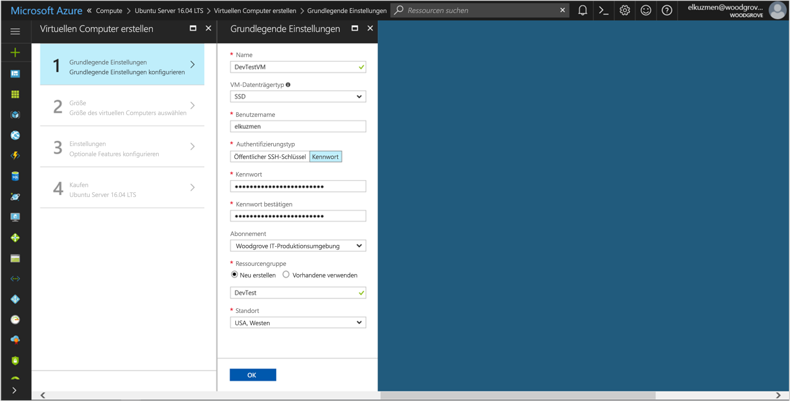

# <a name="use-a-linux-vm-managed-service-identity-to-access-azure-storage-via-a-sas-credential"></a>Verwenden einer Linux-VM-MSI für den Zugriff auf Azure Storage mithilfe von SAS-Anmeldeinformationen

[!INCLUDE[preview-notice](../../includes/active-directory-msi-preview-notice.md)]

In diesem Tutorial erfahren Sie, wie Sie eine verwaltete Dienstidentität (Managed Service Identity, MSI) für einen virtuellen Linux-Computer aktivieren und anschließend mit dieser MSI SAS-Anmeldeinformationen (Shared Access Signature) für Storage erhalten. Im Speziellen geht es um [Anmeldeinformationen für eine Dienst-SAS](/azure/storage/common/storage-dotnet-shared-access-signature-part-1?toc=%2fazure%2fstorage%2fblobs%2ftoc.json#types-of-shared-access-signatures). 

Eine Dienst-SAS erlaubt für einen begrenzten Zeitraum den eingeschränkten Zugriff auf Objekte in einem Speicherkonto für einen bestimmten Dienst (in unserem Fall der Blob-Dienst), ohne dass dabei der Zugriffsschlüssel für das Konto offengelegt wird. Sie können SAS-Anmeldeinformationen wie gewohnt bei Speichervorgängen verwenden, z.B. bei der Verwendung des Storage SDK. Für dieses Tutorial veranschaulichen wir das Hoch- und Herunterladen eines Blobs mithilfe der Azure Storage-Befehlszeilenschnittstelle. Sie lernen Folgendes:


> [!div class="checklist"]
> * Aktivieren von MSI auf einem virtuellen Linux-Computer 
> * Gewähren des Zugriffs auf eine Speicherkonto-SAS für Ihren virtuellen Computer in Resource Manager 
> * Abrufen eines Zugriffstokens mithilfe der Identität Ihres virtuellen Computers und Verwenden dieses Zugriffstokens zum Abrufen der SAS von Resource Manager 


Wenn Sie kein Azure-Abonnement besitzen, können Sie ein [kostenloses Konto](https://azure.microsoft.com/free/?WT.mc_id=A261C142F) erstellen, bevor Sie beginnen.

## <a name="sign-in-to-azure"></a>Anmelden bei Azure
Melden Sie sich unter [https://portal.azure.com](https://portal.azure.com) beim Azure-Portal an.


## <a name="create-a-linux-virtual-machine-in-a-new-resource-group"></a>Erstellen eines virtuellen Linux-Computers in einer neuen Ressourcengruppe

In diesem Tutorial wird ein neuer virtueller Linux-Computer erstellt. Sie können MSI auch auf einem vorhandenen virtuellen Computer aktivieren.

1. Klicken Sie in der linken oberen Ecke des Azure-Portals auf die Schaltfläche **+/Neuen Dienst erstellen**.
2. Wählen Sie **Compute** und dann **Ubuntu Server 16.04 LTS**.
3. Geben Sie die Informationen zum virtuellen Computer ein. Wählen Sie unter **Authentifizierungstyp** die Option **Öffentlicher SSH-Schlüssel** oder **Kennwort**. Mit den erstellten Anmeldeinformationen können Sie sich auf dem virtuellen Computer anmelden.

    

4. Wählen Sie in der Dropdownliste ein **Abonnement** für den virtuellen Computer aus.
5. Um eine neue **Ressourcengruppe** auszuwählen, in der der virtuelle Computer erstellt werden soll, wählen Sie **Neu erstellen** aus. Klicken Sie zum Abschluss auf **OK**.
6. Wählen Sie eine Größe für den virtuellen Computer. Wählen Sie die Option **Alle anzeigen**, oder ändern Sie den Filter für den unterstützten Datenträgertyp, um weitere Größen anzuzeigen. Behalten Sie auf dem Blatt „Einstellungen“ die Standardwerte bei, und klicken Sie auf **OK**.

## <a name="enable-msi-on-your-vm"></a>Aktivieren von MSI auf dem virtuellen Computer

Eine VM-MSI ermöglicht es Ihnen, Zugriffstoken aus Azure AD abzurufen, ohne dass Sie Anmeldeinformationen in Ihren Code einfügen müssen. Im Hintergrund werden durch das Aktivieren von MSI zwei Vorgänge ausgelöst: Auf dem virtuellen Computer wird die MSI-VM-Erweiterung installiert, und MSI wird für den virtuellen Computer aktiviert.  

1. Navigieren Sie zu der Ressourcengruppe des neuen virtuellen Computers, und wählen Sie den virtuellen Computer aus, den Sie im vorherigen Schritt erstellt haben.
2. Klicken Sie in den „Einstellungen“ des virtuellen Computers auf der linken Seite auf **Konfiguration**.
3. Wählen Sie zum Registrieren und Aktivieren von MSI die Option **Ja** oder zum Deaktivieren „Nein“.
4. Achten Sie darauf, zum Speichern der Konfiguration auf **Speichern** zu klicken.

    

5. Wenn Sie überprüfen möchten, welche Erweiterungen sich auf der VM befinden, klicken Sie auf **Erweiterungen**. Wenn MSI aktiviert ist, wird **ManagedIdentityExtensionforLinux** in der Liste angezeigt.

    

## <a name="create-a-storage-account"></a>Erstellen Sie ein Speicherkonto. 

Erstellen Sie ein Speicherkonto, sofern Sie über keines verfügen.  Sie können diesen Schritt auch überspringen und VM-MSI Zugriff auf die Schlüssel eines vorhandenen Speicherkontos gewähren. 

1. Klicken Sie in der linken oberen Ecke des Azure-Portals auf die Schaltfläche **+/Neuen Dienst erstellen**.
2. Klicken Sie auf **Speicher**, dann auf **Speicherkonto**, und anschließend wird ein neuer Bereich namens „Speicherkonto erstellen“ angezeigt.
3. Geben Sie einen **Namen** für das Speicherkonto ein, das Sie später verwenden werden.  
4. **Bereitstellungsmodell** und **Kontoart** sollten jeweils auf „Resource Manager“ und „Allgemein“ festgelegt werden. 
5. Stellen Sie sicher, dass **Abonnement** und **Ressourcengruppe** dem entsprechen, was Sie bei der Erstellung Ihrer VM im vorherigen Schritt angegeben haben.
6. Klicken Sie auf **Erstellen**.

    

## <a name="create-a-blob-container-in-the-storage-account"></a>Erstellen eines Blob-Containers im Speicherkonto

Später werden wir eine Datei in das neue Speicherkonto hoch- und daraus herunterladen. Da Dateien Blob-Speicher erfordern, müssen wir einen Blob-Container erstellen, in dem die Datei gespeichert wird.

1. Navigieren Sie zurück zum neu erstellten Speicherkonto.
2. Klicken Sie im linken Bereich unter „Blob-Dienst“ auf den Link **Container**.
3. Klicken Sie oben auf der Seite auf **+ Container**, und ein Bereich namens „Neuer Container“ wird geöffnet.
4. Geben Sie dem Container einen Namen, wählen Sie eine Zugriffsebene aus, und klicken Sie dann auf **OK**. Der angegebene Name wird später in diesem Tutorial verwendet. 

    

## <a name="grant-your-vms-msi-access-to-use-a-storage-sas"></a>Gewähren des MSI-Zugriffs für Ihren virtuellen Computer für die Verwendung einer Speicherkonto-SAS 

Azure Storage unterstützt die Azure AD-Authentifizierung nicht nativ.  Sie können eine MSI jedoch zum Abrufen einer Speicher-SAS von Resource Manager verwenden und mithilfe dieser SAS auf den Speicher zugreifen.  In diesem Schritt erteilen Sie Ihrem virtuellen Computer MSI-Zugriff auf die Speicherkonto-SAS.   

1. Navigieren Sie zurück zum neu erstellten Speicherkonto.   
2. Klicken Sie im linken Bereich auf den Link **Zugriffssteuerung (IAM)**.  
3. Klicken Sie dann oben auf der Seite auf **+ Hinzufügen**, um dem virtuellen Computer eine neue Rollenzuweisung hinzuzufügen.
4. Legen Sie **Rolle** rechts auf der Seite auf „Speicherkontomitwirkender“ fest. 
5. Legen Sie in der nächsten Dropdownliste **Zugriff zuweisen zu** auf die Ressource „Virtueller Computer“ fest.  
6. Stellen Sie im nächsten Schritt sicher, dass das richtige Abonnement in der Dropdownliste **Abonnement** aufgeführt wird, und legen Sie dann **Ressourcengruppe** auf „Alle Ressourcengruppen“ fest.  
7. Wählen Sie schließlich unter **Auswählen** in der Dropdownliste Ihren virtuellen Linux-Computer aus, und klicken Sie dann auf **Speichern**.  

    

## <a name="get-an-access-token-using-the-vms-identity-and-use-it-to-call-azure-resource-manager"></a>Abrufen eines Zugriffstokens mithilfe der VM-Identität und Verwenden dieses Zugriffstokens zum Aufrufen von Azure Resource Manager

Für den Rest des Tutorials arbeiten wir von dem virtuellen Computer aus, den wir zuvor erstellt haben.

Zum Ausführen dieser Schritte benötigen Sie einen SSH-Client. Wenn Sie Windows verwenden, können Sie den SSH-Client im [Windows-Subsystem für Linux](https://msdn.microsoft.com/commandline/wsl/install_guide) verwenden.

1. Navigieren Sie im Azure-Portal zu **Virtuelle Computer**, wechseln Sie zu Ihrem virtuellen Linux-Computer, und klicken Sie dann oben auf der Seite **Übersicht** auf **Verbinden**. Kopieren Sie die Zeichenfolge, um eine Verbindung mit Ihrem virtuellen Computer herzustellen. 
2. Stellen Sie mit Ihrem SSH-Client eine Verbindung mit Ihrem virtuellen Computer her.  
3. Als Nächstes werden Sie aufgefordert, Ihr **Kennwort** einzugeben, das Sie hinzugefügt haben, als Sie den **virtuellen Linux-Computer** erstellt haben. Anschließend sollten Sie erfolgreich angemeldet werden.  
4. Verwenden Sie CURL, um ein Zugriffstoken für Azure Resource Manager abzurufen.  

    Die CURL-Anforderung und -Antwort für das Zugriffstoken sehen Sie unten:
    
    ```bash
    curl http://localhost:50342/oauth2/token --data "resource=https://management.azure.com/" -H Metadata:true    
    ```
    
    > [!NOTE]
    > In der Anforderung oben muss der Wert des resource-Parameters genau mit dem von Azure AD erwarteten Wert übereinstimmen. Wenn Sie die Azure Resource Manager-Ressourcen-ID verwenden, müssen Sie den nachgestellten Schrägstrich im URI verwenden.
    > In der folgenden Antwort wurde das access_token-Element aus Gründen der Übersichtlichkeit gekürzt.
    
    ```bash
    {"access_token":"eyJ0eXAiOiJ...",
    "refresh_token":"",
    "expires_in":"3599",
    "expires_on":"1504130527",
    "not_before":"1504126627",
    "resource":"https://management.azure.com",
    "token_type":"Bearer"} 
     ```

## <a name="get-a-sas-credential-from-azure-resource-manager-to-make-storage-calls"></a>Abrufen von SAS-Anmeldeinformationen von Azure Resource Manager für Speicheraufrufe

Nun rufen Sie mit cURL und dem Zugriffstoken, das im vorherigen Abschnitt abgerufen wurde, Resource Manager auf, um Anmeldeinformationen für eine Speicher-SAS zu erstellen. Sobald wir die SAS-Anmeldeinformationen haben, können wir Vorgänge zum Up- und Download von Speicher aufrufen.

Für diese Anforderung verwenden wir die folgenden HTTP-Anforderungsparameter, um die SAS-Anmeldeinformationen zu erstellen:

```JSON
{
    "canonicalizedResource":"/blob/<STORAGE ACCOUNT NAME>/<CONTAINER NAME>",
    "signedResource":"c",              // The kind of resource accessible with the SAS, in this case a container (c).
    "signedPermission":"rcw",          // Permissions for this SAS, in this case (r)ead, (c)reate, and (w)rite.  Order is important.
    "signedProtocol":"https",          // Require the SAS be used on https protocol.
    "signedExpiry":"<EXPIRATION TIME>" // UTC expiration time for SAS in ISO 8601 format, for example 2017-09-22T00:06:00Z.
}
```

Diese Parameter sind im POST-Text der Anforderung für die SAS-Anmeldeinformationen enthalten. Weitere Informationen zu Parametern für das Erstellen von SAS-Anmeldeinformationen finden Sie in der [REST-Referenz zu „List Service SAS“](/rest/api/storagerp/storageaccounts/listservicesas).

Verwenden Sie die folgende cURL-Anforderung, um die SAS-Anmeldeinformationen abzurufen. Ersetzen Sie die Parameter`<SUBSCRIPTION ID>`, `<RESOURCE GROUP>`, `<STORAGE ACCOUNT NAME>`, `<CONTAINER NAME>` und `<EXPIRATION TIME>` durch Ihre eigenen Werte. Ersetzen Sie den Wert `<ACCESS TOKEN>` durch das Zugriffstoken, das Sie zuvor abgerufen haben:

```bash 
curl https://management.azure.com/subscriptions/<SUBSCRIPTION ID>/resourceGroups/<RESOURCE GROUP>/providers/Microsoft.Storage/storageAccounts/<STORAGE ACCOUNT NAME>/listServiceSas/?api-version=2017-06-01 -X POST -d "{\"canonicalizedResource\":\"/blob/<STORAGE ACCOUNT NAME>/<CONTAINER NAME>\",\"signedResource\":\"c\",\"signedPermission\":\"rcw\",\"signedProtocol\":\"https\",\"signedExpiry\":\"<EXPIRATION TIME>\"}" -H "Authorization: Bearer <ACCESS TOKEN>"
```

> [!NOTE]
> Für den Text in der URL oben wird zwischen Groß-/Kleinschreibung unterschieden. Wenn Sie also für Ihre Ressourcengruppen Groß-/Kleinschreibung verwenden, achten Sie darauf, die richtige Schreibweise zu verwenden. Darüber hinaus ist es wichtig zu wissen, dass dies eine POST-Anforderung ist, keine GET-Anforderung.

Die cURL-Antwort gibt die SAS-Anmeldeinformationen zurück:  

```bash 
{"serviceSasToken":"sv=2015-04-05&sr=c&spr=https&st=2017-09-22T00%3A10%3A00Z&se=2017-09-22T02%3A00%3A00Z&sp=rcw&sig=QcVwljccgWcNMbe9roAJbD8J5oEkYoq%2F0cUPlgriBn0%3D"} 
```

Erstellen Sie eine Beispiel-Blob-Datei, die in den Blob-Speichercontainer hochgeladen wird. Dies ist auf einem virtuellen Linux-Computer mit dem folgenden Befehl möglich. 

```bash
echo "This is a test file." > test.txt
```

Im nächsten Schritt authentifizieren Sie sich mit dem CLI-Befehl `az storage` unter Verwendung der SAS-Anmeldeinformationen. Laden Sie die Datei dann in den Blobcontainer hoch. Für diesen Schritt müssen Sie auf Ihrem virtuellen Computer [die neueste Azure CLI installieren](https://docs.microsoft.com/cli/azure/install-azure-cli), sofern dies noch nicht geschehen ist.

```azurecli-interactive
 az storage blob upload --container-name 
                        --file 
                        --name
                        --account-name 
                        --sas-token
```

Antwort: 

```JSON
Finished[#############################################################]  100.0000%
{
  "etag": "\"0x8D4F9929765C139\"",
  "lastModified": "2017-09-21T03:58:56+00:00"
}
```

Zudem können Sie die Datei mithilfe der Azure-Befehlszeilenschnittstelle herunterladen und mit den SAS-Anmeldeinformationen authentifizieren. 

Anforderung: 

```azurecli-interactive
az storage blob download --container-name
                         --file 
                         --name 
                         --account-name
                         --sas-token
```

Antwort: 

```JSON
{
  "content": null,
  "metadata": {},
  "name": "testblob",
  "properties": {
    "appendBlobCommittedBlockCount": null,
    "blobType": "BlockBlob",
    "contentLength": 16,
    "contentRange": "bytes 0-15/16",
    "contentSettings": {
      "cacheControl": null,
      "contentDisposition": null,
      "contentEncoding": null,
      "contentLanguage": null,
      "contentMd5": "Aryr///Rb+D8JQ8IytleDA==",
      "contentType": "text/plain"
    },
    "copy": {
      "completionTime": null,
      "id": null,
      "progress": null,
      "source": null,
      "status": null,
      "statusDescription": null
    },
    "etag": "\"0x8D4F9929765C139\"",
    "lastModified": "2017-09-21T03:58:56+00:00",
    "lease": {
      "duration": null,
      "state": "available",
      "status": "unlocked"
    },
    "pageBlobSequenceNumber": null,
    "serverEncrypted": false
  },
  "snapshot": null
}
```

## <a name="next-steps"></a>Nächste Schritte

- Einen Überblick über MSI finden Sie unter [Übersicht über verwaltete Dienstidentitäten](../active-directory/msi-overview.md).
- Wenn Sie dieses gleiche Tutorial mit Speicherkontoschlüsseln ausführen möchten, lesen Sie [Verwenden einer Linux-VM-MSI für den Zugriff auf Azure Storage](msi-tutorial-linux-vm-access-storage.md).
- Weitere Informationen zum SAS-Feature des Azure Storage-Kontos finden Sie hier:
  - [Verwenden von Shared Access Signatures (SAS)](/azure/storage/common/storage-dotnet-shared-access-signature-part-1.md)
  - [Constructing a Service SAS (Erstellen einer Dienstebenen-SAS)](/rest/api/storageservices/Constructing-a-Service-SAS.md)

Verwenden Sie den folgenden Kommentarabschnitt, um uns Feedback zu senden und uns bei der Verbesserung unserer Inhalte zu unterstützen.
