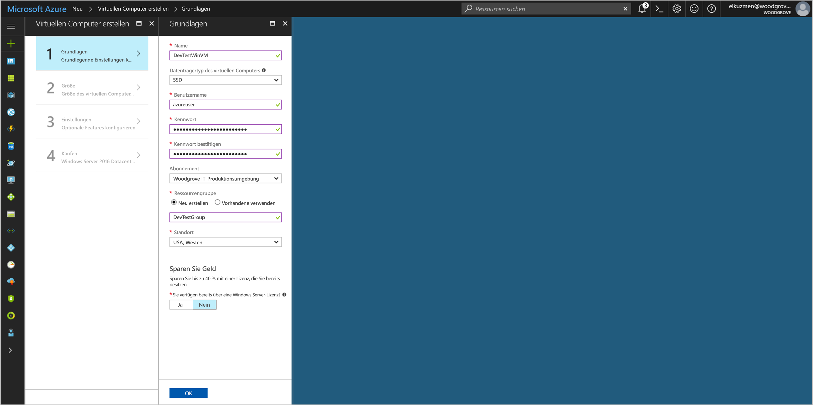
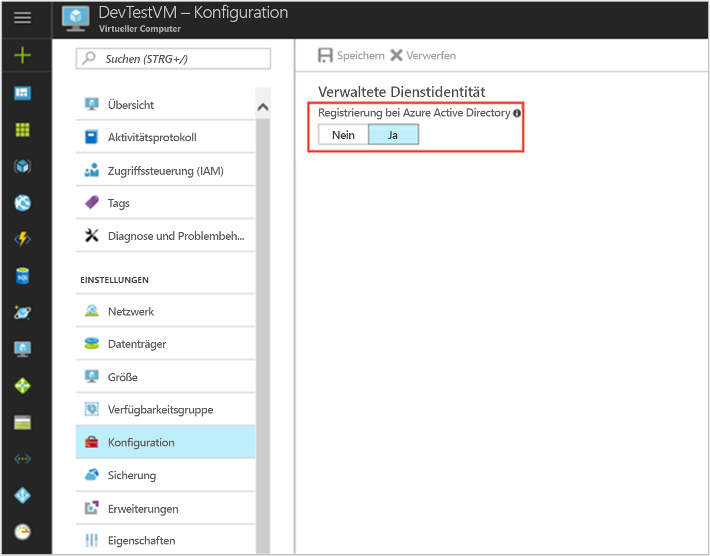

# <a name="use-a-windows-vm-managed-service-identity-to-access-azure-storage"></a>Verwenden einer Windows-VM-MSI für den Zugriff auf Azure Storage

[!INCLUDE[preview-notice](../../includes/active-directory-msi-preview-notice.md)]

In diesem Tutorial erfahren Sie, wie Sie eine verwaltete Dienstidentität (Managed Service Identity, MSI) für einen virtuellen Windows-Computer aktivieren und mit dieser Identität anschließend auf Speicherschlüssel zugreifen. Sie können Speicherschlüssel wie gewohnt bei Speichervorgängen verwenden, z.B. bei der Verwendung von Storage SDK. Für dieses Tutorial werden Blobs mithilfe von Azure Storage PowerShell hoch- und heruntergeladen. Sie lernen Folgendes:


> [!div class="checklist"]
> * Aktivieren von MSI auf einem virtuellen Windows-Computer 
> * Gewähren des Zugriffs auf Speicherschlüssel in Azure Resource Manager für Ihren virtuellen Computer 
> * Abrufen eines Zugriffstokens mithilfe der VM-Identität und Verwenden dieses Zugriffstokens zum Aufrufen von Speicherschlüsseln aus Resource Manager 


Wenn Sie kein Azure-Abonnement besitzen, können Sie ein [kostenloses Konto](https://azure.microsoft.com/free/?WT.mc_id=A261C142F) erstellen, bevor Sie beginnen.

## <a name="sign-in-to-azure"></a>Anmelden bei Azure

Melden Sie sich unter [https://portal.azure.com](https://portal.azure.com) beim Azure-Portal an.

## <a name="create-a-windows-virtual-machine-in-a-new-resource-group"></a>Erstellen eines virtuellen Windows-Computers in einer neuen Ressourcengruppe

In diesem Tutorial wird ein neuer virtueller Windows-Computer erstellt. Sie können MSI auch auf einem vorhandenen virtuellen Computer aktivieren.

1.  Klicken Sie in der linken oberen Ecke des Azure-Portals auf die Schaltfläche **Neu**.
2.  Wählen Sie **Compute** und dann **Windows Server 2016 Datacenter**. 
3.  Geben Sie die Informationen zum virtuellen Computer ein. Der **Benutzername** und das **Kennwort**, die hier erstellt werden, sind die Anmeldeinformationen, die Sie für die Anmeldung beim virtuellen Computer verwenden.
4.  Wählen Sie in der Dropdownliste das richtige **Abonnement** für den virtuellen Computer aus.
5.  Um eine neue **Ressourcengruppe** auszuwählen, in der der virtuelle Computer erstellt werden soll, wählen Sie **Neu erstellen** aus. Klicken Sie zum Abschluss auf **OK**.
6.  Wählen Sie eine Größe für den virtuellen Computer. Wählen Sie die Option **Alle anzeigen**, oder ändern Sie den Filter **Supported disk type** (Unterstützter Datenträgertyp), um weitere Größen anzuzeigen. Behalten Sie auf dem Blatt „Einstellungen“ die Standardwerte bei, und klicken Sie auf **OK**.

    

## <a name="enable-msi-on-your-vm"></a>Aktivieren von MSI auf dem virtuellen Computer

Eine VM-MSI ermöglicht es Ihnen, Zugriffstoken aus Azure AD abzurufen, ohne dass Sie Anmeldeinformationen in Ihren Code einfügen müssen. Im Hintergrund werden durch das Aktivieren von MSI zwei Vorgänge ausgelöst: Auf dem virtuellen Computer wird die MSI-VM-Erweiterung installiert, und MSI wird für den virtuellen Computer aktiviert.  

1. Navigieren Sie zu der Ressourcengruppe des neuen virtuellen Computers, und wählen Sie den virtuellen Computer aus, den Sie im vorherigen Schritt erstellt haben.
2. Klicken Sie in der VM-Einstellung links auf **Konfiguration**.
3. Wählen Sie zum Registrieren und Aktivieren von MSI die Option **Ja** oder zum Deaktivieren „Nein“.
4. Achten Sie darauf, zum Speichern der Konfiguration auf **Speichern** zu klicken.

    

5. Wenn Sie überprüfen möchten, welche Erweiterungen sich auf der VM befinden, klicken Sie auf **Erweiterungen**. Wenn die MSI aktiviert ist, wird **ManagedIdentityExtensionforWindows** in der Liste angezeigt.

    

## <a name="create-a-storage-account"></a>Erstellen eines Speicherkontos 

Erstellen Sie ein Speicherkonto, sofern Sie über keines verfügen. Sie können diesen Schritt auch überspringen und VM-MSI Zugriff auf die Schlüssel eines vorhandenen Speicherkontos gewähren. 

1. Klicken Sie in der linken oberen Ecke des Azure-Portals auf die Schaltfläche **Neu**.
2. Klicken Sie auf **Speicher**, dann auf **Speicherkonto**, und anschließend wird ein neuer Bereich namens „Speicherkonto erstellen“ angezeigt.
3. Geben Sie einen Namen für das Speicherkonto ein, das Sie später verwenden werden.  
4. **Bereitstellungsmodell** und **Kontoart** sollten jeweils auf „Resource Manager“ und „Allgemein“ festgelegt werden. 
5. Stellen Sie sicher, dass **Abonnement** und **Ressourcengruppe** dem entsprechen, was Sie bei der Erstellung Ihrer VM im vorherigen Schritt angegeben haben.
6. Klicken Sie auf **Erstellen**.

    

## <a name="create-a-blob-container-in-the-storage-account"></a>Erstellen eines Blob-Containers im Speicherkonto

Später werden wir eine Datei in das neue Speicherkonto hoch- und daraus herunterladen. Da Dateien Blob-Speicher erfordern, müssen wir einen Blob-Container erstellen, in dem die Datei gespeichert wird.

1. Navigieren Sie zurück zum neu erstellten Speicherkonto.
2. Klicken Sie auf der linken Navigationsleiste unter „Blob-Dienst“ auf den Link **Container**.
3. Klicken Sie oben auf der Seite auf **+ Container**, und ein Bereich namens „Neuer Container“ wird geöffnet.
4. Geben Sie dem Container einen Namen, wählen Sie eine Zugriffsebene aus, und klicken Sie dann auf **OK**. Der angegebene Name wird später in diesem Tutorial verwendet. 

    

## <a name="grant-your-vm-identity-access-to-use-storage-keys"></a>Gewähren des Zugriffs für die Verwendung von Speicherschlüsseln für die VM-Identität 

Azure Storage unterstützt die Azure AD-Authentifizierung nicht nativ.  Sie können MSI jedoch zum Abrufen von Speicherschlüsseln aus dem Resource Manager verwenden und mithilfe dieser Schlüssel auf den Speicher zugreifen.  In diesem Schritt erteilen Sie VM-MSI Zugriff auf die Schlüssel für Ihr Speicherkonto.   

1. Wechseln Sie zur Registerkarte für **Speicher**.  
2. Wählen Sie das zuvor erstellte **Speicherkonto** aus.   
3. Wechseln Sie im linken Bereich zu **Zugriffssteuerung (IAM)**.  
4. Klicken Sie dann auf **Hinzufügen**, um dem virtuellen Computer eine neue Rollenzuweisung hinzuzufügen, und wählen Sie unter **Rolle** die **Dienstrolle „Speicherkonto-Schlüsseloperator“**.  
5. Wählen Sie in der nächsten Dropdownliste für die Option **Zugriff zuweisen zu** die Ressource **Virtueller Computer** aus.  
6. Stellen Sie dann sicher, dass in der Dropdownliste **Abonnement** das richtige Abonnement aufgeführt wird. Wählen Sie unter **Ressourcengruppe** die Option **Alle Ressourcengruppen**.  
7. Wählen Sie schließlich unter **Auswählen** in der Dropdownliste Ihren virtuellen Windows-Computer aus, und klicken Sie auf **Speichern**. 

    

## <a name="get-an-access-token-using-the-vm-identity-and-use-it-to-call-azure-resource-manager"></a>Abrufen eines Zugriffstokens mithilfe der VM-Identität und Verwenden dieses Zugriffstokens zum Aufrufen von Azure Resource Manager 

In diesem Abschnitt müssen Sie Azure Resource Manager **PowerShell** verwenden.  Wenn Sie das Programm nicht installiert haben, [laden Sie die neuesten Version herunter](https://docs.microsoft.com/powershell/azure/overview?view=azurermps-4.3.1), bevor Sie fortfahren.

1. Navigieren Sie im Portal zu **Virtuelle Computer**, wechseln Sie dann zu Ihrem virtuellen Windows-Computer, und klicken Sie in der **Übersicht** auf **Verbinden**. 
2. Geben Sie Ihren **Benutzernamen** und Ihr **Kennwort** ein, das Sie beim Erstellen des virtuellen Windows-Computers hinzugefügt haben. 
3. Sie haben nun eine **Remotedesktopverbindung** mit dem virtuellen Computer erstellt. Öffnen Sie jetzt **PowerShell** in der Remotesitzung. 
4. Erstellen Sie mithilfe des PowerShell-Befehls „Invoke-WebRequest“ eine Anforderung an den lokalen MSI-Endpunkt, um ein Zugriffstoken für Azure Resource Manager zu erhalten.

    ```powershell
       $response = Invoke-WebRequest -Uri http://localhost:50342/oauth2/token -Method GET -Body @{resource="https://management.azure.com/"} -Headers @{Metadata="true"}
    ```
    
    > [!NOTE]
    > Der Wert des „resource“-Parameters muss exakt mit dem von Azure AD erwarteten Wert übereinstimmen. Wenn Sie die Azure Resource Manager-Ressourcen-ID verwenden, müssen Sie den nachgestellten Schrägstrich im URI verwenden.
    
    Extrahieren Sie als Nächstes die vollständige Antwort, die als JSON-formatierte Zeichenfolge (JavaScript Object Notation) im „$response“-Objekt gespeichert ist. 
    
    ```powershell
    $content = $response.Content | ConvertFrom-Json
    ```
    Extrahieren Sie dann das Zugriffstoken aus der Antwort.
    
    ```powershell
    $ArmToken = $content.access_token
    ```
 
## <a name="get-storage-keys-from-azure-resource-manager-to-make-storage-calls"></a>Abrufen von Speicherschlüsseln aus Azure Resource Manager für Speicheraufrufe 

Jetzt rufen wir mit PowerShell und dem Zugriffstoken, das im vorherigen Abschnitt abgerufen wurde, Azure Resource Manager auf, um den Speicherzugriffsschlüssel abzurufen. Sobald wir den Speicherzugriffsschlüssel haben, können wir Vorgänge zum Up- und Download von Speicher aufrufen.

```powershell
PS C:\> $keysResponse = Invoke-WebRequest -Uri https://management.azure.com/subscriptions/<SUBSCRIPTION-ID>/resourceGroups/<RESOURCE-GROUP>/providers/Microsoft.Storage/storageAccounts/<STORAGE-ACCOUNT>/listKeys/?api-version=2016-12-01 -Method POST -Headers @{Authorization="Bearer $ARMToken"}
```
> [!NOTE] 
> Bei der URL wird die Groß-/Kleinschreibung beachtet. Achten Sie daher darauf, dieselbe Groß- und Kleinschreibung zu verwenden wie zuvor beim Benennen der Ressourcengruppe, einschließlich des Großbuchstaben „G“ in „resourceGroups“. 

```powershell
PS C:\> $keysContent = $keysResponse.Content | ConvertFrom-Json
PS C:\> $key = $keysContent.keys[0].value
```

Als Nächstes erstellen wir eine Datei namens „test.txt“. Führen Sie dann mithilfe des Speicherschlüssels die Authentifizierung mit Azure Storage PowerShell aus, und laden Sie die Datei in unseren Blob-Container hoch und anschließend wieder herunter.

```bash
echo "This is a test text file." > test.txt
```

> [!NOTE]
> Denken Sie zuerst daran, die Azure Storage-Cmdlets „Install-Module Azure.Storage“ zu installieren. 

Sie können das Blob, das Sie soeben erstellt haben, mit dem PowerShell-Cmdlet `Set-AzureStorageBlobContent` hochladen:

```powershell
PS C:\> $ctx = New-AzureStorageContext -StorageAccountName <STORAGE-ACCOUNT> -StorageAccountKey $key
PS C:\> Set-AzureStorageBlobContent -File test.txt -Container <CONTAINER-NAME> -Blob testblob -Context $ctx
```

Antwort:

```powershell
ICloudBlob        : Microsoft.WindowsAzure.Storage.Blob.CloudBlockBlob
BlobType          : BlockBlob
Length            : 56
ContentType       : application/octet-stream
LastModified      : 9/13/2017 6:14:25 PM +00:00
SnapshotTime      :
ContinuationToken :
Context           : Microsoft.WindowsAzure.Commands.Storage.AzureStorageContext
Name              : testblob
```

Sie können das Blob, das Sie soeben erstellt haben, auch mit dem PowerShell-Cmdlet `Get-AzureStorageBlobContent` herunterladen:

```powershell
PS C:\> Get-AzureStorageBlobContent -Blob <blob name> -Container <CONTAINER-NAME> -Destination test2.txt -Context $ctx
```

Antwort:

```powershell
ICloudBlob        : Microsoft.WindowsAzure.Storage.Blob.CloudBlockBlob
BlobType          : BlockBlob
Length            : 56
ContentType       : application/octet-stream
LastModified      : 9/13/2017 6:14:25 PM +00:00
SnapshotTime      :
ContinuationToken :
Context           : Microsoft.WindowsAzure.Commands.Storage.AzureStorageContext
Name              : testblob
```


