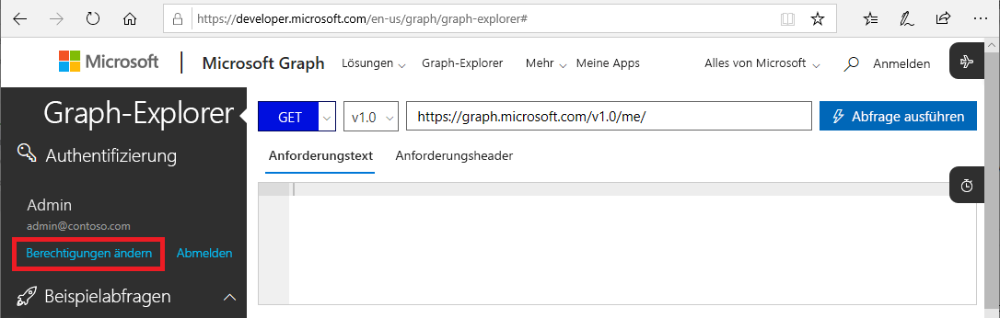
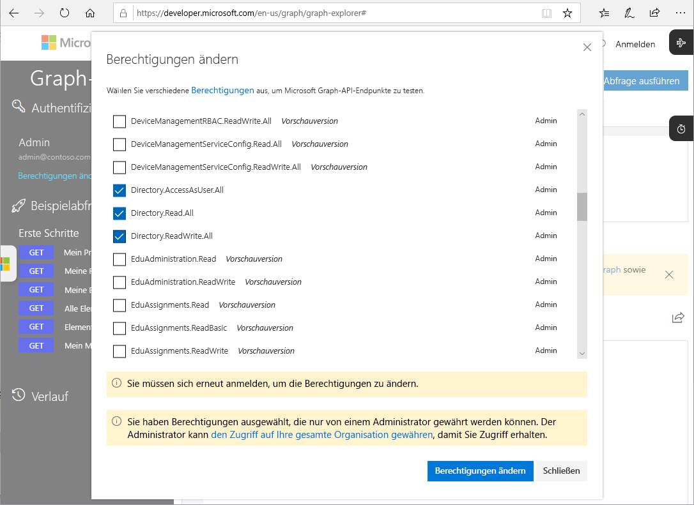

# Microsoft Graph-APIs für PIM (Vorschauversion)

Die meisten Aufgaben, die Sie in Azure AD Privileged Identity Management (PIM) über das Azure-Portal ausführen können, können Sie auch mit den [Microsoft Graph-APIs](https://developer.microsoft.com/graph/docs/concepts/overview) ausführen. In diesem Artikel werden einige wichtige Konzepte für die Verwendung der Microsoft Graph-APIs für PIM beschrieben. Weitere Informationen zu den Microsoft Graph-APIs finden Sie in der [Referenz zur Azure AD Privileged Identity Management-API](https://developer.microsoft.com/graph/docs/api-reference/beta/resources/privilegedidentitymanagement_root).

> [!IMPORTANT]
> APIs in der Betaversion in Microsoft Graph befinden sich in der Vorschauphase und ändern sich möglicherweise noch. Die Verwendung dieser APIs in Produktionsanwendungen wird nicht unterstützt.

## Erforderliche Berechtigungen

Zum Aufrufen der Microsoft Graph-APIs für PIM benötigen Sie **mindestens eine** der folgenden Berechtigungen:

- `Directory.AccessAsUser.All`
- `Directory.Read.All`
- `Directory.ReadWrite.All`
- `PrivilegedAccess.ReadWrite.AzureAD`

### Festlegen von Berechtigungen

Damit Anwendungen die Microsoft Graph-APIs für PIM aufrufen können, benötigen sie die erforderlichen Berechtigungen. Die erforderlichen Berechtigungen werden am einfachsten über das [Azure AD-Zustimmungsframework](../develop/consent-framework.md) angegeben.

### Festlegen von Berechtigungen in Graph-Tester

Beim Testen Ihrer Aufrufe mit Graph-Tester können Sie die Berechtigungen im Tool angeben.

1. Melden Sie sich bei [Graph-Tester](https://developer.microsoft.com/graph/graph-explorer) als globaler Administrator an.

1. Klicken Sie auf **Berechtigungen ändern**.

    

1. Markieren Sie die gewünschten Berechtigungen. `PrivilegedAccess.ReadWrite.AzureAD` ist in Graph-Tester noch nicht verfügbar.

    

1. Klicken Sie auf **Berechtigungen ändern**, um die Änderungen der Berechtigungen zu übernehmen.

## Nächste Schritte

- [Referenz zur Azure AD Privileged Identity Management-API](https://developer.microsoft.com/graph/docs/api-reference/beta/resources/privilegedidentitymanagement_root)
