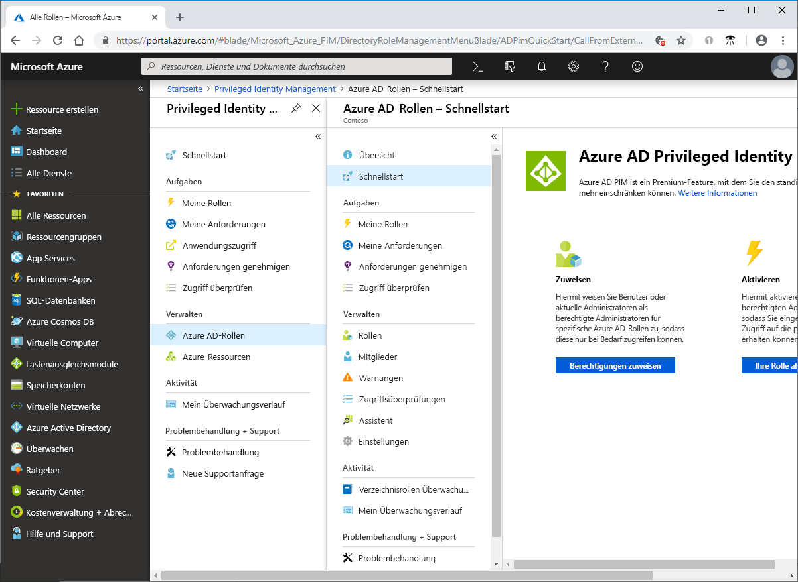

# Was ist Azure AD Privileged Identity Management?

Azure Active Directory (Azure AD) Privileged Identity Management (PIM) ist ein Dienst, mit dem Sie den Zugriff auf wichtige Ressourcen innerhalb Ihrer Organisation verwalten, steuern und überwachen können. Dazu zählt der Zugriff auf Ressourcen in Azure AD, in Azure-Ressourcen und anderen Microsoft-Onlinediensten wie Office 365 oder Microsoft Intune.

## Gründe für die Verwendung von PIM

Organisationen möchten die Anzahl von Personen mit Zugriff auf sichere Informationen oder Ressourcen möglichst gering halten, da sich dadurch das Risiko verringert, dass ein böswilliger Akteur Zugriff darauf erhält oder dass ein autorisierter Benutzer versehentlich eine sensible Ressource kompromittiert. Benutzer müssen jedoch in Azure AD, Azure, Office 365 oder SaaS-Apps weiterhin privilegierte Vorgänge ausführen. Organisationen können Benutzern privilegierten JIT-Zugriff (Just-In-Time) auf Azure-Ressourcen und Azure AD gewähren. Dabei muss jedoch überwacht werden, wofür diese Benutzer ihre Administratorrechte nutzen. PIM trägt dazu bei, das Risiko durch unverhältnismäßige oder unnötige Zugriffsrechte bzw. durch deren Missbrauch zu verringern.

## Welche Möglichkeiten bietet PIM?

PIM unterstützt Sie im Grunde dabei, das „Wer?“, „Was?“, „Wann?“, „Wo?“ und „Warum?“ für Ressourcen zu verwalten, die Ihnen wichtig sind. Im Anschluss sind einige der wichtigsten Features von PIM aufgeführt:

- Gewähren von privilegiertem **Just-In-Time**-Zugriff auf Azure AD- und Azure-Ressourcen
- Zuweisen von **zeitgebundenem** Zugriff auf Ressourcen (mit Start- und Enddatum)
- Anfordern einer **Genehmigung** bei der Aktivierung privilegierter Rollen
- Erzwingen der **mehrstufigen Authentifizierung** für alle Rollenaktivierungen
- Anfordern einer **Begründung**, um nachvollziehen zu können, warum Benutzer eine Aktivierung vornehmen
- Erhalten von **Benachrichtigungen**, wenn privilegierte Rollen aktiviert werden
- Durchführen von **Zugriffsüberprüfungen**, um zu prüfen, ob Benutzer die Rollen weiterhin benötigen
- Herunterladen eines **Überwachungsverlaufs** zur internen oder externen Überwachung

## Voraussetzungen

Um PIM verwenden zu können, müssen Sie über eine der folgenden kostenpflichtigen Lizenzen oder Testlizenzen verfügen. Weitere Informationen finden Sie unter [Was ist Azure Active Directory?](../fundamentals/active-directory-whatis.md).

- Azure AD Premium P2
- Enterprise Mobility + Security (EMS) E5

Weitere Informationen zu Lizenzen für Benutzer finden Sie unter [License requirements to use PIM](subscription-requirements.md) (Lizenzanforderungen für die Verwendung von PIM).

## Begriff

Machen Sie sich zum besseren Verständnis von PIM und der dazugehörigen Dokumentation mit den folgenden Begriffen vertraut:

| Begriff oder Konzept | Rollenzuweisungskategorie | BESCHREIBUNG |
| --- | --- | --- |
| Berechtigt | Type | Eine Rollenzuweisung, bei der ein Benutzer mindestens eine Aktion ausführen muss, um die Rolle nutzen zu können. Wenn ein Benutzer zu einer Rolle berechtigt ist, kann er die Rolle aktivieren, wenn er privilegierte Aufgaben ausführen muss. Es gibt keinen Unterschied hinsichtlich des Zugriffs zwischen einer permanenten und einer berechtigten Rollenzuweisung. Der einzige Unterschied ist, dass einige Benutzer den Zugriff nicht jederzeit benötigen. |
| aktiv | Type | Eine Rollenzuweisung, bei der ein Benutzer keine Aktion ausführen muss, um die Rolle nutzen zu können. Bei als aktiv zugewiesenen Benutzern sind die Berechtigungen der Rolle zugewiesen. |
| aktivieren |  | Das Ausführen mindestens einer Aktion zum Verwenden einer Rolle, zu der der Benutzer berechtigt ist. Beispiele für Aktionen sind eine erfolgreiche Multi-Factor Authentication-Überprüfung (MFA), die Angabe einer geschäftlichen Begründung oder das Anfordern einer Genehmigung von den angegebenen genehmigenden Personen. |
| zugewiesen | Zustand | Ein Benutzer mit einer Rollenzuweisung vom Typ „aktiv“. |
| aktiviert | Zustand | Ein Benutzer mit einer Rollenzuweisung vom Typ „berechtigt“, der die Aktionen zum Aktivieren der Rolle ausgeführt hat und nun aktiv ist.  Nach der Aktivierung kann der Benutzer die Rolle für einen vorkonfigurierten Zeitraum nutzen. Danach muss sie erneut aktiviert werden. |
| dauerhaft berechtigt | Duration | Eine Rollenzuweisung, bei der ein Benutzer immer zum Aktivieren der Rolle berechtigt ist. |
| dauerhaft aktiv | Duration | Eine Rollenzuweisung, bei der ein Benutzer die Rolle jederzeit ohne vorherige Aktion verwenden kann. |
| Ablauf (berechtigt) | Duration | Eine Rollenzuweisung, bei der ein Benutzer innerhalb eines angegebenen Zeitraums (Start- und Enddatum) zum Aktivieren der Rolle berechtigt ist. |
| Ablauf (aktiv) | Duration | Eine Rollenzuweisung, bei der ein Benutzer die Rolle innerhalb eines angegebenen Zeitraums (Start- und Enddatum) ohne vorherige Aktion verwenden kann. |
| Just-in-Time-Zugriff (JIT) |  | Ein Modell, bei dem Benutzer temporäre Berechtigungen zum Ausführen privilegierter Aufgaben erhalten. Dieses Modell verhindert, dass böswillige oder nicht autorisierte Benutzer nach dem Ablauf der Berechtigungen Zugriff erhalten. Der Zugriff wird nur gewährt, wenn Benutzer ihn benötigen. |
| Prinzip des Zugriffs mit den geringsten Rechten |  | Eine empfohlene Sicherheitsmethode, bei der alle Benutzer nur die zum Ausführen der Aufgaben, für die sie autorisiert sind, mindestens erforderlichen Berechtigungen erhalten. Diese Methode minimiert die Anzahl von globalen Administratoren, indem stattdessen spezifische Administratorrollen für bestimmte Szenarien verwendet werden. |

## Wie sieht PIM aus?

Nachdem Sie PIM eingerichtet haben, werden im linken Navigationsmenü die Optionen **Aufgaben**, **Verwalten**, und **Aktivität** angezeigt. Als Administrator können Sie zwischen der Verwaltung von **Azure AD-Rollen** und **Azure-Ressourcenrollen** wählen. Wenn Sie die Art der zu verwaltenden Rollen auswählen, werden ähnliche Optionen für diesen Rollentyp angezeigt.

## Wer kann in PIM welche Aktionen ausführen?

Wenn Sie die erste Person sind, die PIM verwendet, werden Ihnen automatisch die Rollen [Sicherheitsadministrator](../users-groups-roles/directory-assign-admin-roles.md#security-administrator) und [Administrator für privilegierte Rollen](../users-groups-roles/directory-assign-admin-roles.md#privileged-role-administrator) im Verzeichnis zugewiesen.

Für Azure AD-Rollen gilt: Nur ein Benutzer mit der Rolle eines Administrators für privilegierte Rollen kann Zuweisungen für andere Administratoren in PIM verwalten. Sie können [Zugriff für andere Administratoren zum Verwalten von PIM gewähren](pim-how-to-give-access-to-pim.md). Globale Administratoren, Sicherheitsadministratoren und Benutzer mit Leseberechtigung für Sicherheitsfunktionen können Azure AD-Rollenzuweisungen in PIM anzeigen.

Bei Azure-Ressourcenrollen können nur Abonnementadministratoren, Ressourcenbesitzer und Ressourcen-Benutzerzugriffsadministratoren Zuweisungen für andere Administratoren in PIM verwalten. Administratoren für privilegierte Rollen, Sicherheitsadministratoren oder Benutzer mit Leseberechtigung für Sicherheitsfunktionen haben nicht standardmäßig Zugriff auf Zuweisungen zu Azure-Ressourcenrollen in PIM.

## Szenarien

PIM unterstützt folgende Szenarien:

**Als Administrator für privilegierte Rollen haben Sie folgende Möglichkeiten:**

- Aktivieren der Genehmigung für bestimmte Rollen
- Festlegen von Benutzern und/oder Gruppen als genehmigende Personen für die Genehmigung von Anforderungen
- Anzeigen des Anforderungs- und Genehmigungsverlaufs für alle privilegierten Rollen

**Als genehmigende Person haben Sie folgende Möglichkeiten:**

- Anzeigen ausstehender Genehmigungen (Anforderungen)
- Genehmigen oder Ablehnen von Anforderungen von Rechteerweiterungen für Rollen (einzeln und/oder mehrere)
- Abgeben einer Begründung für die Genehmigung/Ablehnung 

**Als Benutzer mit berechtigter Rolle haben Sie folgende Möglichkeiten:**

- Anfordern der Aktivierung einer Rolle, die genehmigt werden muss
- Anzeigen des Status Ihrer Aktivierungsanforderung
- Fertigstellen Ihrer Aufgabe in Azure AD, wenn die Aktivierung genehmigt wurde

## Nächste Schritte

- [License requirements to use PIM](subscription-requirements.md) (Lizenzanforderungen für die Verwendung von PIM)
- [Schützen des privilegierten Zugriffs für hybride und Cloudbereitstellungen in Azure AD](../users-groups-roles/directory-admin-roles-secure.md?toc=%2fazure%2factive-directory%2fprivileged-identity-management%2ftoc.json)
- [Bereitstellen von Privileged Identity Management (PIM)](pim-deployment-plan.md)
