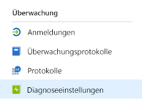
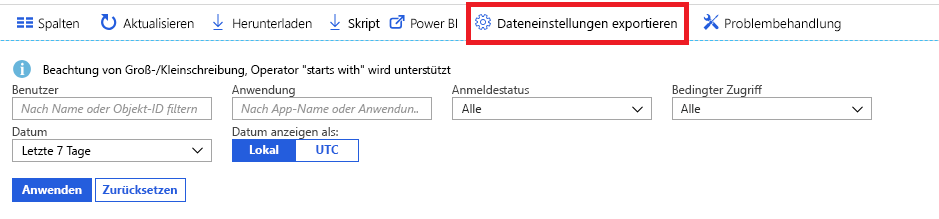

# Was ist die Azure Active Directory-Überwachung? (Vorschauversion)

Mit der Azure AD-Überwachung (Azure Active Directory) können Sie nun Ihre Azure AD-Aktivitätsprotokolle an verschiedene Endpunkte weiterleiten. Diese können dann entweder zur langfristigen Verwendung gespeichert oder in SIEM-Drittanbietertools (Security Information & Event Management) integriert werden, um Einblicke in Ihre Umgebung zu gewinnen.

Derzeit können die Protokolle an folgende Ziele weitergeleitet werden:

- Ein Azure-Speicherkonto.
- Azure Event Hub (für die Integration in Splunk- und Sumologic-Instanzen)
- Azure Log Analytics-Arbeitsbereich, in dem Sie die Daten analysieren, ein Dashboard erstellen und Warnungen für bestimmte Ereignisse verwenden können

> [!VIDEO https://www.youtube.com/embed/syT-9KNfug8]

## Konfiguration der Diagnoseeinstellungen

Wenn Sie Überwachungseinstellungen für Azure AD-Aktivitätsprotokolle konfigurieren möchten, müssen Sie sich zunächst beim [Azure-Portal](https://portal.azure.com) anmelden und auf **Azure Active Directory** klicken. Anschließend können Sie auf zwei Arten auf die Konfigurationsseite für die Diagnoseeinstellungen zugreifen:

* Klicken Sie im Abschnitt **Überwachung** auf **Diagnoseeinstellungen**.

    
    
* Klicken Sie auf **Überwachungsprotokolle** oder **Anmeldungen** und anschließend auf **Einstellungen exportieren**. 

    

## Senden von Protokollen an ein Speicherkonto

Wenn Sie Protokolle an ein Azure-Speicherkonto weiterleiten, können Sie sie länger aufbewahren als die Standardaufbewahrungsdauer aus unseren [Aufbewahrungsrichtlinien](reference-reports-data-retention.md) vorgibt. Informationen zum Weiterleiten von Daten an Ihr Speicherkonto finden Sie [hier](quickstart-azure-monitor-route-logs-to-storage-account.md).

## Streamen von Protokollen an einen Event Hub

Wenn Sie Protokolle an einen Azure Event Hub weiterleiten, können Sie sie in SIEM-Drittanbietertools wie Sumologic und Splunk integrieren. Diese Integration ermöglicht es Ihnen, Daten des Azure AD-Aktivitätsprotokolls mit anderen Daten zu kombinieren, die von Ihrer SIEM-Lösung verwaltetet werden, um umfassendere Einblicke in Ihre Umgebung zu gewähren. Informationen zum Streamen von Protokollen an einen Event Hub finden Sie [hier](tutorial-azure-monitor-stream-logs-to-event-hub.md).

## Senden von Protokollen an Log Analytics

[Log Analytics](https://docs.microsoft.com/azure/log-analytics/log-analytics-overview) konsolidiert Überwachungsdaten aus unterschiedlichen Quellen und bietet eine Abfragesprache sowie eine Analyseengine, die Ihnen Einblick in den Betrieb Ihrer Anwendungen und Ressourcen gibt. Indem Sie Ihre Azure AD-Aktivitätsprotokolle an Log Analytics senden, können Sie schnell gesammelte Daten abrufen, überwachen und für Warnungen heranziehen. Informationen zum Senden von Daten an Log Analytics finden Sie [hier](howto-integrate-activity-logs-with-log-analytics.md).

Sie können auch die vorgefertigten Ansichten für Azure AD-Aktivitätsprotokolle installieren, um allgemeine Szenarien mit Anmeldungen und Überprüfungsereignissen überwachen. Informationen zum Installieren und Verwenden von Log Analytics-Ansichten für Azure AD-Aktivitätsprotokolle finden Sie [hier](howto-install-use-log-analytics-views.md).

## Nächste Schritte

* [Aktivitätsprotokolle in Azure Monitor](concept-activity-logs-azure-monitor.md)
* [Streamen von Protokollen an einen Event Hub](tutorial-azure-monitor-stream-logs-to-event-hub.md)
* [Senden von Protokollen an Log Analytics](howto-integrate-activity-logs-with-log-analytics.md)
