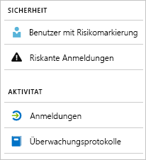

# Was sind Azure Active Directory-Berichte?

Mit Azure Active Directory-Berichten (Azure AD) erhalten Sie einen umfassenden Überblick über Aktivitäten in Ihrer Umgebung. Die bereitgestellten Daten ermöglichen Ihnen Folgendes:

- Ermitteln, wie Ihre Apps und Dienste von Ihren Benutzern genutzt werden
- Erkennen potenzieller Risiken für die Integrität Ihrer Umgebung
- Behandeln von Problemen, die Ihre Benutzer an der Erledigung ihrer Arbeit hindern  

Die Architektur der Berichterstellung basiert auf zwei Hauptkomponenten:

- [Sicherheitsberichte](#security-reports)
- [Aktivitätsberichte](#activity-reports)

## Sicherheitsberichte

Mit den Sicherheitsberichten können Sie die Identitäten Ihrer Organisation schützen. Es gibt zwei Arten von Sicherheitsberichten:

- **Benutzer mit Risikomarkierung:** Im [Sicherheitsbericht „Benutzer mit Risikomarkierung“](concept-user-at-risk.md) erhalten Sie eine Übersicht über Benutzerkonten, die unter Umständen kompromittiert wurden.

- **Riskante Anmeldungen:** Mit dem [Sicherheitsbericht „Riskante Anmeldungen“](concept-risky-sign-ins.md) erhalten Sie einen Indikator für Anmeldeversuche von Benutzern, die nicht der rechtmäßige Besitzer eines Benutzerkontos sind. 

### Welche Azure AD-Lizenz benötigen Sie für den Zugriff auf einen Sicherheitsbericht?  

Alle Editionen von Azure AD verfügen über die Sicherheitsberichte „Benutzer mit Risikomarkierung“ und „Riskante Anmeldungen“. Die Granularitätsebene von Berichten kann für die einzelnen Editionen aber variieren: 

- In den **Free- und Basic-Editionen von Azure Active Directory** erhalten Sie die Listen „Benutzer mit Risikomarkierung“ und „Riskante Anmeldungen“. 

- Mit der Edition **Azure Active Directory Premium 1** wird dieses Modell erweitert, indem Sie zusätzlich jeweils einige zugrunde liegende Risikoereignisse untersuchen können, die für einen Bericht erkannt wurden. 

- In der Edition **Azure Active Directory Premium 2** erhalten Sie die ausführlichsten Informationen zu den zugrunde liegenden Risikoereignissen, und Sie können Sicherheitsrichtlinien konfigurieren, mit denen automatisch auf konfigurierte Risikostufen reagiert wird.

## Aktivitätsberichte

Anhand von Aktivitätsberichten können Sie das Verhalten von Benutzern in Ihrer Organisation nachvollziehen. In Azure AD gibt es zwei Arten von Aktivitätsberichten:

- **Überwachungsprotokolle:** Mit dem [Aktivitätsbericht „Überwachungsprotokolle“](concept-audit-logs.md) erhalten Sie Zugriff auf den Verlauf aller Aufgaben, die in Ihrem Mandanten durchgeführt werden.

- **Anmeldungen:** Mit dem [Aktivitätsbericht „Anmeldungen“](concept-sign-ins.md) können Sie ermitteln, von wem die Aufgaben durchgeführt wurden, die im Bericht „Überwachungsprotokolle“ aufgeführt sind.

### Bericht „Überwachungsprotokolle“ 

Der [Bericht „Überwachungsprotokolle“](concept-audit-logs.md) enthält Datensätze zu Systemaktivitäten, die für die Konformität relevant sind. Diese Daten sind in folgenden häufigen Szenarien hilfreich:

- Ein Benutzer meines Mandanten hat Zugriff auf eine Administratorgruppe erhalten. Wer hat dem Benutzer den Zugriff gewährt? 

- Ich möchte eine Liste mit Benutzern erhalten, die sich an einer bestimmten App angemeldet haben, seitdem ich das App-Onboarding durchgeführt habe, und ich möchte Informationen zur Leistung der App erhalten.

- Ich möchte wissen, wie viele Kennwortzurücksetzungen unter meinem Mandanten durchgeführt werden.

#### Welche Azure AD-Lizenz benötigen Sie, um auf den Bericht „Überwachungsprotokolle“ zuzugreifen?  

Der Bericht „Überwachungsprotokolle“ ist für Features verfügbar, für die Sie über Lizenzen verfügen. Wenn Sie im Besitz einer Lizenz für ein bestimmtes Feature sind, haben Sie auch Zugriff auf die dazugehörigen Informationen zum Überwachungsprotokoll. Weitere Informationen finden Sie unter [Azure Active Directory-Features und -Funktionen](https://www.microsoft.com/cloud-platform/azure-active-directory-features).   

### Bericht zu Anmeldeaktivitäten

Mit dem [Bericht „Anmeldungen“](concept-sign-ins.md) können Sie beispielsweise folgende Fragen beantworten:

- Wie sieht das Anmeldemuster eines Benutzers aus?
- Wie viele Benutzer sind für Benutzer im Laufe einer Woche angemeldet?
- Wie lautet der Status dieser Anmeldungen?

#### Welche Azure AD-Lizenz benötigen Sie, um auf den Aktivitätsbericht „Anmeldungen“ zuzugreifen?  

Ihrem Mandanten muss eine Azure AD Premium-Lizenz zugewiesen sein, um auf den Aktivitätsbericht „Anmeldungen“ zugreifen zu können.

## Programmgesteuerter Zugriff

Zusätzlich zur Benutzeroberfläche ermöglicht Azure AD Ihnen über eine Reihe von REST-basierten APIs auch den [programmgesteuerten Zugriff](concept-reporting-api.md) auf die Berichtsdaten. Sie können diese APIs über verschiedene Programmiersprachen und Tools aufrufen. 

## Nächste Schritte

- [Bericht „Riskante Anmeldungen“](concept-risky-sign-ins.md)
- [Bericht „Überwachungsprotokolle“](concept-audit-logs.md)
- [Bericht „Anmeldungen“](concept-sign-ins.md)
