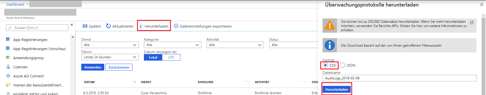

# Schnellstart: Herunterladen eines Überwachungsberichts über das Azure-Portal

In dieser Schnellstartanleitung erfahren Sie, wie Sie die Überwachungsprotokolle der letzten 24 Stunden für Ihren Mandanten herunterladen. Sie können bis zu 5000 Datensätze aus dem Azure-Portal herunterladen. Die Datensätze werden nach Aktualität sortiert, und standardmäßig erhalten Sie die neuesten 5.000 Datensätze. 

## Voraussetzungen

Erforderlich:

* Ein Azure Active Directory-Mandant. 
* Ein Benutzer, der über die Rolle **Sicherheitsadministrator**, **Benutzer mit Leseberechtigung für Sicherheitsfunktionen** oder **Globaler Administrator** für den Mandanten verfügt. Darüber hinaus kann jeder Benutzer im Mandanten auf die eigenen Überwachungsprotokolle zugreifen.

## Schnellstart: Herunterladen eines Überwachungsberichts

1. Navigieren Sie zum [Azure-Portal](https://portal.azure.com).
2. Wählen Sie im linken Navigationsbereich die Option **Azure Active Directory** aus, und klicken Sie auf die Schaltfläche **Verzeichnis wechseln**, um Ihr Active Directory-Verzeichnis auszuwählen.
3. Wählen Sie im Dashboard **Azure Active Directory** und dann **Überwachungsprotokolle** aus. 
4. Wählen Sie in der Dropdownliste **Datumsbereich** den Eintrag **Letzte 24 Stunden** aus, und klicken Sie auf **Anwenden**, um die Überwachungsprotokolle für die letzten 24 Stunden anzuzeigen. 
5. Wählen Sie die Schaltfläche **Herunterladen** aus, um eine CSV-Datei mit den gefilterten Datensätzen herunterzuladen. 

## Nächste Schritte

* [Berichte zu Anmeldeaktivitäten im Azure Active Directory-Portal](concept-sign-ins.md)
* [Vermerkdauer für Azure Active Directory-Berichte](reference-reports-data-retention.md)
* [Latenzen bei Azure Active Directory-Berichten – Vorschau](reference-reports-latencies.md)
