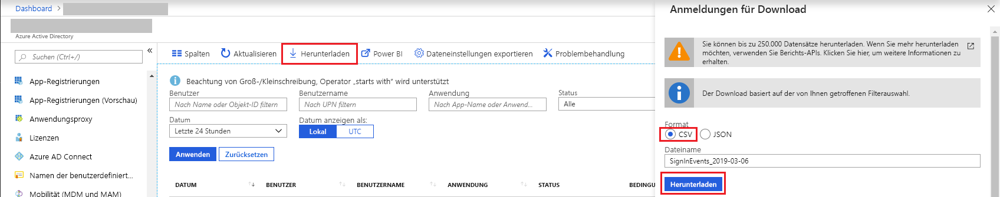

# Schnellstart: Herunterladen eines Anmeldeberichts über das Azure-Portal

In diesem Schnellstart erfahren Sie, wie Sie die Anmeldedaten Ihres Mandanten für die letzten 24 Stunden herunterladen. Sie können bis zu 250.000 Datensätze aus dem Azure-Portal herunterladen. Die Datensätze werden nach Aktualität sortiert, sodass Sie standardmäßig die neuesten 250.000 Datensätze erhalten. 

## Voraussetzungen

Erforderlich:

* Ein Azure Active Directory-Mandant mit einer Premium-Lizenz zum Anzeigen des Berichts zu Anmeldeaktivitäten. Unter [Erste Schritte mit Azure Active Directory Premium](../fundamentals/active-directory-get-started-premium.md) erfahren Sie, wie Sie ein Upgrade für Ihre Azure Active Directory-Edition durchführen. Hinweis: Lagen vor dem Upgrade keine Aktivitätsdaten vor, dauert es nach dem Upgrade auf eine Premium-Lizenz einige Tage, bis Daten in den Berichten angezeigt werden.
* Ein Benutzer, der über die Rolle **Sicherheitsadministrator**, **Benutzer mit Leseberechtigung für Sicherheitsfunktionen**, **Benutzer mit Leseberechtigung für Berichte** oder **globaler Administrator** für den Mandanten verfügt. Darüber hinaus kann jeder Benutzer im Mandanten auf die eigenen Anmeldungen zugreifen.

## Schnellstart: Herunterladen eines Anmeldeberichts

1. Navigieren Sie zum [Azure-Portal](https://portal.azure.com).
2. Wählen Sie im linken Navigationsbereich die Option **Azure Active Directory** aus, und klicken Sie auf die Schaltfläche **Verzeichnis wechseln**, um Ihr Active Directory-Verzeichnis auszuwählen.
3. Wählen Sie im Dashboard **Azure Active Directory** und dann **Anmeldungen** aus. 
4. Wählen Sie im Dropdownmenü **Datum** den Eintrag **Letzte 24 Stunden** und dann **Anwenden** aus, um die Anmeldungen der letzten 24 Stunden anzuzeigen. 
5. Wählen Sie die Schaltfläche **Herunterladen** und als Dateiformat **CSV** aus. Geben Sie dann einen Dateinamen an, um eine CSV-Datei mit den gefilterten Datensätzen herunterzuladen. 

## Nächste Schritte

* [Berichte zu Anmeldeaktivitäten im Azure Active Directory-Portal](concept-sign-ins.md)
* [Vermerkdauer für Azure Active Directory-Berichte](reference-reports-data-retention.md)
* [Latenzen bei Azure Active Directory-Berichten – Vorschau](reference-reports-latencies.md)
