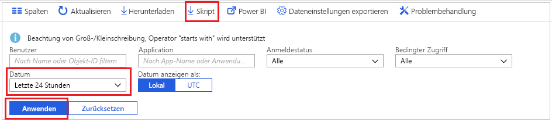

# Tutorial: Herunterladen und Verwenden eines Skripts zum Zugreifen auf Anmeldeprotokolle

Sie können die Daten zu Anmeldeaktivitäten herunterladen, wenn Sie sie außerhalb des Azure-Portals verwenden möchten. Mit der Option **Herunterladen** im Azure-Portal wird eine CSV-Datei mit den letzten 5.000 Datensätzen erstellt. Wenn eine höhere Flexibilität erforderlich ist und Sie beispielsweise mehr als 5.000 Datensätze auf einmal oder die Protokolle in geplanten Abständen herunterladen müssen, können Sie über die Schaltfläche **Skript** ein PowerShell-Skript zum Herunterladen Ihrer Daten generieren.

In diesem Tutorial erfahren Sie, wie Sie ein Skript zum Herunterladen aller Anmeldeprotokolle der letzten 24 Stunden generieren und es für die tägliche Ausführung konfigurieren. 

## Voraussetzungen

Sie benötigen Folgendes:

* Einen Azure Active Directory-Mandanten mit einer Premium-Lizenz (P1/P2) Beachten Sie Folgendes: Wenn Sie vor dem Upgrade über keine Aktivitätsdaten verfügten, dauert es ein paar Tage, bis die Daten in den Berichten angezeigt werden, nachdem Sie ein Upgrade auf eine Premium-Lizenz durchgeführt haben. 
* Einen Benutzer, der über die Rolle **Globaler Administrator**, **Sicherheitsadministrator**, **Benutzer mit Leseberechtigung für Sicherheitsfunktionen** oder **Benutzer mit Leseberechtigung für Berichte** für den Mandanten verfügt. Darüber hinaus kann jeder Benutzer auf die eigenen Anmeldungen zugreifen. 
* Wenn Sie das heruntergeladene Skript auf Ihrem Windows 10-Computer ausführen möchten, [richten Sie das AzureRM-Modul ein, und legen Sie die Ausführungsrichtlinie fest](concept-sign-ins.md#running-the-script-on-a-windows-10-machine).

## Tutorial

1. Navigieren Sie zum [Azure-Portal](https://portal.azure.com), und wählen Sie Ihr Verzeichnis aus.
2. Wählen Sie **Azure Active Directory** und dann im Bereich **Überwachung** die Option **Anmeldungen** aus. 
3. Wählen Sie im Dropdownmenü **Datumsbereich** und anschließend **24 Stunden** aus, um Daten der letzten 24 Stunden abzurufen. 
4. Wählen Sie **Übernehmen** aus, und vergewissern Sie sich, dass der Filter wie erwartet angewendet wird. 
5. Wählen Sie im Menü am oberen Rand die Option **Skript** aus, um das PowerShell-Skript mit den angewendeten Filtern herunterzuladen.

     
     
6. Öffnen Sie auf Ihrem Windows-Computer die Anwendung **Taskplaner**, und wählen Sie **Einfache Aufgabe erstellen** aus.
7. Geben Sie einen Namen und eine Beschreibung für die Aufgabe ein, und klicken Sie auf **Weiter**.
8. Aktivieren sie das Optionsfeld **Täglich**, damit die Aufgabe täglich ausgeführt wird, und geben Sie Startdatum und -uhrzeit ein.
9. Wählen Sie im Aktionsmenü die Option **Start a program** (Programm starten) und dann das heruntergeladene Skript und **Weiter** aus. 
10. Überprüfen Sie die geplante Aufgabe, und wählen Sie **Fertig stellen** aus, um die Aufgabe zu erstellen.

     

Ihre Aufgabe wird nun jeden Tag ausgeführt, und die Anmeldedatensätze der letzten 24 Stunden werden in einer Datei mit dem Format **AAD_SignInReport_JJJJMMTT_HHMMSS.csv** gespeichert. Sie können auch das heruntergeladene PowerShell-Skript bearbeiten, um es unter einem anderen Dateinamen zu speichern oder die Anzahl der heruntergeladenen Datensätze zu ändern. 

## Nächste Schritte

* [Aufbewahrungsrichtlinien für Azure Active Directory-Berichte](reference-reports-data-retention.md)
* [Erste Schritte mit der Berichterstellungs-API von Azure Active Directory](concept-reporting-api.md)
* [Zugreifen auf die Berichterstellungs-API mit Zertifikaten](tutorial-access-api-with-certificates.md)
