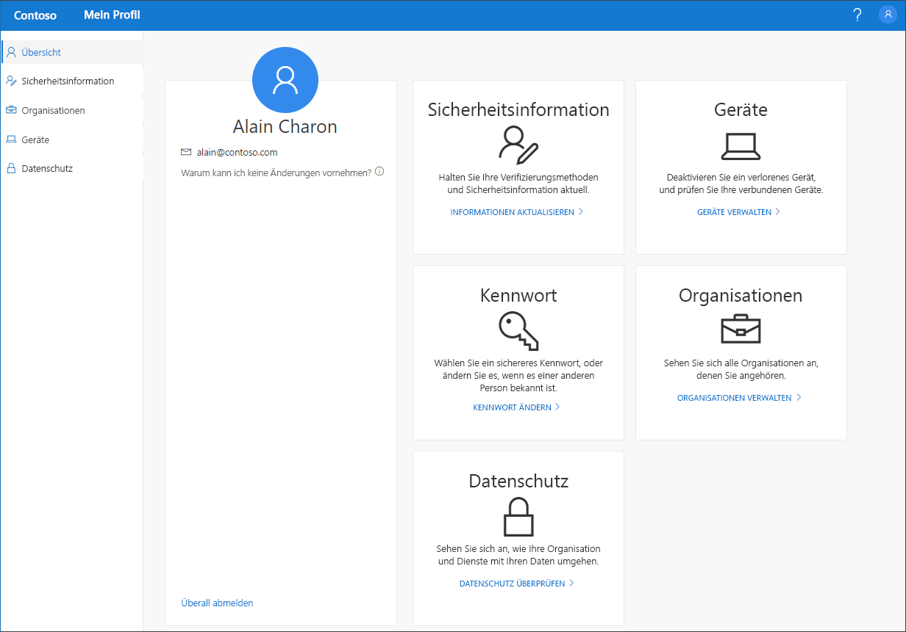

# Übersicht über das Portal „Mein Profil“ (Vorschauversion)

[!INCLUDE [preview-notice](../../../includes/active-directory-end-user-preview-notice-myprofile.md)]

Im Portal **Mein Profil** (Vorschauversion) können Sie Ihre Geschäfts-, Schul- oder Unikonten verwalten, indem Sie Ihre Sicherheitsinformation einrichten und verwalten, verbundene Organisationen und Geräte verwalten und Informationen zur Nutzung Ihrer Daten innerhalb der Organisation anzeigen.

>[!Important]
>Dieser Inhalt richtet sich an Benutzer. Administratoren finden in der [Azure Active Directory-Dokumentation](https://docs.microsoft.com/azure/active-directory) weitere Informationen zum Einrichten und Verwalten der Azure Active Directory-Umgebung (Azure AD).

## Aufrufen des Portals „Mein Profil“

Sie können auf das Portal **Mein Profil** (https://myprofile.microsoft.com) in der aktuellen Version eines der folgenden Browser zugreifen:

- Chrome
- Microsoft Edge
- Safari
- Firefox
- Internet Explorer 11

## Artikel zum Portal „Mein Profil“

Ausführliche Informationen und Anleitungen zu den verfügbaren Funktionen im Portal **Mein Profil** finden Sie in den folgenden Artikeln:

|Artikel |BESCHREIBUNG |
|------|------------|
|[Übersicht über die Sicherheitsinformation (Vorschau)](user-help-security-info-overview.md)| Mehrere Artikel mit Anweisungen zum Einrichten der Microsoft Authenticator-App, von Textnachrichten oder Telefonanrufen als Überprüfungsmethode. Hier finden Sie darüber hinaus Artikel zum Hinzufügen einer E-Mail-Adresse oder von vordefinierten Sicherheitsfragen, damit Sie Ihr eigenes Kennwort ggf. zurücksetzen können, sollten Sie es vergessen.|
|[Verwalten von Organisationen im Portal „Mein Profil“ (Vorschauversion)](myprofile-portal-organizations-page.md)| Anleitungen zum Anzeigen und Verlassen von Organisationen, die mit Ihrem Geschäfts-, Schul- oder Unikonto verbunden sind|
|[Verwalten Ihrer verbundenen Geräte im Portal „Mein Profil“ (Vorschauversion)](myprofile-portal-devices-page.md)| Anleitungen zum Anzeigen oder Deaktivieren von Geräten, die Sie mit Ihrem Geschäfts-, Schul- oder Unikonto verbunden haben|
|[View your privacy-related info](myprofile-portal-privacy-page.md) (Anzeigen Ihrer Informationen zum Datenschutz)| Anleitungen zum Anzeigen der Onlinedienste, die mit Ihrem Geschäfts-, Schul- oder Unikonto verbunden sind, sowie der Nutzungsbedingungen Ihrer Organisation|