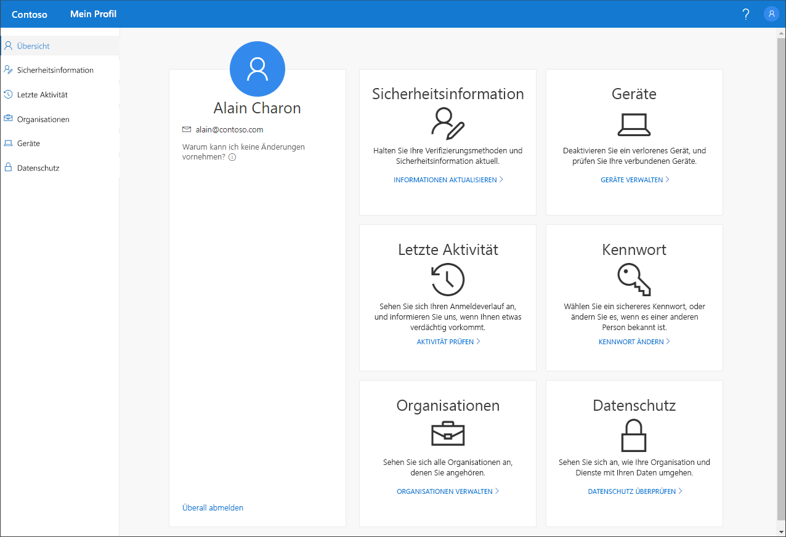

# Übersicht über das Portal „Mein Profil“ (Vorschauversion)

[!INCLUDE [preview-notice](../../../includes/active-directory-end-user-preview-notice-myprofile.md)]

Über das Portal **Mein Profil** (Vorschauversion) können Sie die folgenden Verwaltungsaufgaben für Ihr Geschäfts-, Schul- oder Unikonto durchführen:

- Einrichten und Verwalten Ihrer Sicherheitsinformationen für die zweistufige Überprüfung und Kennwortzurücksetzung

- Anzeigen der Anmeldeaktivitäten

- Verwalten Ihrer verbundenen Organisationen und Geräte

- Anzeigen von Informationen zur Nutzung Ihrer Daten innerhalb der Organisation

>[!Important]
>Dieser Inhalt richtet sich an Benutzer. Administratoren finden in der [Azure Active Directory-Dokumentation](https://docs.microsoft.com/azure/active-directory) weitere Informationen zum Einrichten und Verwalten der Azure Active Directory-Umgebung (Azure AD).

## Zugreifen auf das Portal „Mein Profil“
Sie können auf das Portal **Mein Profil** zugreifen, indem Sie in der aktuellen Version eines der folgenden Browser zu https://myprofile.microsoft.com navigieren:

- Chrome
- Microsoft Edge
- Safari
- Firefox
- Internet Explorer 11

    

## Inhalt dieses Abschnitts
Weitere Informationen zum Portal **Mein Profil** und zu den zugehörigen Portalseiten finden Sie in den folgenden Artikeln.

|Artikel |BESCHREIBUNG |
|------|------------|
|[Verwalten der Sicherheitsinformation (Vorschauversion)](user-help-security-info-overview.md)|Beschreibt, wie Sie Ihre Sicherheitsinformation einrichten und verwalten.|
|[View your recent sign-in activity](myprofile-portal-recent-activity-page.md) (Anzeigen Ihrer letzten Anmeldeaktivität)|Beschreibt, wie Sie die letzte Anmeldeaktivität für Ihr Geschäfts-, Schul- oder Unikonto anzeigen.|
|[Manage your organizations](myprofile-portal-organizations-page.md) (Verwalten Ihrer Organisationen)|Beschreibt, wie Sie die Organisationen verwalten, die mit Ihrem Geschäfts-, Schul- oder Unikonto verbunden sind.|
|[Manage your connected devices](myprofile-portal-devices-page.md) (Verwalten Ihrer verbundenen Geräte)| Beschreibt, wie Sie die Geräte verwalten, die Sie mit Ihrem Geschäfts-, Schul- oder Unikonto verbunden haben.|
|[View your privacy-related info](myprofile-portal-privacy-page.md) (Anzeigen Ihrer Informationen zum Datenschutz)|Beschreibt, wie Sie Informationen zur Nutzung Ihrer Daten innerhalb Ihrer Organisation anzeigen.|