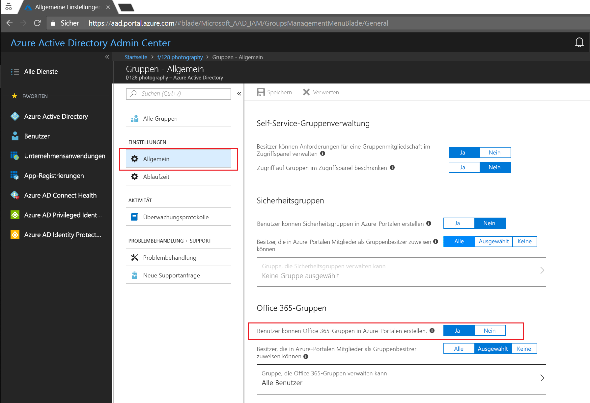
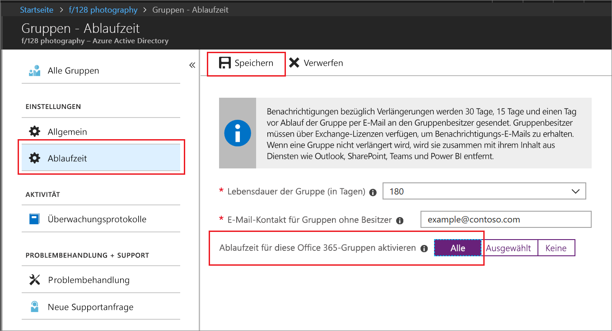

# Schnellstart: Festlegen des Ablaufs von Office 365-Gruppen in Azure Active Directory

In dieser Schnellstartanleitung legen Sie die Ablaufrichtlinie für Ihre Office 365-Gruppen fest. Wenn Benutzer eigene Gruppen einrichten können, entstehen unter Umständen zahlreiche ungenutzte Gruppen. Um das zu vermeiden, kann beispielsweise ein Ablaufdatum für diese Gruppen konfiguriert werden, um den Aufwand für das manuelle Löschen von Gruppen zu verringern.

Eine Ablaufrichtlinie ist einfach:

* Gruppenbesitzer werden benachrichtigt, eine ablaufende Gruppe zu verlängern.
* Nicht verlängerte Gruppen werden gelöscht.
* Eine gelöschte Office 365-Gruppe kann innerhalb von 30 Tagen durch einen Gruppenbesitzer oder einen Azure AD-Administrator wiederhergestellt werden.

Wenn Sie kein Azure-Abonnement besitzen, können Sie ein [kostenloses Konto](https://azure.microsoft.com/free/) erstellen, bevor Sie beginnen.

## Voraussetzung

 Die zum Einrichten des Gruppenablaufs erforderliche Rolle mit den geringsten Berechtigungen ist die Rolle „Benutzeradministrator“ für die Organisation.

## Aktivieren der Benutzererstellung für Gruppen

1. Melden Sie sich mit einem Benutzeradministratorkonto beim [Azure-Portal](https://portal.azure.com) an.

2. Klicken Sie auf **Gruppen** und anschließend auf **Allgemein**.
  
   

3. Legen Sie **Benutzer können Office 365-Gruppen erstellen** auf **Ja** fest.

4. Klicken Sie auf **Speichern**, um die Gruppeneinstellungen zu speichern, wenn Sie fertig sind.

## Festlegen des Gruppenablaufs

1. Melden Sie sich beim [Azure-Portal](https://portal.azure.com) an, und wählen Sie **Azure Active Directory** > **Gruppen** > **Ablauf** aus, um die Ablaufeinstellungen zu öffnen.
  
   

2. Legen Sie das Ablaufintervall fest. Wählen Sie einen vordefinierten Wert aus, oder geben Sie einen benutzerdefinierten Wert ein, der mehr als 31 Tage beträgt. 

3. Geben Sie eine E-Mail-Adresse an, an die die Verlängerungsbenachrichtigungen gesendet werden sollen, wenn eine Gruppe keinen Besitzer hat.

4. Legen Sie für diese Schnellstartanleitung **Ablauf für diese Office 365-Gruppen aktivieren** auf **Alle** fest.

5. Klicken Sie auf **Speichern**, um die Ablaufeinstellungen zu speichern, wenn Sie fertig sind.

Das ist alles! In dieser Schnellstartanleitung haben Sie die Ablaufrichtlinie für die ausgewählten Office 365-Gruppen festgelegt.

## Bereinigen von Ressourcen

### So entfernen Sie die Ablaufrichtlinie

1. Vergewissern Sie sich, dass Sie beim [Azure-Portal](https://portal.azure.com) über ein Konto angemeldet sind, das als globaler Administrator für Ihren Mandanten konfiguriert ist.
2. Klicken Sie auf **Azure Active Directory** > **Gruppen** > **Ablauf**.
3. Legen Sie **Ablauf für diese Office 365-Gruppen aktivieren** auf **Keine** fest.

### So deaktivieren Sie die Benutzererstellung für Gruppen

1. Klicken Sie auf **Azure Active Directory** > **Gruppen** > **Allgemein**. 
2. Legen Sie **Benutzer können Office 365-Gruppen in Azure-Portalen erstellen.** auf **Nein** fest.

## Nächste Schritte

Weitere Informationen zum Ablauf einschließlich der PowerShell-Anweisungen und technischen Einschränkungen finden Sie im folgenden Artikel:

> [!div class="nextstepaction"]
> [Konfigurieren der Ablaufrichtlinie für Office 365-Gruppen](groups-lifecycle.md)
